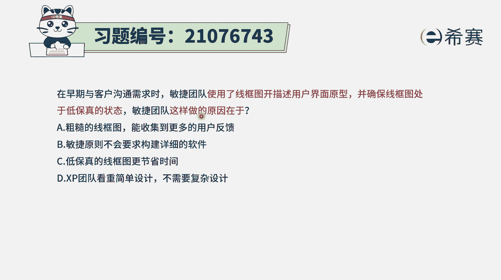
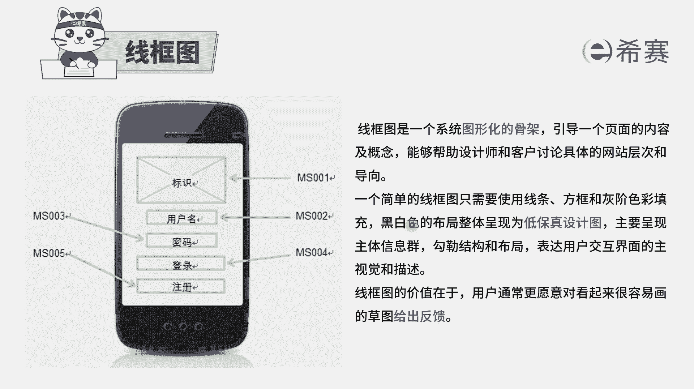
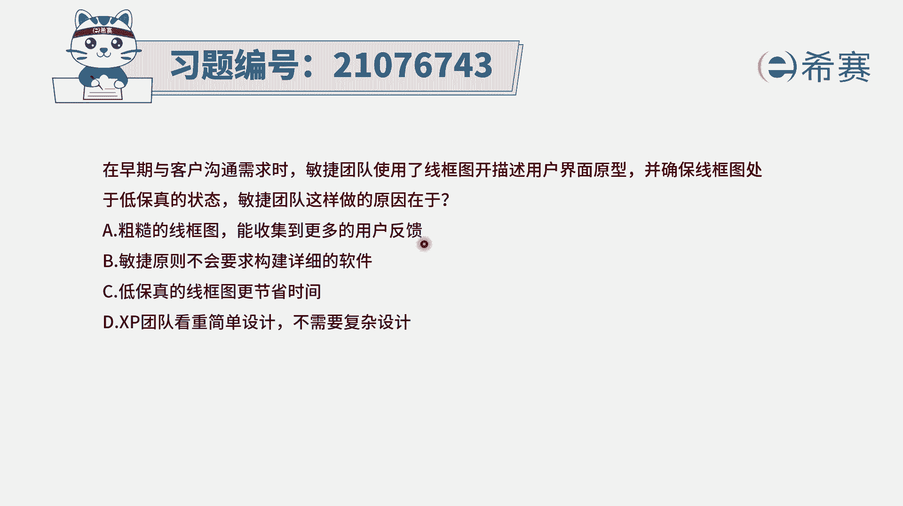
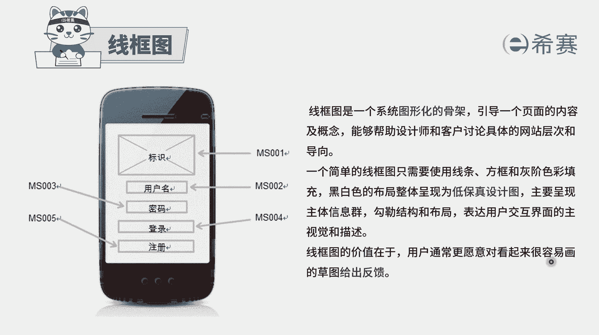
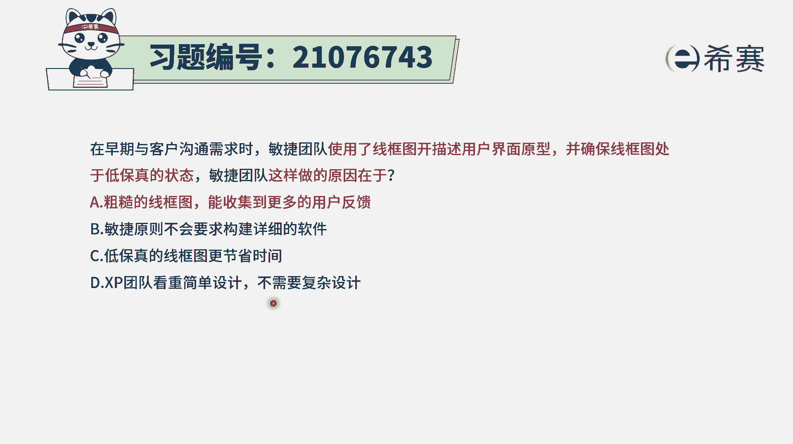

# 24年PMP考试模拟题200道，题目解读+知识点解析，1道题1个知识点（预测+敏捷） - P61：61 - 冬x溪 - BV17F411k7ZD

在早期与客户沟通需求时，敏捷团队使用了线框图来描述用户界面原型，并确保线框图是处于一个低保证的状态，那美尼团队这样做的原因是什么呢，啊首先我们了解一下什么是线框图，以及什么叫低保真的状态。

其实低保证它是跟那个高保真相对而言，就是如果说一个东西，跟那个最后我们所需要的东西讲得非常像，非常细致详细，那个呢我们就叫高保真，而线框图呢它是一个低保真。

它长什么样子，我们来看一下啊，像这种就是一个很简单的方式来去描述，在这里有这样一个框，有这个框，有这个框，有这个框，是一种就是用图形化的方式来展现，这个系统的某些页面的一个骨架的作用方式。

这种方式有什么好处呢，因为他写的比较粗浅，画的比较粗略，这样的话大家就会觉得说我们可以随意讨论，可以交流，如果说你画的非常细致详细，那别人都不好意思再去给反馈，因为你如果说再有改动的话，又会很困难。

所以对于这样一个像草图一样的，这样一个线框图，大家给反馈是可以比较有勇气去给的，这也就是方便我们更好的去收集大家的需求，所以经常会用这种线框图的方式，就是只用一些线条和方框。

还有一些灰阶色彩来去填空的这种方式，黑白的这种方式来做这样一个线框图，并且是一个低保，真的让大家感受到这就是一个草图，我们是可以去提改进意见，所以有了这些信息后。

我们来看一下四个选项，选项A说是粗糙的线框图，能够受到更多的用户反馈，哎这就是它的价值所在，所以呢答案就是选A。

就是用这一个很粗糙，像这样子很粗糙的这个线框图，能够更方便去收集信息，因为通常用户他会更愿意对，这种看起来很容易画的这种草图来给反馈。

如果你画的非常精美的话，他可能就不太好意思再去让你改，他不忍心，所以答案就是选A选项的其他几个选项，简单认识一下敏捷原则，不会要求构建详细的软件，请注意，敏捷的原则里面是要求。

不要去做这样一个详细的文档，但是是可用的软件，而胜过了面面俱到的文档，所以这句话本身他说的就是错的，我们敏捷本身就是要去做软件，最后做的一定是一个可以用的软件，它一定是包含了很多的这种代码。

很详细的去写代码选项，C低保真的这样一个线框图更节省时间，这不是重点，它不是为了去节省时间而做这样一个事情，而是为了能够更好地去满足他的收集需求，的这样一个目的，因为我们所要做的事情都是奔向价值去。

什么样才是有价值，就是能够客户觉得有价值才是有价值，那客户他如果需求都提不出来的话，那做的这些东西都是价值，可能就没那么大，选项D那极限编程团队会看重简单设计，而不需要复杂设计。

这个跟极限编程没有什么直接关系啊，线框图它就是一种很粗浅很粗略的方式，一个草稿图的方式能够方便我们去收集信息，所以答案就是选A选项的。

