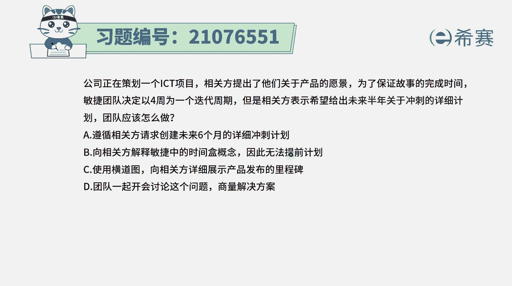
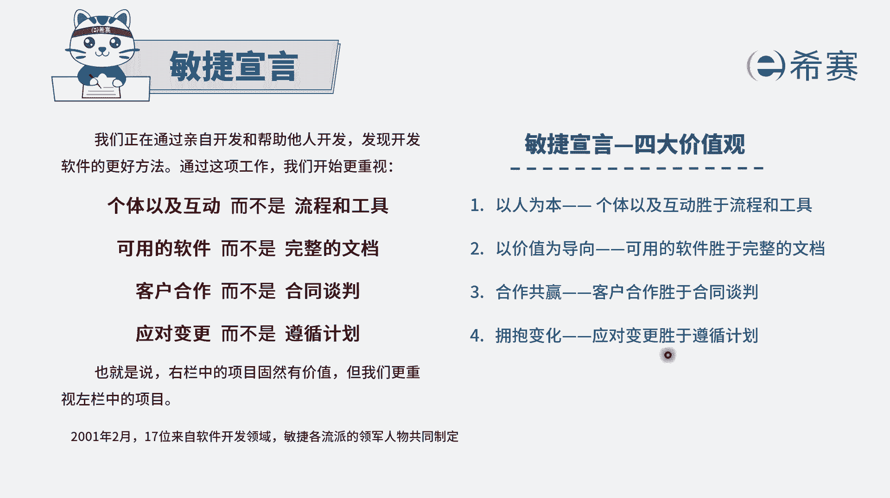
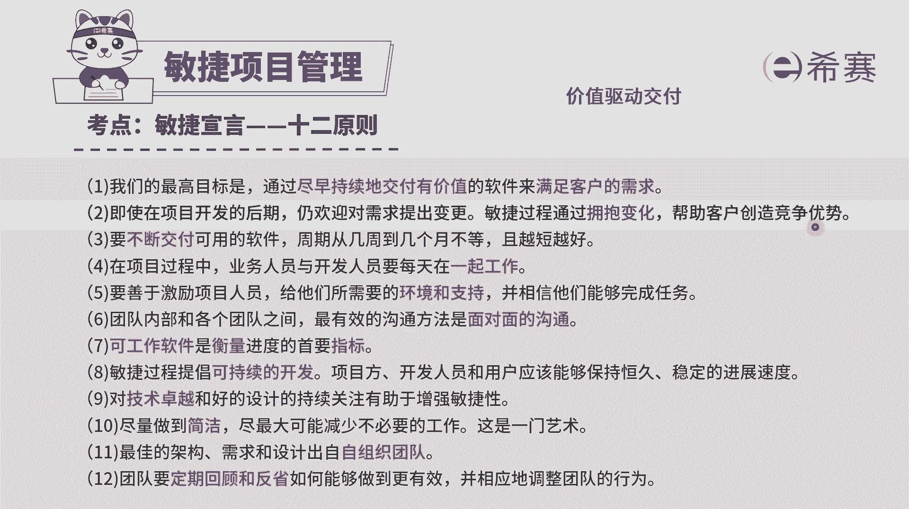
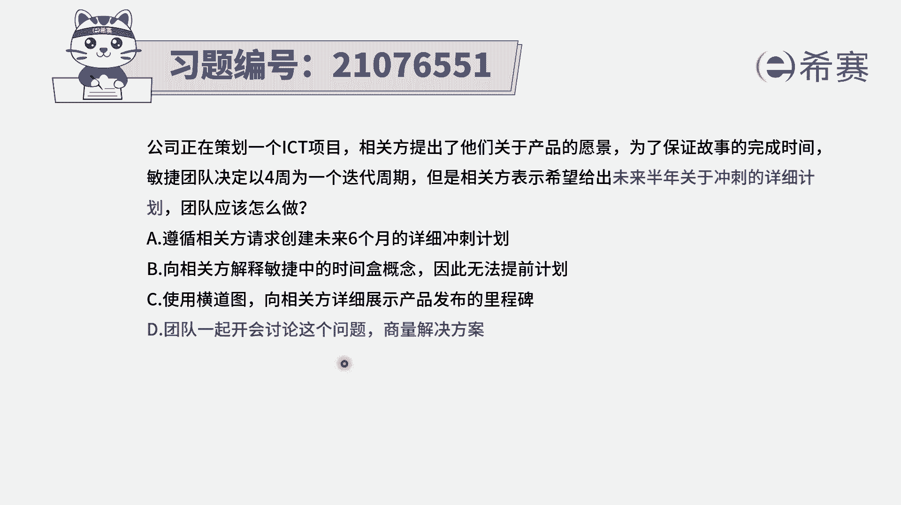

# 24年PMP考试模拟题200道，题目解读+知识点解析，1道题1个知识点（预测+敏捷） - P64：64 - 冬x溪 - BV17F411k7ZD

公司正在策划一个ICT项目，向官方提出了他们关于产品的愿景，为了保证故事的完成时间，敏捷团队决定以四周为一个迭代周期，但是相关方表示，希望给出未来半年关于冲刺的详细计划，那团队应该怎么做。

请注意本身这个项目呢它是一个敏捷型的项目，然后我们也已经是计划，按照四周为一个迭代周期来进行，但是相关方，他希望能够给出半年的这样详细计划，我们知道敏捷中他其实有个什么样的特点，他就是在拥抱变化呀。

就是可能不断的会有很多变更请求的产生，如果都没有什么变化的话，那就用结构化的方式来去管理就好了，就用瀑布模型来去管理就好了，这种方式呢还更加简单，并且所有的东西都是在掌控之中，而题干中告诉我们。

之所以用敏捷，那一定是会有很多变化，所以能不能做出这样一个，关于半年的详细的冲刺计划，几乎是不可能，有了这样一个基本信息以后，我们再来看一下这四个选项，选项A遵循相关方他请求的未来。

创建六个月的详细计划，这个钱肯定是不合适的啊，因为你做不出来的本身敏捷动态又会大量变化，那你做的是无用功选项B，向相关方解释命中的时间和的概念，因此无法提前计划，请注意是因为时间和的概念。

所以无法替换吗，不是啊。

其实是因为变化的原因，就是整个在敏捷中都会有一条，说是我们会开始更重视应对变更，而不是遵循计划，会说是应对变更更胜过了遵循计划里。

吉塔的这样一个价值观，就是拥抱变化，并且呢在敏捷的12原则中有这样一条说，即使在开发的后期，仍然欢迎对需求提出变更敏捷，通过拥抱变化来帮助客户创造竞争优势。

所以他一直在提倡什么，一直在提倡关于变化的这个事情，B选项中说是因为时间和的概念无法计划，不是的啊，其实是因为有大量的变更，所以才无法计划的，所以B选项也是错误选项，C，使用横道图。

像相关方详细展示产品发布的里程碑，那横道图首先你得要知道一下，很大头是用来干什么的，那它通常就是一个很详细的进度计划，那它其实就跟那个A选项，其实又回到一个事情上去，而我们现在是做不了的。

所以只能是告诉他，我们在敏捷的这种方式，没有办法用这种方式来进行，那以上三个选项都不能选，那就只能选D了对吧，那我们来看一下D选项，团队一起开会讨论这个问题，商量解决方案，诶这是一个很其实怎么说呢。

它是一个万金油的一个选项，他没有给出具体的解决方案，但他会告诉你，我们团队可以一起来共同讨论这样一个问题，那这就是正确答案，因为其他三个都实在是没有办法选，只有它了，他虽然没有给出真的具体方案是什么。

但是他会说的是我们一起来讨论，因为整个在敏捷中呢，我们的团队是一个自我组织做管理的团队，那遇到的问题，这个问题就是我们用敏捷的方式，对方却需要我们给出一个当年的详细计划，面对这样一个问题。

我们来一起讨论去解决答案选D啊。

