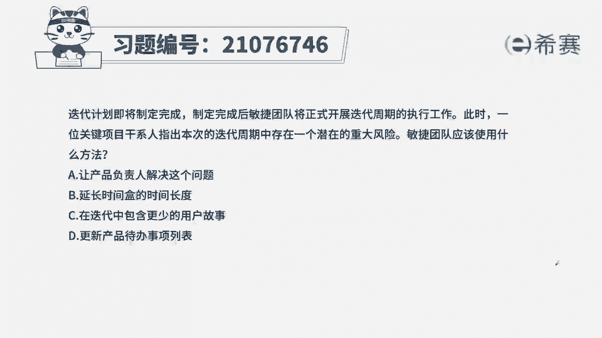
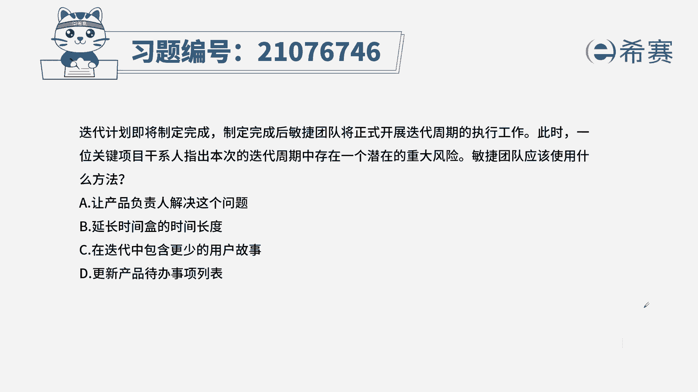
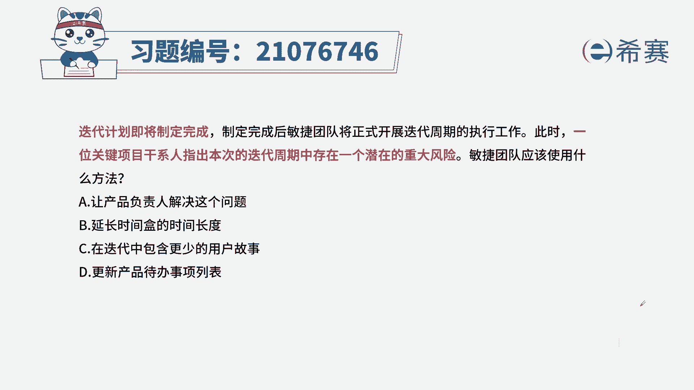
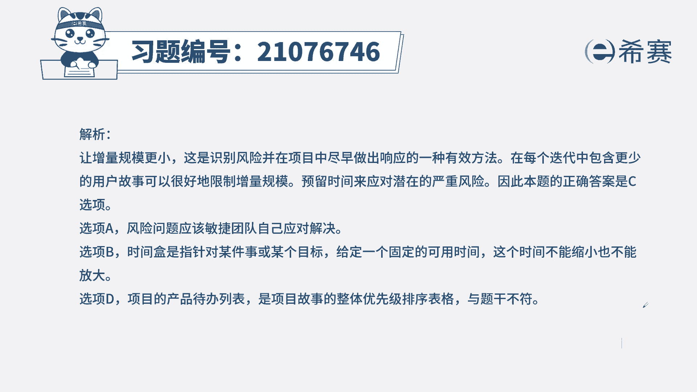

# 24年PMP考试模拟题200道，题目解读+知识点解析，1道题1个知识点（预测+敏捷） - P68：68 - 冬x溪 - BV17F411k7ZD

迭代计划即将制定完成，制定完成后，敏捷团队将正式开展迭代周期的执行工作。

此时一位关键项目干系人指出，本次迭代周期中存在一个潜在的重大风险，敏捷团队应该使用什么方法，A让产品负责人解决这个问题，B延长时间和的时间长度，C在迭代中包含更少的用户故事，D更新产品代办时尚列表。

本机的考法最佳实践，找到题干的关键信息，迭代计划已经完成，即刻进入到执行阶段，一位干洗人识别出了，本次比赛中存在一个重大的风险，我们回忆一下知识点，待办事项列表中，我们的优先级排序一按价值排序。

二按风险高低排序，这里识别了一个重大风险，证明风险的级别比较高，所以一定是在本次迭代中要进行处理，基于这个分析，我们来看一下选项，A让产品负责人解决这个问题，产品负责不负责具体的工作。

因为这是项目团队的工作范围，延长时间和的时间长度，迭代时间是固定的，不允许变，C在迭代中包含更少的用户故事，此项描述的意思就代表着，我们要将其他的用户故事减少，以被留出时间来处理刚才识别的重大风险。

因为他留学级更高啊，所以符合我们刚才的分析，D更新产品待办事项列表，本次是迭代代办列表，与产品待办事项列表没有关系。

从而选出最佳实践为C选项。

