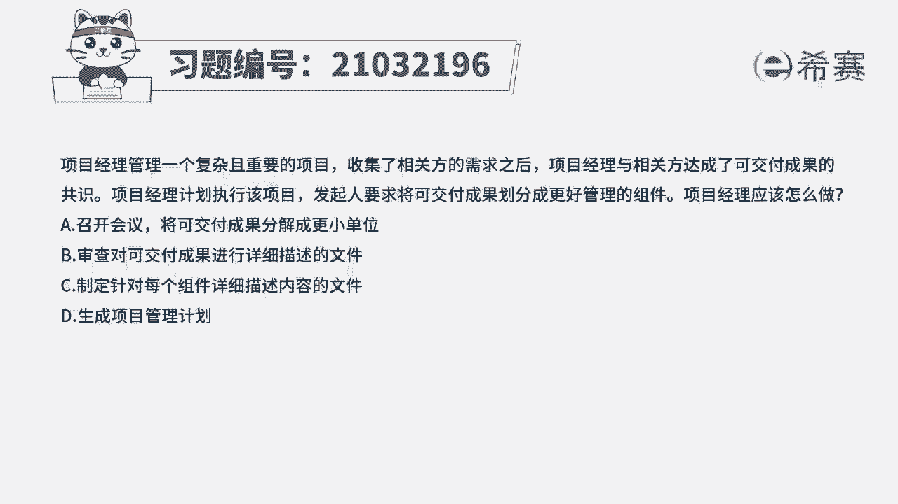
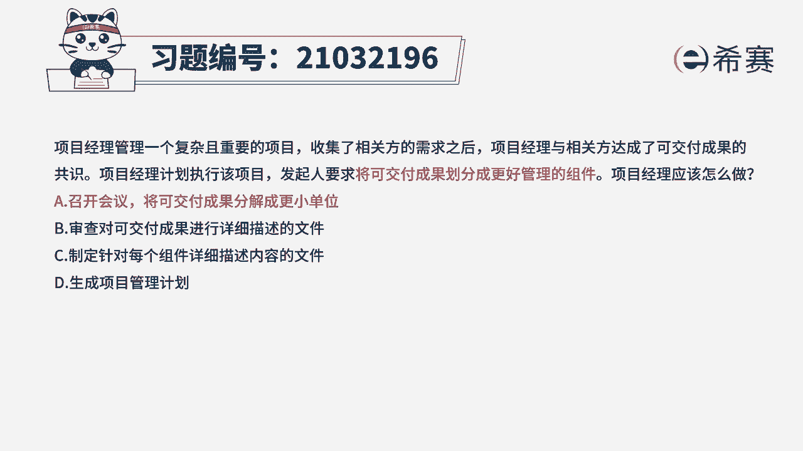
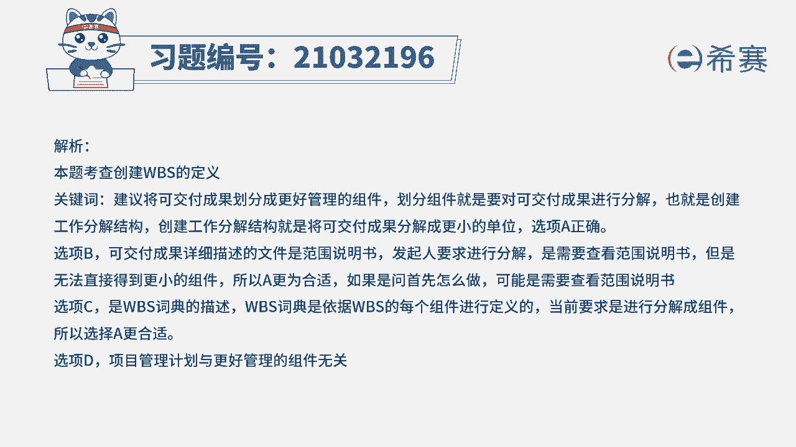
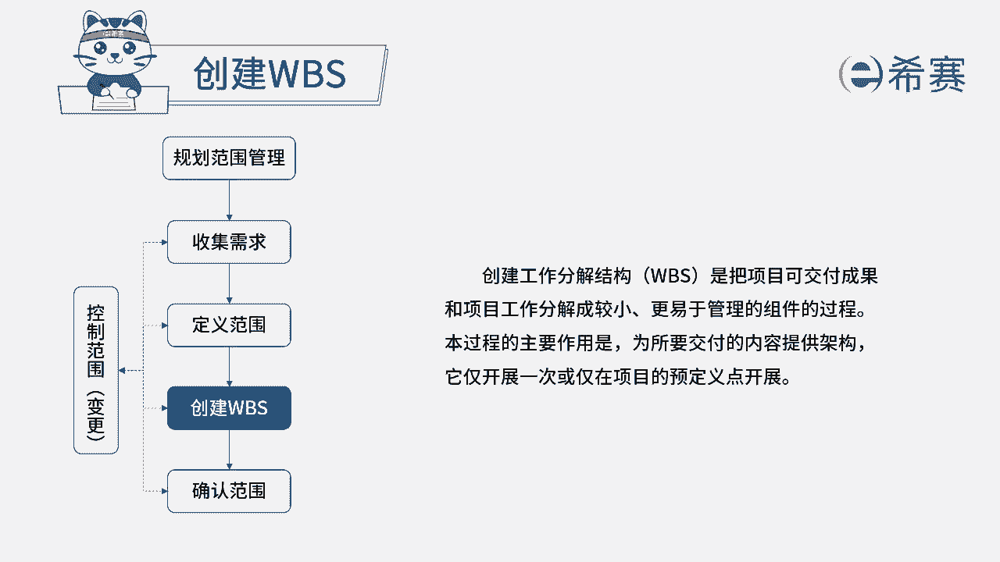

# 24年PMP考试模拟题200道，题目解读+知识点解析，1道题1个知识点（预测+敏捷） - P6：6 - 冬x溪 - BV17F411k7ZD

项目经理管理一个复杂且重要的项目，收集了相关方的需求之后，项目经理与相关方达成了可交付成果的共识，项目经理计划执行该项目，发起人要求，将可交付成果划分成更好管理的组件，项目经理应该怎么做，A召开会议。

将可交付成果分解成更小单位审查，对可交付成果进行详细描述的文件，C制定针对每个组件详细描述内容的文件，D生成项目管理计划，我们来看一下关键词，将可交付成果划分成更好管理的组件。

划分组件就是要对可交付成果进行分解，其实也就是创建WBS，创建工作分解结构，其实就是将可交付成果分解成为更小的单位，所以这道题最佳选项应该是A选项，我们再来看一下其他三个选项。

选项B审查对可交付成果进行详细描述的文件，可交付成果详细描述的文件，它就是范围说明书，发行人他要求进行分解，其实就是需要查看范围说明书，但是没有办法得到更小的组件，所以A会比B要更合适一些。

如果他要是问首先怎么做，那可能就是需要查看范围说明书，大家看一下C选项，制定针对每个组件详细描述内容的文件，C选项，他说的其实就是WBS词典，那WBS词典呢，它是根据WBS里面每一个组件进行定义的。

当前的要求是进行分解组件，而不是去定义这个组件它的一个描述内容，所以C也排除D生成项目管理计划，项目管理计划，它与我们题目要求划分成更好管理的组件，没有关联，所以我们排除这道题。

最佳选项是A选项，这是这道题的文字解析。

有需要的同学可以暂停看一下，这道题考察的知识点是第五章。

