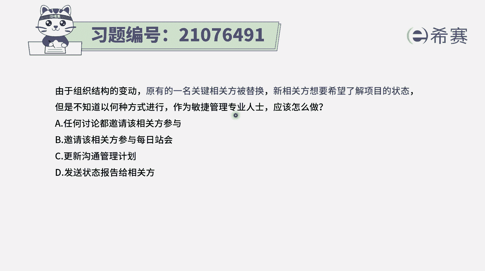
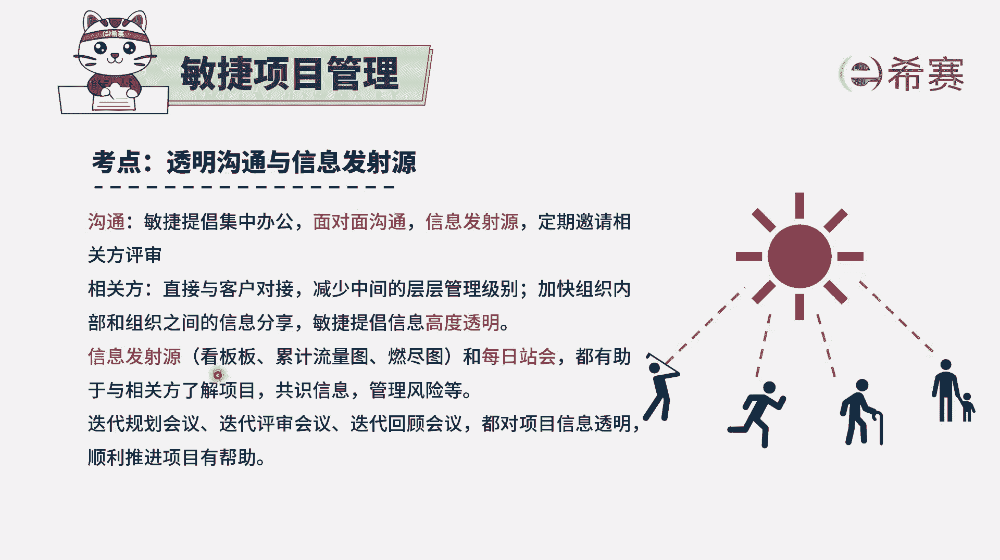
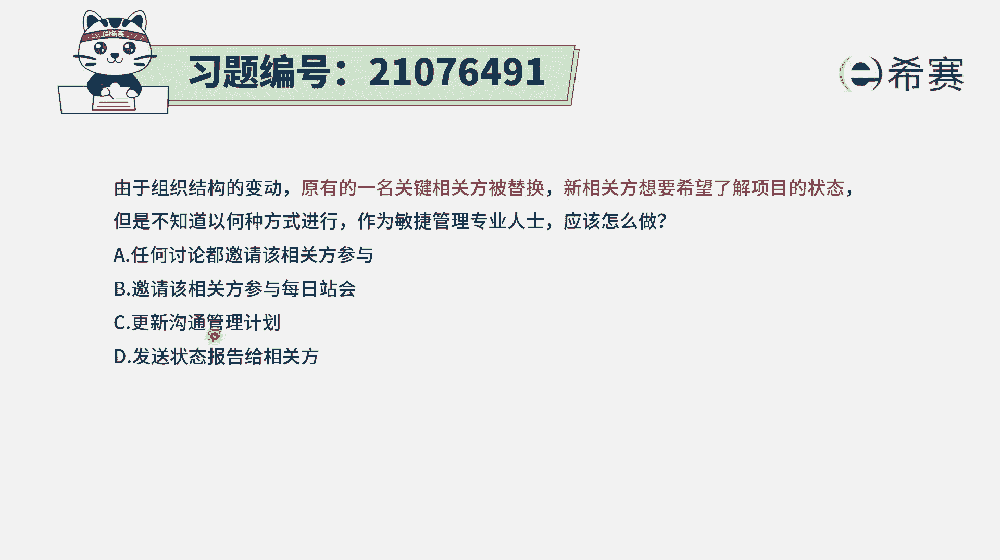
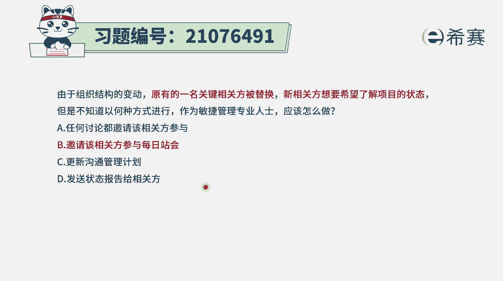
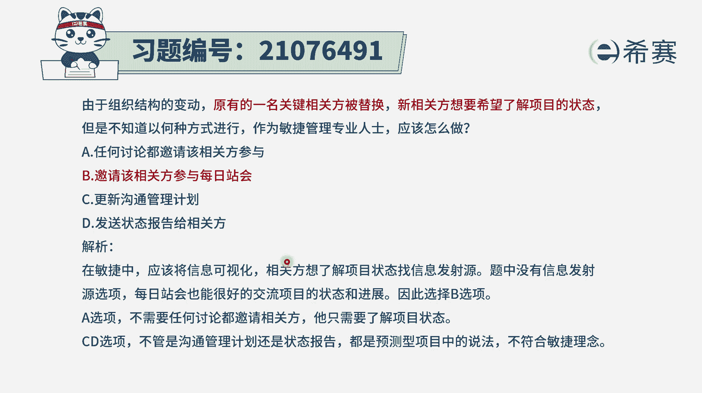

# 24年PMP考试模拟题200道，题目解读+知识点解析，1道题1个知识点（预测+敏捷） - P79：79 - 冬x溪 - BV17F411k7ZD

由于组织结构的变动，原有的一名关键相关方被替代，新相关方想要了解项目的一些状态，但是不知道以何种方式来进行，作为敏捷管理的专业人士，你应该怎么做呃，就是有新的人员加入进来。

需要去了解下面的一些情况的时候呢，其实我们在敏捷中它就会有一个很重要的事情。

就是信息透明，就是会把一些项目的一些具体的进展情况，会通过看板的方式呀，燃尽图的方式来展现出来，这个呢有专门有个名词叫信息发射语言，同时我们还要一般来讲，每一天都会开一次，来同步项目的一些基本情况。

每一个人都在做什么东西，将要做什么东西，以及遇到什么困难和挑战，一般会把这样一个看板里面的内容稍微过一遍。

所以呢有了这样一些基本信息以后，我们来看一下四个选项，选项A呃，任何讨论都邀请该相关方参与，你开玩笑，他是一名关键相关方，一般来讲涉及到什么叫关键相关方，其实就可能会是一个偏leader的这个角色。

那看来有那么多时间来参与你的每一次会议，这种方式是可行的，但不一定就非得用这种方式去做，但是我们其实是可以通过这样一个，信息发射语言的方式，能够让他去看到，选项C更新沟通管理计划。

以及选项D发送状态报告给相关方，就是这个的话呢，在敏捷中他就没有完整的这种沟通管理计划，以及没有这样一个完整的关于专项报告的说法，他的沟通就是大家都是一种扁平式的沟通，但就是整个整个是一个扁平式的管理。

是信息透明的这种方式来进行沟通。

而关于状态呢，就通常也是会通过这样一个看板的方式，燃晶图的方式，能够明显的去看到当下项目的一些进展情况，而不会是单独再去做这样一个，状态报告的这种形式。

所以C和D呢都不是敏捷的，那这样算下来的话，只有B选项是可以选，因为B选项它也算是这种信息同步的方式之一，通过这种信息同步，能够让对方获取到项目的一些基本情况，其实他更好选了一个方式。

应该是信息发射语言，那这个题目的解析呢。

