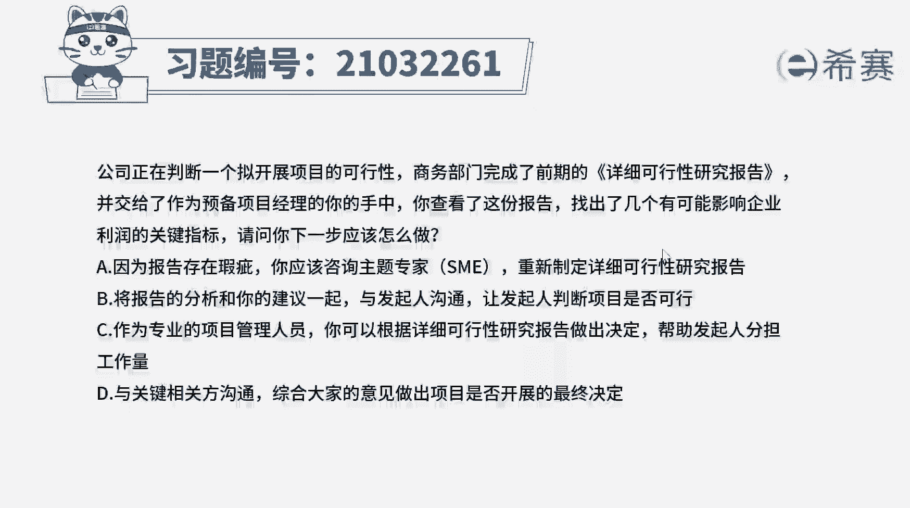
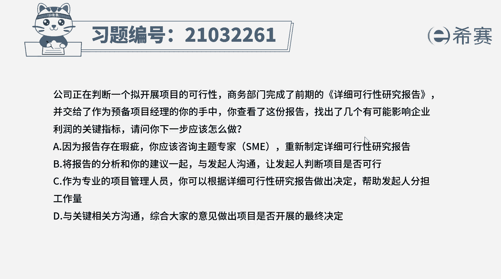
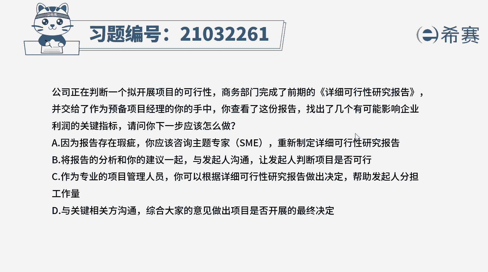
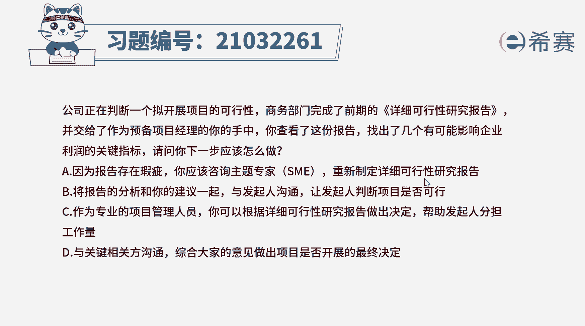
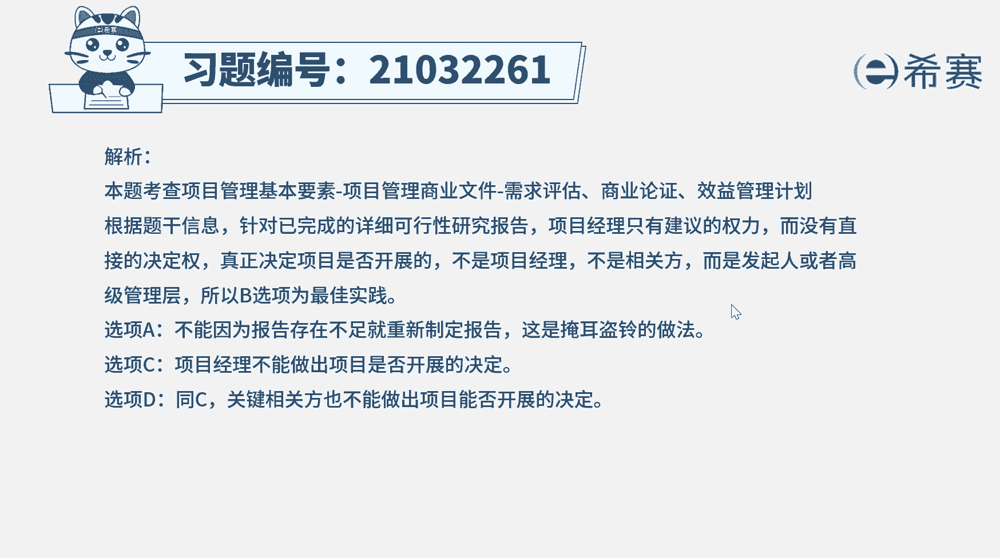
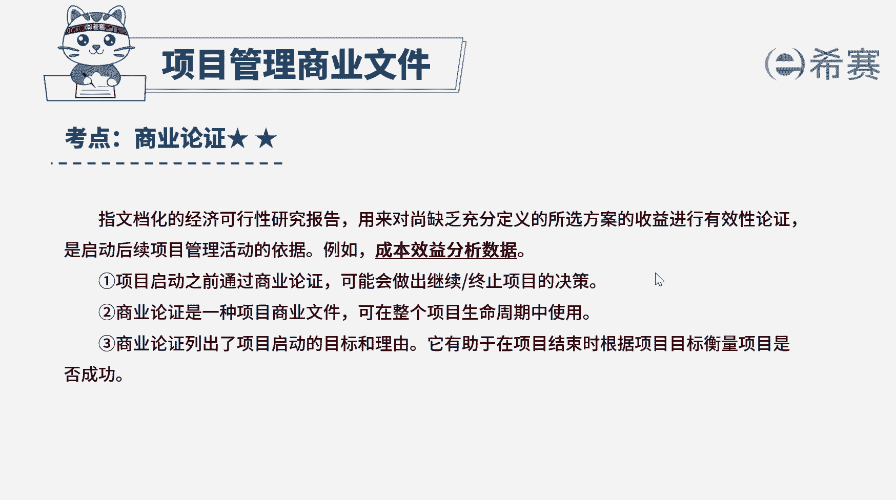

# 24年PMP考试模拟题200道，题目解读+知识点解析，1道题1个知识点（预测+敏捷） - P7：7 - 冬x溪 - BV17F411k7ZD

公司正在判断一个离开展项目的可行性。

并交给了作为预备项目经理的你的手中。

你查看了这份报告，找出了几个有可能影响企业利润的关键指标，请问你下一步应该怎么做，A因为报告存在瑕疵，你应该咨询主题专家SME，重新制定详细可行性研究报告，B将报告的分析和你的建议一起与发起人沟通。

让发起人判断项目是否可行，作为专业的项目管理人员，你可以根据详细可行性研究报告作出决定，帮助发起人分担工作量，D与关键相关方沟通，综合大家的意见，作出项目是否开展的最终决定好读完题目。

我们找到题干中的关键词，判断一个项目的可行性，已经完成了详细可行性研究报告，找出了几个可能影响企业利润的关键指标，项目经理下一步应该怎么做，注意这里还在制定项目可行性研究报告，说明项目还没有正式启动。

项目启动前，很多工作都是项目经理没有权限做的，存在影响项目利润的指标，下一步就要看这些指标，对项目的利润有多大的影响，能不能减轻他们对项目利润的影响，判断在此条件下，项目还是不是可行的，值得去做的。

而项目可行性的判断，项目经理无法决定，他只有建议权，真正决定项目能否开展的是发起人，或高级管理层，因此本题的最佳答案是B选项，提出自己的建议，让发起人判断项目是否可行，那我们来看一下其他选项，选项A。

现在只是这个报告中，存在几个影响企业利润的指标，并不是说整个报告的制定或内容出现了问题，所以只需要针对这几个指标进行分析就可以了，重新制定报告，并不能让这几个指标消失，无法解决实际问题，选项C。

项目经理没有权限做出项目是否开展的决定，这是发起人或高级管理层应该做的，选项D那D的错误原因与C是一样的，项目经理，关键相关发都没有权限，作出项目是否开展的决定，最终的决定由发起人或高级管理层来做好。

那我们这道题就先讲解到这里。

大家可以自行参考一下相关的文字解析。

整个题目讲解下来，我们可以知道，本题考察的知识点就是项目可行性的判断。

