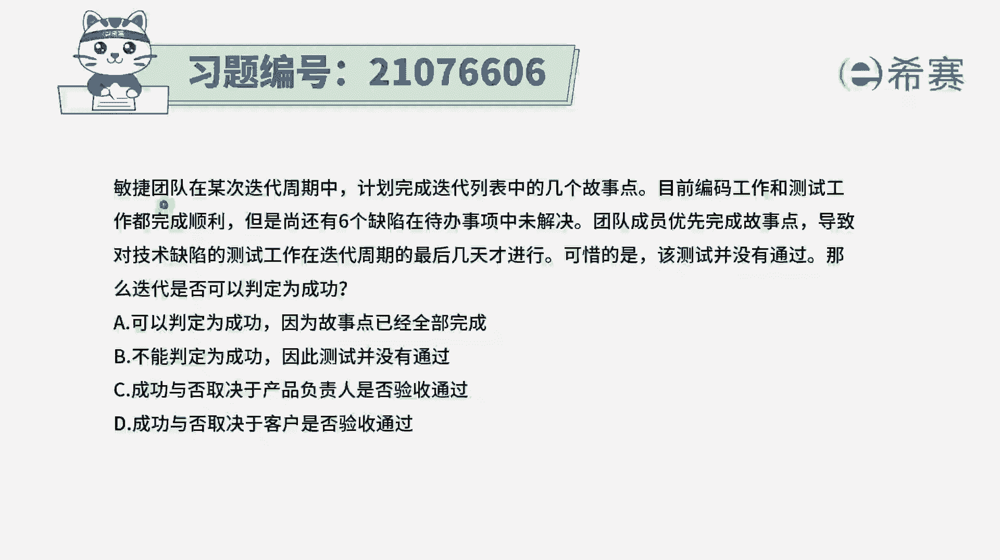
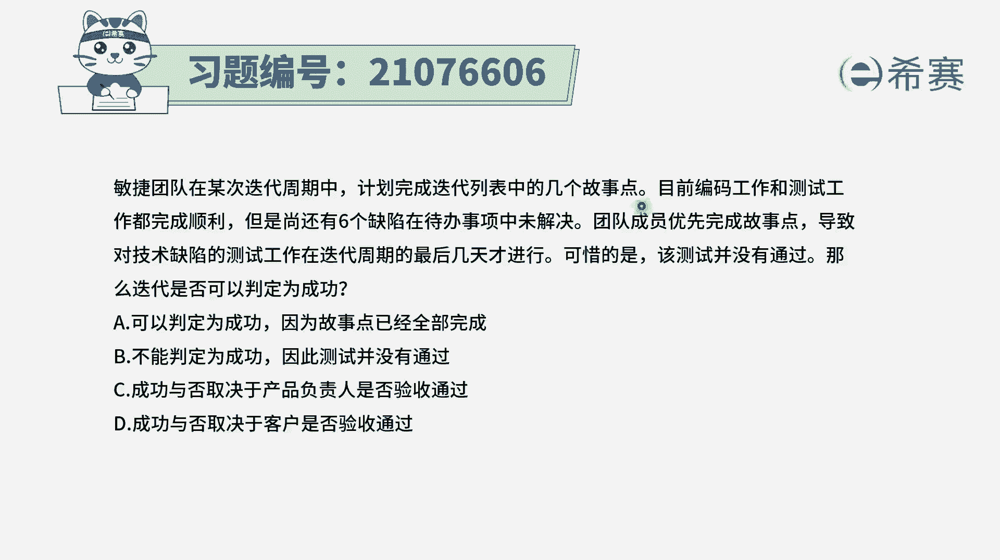
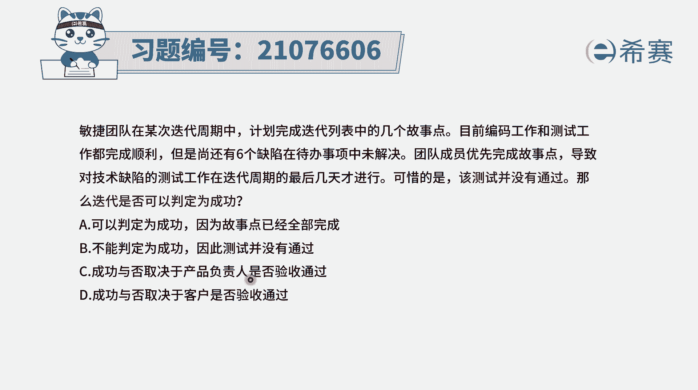
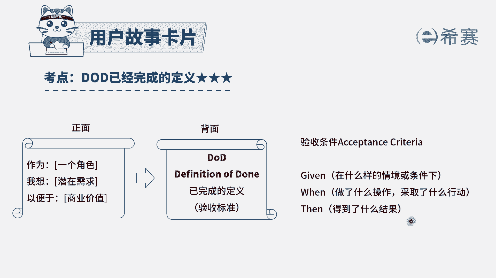
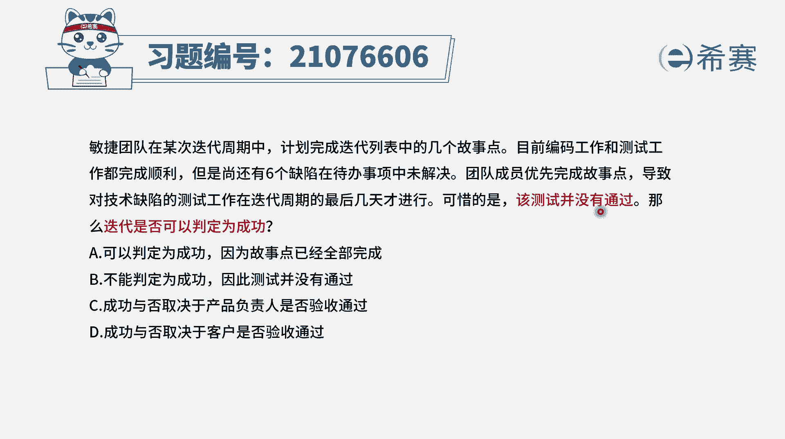
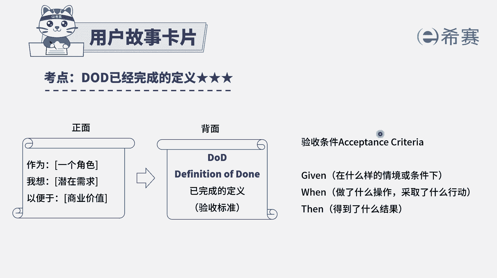
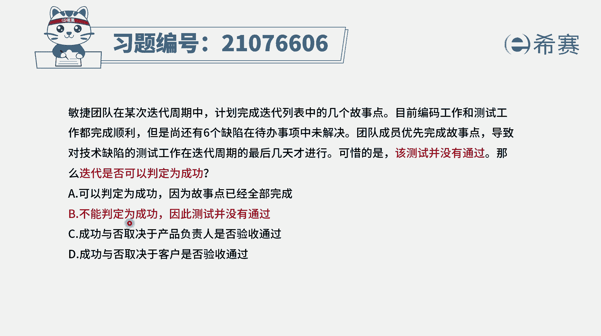
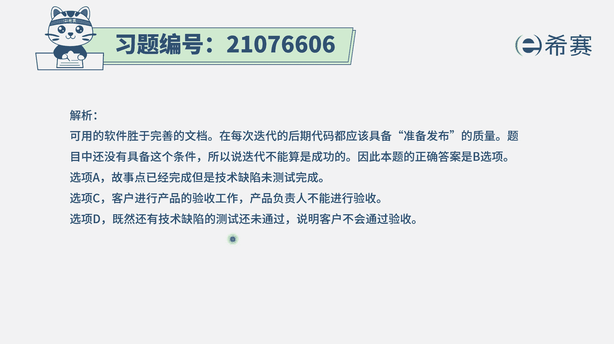

# 24年PMP考试模拟题200道，题目解读+知识点解析，1道题1个知识点（预测+敏捷） - P81：81 - 冬x溪 - BV17F411k7ZD

敏捷团队在某次迭代周期中，计划完成迭代，代办事项列表中的几个用户故事点。

目前编码工作和测试工作都已经是顺利完成，但是尚有六个缺陷在待办事项列表中未解决，团队成员优先完成故事点，导致对技术缺陷的测试工作，在迭代周期的最后几天才进行，可惜的是，该测试并没有通过。

那么迭代是否可以判定为成功呢，那么四个选项其实就是在问询说呃，有功能已经是都做完了，但是呢有六个bug，那么这一次的这个迭代到底算成功还是不成功，选项A说是可以说成功，因为故事都做完了。

而选项B呢是不成功，因为测试没有通过，选项C和D生成功与否，取决于产品负责人是否验收，或者是客户是否验收。

通过这里呢我们需要去解释一个定义，通常在用户故事的跟随而来的，有一个叫做DOD叫完成的定义，就是当我们做到什么程度上的时候，这个用户故事就算是完成，它的这个完成定义呢，会有一个明确的一个三段论。

就是在什么样的条件下，或在什么样的情境下，当我做了什么操作，当或者当我采取什么行动的时候，他就能够得到什么结果，就这个系统就会呈现出什么结果出来，那如果说我做的功能都完成了，并且测试也通过了。

那么只要是在这个情境下，我一旦做什么操作，输入什么东西或者是按什么按钮，它就会得到什么样一个结果呈现出来。

做了这样的话才算是完成，而题干中告诉你的，很显然是那些测试都没有通过的话，你去做对应的按钮，或者说输入对应的输入信息，它能得到我们所预想的结果吗，肯定得不到，所以呢这肯定是不成功。

OK所以答案就是选第二个选项啊，就是不成功啊，因为它跟这一个已完成定义都不匹配。

完全没有达到已完成定义，所以就是不成功，有意思，同学会说啊，我说那个产品负责人说通过验收就算是可以了，或者是客户验收就通过就可以了，这个连功能都没做到，连那个质量都没达标的东西，你怎么样说都说不过去。

OK所以但凡是有一些东西没有测试通过，那么这个迭代肯定是算失败的。

就没有成功，那下一轮就要好好搞解析。

