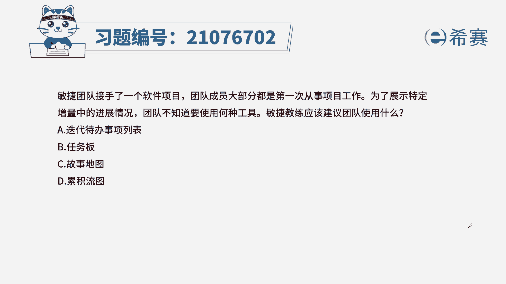
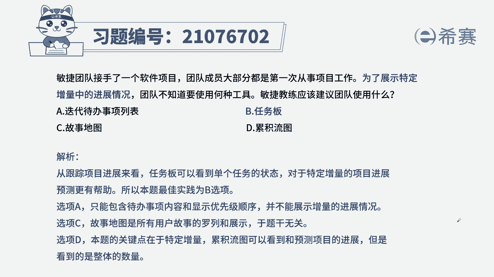
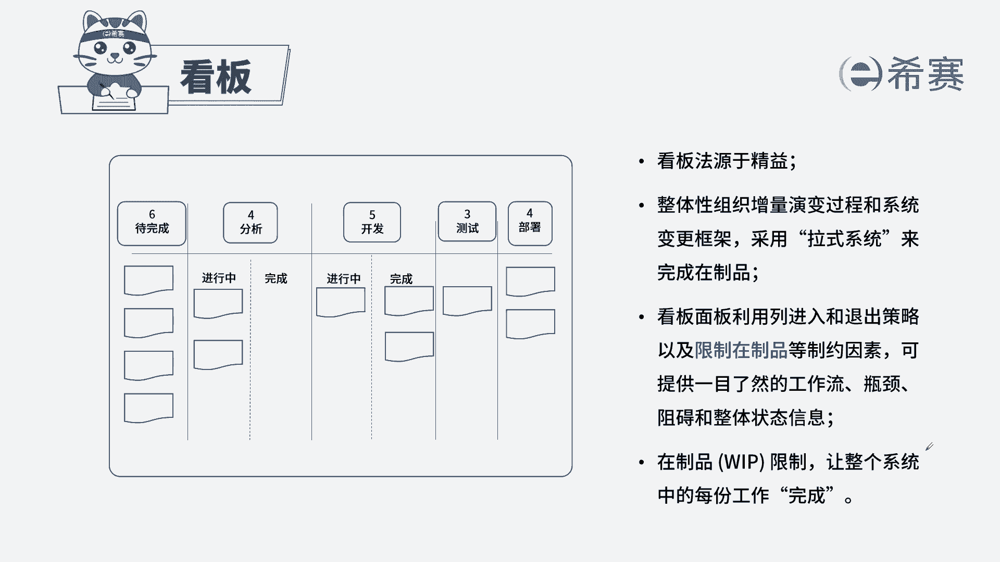

# 24年PMP考试模拟题200道，题目解读+知识点解析，1道题1个知识点（预测+敏捷） - P83：83 - 冬x溪 - BV17F411k7ZD

敏捷团队接手一个软件项目，团队成员大部分都是第一次从事项目工作，为了展现特定增量中的进展情况，团队不知道要使用何种工具，敏捷教练应该建议团队使用什么，A迭代代办时尚列表，B任务版，C故事地图D累积流图。

本题的考法是考内容，首先通过题干找到关键信息，题干中提到为了展示特定增量中的进展情况，我们用什么样的工具，我们来看四个选项，A迭代代办事项列表，迭代代办事项列表，只能了解故事的优先级。

而无法了解它的进展情况，任务版，任务版是看板的一种，通过看板我们就能了解到某一个特定的任务，现在是代办中还是进行中，还是已经完成，还是已经测试，他的状态展现的非常的细致，尤其是这里的特定增量。

代表着我要找到具体的某一项用户故事，在任务版中就非常的详细，里面包括了谁在操作，具体是什么内容等等，C故事地图，此地图包括了我们用户故事，但是无法展示我们的进展情况，D累积流图。

累计的图可以了解到整体用户故事的进展情况，但是针对特定增量是无法详细到这个程度的，从而我们选出正确选项是B选项。

任务版，这是本题的解析。

大家可以暂停看一下本题的相关知识点，看板，针对于这个知识点，我们一定是从内容上看手，首先看板是什么，它包括哪些特性，其次看板的作用是什么，只有这样掌握了作用和内容。

