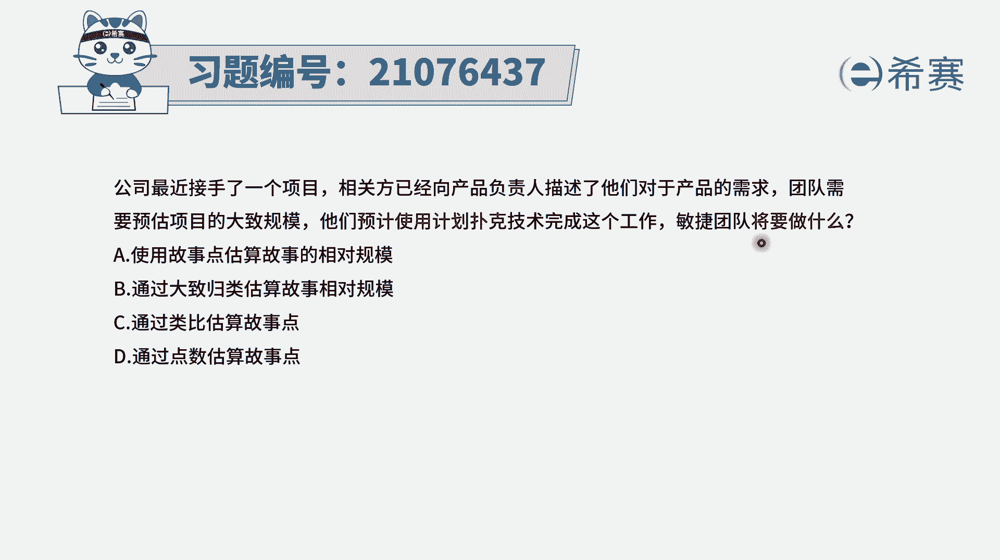
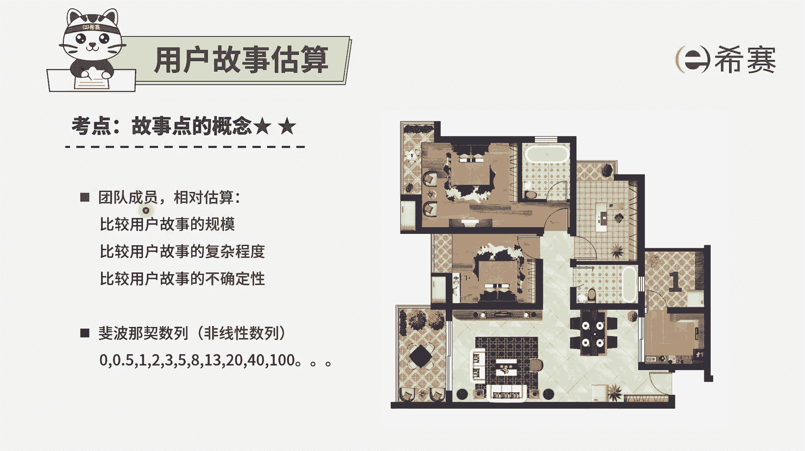
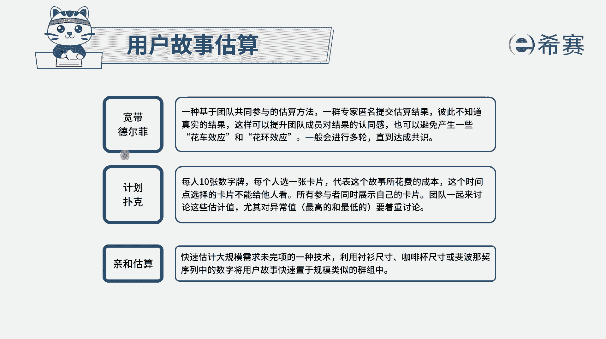
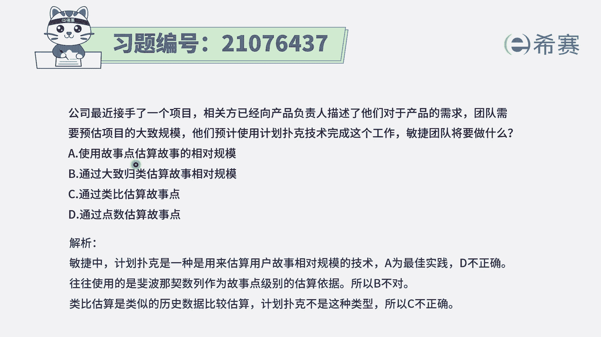

# 24年PMP考试模拟题200道，题目解读+知识点解析，1道题1个知识点（预测+敏捷） - P86：86 - 冬x溪 - BV17F411k7ZD

公司最近接手了一个项目，相关方已经向产品负责人描述了，他们对于产品的需求，团队需要预估项目的大致规模，他们预计使用计划扑克来完成这样一个工作，那么团队将要怎么做呃，这里面其实会告诉我们的是。

我们要去估算一个项目的项目规模呃，用计划补课来去估算这些故事点数，那在估算之前呢，我们有一些基本信息需要去了解。

首先第一个在敏捷中，他去估算的时候呢，相对来讲都是用的一种叫相对估算，什么叫相对估算呢，就是我们并不会说给出这样一个用户故事，他大概需要几天，大概需要几天，而是会把这样一些故事中的一些故事。

都过一遍以后，挑出其中最小的一个故事来作为单位一，然后其他的故事呢会跟这样一个单位一，来去比较，通过比对的方式，能够去算出大概的这个复杂程度，打个比方，像我这里这张图形看到的，我们如果说要去装修房子。

那装修房子到底要费多少功夫呢，或者要费多少钱呢，费多少时间呢，我们就来其中的一个最为容易装修完成的，这一部分来作为一个作为一个参考值，作为一个标杆值，比方说拿这个花园入户花园来作为一个参考值。

那它我们就是上层是一，然后起来看看这一部分要多长时间，这一部分要多长时间，这一部分这一部分这一部分这一部分这一部分，这一部分，就其他地方，我们会来他去跟这个参考一来进行比对，所以是一种相对估算。

并且在敏捷项目管理中，A项目它的故事点数和B项目的故事点数，没有直接的可比性，因为每一个项目都是根据自己的里面的内容，来进行相对估算的。

所以它没有可比性啊，这是这样一个内容，另外题干中说到了关于计划扑克，那计划扑克其实是，每一个人手上都拿了一副扑克，可能会用的是这个菲波那切数列来去表示的，每一个人都会去对于某一个用户故事。

我们来去123出牌，出版以后来去出出，我对于这样一个用户故事，我觉得他可能需要多少故事点数来完成，通过这种方式在讨论交流以后得到一个间隔，结果值，有了间隔基本信息以后呢，我们再来看一下题干中的四个选项。

就是我们想要去做这个大致的规模的估算，然后呢用计划补课来去做，那我们基本上会怎么做呢，选项A使用故事点来估算故事的相对规模，这一句话首先一看就是没有错误啊，他没有错误，它是正确的，所以它是一个可选项。

选项B通过大致规律来估算故事的相对规模，在我们敏集中没有用到，这样一个叫大致归类的这样一种方式，它都是一个故事，一个故事，它来去比较，就来去进行估算的，选项C通过类比估算估值点数。

那这个类比估算其实我们在某种程度上来讲，对于这一个项目里面的其他的那些个用户故事，我们会去比对这一个标杆的这个故事，但是我们如果非得说到类比估算的方式，更多的是什么呢。

类比不上更多的是这个项目和那个项目，它们之间项目和项目进行比较，而我们刚刚有看到，其实在敏捷里面的话，它会更强调的是一种相对过剩，那在这一个项目中，我们会拿其中的某一个用户故事。

作为最小的用户故事作为一个一来表示，所以它是用一种相对估算的方式，它的故事故事点数，A项目的故事点数和B项目的故事点数，没有直接可对比的这个可能性，所以不选这个最后一个，通过点数来估算故事数呃。

这个说法表达不清不楚，事实上我们是通过故事点数，也就是这一个用户故事，它大概是三点还是五点，而是这种方式，并且呢它还是一个相对估算，所以这里只有A选项是最完整的，只有A选项是最完整的，答案是选A。

也就是说在敏捷中，一般情况下，我们就会是用这种故事点数的方式，来去估算项目，并且是一种相对估算的这种方式来做到。

