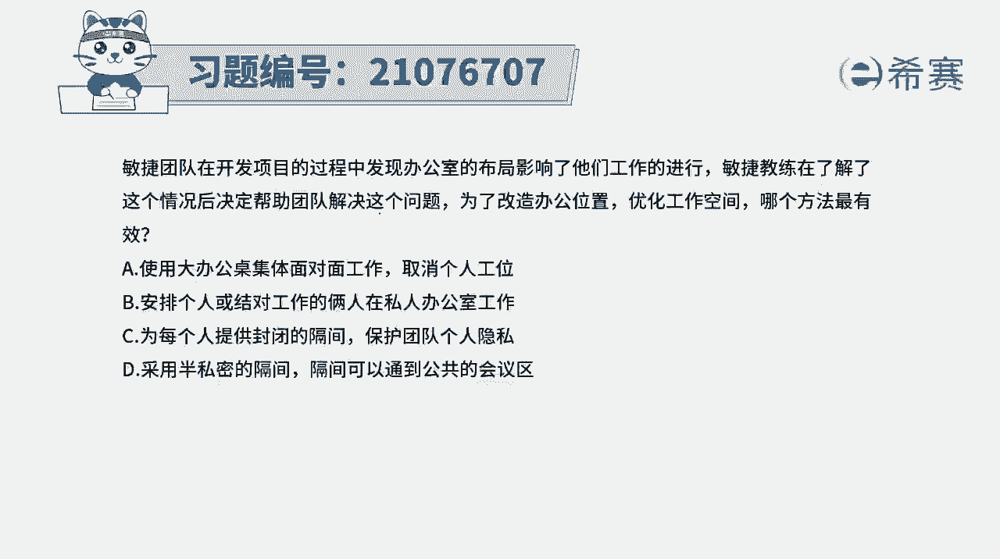
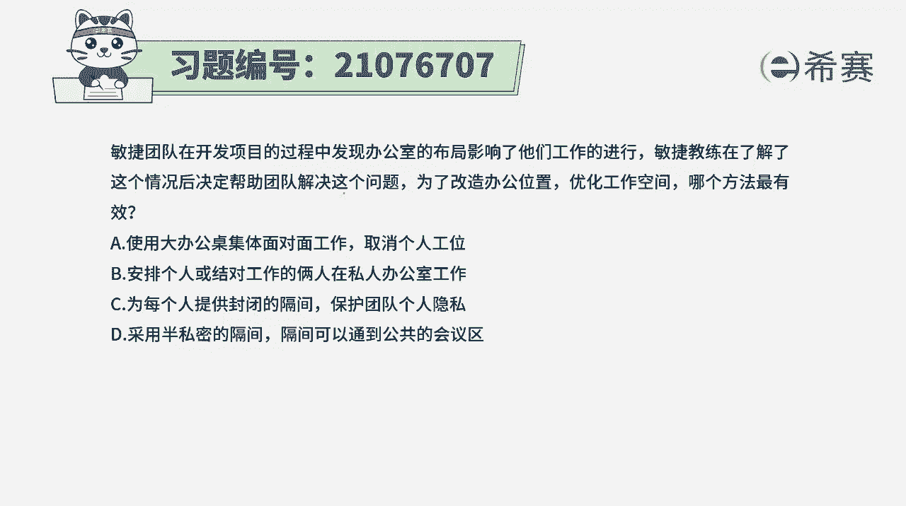
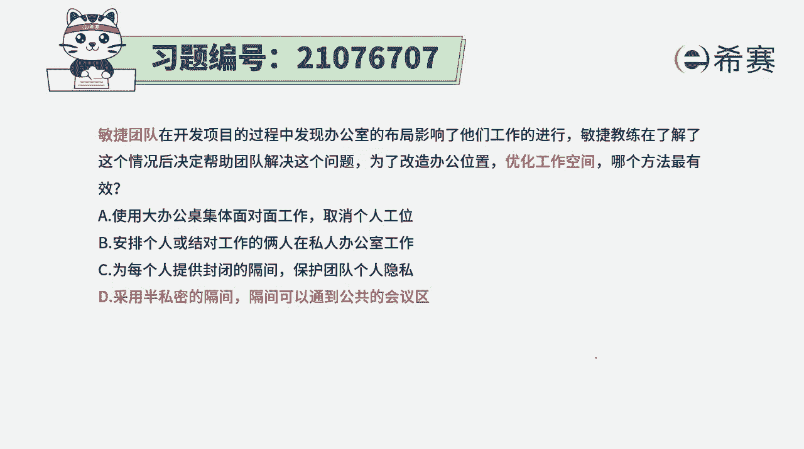

# 24年PMP考试模拟题200道，题目解读+知识点解析，1道题1个知识点（预测+敏捷） - P90：90 - 冬x溪 - BV17F411k7ZD

敏捷团队在开发项目的过程中，发现办公室的布局影响了他们的工作进行。

敏捷教练在了解了这个情况以后，决定帮助团队解决这个问题，为了改造办公室位置，优化工作空间，每一个方法是最为有效的哦，这就厉害了，那这样一个工作人员，他觉得办公区域的作用方式对自己工作不利，那怎么办呢。

我们首先要了解一下，一般来讲敏捷他会提倡的是面对面的沟通，应该是集中办公，所以大家应该是在一个办公室里面，但是呢它就是如果是完全敞开的这种方式呢，它又会没有隐私，所以就是如果有一种方式。

既能够一定程度上保护隐私，同时呢又有一些公共区间，那更好，不过我们来看一下四个选项，选项A使用大办公桌，集体面对面办公，取消个人工位，那这种方式就完全没有隐私可言，但是他确实是能够比较好的去沟通。

但同时可能受干扰的可能性也比较大，选项B安排个人或结对工作的两人，在私人办公区工作，那你得要去弄多少个办公室出来呀，那这个代价也太昂贵了吧，这种方式对于他们两个来讲，单是好处的，有隐私。

但是对于大家的这种信息互动，其实也不友好，因为有的时候我们在一起办公的话，有什么好处呢，就在无意中说了什么话，哎对方就诶能够去更多更多的信息，这就是所谓的叫渗透式沟通，所以这种方式也不行啊。

选项C为每一个人都提供封闭的，这个跟B选项是一样的，不合适，而D选项采用半私密的这种隔离，隔离可以通到公共区域，就说既能够有一些公共区域的地方，能够能够进到公共区域的地方来。

同时又有自己的一点小小的隔离，这两个人可以去沟通交流，既可以是关注专注自己的事情，同时又可以转过头来专注大家的这样一些事情，这种方式相对而言是最为理想的，所以答案呢是选最后一个，但是在敏捷的讲述中。

其实没有说到这一部分，大家需要了解这种方式，它既能够保持一定程度上的这样一个私密性，又能够满足这种大家一起去工作，这种渗透沟通解析。

