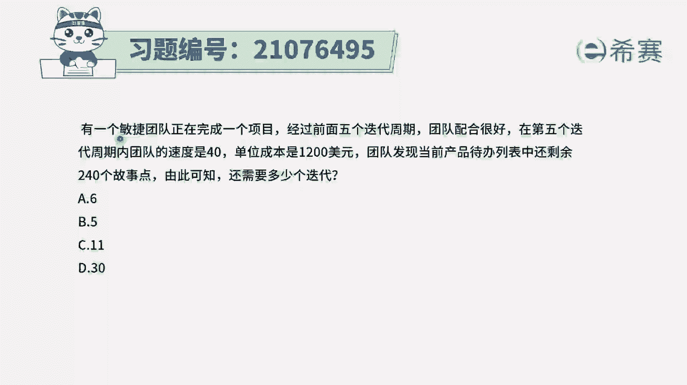
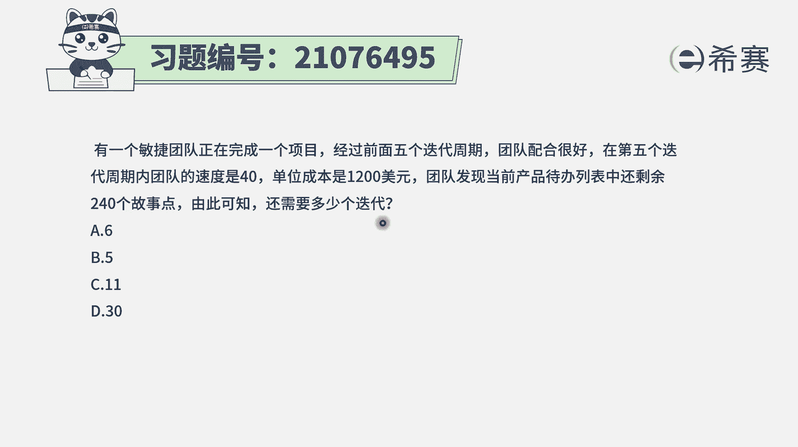
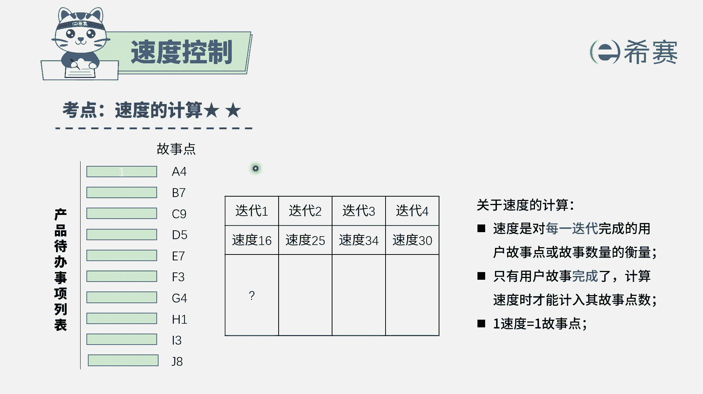
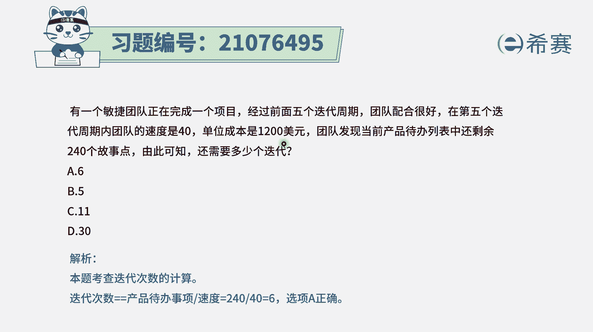

# 24年PMP考试模拟题200道，题目解读+知识点解析，1道题1个知识点（预测+敏捷） - P94：94 - 冬x溪 - BV17F411k7ZD

有一个敏捷团队正在完成一个项目，经过前面五个迭代周期，团队配合很好，在第五个迭代周期内，团队的速度是40，单位成本是1200美元，团队发现当前产品待办事项列表中，还剩余240个故事点。

由此可知还需要多少个迭代，那这个题目，虽然他没有给你更多的信息的情况下，你只能是用一种理想的方式来去做计算。

呃，首先我们得这样一个点，就是在敏捷中啊，它的用户故事的那个速度是什么呢，它的速度是我们在做一轮迭代中，能够完成多少个故事点数，这个故事点数的数量就是我们的那个速度，那这个速度通常是基于前几轮迭代的。

这个稳定速度来推测得到的。

就是而题干中已经明确告诉你，现在那个速度已经是配合的很好，然后速度应该就是比较稳定了，然后他就告诉你在这一轮中的速度是40，他没有告诉你更多信息的情况下，我们就可以默认为40。

就是咱们的一个比较合适的速度，有了这个信息以后再来看，现在还剩了240个估值点数，那么就用除法，就是直接用240÷40，就可以得到这个数值就是六，所以你就可以直接去选到六，当然了，这是一种理想状态。

因为他没有给任任任何更多的信息，但有更多信息的情况下，我们就可能还需要有更多的推测，但是在他没有给任何信息的情况下，我们就只能是根据他少量的信息来做一个，简单的计算就够了，当然在这里有一个。

1200美元的这样一个单位成本，它是一个干扰项，跟这个题目没有什么直接关系，我们要知道，整个速度就是这一轮迭代能够完成的，总体的故事点数的总和，一号线总共才240个，那么就是每一轮可以完成40个的话。

那么六轮就可以完成240个。

