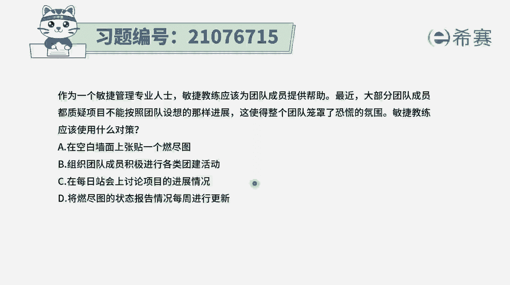
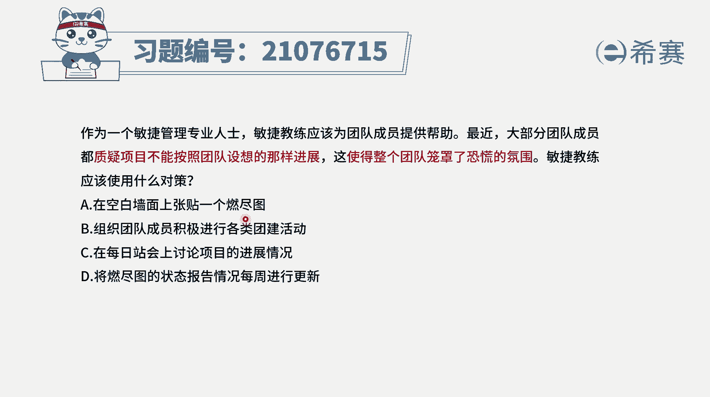
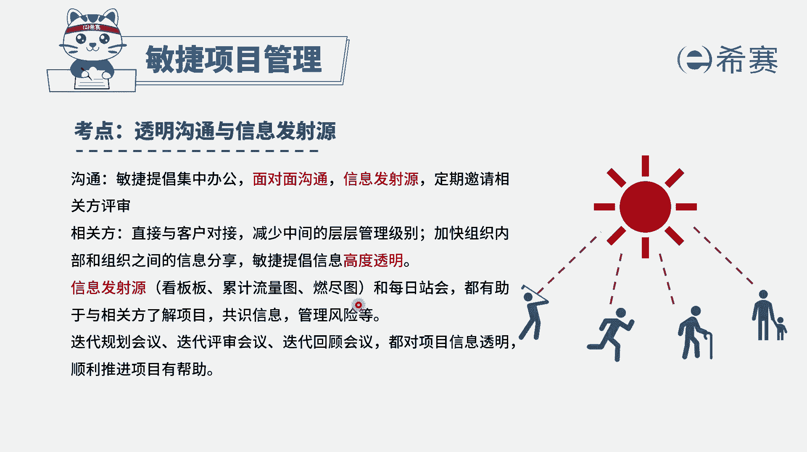
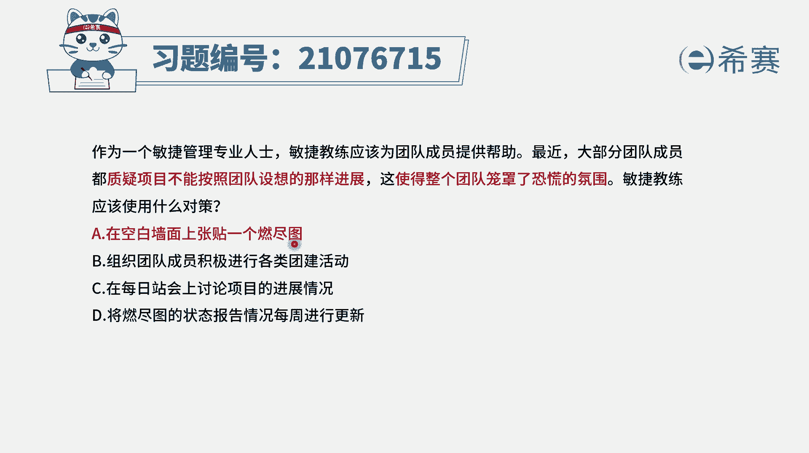
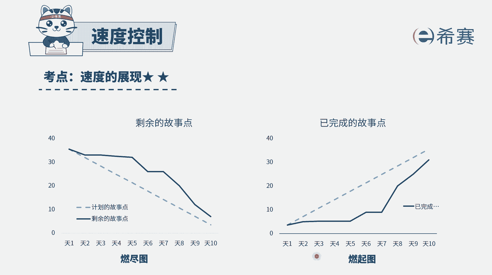
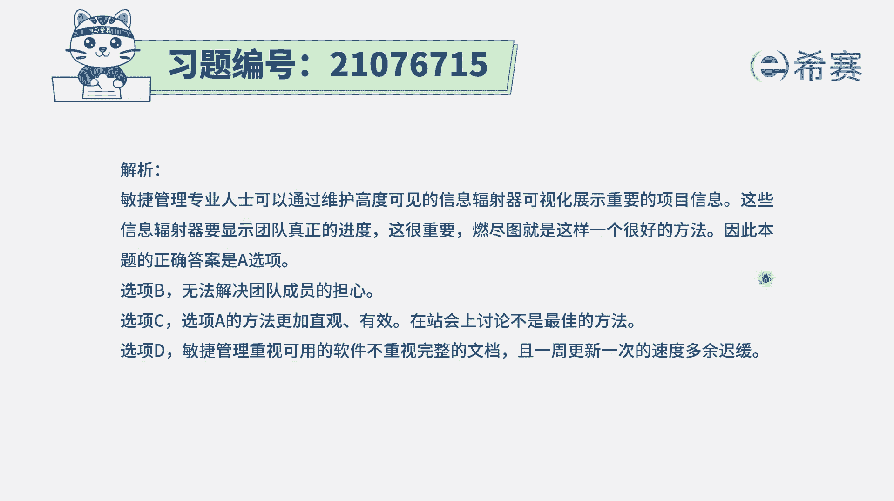

# 24年PMP考试模拟题200道，题目解读+知识点解析，1道题1个知识点（预测+敏捷） - P98：98 - 冬x溪 - BV17F411k7ZD

作为一个敏捷管理专业人士，敏捷教练应该为团队提供帮助，最近大部分团队成员呢都质疑，像不能够按照团队设想的那样的进展，这使得整个团队笼罩在恐慌的氛围中，敏捷教练应该使用什么样的方式来去，解决这个问题呢。

也就是题干中所说的敏捷教练，你应该要为团队来提供帮助，那团队现在都是担心说项目的进展可能不太好，然后他那里都有点慌，那怎么办，有一种最好的方式，就是让大家能够看到当前的进展情况，对不对。

我们来看一下4K选项啊，写下来呢说在空白的墙上来粘贴一个燃尽图，这就能够让所有人看到当前项目的进展情况，他就不至于说是要设想的，对不对，不是去想，而是能够有用事实说话，用数据说话。

选项B组织团队成员进行各种团建，进行各种团建，和他质疑团队不能够如期完成直接关系，嗯确确实实能够给团队一些信心，但是对于团队的这个担忧能不能解决，它不一定，因为每一账号他重点其实关注的是。

我们简单过一下看板，然后呢重点是说我昨天干了什么，今天干什么，然后干这个事情的过程中，遇到什么障碍和挑战啊，去同步这样一些基本的信息，所以没站会他有他的这个意图，去做一个信息透明，信息同步好。

选项D将燃尽图的转卖报告来去美洲公司更新，这个每周更新，其实肯定不如说就放在某一个地方，对不对，所以选项A将空白墙上粘贴一个软件图，这也是一种叫信息发射源的这种做法。

在整个敏捷中呢，它会提倡的是信息透明，要信息高度透明，怎么样去做的透明呢，有一种方式就是用信息发射源的方式，比方说用看板的方式啊，用燃尽图燃气图的方式啊来去做，这都是可行的。

所以这个题目的答案呢就是选A了，在空白的墙上来粘贴这个燃金图，作为信息发射源去跟大家同步信息，你们就不用去猜，你就知道了啊。

当前这个项目的进展情况到了什么程度，那燃尽图燃起图呢大家一看就知道了，就这么一张图，就是有时间有工作量，看还剩多少，或者是已经完成了多少。

那个就是一个比较好的一个展现了。

