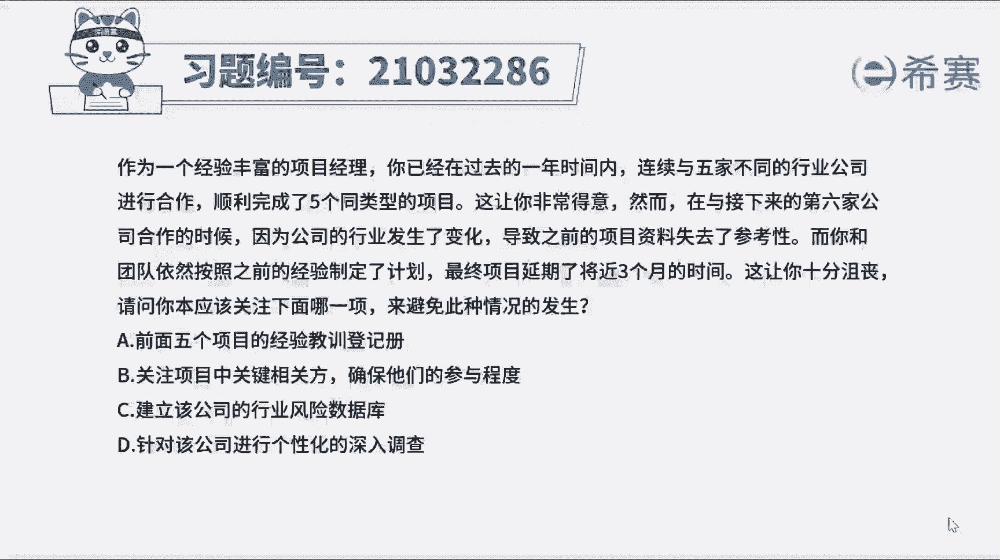
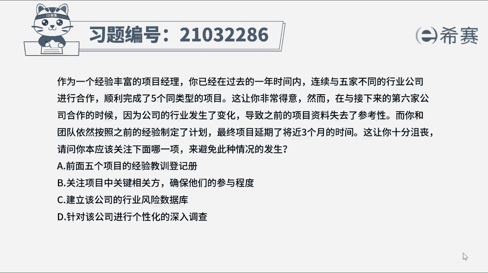
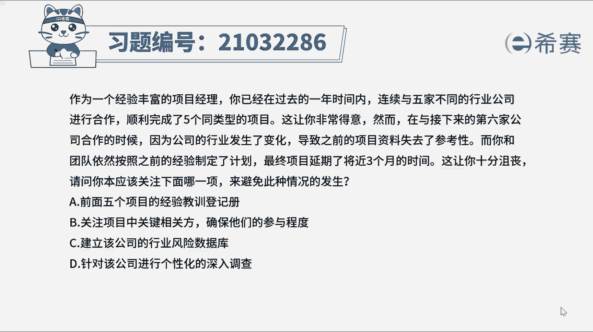
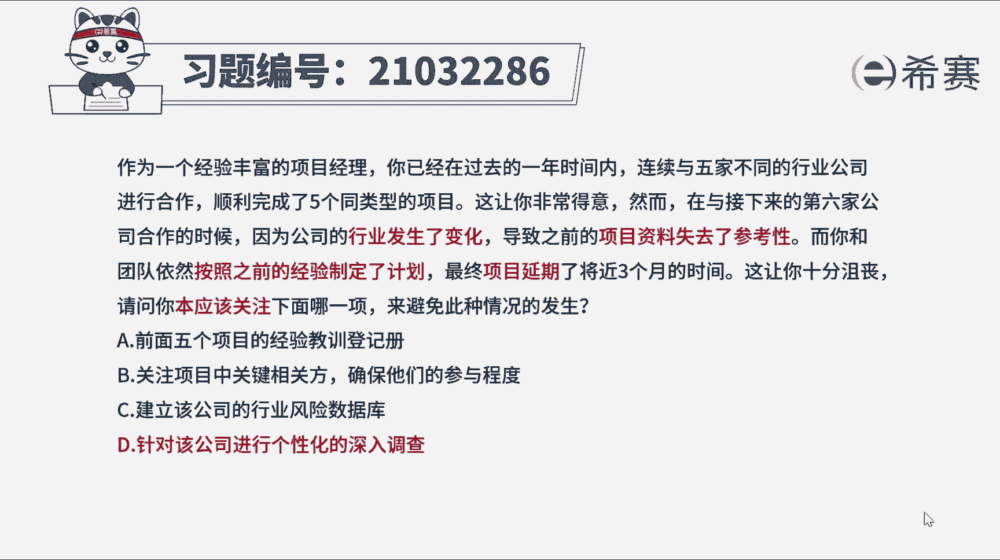
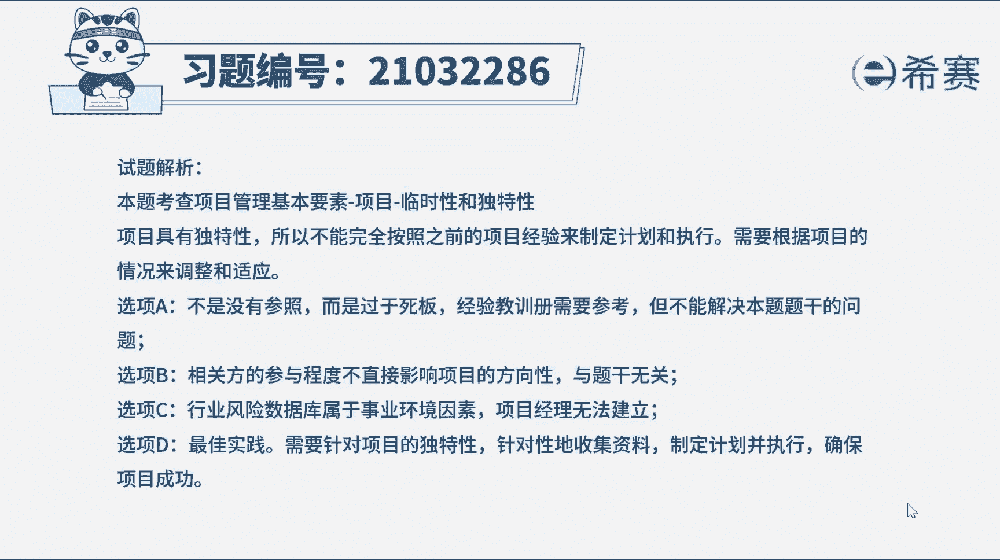
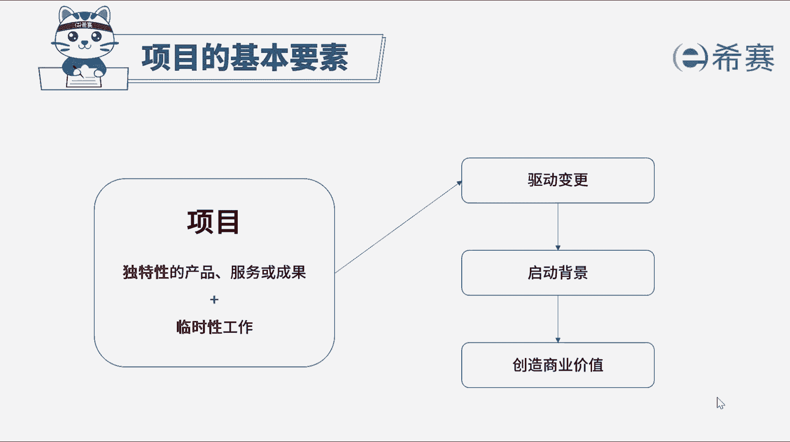

# 24年PMP考试模拟题200道，题目解读+知识点解析，1道题1个知识点（预测+敏捷） - P9：9 - 冬x溪 - BV17F411k7ZD

作为一个经验丰富的项目经理，你已经在过去的一年时间内，连续与五家不同的行业公司进行合作。

顺利完成了五个同类型的项目，这让你非常得意。

然而在与接下来的第六家公司合作的时候，因为公司的行业发生了变化，导致之前的项目资料失去了参考性，而你和团队依然按照之前的经验制定了计划，最终项目延期了将近三个月的时间，就让你十分沮丧。

请问你本应该关注下面哪一项，来避免此种情况的发生，A前面五个项目的经验教训登记册，B关注项目中关键相关方，确保他们的参与程度，C建立该公司的行业分析数据库，D针对该公司进行个性化的深入调查。

好我们读完题目，先来看一下问题，问本该关注什么，就是问事先应该做什么，首先找到题干的关键词，完成了五个同类型的项目，现行业发生变化，资料失去了参考性，团队还是按之前的经验来制定计划，导致项目延期。

我们都知道项目具有独特性，不能完全参照之前的经验完成新项目的工作，按之前的经验制定的计划，导致项目延期，要避免这个问题，所以就要事先对第六家公司进行深入调查，针对性收集资料。

根据他的实际情况来制定对应的项目计划，并执行，所以我们本题的正确答案是D选项，事先针对该公司进行个性化的深入调查，我们来看一下其他选项，选项A前面五个的经验教训登记册，题干提到行业发生了变化。

所以之前的经验教训只能作为一个参考，但完全参照它太过死板，所以我们要排除掉B选项，关注项目中关键相关方，确保他们的参与程度，确保相关方的参与程度与项目计划无关，不会影响项目的一个方向。

所以这个选项也与题干无直接联系啊，我们不选C选项，建立该公司的行业分析数据库，行业分析数据库属于事业环境因素，事业环境因素是项目团队无法控制的，项目经理无法建立，所以C不应该选好了。

我们此道题就先讲解到这里。

可以自行参考一下相关的文字解析。

整个题目讲解下来，我们可以知道，本题考察的知识点就是项目管理的基本要素，项目的独特性，因为项目具有独特性，所以啊。

