# 24年PMP考试，3天冲刺训练营27集精讲视频，完整免费分享！ - P10：2.0 课程内容回顾 - 冬x溪 - BV1Do4y1x79r

先来回顾一下昨天晚上啊，昨天晚上呢我们讲了有呃主要的几个命题，第一个就是我们说什么是项目，那么我们回忆一下，通过问答的形式来回忆一下，昨天讲的项目的特性是什么，项目有哪三大特性。

看多少人还记得项目有哪三大特性啊。

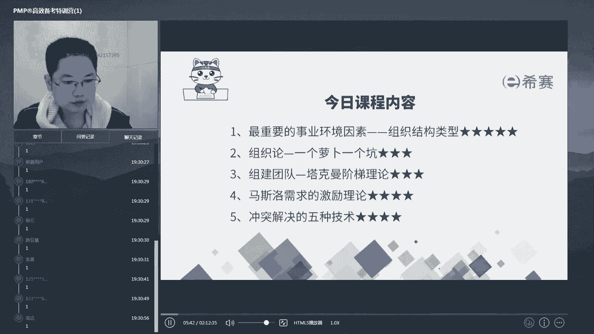

这个名字叫l s a h等你这个名字啊，可能是我的问题啊，我一看到你这个就就想。

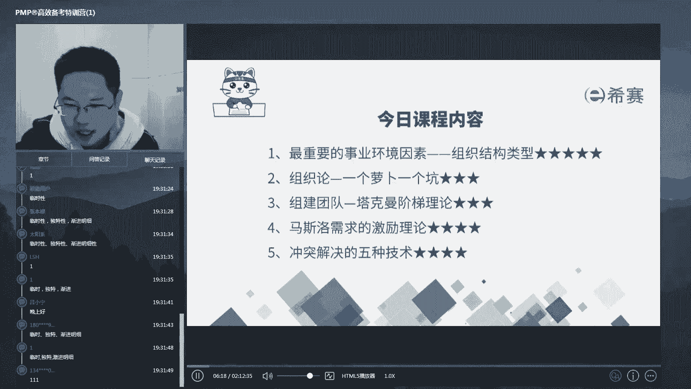

总总把你这个读成叫做l s p。

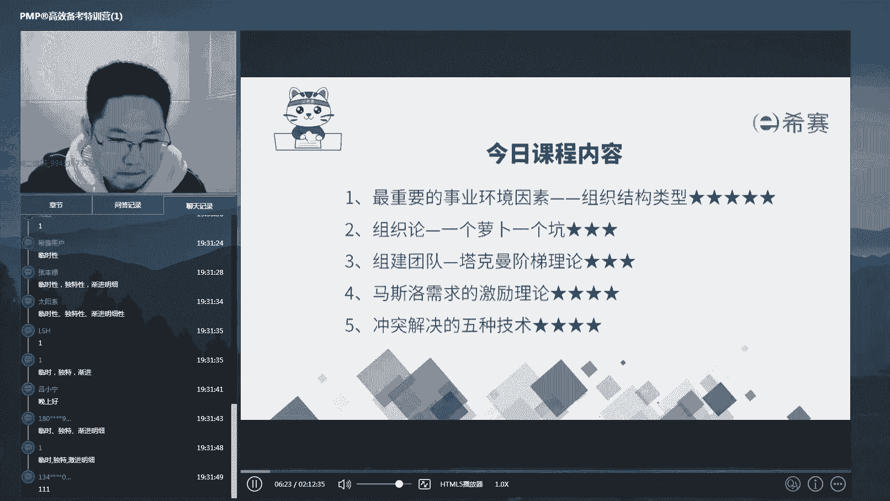

好那么ok没问题啊，独特性临时性和间距明晰性，我们说了，项目之所以复杂，要专门的来学习怎样管理它，因为它跟它的对立面运营相比的话，它有临时性，独特性和渐渐明晰性，也就是说呢。

任何一个项目都是在一定的周期之内诶，不是重复的，那么在这个周期之内呢，单独的有它的各种差异化的来做事情，以及呢我们对于项目而言，经常是在最开始的时候很模糊，随着它的逐步进展，才能够啊理解透彻它啊。

那么这三大特性呢是我们项目的啊，这个跟运营之间的区别好，这是一个第二个，我们刚才也上一节课讲了项目的呃，管理有五五和12个关键的数字，那么无它代表的五大过程组是哪五个，在进行项目管理的时候。

每一个这个绩效率啊，就是我们说的每一个知识领域，我们都需要按照p d c循环的五大过程组，来进行管理。

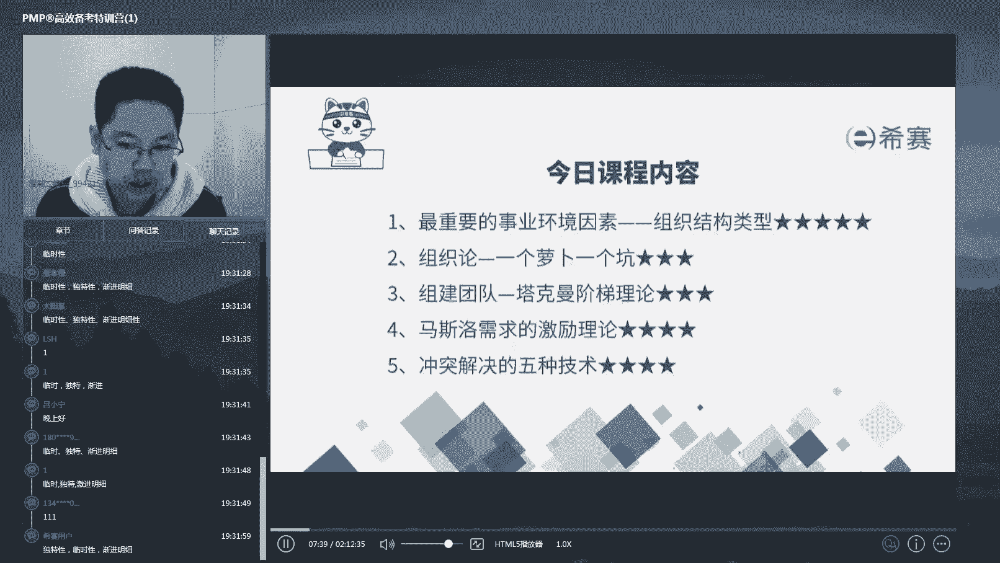

那么这五大过程组分别是哪五个过程组好，这个数字啊渐渐的变多了啊，这个这个内容渐渐变多了啊，看还有多少人能记得下来对吧，我们做完说了1万小时定律其实是错误的，并不是说你做什么事情做得多，你就会越做越好。

越做越熟练，而是要不断的去首先定自己的目标。

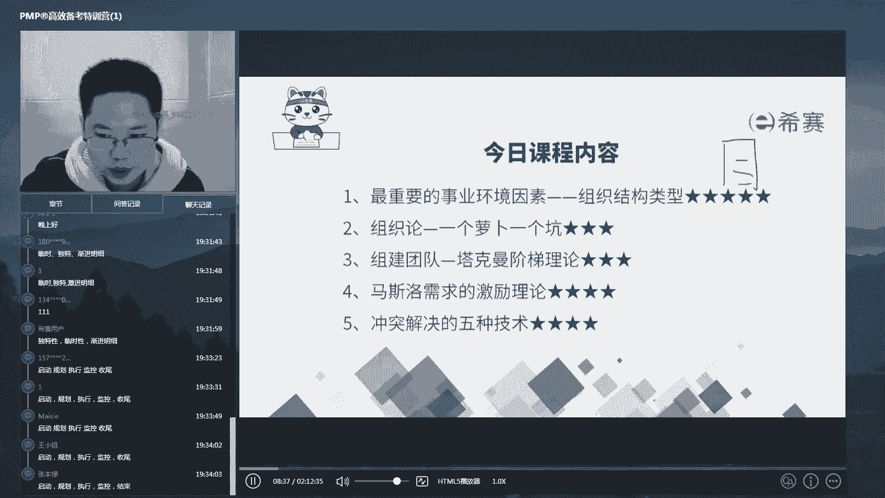

咱们把这叫启动阶段，启动阶段定好目标之后，你得去做计划，也就是plan，那么做了计划之后呢，你得去执行啊，也就是do执行了一定会跟你的计划有所偏差，这个时候你得去检查啊，我们叫check。

那么check完之后呢，你这个gap在哪，就是预期和啊这个梦想和现实之间的差异在哪，对吧，我们要去action啊，就是去改善，去纠正，那么不断迭代的循环的，直到我们把你的计划实现，能够走入收尾阶段对吧。

所以是五大工程组启动规划执行监控和收尾，那么这件事情啊，无论是在你干什么时候时候都适用好，那我们也讲了，五大过程组是发生在十大知识领域里面的。

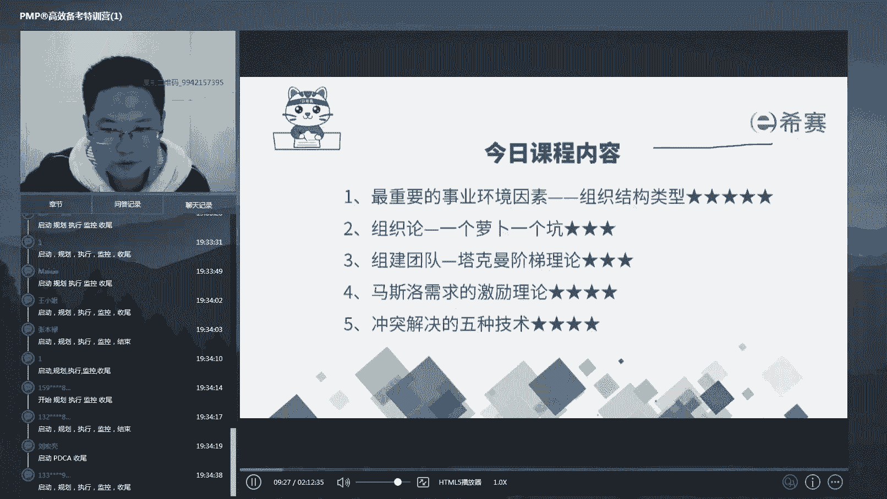

每一个知识领域都会需要按照五个过程组走，那么现在谁还记得十大知识领域包含哪些内容，十大知识领域包含哪些内容。

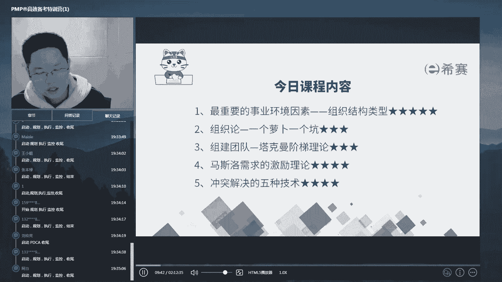

给大家捋了一个思路的，看这条思路多少人还记得啊，可能这个就不能报全了对吧，可能就报不全了，只能有印象的几个，这十大知识领域什么概念呢，其实很简单，比如说我这儿呢有一张这个呃华为的啊。

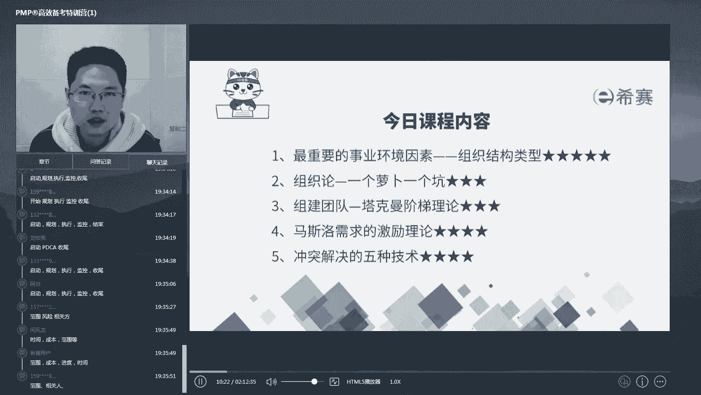

项目管理的是这个十大啊，这个套表每一张表解决一个问题对吧，就是十个领域，ok我们来回忆一下啊，首先我们是不是说做项目，最重要的是搞清楚你的范围是什么。

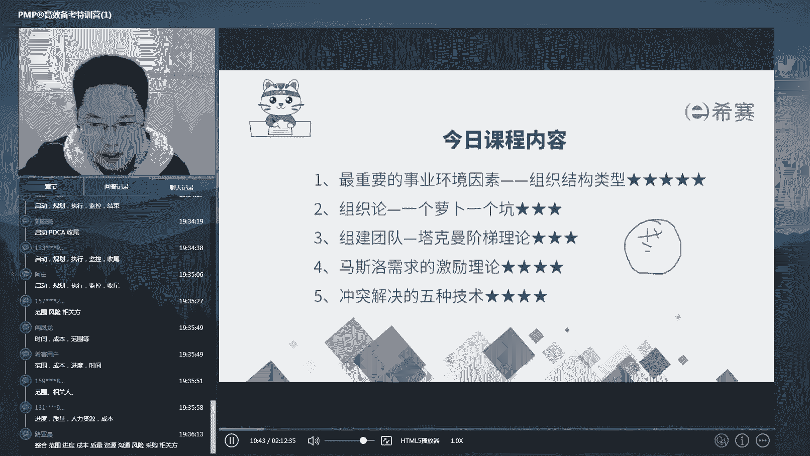

不要多做，也不要少做对吧，少做了诶，甲方不肯多做了呢，其实有时候也捞不着好处对吧，所以我们要定下边界范围，你这个项目要做的内容是什么，然后呢你做的内容一定要满足三个合格，质量合格，成本合格。

进度合格对吧，在甲方要求的成本范围之内，在他要求的时间范围之内，做出他要求的质量来，这四个目标好，那么这四个目标完了之后呢，咱就还要去考虑a我们的这个谁来做呀，是不是资源从公司内部调啊，调人来。

这叫资源，如果公司内部没有，你到外部去买，是不是叫采购，然后呢还有一个相关方，因为你做事情不单是有内部人员，还有外部人员，上级人员，评级人员等等，那么他们用项目经理的最重要的一个能力，沟通能力。

动嘴皮子来把他们说服，把它们拧在一块儿来做事情，然后这些东西都是散的，咱们是不是得有一个整合管理，把他们共同的啊端起来套起来好，这些东西都是确定的啊，我们说过了，现在是无卡时代，面临很多不确定性。

复杂性，咱们是不是还得把不确定性的东西也管理起来，叫做风险管理啊，对，所以呢这些模块总共构起来就是十大知识领域，我们也讲了啊，15大过程组，十大知识领域得到的49个子过程组，以及38个文件和132个。

这个工具和技术，能够帮助我们管理一个非常复杂的项目啊，我们一般来说做项目都没有这么复杂，可能会进行一些裁剪啊，而这些呢是我们在曾经哎，这个时代变化没有那么快的时候啊，来讲的，来做的这个对吧。

做的这个项目诶，它是预测型的，那么请问大家，除了预测型，我们上节课还讲了几种生命周期的类型。

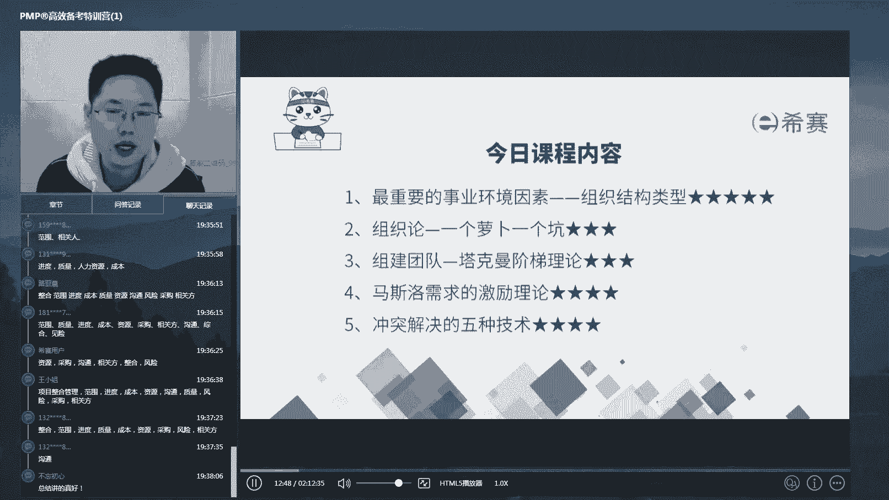

那么它们的特点是什么，我们是不是有两个维度把它们分成了四个象限，那么除了预测型，也就是瀑布型生命周期以外，还有哪三种，以及它们分别各自有什么特点，关键词是什么，好很多人都答出了，还有哪些生命周期类型。

那么它们的特点是什么，帮助我们判断并且定位到它的关键词，有哪些内容，很多都答出来了对吧，预测型诶，这个增量型以及迭代型和敏捷型，敏捷又叫适应性对吧，对两个维度，一个维度呢看它交付的次数。

一个维度呢看需求的变化程度啊，如果这个需求经常经常的啊会发生变化，或者叫甲方一开始没有想好他到底要什么，那么也等于会变化，那么呢我们要更多的去迭代版本，让甲方看见更多的啊版本的这个原型。

逐步摸索出他真正想要的东西啊，那么第二个维度呢就是交付的次数哎，如果这个东西我们想要更快的进入市场啊，尽快的拿出能够面试的，能够收回其资金回笼的这样一个版本，那么我们可能会把它分成多次啊。

一次点这个增量一点点内容，对不对，所以呢是交付的次数和变化的这个啊，内容定住了四个区间，如果这两个特性都具有，那么就是我们的敏捷型，所以我们给大家讲了，我们的第六版教材。

是按照诶很固定的方法来做预测性生命周期，而现在的时代就是变化的模糊的啊，动荡的，所以呢我们现在要学第七版，也就是按敏捷的思维怎么来做我们的项目，好，昨天的内容其实总结起来的，也就这么一些东西啊，并不多。

那么今天呢我们的内容是什么呀，就是把这个第九章资源管理模块的，这个预测型的内容啊，在这讲一下。

ok好，那么今天啊讲课之前，我们昨天的内容回顾了。

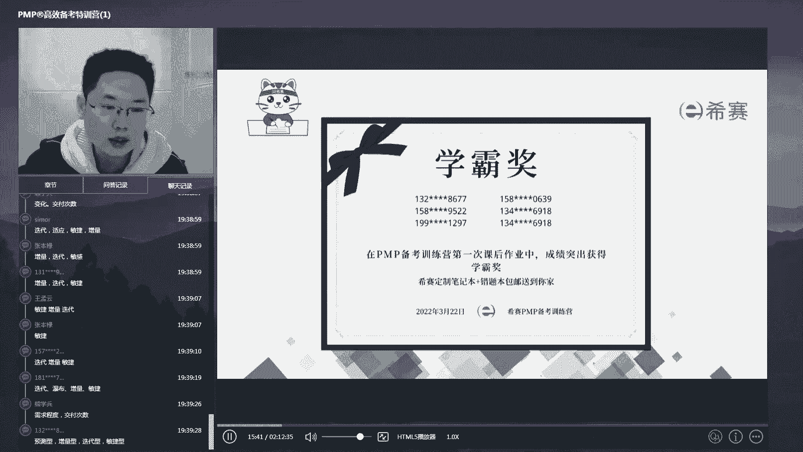

再回顾一下我们昨天下课以后啊，我们做的题啊，有这么一些同学呢，昨天在做题的时候答得又快又好啊，全队以及速度最快，所以呢我们给他们颁发这个学霸奖啊，会送一些小型的这个啊笔记啊，一点小意思啊。

不曾近你一点小礼物，请这几位同学呢找到我们的群内助教啊，跟他们沟通一下，然后我们会把这个礼礼物呢啊寄送给大家。

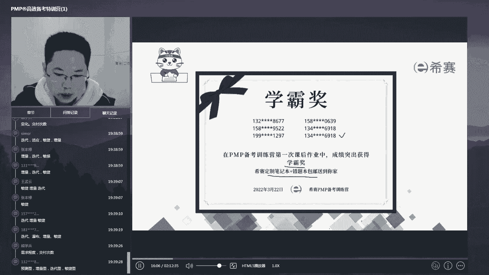

ok那么昨天的六道题，我刚才讲了，有简单的，有难的，那么我们还是稍微讲一下啊，因为有些人可能还是对于难题呃，有一点没有摸得清楚啊，那我稍微讲一下，首先第一题啊，说这个关于习题课这个项目录制的啊。

这个录制项目的它的临时性的特点的说法，有什么，这道题呢，跟我们昨天讲的课堂上的原题几乎一样啊，我就不展开了，我就不展开了，我们来讲一下，可能稍微难一点的，比如说第二道一家组织，首先开展啊。

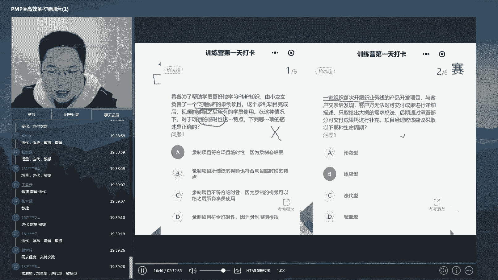

首次开展新业务线的产品开发项目，与客户交涉后，发现客户无法对可交付成果进行详细的描述，那么这个时候关键词是不是就已经出了，第一个没办法进行详细的可交付成果的描述，就说明需求并不清楚，首先这个点就定了啊。

然后呢只能给出大概的想法，后期通过审查啊，什么呢，部分可交付成果再进行补充，那么这句话的首先交部分啊，再来补充以下剩下的部分，这是不是就是典型的说诶，你这个可以分多段交付，那么既有需求不明确。

又有多次交付的特点在，那么是不是马上定位到这个项目呢，就是适合用适应性，也就是敏捷型项目啊，所以这是一道啊跟原题相反的一个结构题型好，再来看一下第三个啊，组织发布了一个新开发新项目。

新系统开发项目计划在四个月内完成开发工作，完成开发以后，新系统将移交给运维部门进行维护和支持，根据这些信息，一切以下说法哪个正确的，这是不是就是我们昨天一直在强调的，项目和运营，他俩之间是什么呢。

既不同又交缠的一个关系啊，问你哪个说法是错误的，先来看a啊，移交后支持和维护性工作就不属于项目了，这是对的啊，东西都交出去了，甲方已经签收了，那么接下来的运费，这个运维工作呢。

就甲方就好像你们工程我们做项目的，做好了，你们家小区以后交出去，那么物业负责维护，而不是施工单位对吧，第二个项目和运营，在时间线上可能会有一些交叉，这个是对的，怎么讲呢，哎你在做好之后，在真正交付之前。

是不是还有一段试用期对吧，试用期其实还有什么呢，还有保质期，其实这一段这几段时间之内，两方都在对这个项目进行一些啊交互，有些时候呢，你在运作过程当中可能会有一些修改，改进升级等动作。

那么也是项目和运营的交叉啊，那么第三个项目的目标，是为了完成新系统的开发，这是对的，运营是为了让用这个新系统啊，运作产生更多的效益啊，所以c呢也是对的啊，d呢就说的完全相反了，他说开发工作和运维工作。

那么换句话说，就是项目工作和运营工作之间完全没有联系，那么这句话显然是错的，所以这道题选d，考核的是项目工作和运营工作之间的一个关系，好再来看一下第四题啊，那么第四题呢大家啊没有没有给大家讲。

他说什么呢，公司新签了一个项目合同，表明如果在交付日期之前完成，客户会给公司一笔可观的奖励，项目组为此非常努力啊，但是呢在项目交付成果快要完成时，一个团队告诉你有一项交付成果唉，买足合同要求。

但是满足不了客户所需的功能，如果晚提交的话，则不能提前完工，那么这个时候你该怎么办啊，那么这道题呢唉我们昨天的课上也给大家讲啊，但是呢我们的政课里面会提到这个东西，给我们奠定了学习p mp。

特别重要的一个思想基础，就是我经常讲的，项目经理应该把自己当作圣人来看待啊，甚至有些时候带着一些啊圣女表的这个，比如说这道题说什么意思呢，啊说的很清楚对吧，就是甲方给你设计的奖励，如果提前完成。

你能得到奖金啊，所以呢你们团队的人都想提前完成结果，现在的问题是什么呀，满足合同了，但是不满足客户的需要，比如说甲方自己没有搞清楚啊，你们他到底要什么或者假释方搞清楚了，你们在这些在一开始签合同的时候。

没有把一个很重要的部分，比如说你造台汽车啊，你甲方在你这定制一台汽车，然后呢甲方跟你说，你要做这个要做那个，结果没告诉你，你得给他做方向盘对吧，你带着一个没有方向盘的，这样的一个设计方案需求。

你去做做开发，结果发现最后发现是吧，没有方向盘其实开不了，此时你应该按照合同要求要求甲方收货，还是站在甲方的角度考虑诶，就是没有方向盘的车开不了啊，没办法，我还是得帮你把方向盘给坐上，所以呢这道题啊。

应该是告诉客户这样是这样的情况，寻求一个双方都能解决的方案啊，这个呢带表示我们项目经理，以达成客户目标为首要任务的一个思想，好什么，a就这样递交可交付成果，那显然是不行的。

因为你交付的是一个甲方用不了的东西啊，它一定会找你麻烦的，c啊，开始编写诶，是客户造成的延误，因为他需求没搞清楚，所以我只能跟他谈判或者是索赔，以及d悄悄削减其他的活动，以修复该成果。

就是哎其他必必须要做的事情咱也不做了啊，瞒着他就是了，然后把那个工时呢啊调过来做这个事儿，这些东西呢都是怎样啊，都是一个没有职业道德的表现，所以呢整个这道题选b选项。

是为了帮助大家建立起一个对于p p m p啊，这个是这项目经理这个岗位的一个观感，要有啊，客户意识好，这是第四题，那么第五题我们看一下啊，这道题呢就是啊基本上是课上讲的原题了，我就不展开了。

好第六题呢很多人就栽在这儿了，所以呢我要稍微展开讲一下啊，他说的什么呢，某公司的一个oa系统项目，正在开展，公司的这个产品的功能呢，有基本的办公功能，聊天绘画功能和其他高级功能。

当你看到他都已经把这个任务，分成了三个功能模块的时候，你是不是就应该已经意识到了，其实它是可以分阶段啊，分步骤增量做的，第二个项目团队呢正在逐一的进行功能的开发，这句话是不是有强化了啊，逐一分阶段啊。

然后目前基本功能以及能够如何设计，已经明晰了，但是高级功能如何设计还不明确，那么这种是什么时候进，什么是生命周期类型，很多人呢啊找到了逐级递增递进的这个词，同时呢因为这个高级功能如何设计不明确。

很多人把这个词就定位到哪儿呀，定位到了需求不明确这儿了啊，那么他说诶多次交付需求又不明确，那么属于这个什么呀，敏捷型立马就选到d去了，但是这就是属于什么呢，属于读题读快了，你看清楚是如何设计不明确。

而我们在什么呀，我们在讲瀑布型的时候，是不是说过了解需求，然后定方案，定了解决方案之后再去做设计，是不是设计不明确跟需求不清晰是两回事啊，需求不清晰是甲方不知道自己要什么。

而设计不明确的是你知道甲方要什么，但是你还没有把这个东西完全清楚地设计出来，对吧，所以这道题只有啊多级交付这一个特性，没有需求不清晰这个特性。

