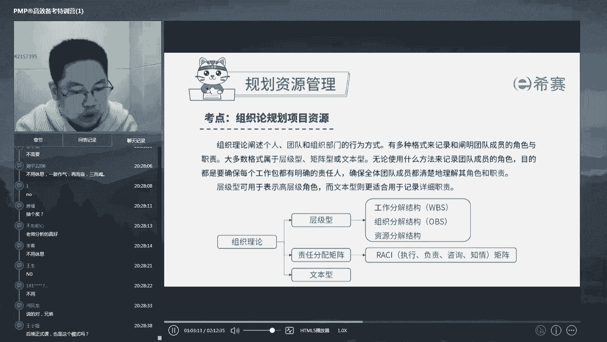
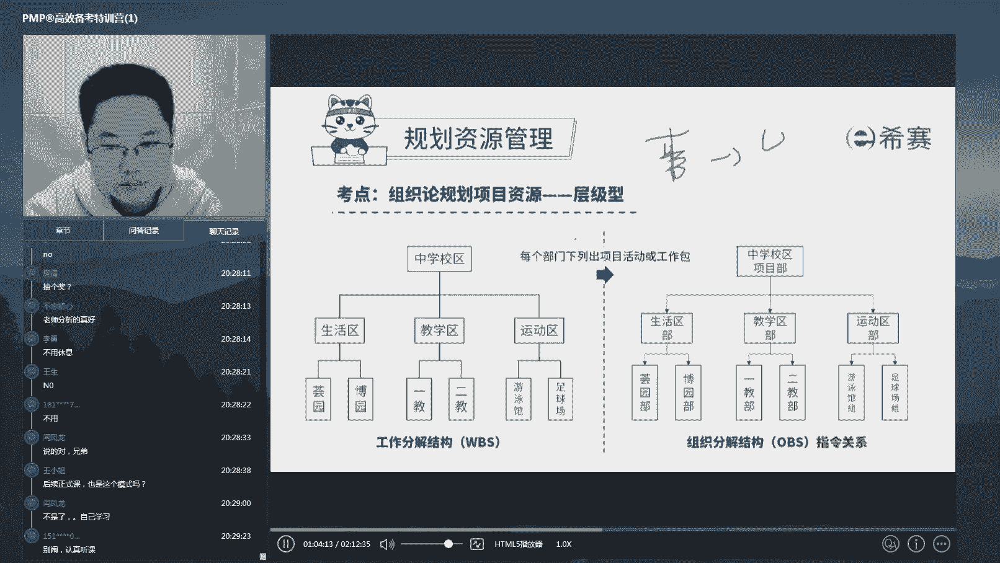
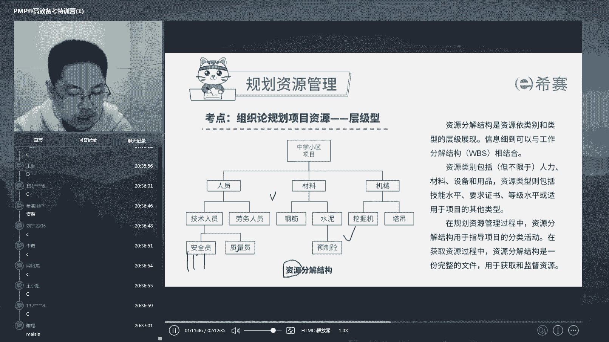

# 24年PMP考试，3天冲刺训练营27集精讲视频，完整免费分享！ - P14：2.4 规划资源管理--组织论-三图两表（上） - 冬x溪 - BV1Do4y1x79r

当你把整个公司的大环境摸清楚之后，你要干嘛呢，我们刚才讲了，哎你得估一下对吧。

估一下你到底呃要多少人。

要哪些人啊，我们来看一下啊，那么我们在姑你要哪些人的时候啊。

也是这个模式啊，呃呃要哪些人的时候。

我们会有一个东西工具叫做组织结构论啊，你如果学过这个管理学的一些东西呢，应该都学过这个组织论啊。

或者是个组织行为学啊，这个意思，那么这里面呢我们经常会提到三类型的，这个工具叫层级型的，表格型的和文本型的啊。

这个很简单是吧，就很多人就说哎写excel看不起写word的啊，做p p t的看不起写excel，为什么呢，就是因为这些工具啊，它从复杂到简要是吧，从复杂到简要，它其实这个岗位呢就越来越高。

那么在这里面发生了些什么事情呢，我们一个一个展开来看啊。

这些内容呢如果你听过我们的政课，学习到这儿就已经早都学过了啊，那么你们现在还没学过呢，我就稍微介绍一下，如果你这一下没有听的太明白，没关系啊，我们正课里面还会再讲，他说的东西其实很简单。

就是你要搞清楚你这个项目组要哪些人，你得先搞清楚你要干什么事，我们啊有一个东西叫做因事设岗啊。

英港招人对不对，是不是都是这个逻辑啊，是不是都是这个逻辑，没有说诶，你这个人特别优秀，我就为了你，我虽然不知道你能干嘛，但是我又给你招进来，然后再给你他啊定个事儿做，除非呢这家公司是你爸爸开的对吧。

一般来讲都是反过来的是吧，一我这个公司要做什么事儿了，哎我是个什么岗啊，我也有要人开车，我是个司机岗，然后招个人来开车啊，那么沿着这个思路呢，我们做项目的时候怎么办呢，首先你要搞清楚你这个项目要干嘛啊。

比如说我要建一个学校，那么我报这个学校的工作呢，我层层细分啊，我建这个学校我会分为生活区，教学区，运动区，那么教学阶段就分为一教二教，而是这个啊运动区分为足球场和篮球场啊。

那么足球场这个小油可以继续细分，有些人负责诶平整场地，有些人负责贴草皮，有些人负责哎建塑胶跑道等等，是不是我可以把这些东西一直往下细分到啊，很小的颗粒度，小到什么呢，小到一个人诶，马上拿起来就做诶。

我知道我今天就做这个事，就是我的任务了，是不是，所以在这张思维导图上，我们能够从上往下的，从大到小的，从粗到细的继续细分开来，整整个项目要做的所有事情，都包含在这张唉表上。

而这张图上我们叫做工作结构分解表，英文缩写叫做w b s，这个是我们做项目管理特别重要的一张表，因为它涵盖了你的所有工作任务，极其细分啊。

这是第一个，当你搞清楚他以后，这个表在哪呢，会在我们的第五章范围管理中得到产出，它是我们范围管理产出的最重要的产出物啊，那么关于这张表得到了以后，你是不是就为每一块去设计它的部门和岗位，比如说运动区。

我这呢设一个运动区部啊，足球场呢我设一个足球场组，那么这里面平整场队的，我是一个平整场队小队啊，那么其中的某一个人，我在为他设一个平整场地的小组长，这个岗位是不是那么对着你要做什么事。

你就能够把你的整个组织结构啊给它构建出来，这个组织结构其实就是我们刚才讲的岗位与啊，这个呃人员之间的指定关系好。

他们一般是一一对应的，那么当你知道了哎，我总共有30个岗位要招，并且每个岗位要做什么事，我也知道了，你是不是就知道诶，这个岗位该招什么样的人来填补了，此时你该去哪儿呢，你该去啊。

你们公司的资源分给分解结构图上，这是个啥呢，这就相当于是菜市场啊，你在这相当于是哎比如说今天我们请朋友吃饭，订了一桌的菜的菜谱，那么要炒十个菜，那么这十个菜要买哪些菜样啊，买青椒还是买肉还是买甲鱼。

就买买这个甲鱼都订好了，那么你要什么，你知道了哪有呢，公司啊，资源库里面有整个公司呢，他应该会给你列一张单子，这张单子呢列明了公司可供你挑选的资源，那么这张单子的一般也是按照思维逻辑啊。

就是这种树状图给它构建出来的，比如说这个啊，我们说资源分为人才机，我们今天只讲人啊，那么人呢你可能可能分为技术人员，劳务人员，如果是你软件公司，你可能就分为a有测试能力的人，有开发能力的人。

有构架能力的人，有美工能力的人，对不对，如果你是制造业呢，你就可能有诶能够做车工的人，能够做设计的人，能够看cd的人对吧，总之呢你们公司有哪些人才供你挑选，全部会按照思维逻辑列在这张图上。

那这个时候你就带着你在这儿得到的，你想要的到这儿呢，找到你能要的，给他们配上队啊，比如说现在走走过来一排人啊，我就出去选人的时，现在面前站着这十个哎，就你五大三粗特别好，你跟我走哎，我要的人就是你是吧。

这样子就选定了好，选的这张供你选的这张表呢叫资源分解结构好，那么啊这个地方呢，这三张表他们共同是以这个图的形式存在的啊，所以呢我们再来看一下工作分解结构啊，他说的是你要做什么事，自组织分解结构。

他说的是你岗位怎么设计啊，资源分解结构说你要的资源能从哪来，有哪些资源好，大家把他们三个之间的关系和区分搞清楚，没有啊，再琢磨一下，有问题你可以提我们来讨论，没问题呢，打个一，我们来做套题测验一下。

我们来看一下啊，看一下这道题，第一个答对的啊。

我们送一份小礼物好，我们来看一下啊，比如说现在其实很简单，是不是做这件事情，就是把正确的人往正确的地方去放对吧，我们现在有三个岗位啊，这个岗位上呢它需要有呃设计能力的人，这个呢需要有开发能力的人。

这个需要有测试能力的人啊，有三个能力对吧，那么现在呢我说a有开发能力，b有设计能力，c有测试能力，那么我们接下来要做的事情，是不是就是把a往这放，把b往这放，把c往这放就完了，好这道题说的什么。

在确定项目中所要开展的所有任务以后，是不是就确定了这一点啊，那么此时，项目经理需要根据每个团队成员的技能，进行任务分配，那么项目经理应该参考什么，这道题是不是有问题，在哪张结构图上。

我们能够找到团队成员的技能是什么，也就是说谁是有开发能力的，谁是有设计能力的，那在哪张图上包含了这样的信息呢，你再思考一下是不是好，我翻译一下啊，我看一下第一个答对的是，好第一个答对的是myself啊。

这个就有点对吧，有点有点读不读不来啊，好第一个来的应该是myself啊，送你一份小礼物，到截图到我们群内去找助教啊，是不是，那么刚才就问了哪张表上记录了哎。

我们的每个人具备什么能力，是不是就在这儿啊，这个安全员有张三李四王五哎。

怎么怎么样，那么这张图上是不是就说哎，作为张三的这个人啊，作为张三的这个人，是不是就是有安全员的这个技能，是不是。

那么我就把它任安排到这个安全岗位上去，所以这道题啊应该是选c资源分解结构是吧，你把刚才这些东西都如果听捋顺了，听明白了，那么你这道题自然就能做出来啊，他问你问你的就是资源分解结构。

包含了哎每个人他有什么能力，而刚才讲了工作分解结构是做什么，组织分解结构是有什么岗位对吧，这就是因事诶，定岗英港去找人啊。

就这么一条思路好。