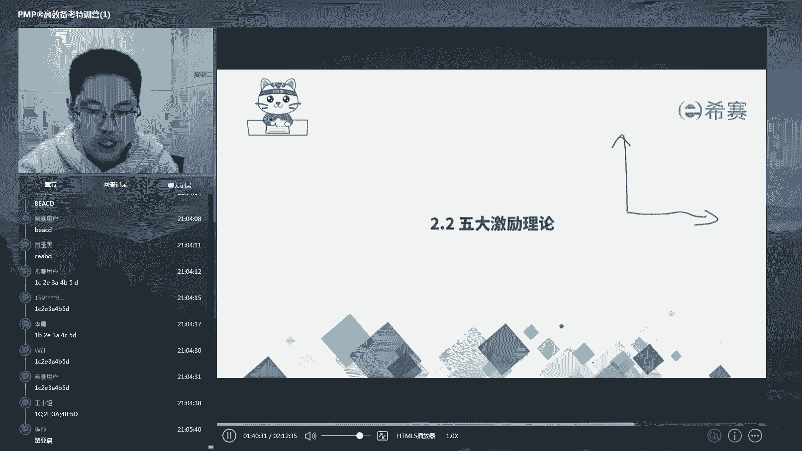
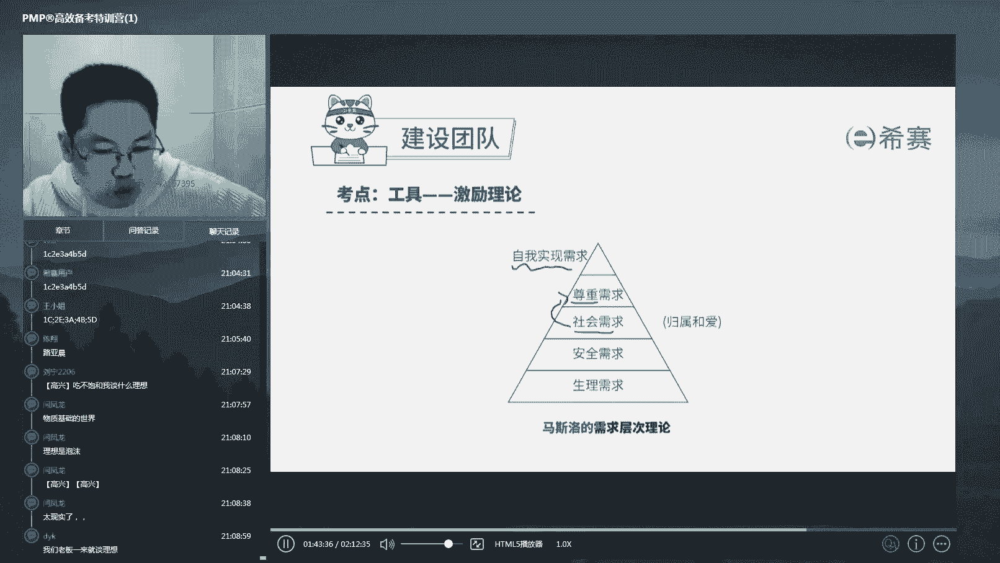
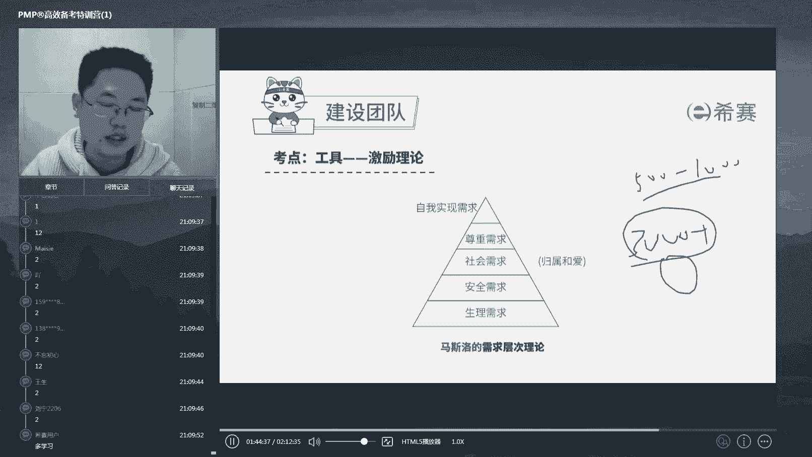
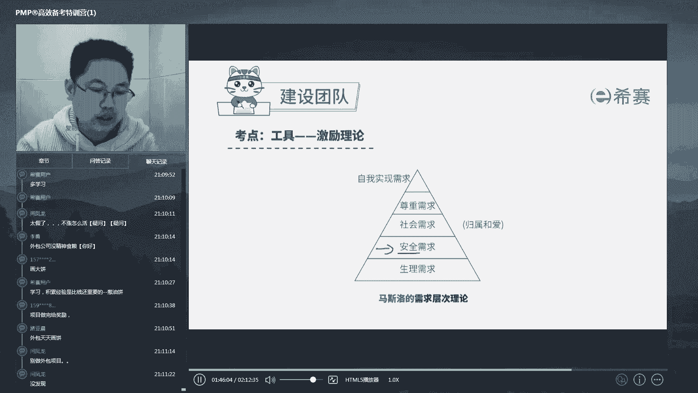
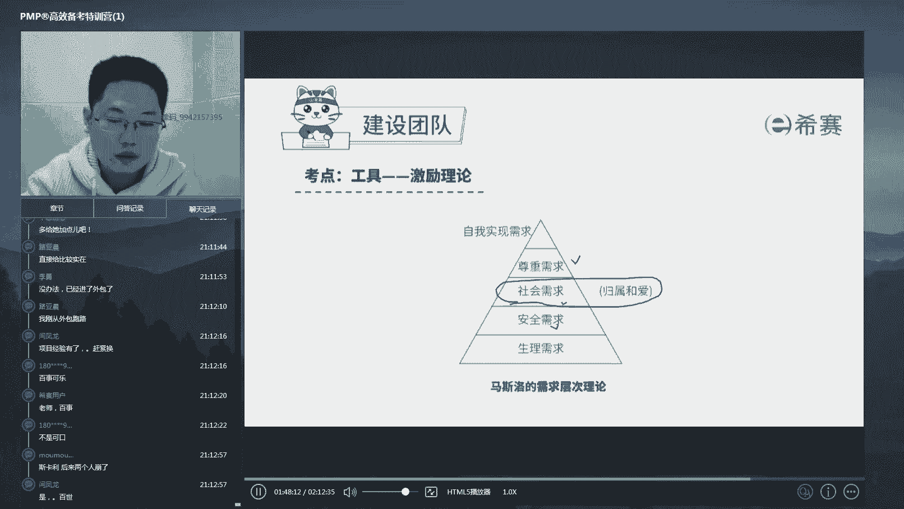
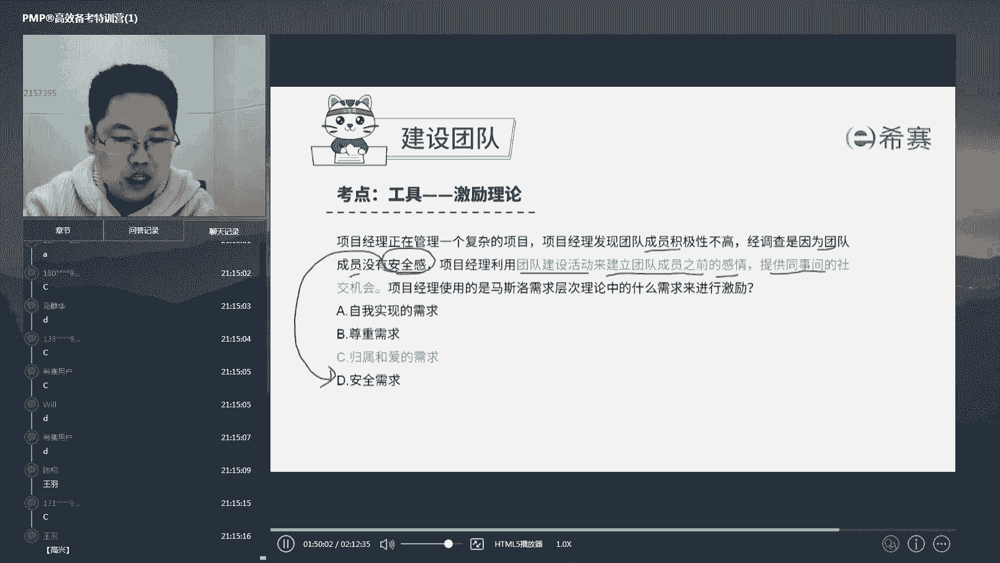
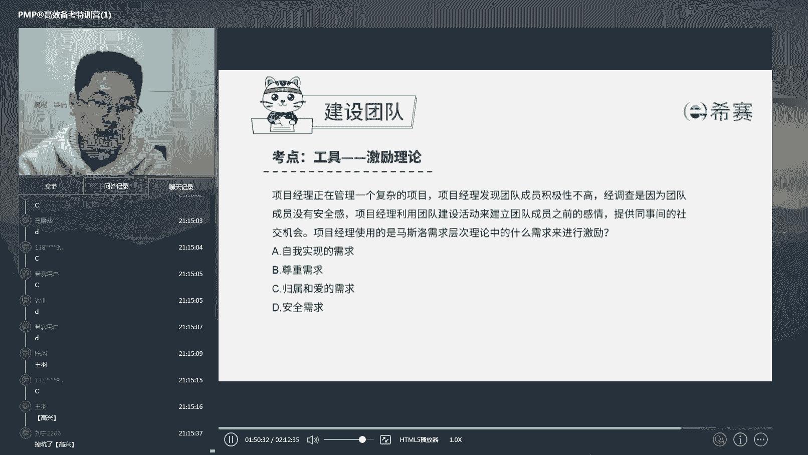

# 24年PMP考试，3天冲刺训练营27集精讲视频，完整免费分享！ - P17：2.7 规划资源管理--建设团队（中）-五大激励理论 - 冬x溪 - BV1Do4y1x79r

刚才讲了对吧。

你在这个团队建设的时候，你在管团队的时候，其实就管两件事。

一个呢他会做，一个呢他想做，如果你的下属都能是既会做又想做。

那么你这个成这个事儿就成了啊。

那么想做和会做会做的就是培训，然后呢想做就是激励了，激励呢我们会说五大激励理论。

他们呢基本上都是基于这个塔克曼啊。

不是基于这个马斯洛需求理论而来的，那么今天时间有限，我们就把这个马斯洛需求理论稍微讲一下啊。

这个理论呢其实呢应该也很多人都接触过了。

对吧，他说的呢，就是说我们每个人他有不同层次的需求啊。

如果你想要激励你一个人。

你一定要先判断清楚他现在在哪个层次上啊。

否则呢拍马屁拍到了马腿上就很尴尬，比如说我们先说人啊。

这个需求分为五层次，叫做生理需求，安全需求。

社会需求，尊重需求和自我实现需求，其实说白了就是什么呢啊。

从物质到精神啊，就是说你不能一开口上来就问别人。

哎你的梦想是什么啊，我能帮你实现梦想，跟我干吧啊。

如果这个人什么他还跟着你没肉吃，那么怎么样啊，是不是首先得跟着你有肉吃，就是跟着你，我得存活的下去，能满足我吃饱喝足睡饱这个需求。

这是人类的第一个层次，好吃饱喝足之后是不是得有安全需求对吧。

现在啊比如说啊这个有些地方在打仗啊。

我们中国没打仗啊，一旦知道别人在打仗。

我们没打仗，你才知道中国多好，是不是就算吃饱喝足了，你还得有安全感好。

有了安全感以后呢，你得有社交需求啊，就是要有归属和爱的这种感觉。

因为人类是一个社群动物啊，比如说我们经常看监狱里面啊。

有这样一种惩罚叫做关禁闭对吧，哎这个人犯错误了。

给他单独的关到一个小房间去关一个月，那么这个人很难受。

为什么呢，因为人他是一个社交需求的一个动物。

一个社交社交动物诶，他一天不跟人说话，行一个月不跟人说话。

那么是不是就很难受，因为他感觉不到自己归属和爱好，有些时候我们社会上有一些什么呀。

有些宅男或者是所谓的一些边缘人。

是不是就是这种感受诶，他感觉自己在世界上是孤独的一个人，没有被任何人爱。

也不归属于任何一个群体，没有被接纳的感觉，所以呢人在满足了生理和安全感需求以后。

他还需要有一个社会需求感啊，这个社交需求感啊。

那么有些我们有些公司是不是会做一些什么啊，5年徽章啊啊这个什么优秀员工表彰啊。

虽然没有经济的东西在，但是呢他让这个人感觉到，因为他是被这个公司这个群体所认可的好。

再往上一个呢是不是好，再往上就可以进入这个精神状态了啊，就尊重需求了啊。

任何人都希望自己能够被身边的人所看得起，对吧，所尊重好。

最后再来谈自我实现啊，这个时候就问你，你有什么理想对吧。

如果没谈下面先谈上面通通都是耍流氓对吧。

没有下面的支持，你就直接哎就上上吴磊了，那你就是真的是耍流氓啊。

我给你举个例子啊，我自己呢原来也做过对吧，你们肯定啊。

我问你啊，给别人画过饼的，打个一，自己被人画过饼来打个二，是不是我原来呢就给人画饼。

有一个小妹子进来了，哎这小妹子的三三千块钱一个月啊。

然后呢啊我就跟他讲是吧，呃他跟我说加工资对吧。

我就说你们这个年轻人不要总眼睛看这个。

500块钱，1000块钱，那个一个月的工资，假，年轻人刚开始参加工作，要多学习。

重要的是要怎么样啊，要这个呃有收获。

多干点事，多干事才能有经验，有了经验，将来500块钱，1000块钱小事直接5000块钱。

5000块钱，5000块钱加对吧，好这个饼画完之后，今天这个小妹子给我来了个反pua啊。

妹子说说什么呢，妹子说老板啊。

他说老板，他说我呢是这么个回事啊，我现在呢3000块钱工资，我住的地方呢是一个啊陈庄村啊，晚上回去我每天加班到90点回去的时候呢。

要经过一条很黑的小路。

我特别害怕啊，一个小一个小，我这个女孩子走这个路上我特别害怕。

所以呢我就想你给我加500块钱啊，然后我多500块钱呢，我能租到一个正规一点的啊。

这个项目啊，这个这个这个这个小区里面去，唉我回去晚了。

我也不怕对吧，那么我安全感保障了，我可以加班到11点我再回去。

你说他这一番话说得我哑口无言，是不是这番话说得我哑口无言。

其实这就是典型的什么呢对吧，当别人连一个小妹子晚上十点回家。

走夜路的这种安全感都没有被满足的情况下。

你跟他谈，你要多做事，多学点东西，不要眼睛总看着钱。

是不是感觉自己有点不是个东西了啊对吧。

这个东西，所以呢当时我就跟他讲啊，我就跟他讲嗯行你的情况我知道了啊。

我给你多加点这个任务和绩效啊，然后呢多加点任务。

你多赚点钱，ok那么这是我们的一个下级需求满足。

那么再往上啊，再往上呢啊，再往上你得有不同的这个这个啊这个激励。

比如说最流传最广的是什么呢。

就是我们呃乔布斯啊。

1983年的时候，乔布斯呢那个时候苹果还没这么大对吧。

苹果还没这么大，苹果当时其实还是一家小企业。

而当时的可口可乐呢就已经是啊，非常大的世界500强了。

当时的乔布斯呢看上了可口可乐的，当时的这个ceo啊。

那么名字我不记得了啊，名字我不记得了，那么当时乔布斯就面临一个问题。

可口可乐世界500强ceo，功成名就，又有名声。

又有地位，又有钱啊，百事可乐是吧，好百事可乐o那么这个时候他怎么挖它呢。

对吧，他就说了一句话，他说你是想卖一辈子糖水，还是想跟我一起改变世界，是不是这什么意思。

他就是说虽然你赚的多，受人尊重，地位高，但是你是个卖糖水的。

你的梦想是什么，你有没有改变世界青史留名的梦想啊。

如果有，你就不要太关注这些，反正你已经有了是吧，基于你有的情况。

你来跟我一起在小公司创业啊，得到你自我实现的这个需求是吧，最后呢真就打动了这个ceo。

然后真就来了，然后真就自我实现了是吧。

后来两个人崩了啊，后来这个人呢直接把乔布斯给踢出局了啊。

把乔布斯踢出局以后呢，啊这这个苹果公司混得很惨。

然后呢又把乔布斯给请回来了啊，这就是以后的事了啊，这就是以后的事了。

但是当时在这个时候的案例，我们还是看到了对吧，对于不同层级的人，你要给予相应的一些集体手段。

才有可能拍马屁，拍到马屁股上啊。

好这个内容呢，再包含就是说诶我们该做些什么样的具体行为。

才是属于这个层面的东西呢，我们到了啊这个政课再来讲，今天咱们先讲这些这些内容。

我们说他怎么考，考起来特别简单，他就是问你哎我现在一个员工。

他是什么什么情况，他需要什么什么，那么他现在缺的是哪个层次的需求。

你能够根据内容进行分类就可以了，好这道题啊。

选c很多人一看哎，说项目经理管一个复杂项目。

团队成员不高，然后呢团队成员没有安全感，马上就选安全需求。

看清楚了，团队成员没有安全感，项目经理利用团建活动。

来建立团队成员之间的感情，提供成员间的社交机会。

这是利用了马斯洛需求理论中的什么。

来进行激励的，是不是你一旦把题目读读准了。

都不用我讲，对团队成员之间进行社交，来建立他们之间的感情啊。

是不是就是啊归属和爱啊，这个爱呢不单是男欢女爱的爱，他也包括大爱小爱啊，父母之爱。

成员之爱，同同同袍之爱对吧，对友之爱都属于。

所以呢这道题虽然这有个安全感，这是个坑，很多人走到这儿立马就跳下去了啊。

但是没有看到后面这两句关键话语，这是属于什么啊。

