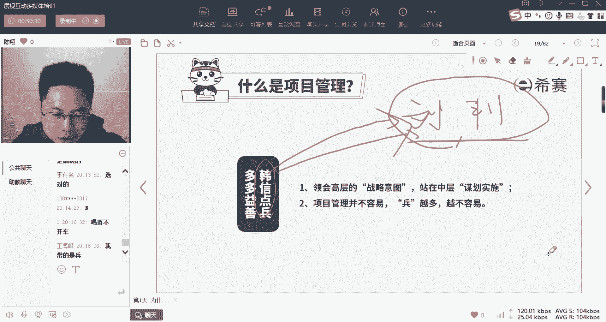

# 24年PMP考试，3天冲刺训练营27集精讲视频，完整免费分享！ - P5：1.5 什么是项目管理 - 冬x溪 - BV1Do4y1x79r

那么接着我们就来说什么是项目管理，因为刚才呢是大家面临的啊，大部分人接触到的第一个知识点和考点，所以我讲的特别碎特别细，那么接下来呢我可能会稍微提一下速啊，大家坐稳了啊，安安全带系好。

刚才讲的是什么是项目，接下来我们就说为什么哎项目要项目管理，那啥叫项目管理呢，先给大家讲个段子啊，这个段子可能大家都听过了，我稍微再复述一下，就是我们的一个成语叫做韩信点兵多多益善好。

那么韩信点兵多多益善讲了一个什么故事呢，就是我们国家上最有名的一对君臣对吧，叫刘邦和项羽啊，啊不不不啊，刘邦和韩信这两人呢一对君臣对吧，这两人打下天下以后呢，有一天诶俩人一块喝酒，那么刘邦呢是君主。

他就问韩信说韩信啊，你说说我能带多少兵，然后韩信就说啊，老板你能力特别强啊，你能带10万精兵，这个时候呢刘邦很开心，因为这是拍他马屁对吧，能带10万金币的意思是你能掌控10万精兵，而不是乱。

你管理能力很强啊啊然后刘邦这个时候呢作死，他说韩信，那你说你能带多少兵，韩信怎么打的是吧，韩信说的是韩信点兵多多益善，意思是我无穷无尽，给我多少，我贷多少啊，没有上限，这个时候是不是就作死了，什么意思。

老板才能贷10万，而韩信我作为你的下属，我能带的无上限，我的能力大于我的老板，这个时候刘邦是不是就肯定不开心了啊。

那么这个韩信呢一下子吓得酒醒了，那么它是怎么圆的。

这个有知道的朋友跟我们说一下对吧，韩信这个喝醉酒说我的能力比我老板强，我带的兵比他多，那这个时候他要把这话给圆回来，他该怎么说，怎么。

你们猜他怎么说的。

然后这老板对不起，我喝大了喝酒不带兵对吧，对王海峰说对了啊。

他说老板，你别跟我比，我是将才对吧，我将才的责任是带兵，而你是帅才，你天生就是当老大的，你的能力是带我们这种将才对吧，你是将将之才，哎这个一九西甲又圆回来了，是不是刘邦一听诶啊小子算你圆的快。

那么这一点呢其实就点出了我们说啥叫管理，啥叫项目管理啊，是不是中层的人啊，他带兵去做事儿，他是中层管理人员，所以呢我们说项目管理一定是承上启下的啊，所谓的承上呢，就是项目一定是依附于整体的公司。

战略层面而定的，就是公司有一个大的目标，那么你作为中层人，你想着说这个目标怎么实现，领导给你指的方向，你怎么走下去。

诶，你动脑子，领导呢动嘴巴对吧。

往那边打，嘴巴一动，完了接下来的事由中层领导干部动脑子去想，想，完了之后呢，不是你做的诶，你是在体下的带领着，我刚才讲了，带领很多个兵，让他们去动手来执行，所以是不是。

所以任何一个组织一定分为中高低三层啊，中间这一层动脑子去策划，带领着下面的人动手做事，执行的人，我们叫项目管理，我们叫项目管理，所以呢这就带来了项目管理的两大方向啊。

我们也会讲的时候也会讲，项目经理需要需要具有三个方向的能力，一个管理上方的能力，第二个评级管理能力，第三个带领下属的能力，对吧啊，项目是依附于公司整体战略而存在的，第二个往下带领兵越多越难带啊。

这就是项目管理，那么带了很多一群人，那么经常会出问题，出现什么问题呢，啊那么你们都可以说出很多很多来啊，我就不一一去点了啊，那么都列在这以后，经过我们前人100多年的总结，前人给你总结出了十大类。

叫做十大知识领域，这十大知识领域呢是这么来说的，首先就是你做一个项目，你第一件事情就是去框定它的范围，如果你不框定范围，永无止境的往这里面塞东西，继续加码做，那么你这个项目不可能做得好对吧。

所以做项目啊一定得先定一个范围啊，叫范围管理，然后呢范围定好了什么事你做做什么事，确定了你还得在什么呀，在要求的成本之内，钱不能花多了，要求的进度之内啊，是不能超期了，把要求的质量给做出来。

所以我们经常把这四个呢叫做四大目标啊，范围质量成本进度四大目标，那么这是你做事情的目标，你怎么把它做出来呢，你是不是得有人帮你做啊，那个这个叫做资源管理啊，我们经常叫人力资源，你有足够资源才能做成事啊。

啊有人帮你做好资源，从内部去要内部没有怎么办，到外面去买，找第三方团队啊，或者去招聘啊，那么这些是跟人有关的，还有什么呢，你这个事儿不可能说都是你的下属，你还有周边评级的，还有项目外跟你相关的一些人。

咱们叫干系人或相关方，那么这些人都是人，怎么把他们协调起来呢，用我们的嘴巴啊，我们经常说项目经理做事，90%的时间在说话啊，因为项目经理主要的工具就是沟通，通过沟通诶调摆这些人把事给做成了啊。

好这些个东西是八大领域，这八大领域呢我们说太碎太散了啊，在真实真实的工作中，他们一定是糅合在一块儿的，所以呢我们要把它整合起来，就让你去超市买东西啊，买的这些东西呢一件一件的不好滴溜。

你给他装一个塑料袋啊，给他铜管起来叫整合管理，对吧好，那么这些东西呢都是我们事先就可以诶，探明计划掌控的，那么我们说现在这个时代变化太快了啊，不是所有事情你都可以掌控，你掌控不了的，咱叫风险。

那么对于你掌控不了的东西，你该怎么去应对，不让他对你的这个项目造成致命的打击啊，我们这叫风险管理，所以呢这十块知识领域就是我们项目管理的啊，一个这个框架了啊，你们如果来tp m p其实也就从这十个方向。

一个方向一个方向的给你展开了，捏碎了。

讲这一块该怎么做，怎么管好，那么这些内容呢它不是一蹴而就的，从上世纪的啊这个啊1910年代一直到现在，他一直在发展，那么整个这个发展体系呢，跟我们今天的内容就可可能不太相同。

就不展开讲了啊，我们就直接略过。

因为他这个地方几乎没什么考点，是一个历史性的一个讲解好，那么但是要讲的是什么呢，要讲的就是我们发展到21世纪初，也就是20011年的时候，由我们原来的这个十大知识领域，进行了一个很重要的改革。

导致了现在我们常听见的一个词叫敏捷，项目管理的来源，这两者之间什么关系呢，我们待会儿还会讲，现在稍微讲一下啊，原来我们做项目管理，我们讲究的是什么呢，是计划和控制啊，这两个词都带着一个什么呀。

很固定很死板的掌控感，但是现在这个世界越来越易变，不确定复杂和模糊，是不是很多东西我们都越来越感觉到失控了啊，从是不是特别是这23年，是不是这23年就感觉全世界整个就乱套了，今天这里打仗，那天那里疫情。

今天是不是飞机就掉下来了啊，是不是处于咱们这个时代非常没有安全感，所以呢早就有人给我们这个时代呢，命了一个名叫乌卡时代，就是这个时代带有这四个特性，而这四个特性呢是我们做项目做预测，做控制最大的敌人。

那么面临这个问题，怎样在是不是跟踩着个高跷踩，这个是这个耍杂技一样，怎样在这么滑动的基础上，能够把这个东西控制下来啊，那么这就是我们敏捷要讨论的东西，如果说原来做预测性项目，那么相当于是你站好了诶。

姿势摆准了，瞄准了靶心，打固定靶的话，现在的做项目就相当于是拔也是变动的，目标是变动的，是啊这个不确定的，你人呢也是变动的资源呀，环境也是变动的，你怎样移动着打移动靶啊，是不是这个难度一听上去。

感觉就明显成倍的增加，所以这也是为什么第六版要往第七版的啊转变，第六版是告诉你怎样站着打固定靶，第七版是告诉你怎样移动着打移动靶啊，难度增加，你要的学的能力变多好。

