# 24年PMP考试，3天冲刺训练营27集精讲视频，完整免费分享！ - P6：1.6 项目管理生命周期的各个阶段-知识点 - 冬x溪 - BV1Do4y1x79r

那么刚才讲的呢呃讲了这个预测型和迭代型和增量型和这个敏捷型。很多人呢对这几个东西经常搞不清楚啊，也是我们的一个重中之重。那么我们来展开讲一下，刚才讲这些东西呢，它们统称为项目的开发方法和生命周期。

那我们来看一下这四者之间的区别。注意这个东西既是我们理解清楚第六第七版的区别的重要的根基也是很重要的考点，它是有很多分值的啊。我们来看一下。首先呢我们还是从最常见的这个瀑布模型啊，来看啊，你感觉一下。

你现在做这个项目是在做什么啊，我问一个问题啊，现在你做项目，你能分得清楚，你是做瀑布模型的，打个一预测型的打个一，你分得清，你是在做敏捷型的打个二看看。

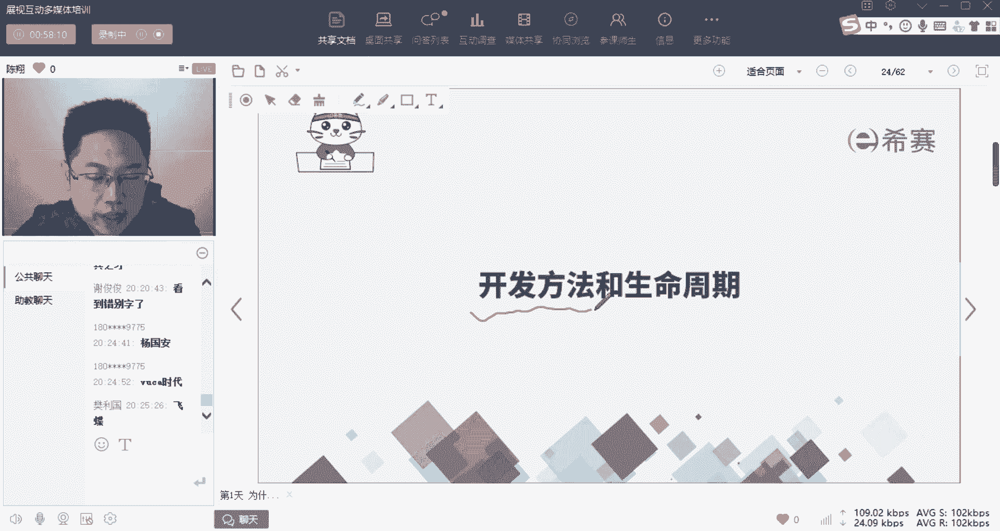

我先看一下啊，咱们的这个。

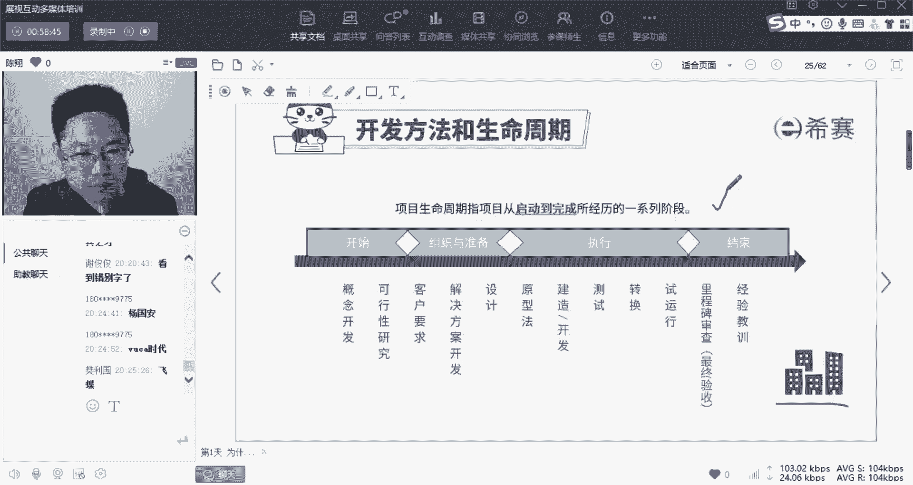

理解。

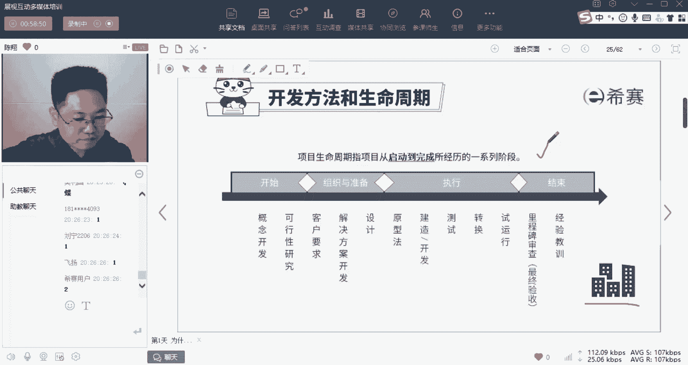

🤧看咳。好，唉，还是有不少的在做敏捷啊。

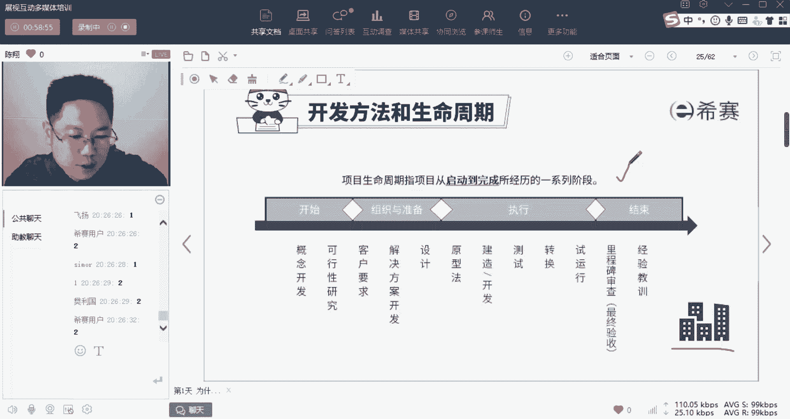

一般敏捷都是在软件行业，对不对？

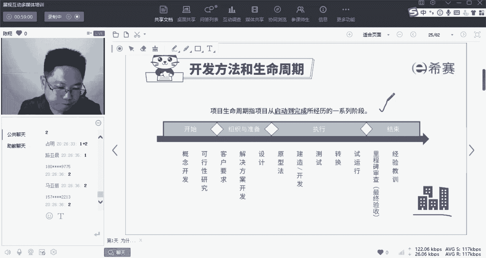

好，还是有很多民间啊。好，OK。😊，那么我们还是来解释一下啊，啥叫瀑布呢？瀑布模型也叫预测模型，取的是瀑布一样飞流直下一泻千里的这种意思啊，啥意思呢？就是一个非常明确的线性啊，比如说我们说一个典型的啊。

这个比如说啊你做一个地铁，一个城市的地铁建设对吧？地铁挖隧道啊，建这个地铁啊，然后组装。首先你会提出一个概念，说哎，要不咱们在这儿建一座地铁站吧啊，但是能不能建呢？你得进行一个可行性研究。

包括唉这个地方是不是有溶洞，是不是有地震断裂带适不适合建地铁，城市规划部门要进行可行性论证啊，可行性论证，还有什么呢？还有精进可行性论证，就是在这投产地铁，它的投入产出比划不划得来，是不是亏的还是赚的。

好，经过论证以后，你会发现啊，这个概念被认可了，值得去做啊，这个产品值得去做。那么咱们就会进入到立项阶段啊，立项就是确立这个项目，咱们要做。然后项目经理这个是入场了，项目经理入场之后，首先就是要探明。

因为在这之前只是一个很粗略的概念。那么这个时候你要探明它的需求，具体有什么？比如说哎我老婆跟我讲，我们结婚十周年，你要给我一个终身难忘的十周年的这个啊这个回忆，那么这是一个概念，具体怎么做，像我这么。

难是不知道的。所以我要去请教专家，专家告诉我，你要带他去吃烛旺晚餐啊，环球旅行、买钻戒等等等等啊。那么客户要求探明了，哎，他在为我去什么设计一个。一揽子解决方案对吧？解决方案的开发。好。

方案定好了再去设计。你要做这个产品的设计方案，然后再出一个原型啊，啥叫原型呢？啊，原型其实这就很简单啊。比如说啊我们今天比如说我要送我老婆啊一个什么东西，然后他到底想要要什么，我不知道我拿个橡皮泥来。

我给他捏啊，捏成一个什么形状，看是不是这个样子。他告诉我不是你那个地方还要多一点，那个地方要少一点，然后再通过这个橡皮泥再再捏到他想要的样子，是不是就是他想要的一个东西，就通过一个原形。

能够可视化的展现出来了啊，这就是原形。那么有了原形确认了以后，你再去建造和开发，然后去测试它能不能用，然后再做转换，啥叫转换呢？啊，我们如果你是搞软件开发的，这东西就叫交割。或者说什么呢？

就是你一台地铁，不是地铁你在工厂里面建好了，你要把它放到哎地铁隧道里面去，铁轨上去觉得组建起来，是不是？这个叫转换到实践实用场景。对吧对，好，实践使用场景已经到这儿以后，你还得试运行。

比如说地铁地铁要试运行整个一整年才能开放给公众，为什么呀？因为危险性太大了，一架飞机今天掉下来是130多个人啊，对吧？如果一台地铁出了问题。那简直就不可想象，是吧？

所以这么重要的东西一定要先给它试运行一整年确定了它的啊稳定性才能交付啊，这个时候我们才到里程碑审查叫做最终验收啊，验收完了之后，你这个时候没完，你得再回顾一下。哎，我做的这个项目，我有什么正面的经验。

有什么反面的教训，值得我学习和沉淀下来。在将来我在开展类似项目的时候，哎，我能够吸取什么教训，能够让我接下来做的更好，是不是整个这个项目才算完，所以呢整个这个项目从开始到准备到执行到结束。

它是一个完整的线性结构。线性结构呢就是一定是前一步做完了，经过了验收和批准才能开始下一步，一步接一步。哎，按照时间顺序线性的进行下来，是不是就找到了一个瀑布，从上往下一泻千里的这种顺滑感？

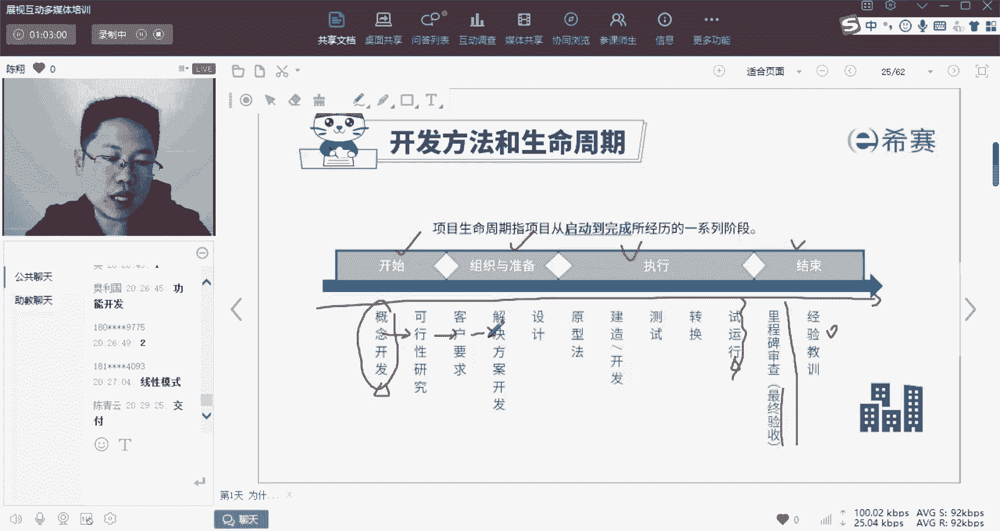

OK那么这呢是一个我们现在在做的典型的啊预测型项目型。刚才我问了，只有大概不到十几二十位同学说他们现在做项目型。实际上呢，如果你对敏捷没什么概念，你现在但凡在接触项目，一般都是。

这个瀑布型的是不是你可以自己感受一下啊，现在基本上啊都是在按瀑布型做事情，除非你是很明确的说我在做敏捷。

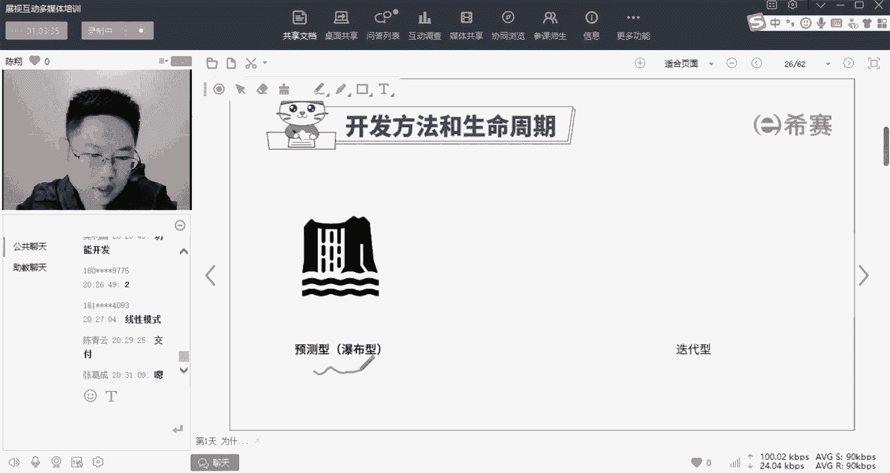

啊，一步一步啊step best啊。好O那么这个瀑布行完了之后，它有一个问题，咱刚才讲了呀。好，我们这个整个这个项目可能呢从最开始设计啊，客户要求的东西，做到这个最后呢，可能3到4年就过去了。

这3到4年之间，无论是客户的口味还是外部的环境都在急剧的变化啊，那么可能东西还没做完，客户的口味就已经完全变完了。那么这个怎么办呢？

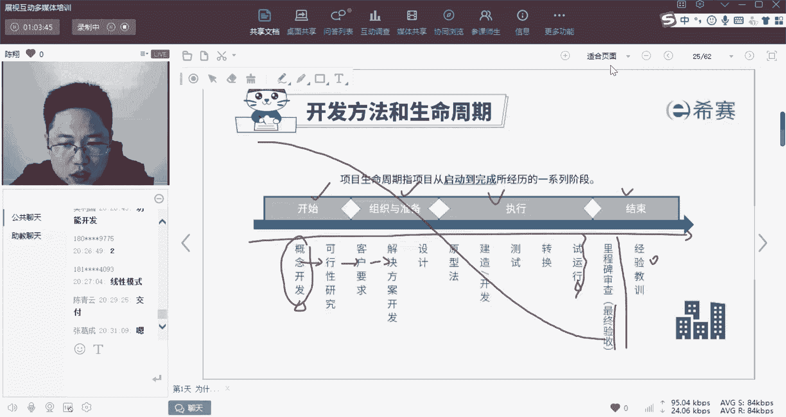

是吧不适应变化，有可能呢3到4年之后，客户才干到实实在在的东西，然后跟他的想的完全不一样。他让你返工，结果这个时候大量的投资已经投进去了，返工造成大量的浪费。那么这些问题怎么解决呢？啊。

我们就必须要去净化啊，比如说净化呢？最常见的一个迭代，一个瀑补。啥叫迭代呢？啊，前段时间我看这个冬奥会的这个报道啊。

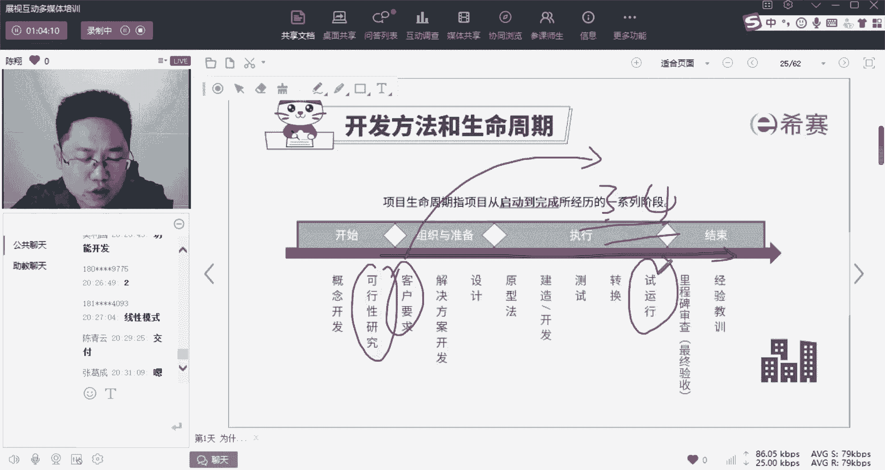

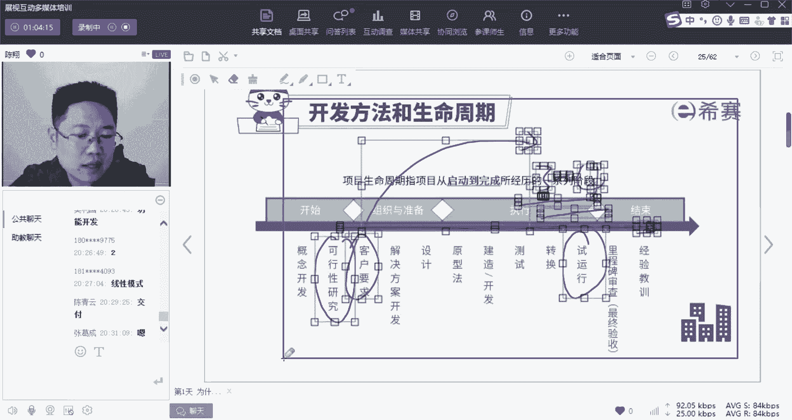

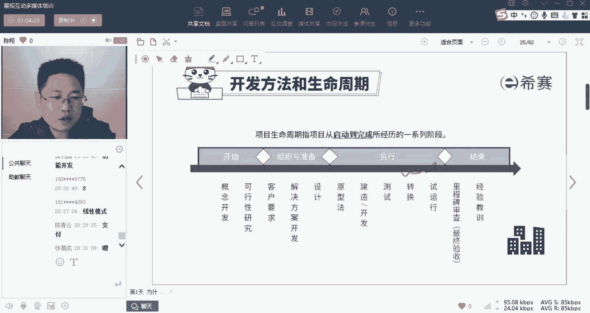

你们知道老眸子啊，这个冬奥会上你们有没有这个印象，是不是有一块冰，冰出来了以后呢，出了几道激光，激光哗啦哗啦把这个冰啊切成这个碎冰，掉落以后，出现了五环。😡。

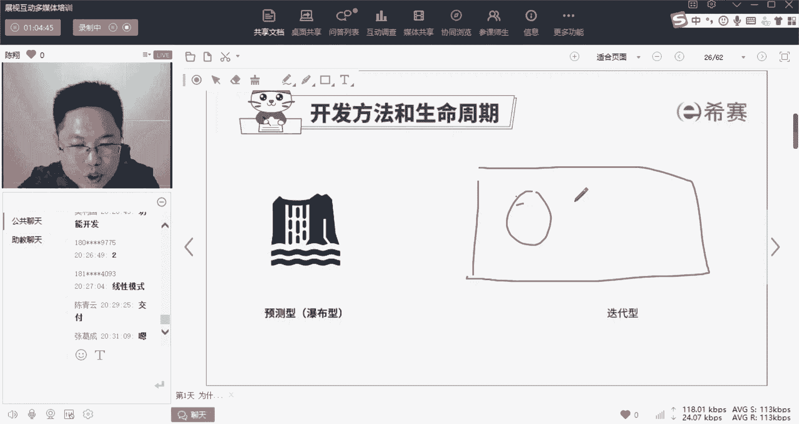

有印象吗？有没有看了冬奥会开幕式的？

一块冰被鸡光切碎之后啊，变成了五环是吧？当时你知道老谋子啊，张艺谋跟这个制作团队提的要求是什么？

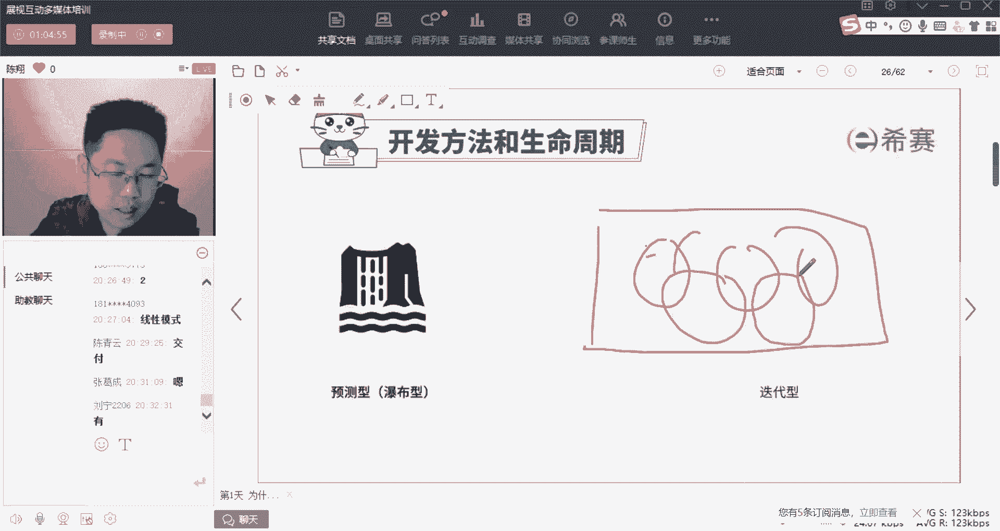

提的要求是你给我制作一块纯洁的冰。😡，你如果是这个乙方，你当时是什么感受？老谋子让你给他设计一块纯洁的冰出来。😡，是不是有点像甲方给你提的要求是我要的是五彩斑斓的黑。😡。

你完全搞不清楚了他要的东西的标准是什么，是吧？甲方自己都说不清楚啥叫纯洁的兵。面临这样子完全不清楚的需求，你怎么办呢？😡，啊，没办法，甲方爸爸出钱你也得去做呀，这个时候最适合的就是用迭代型，你摸不清楚。

那你就摸清楚嘛，对吧？那比如说我现在跟你讲，哎，我要你给我画画幅画，这幅画有鱼有水草啊，是彩色的。我这样说，你肯定不知道我要的东西是什么，你只能先去试，你说我先给你画个草图，大概是这样，对不对？啊。

我说没错，哎，是你可以照这个方向去画，然后呢，我给了你这个反应之后，你又给他哎，你不是说我说我要鱼和水草嘛，你再给我画几笔鱼和水草，哎，我说看看这个哎这个东西差不多就这个样子，如果不满意。

我会提出来说这个地方去掉那个地方加深一点啊，加加大一点是不是？接着我的需求，你再去改。好，改出了哎，有颜色了，最终哎这幅东西终于满了我的一，那么你把它交给我。那么啥叫迭代。

就是先做交这个给他给甲方看甲方给反馈再做再看再反馈，再做再看再反馈，一直不断的。😡。

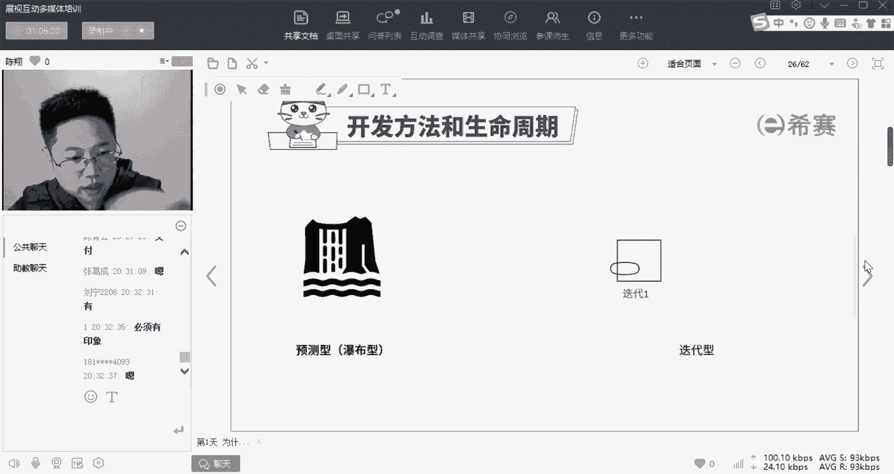

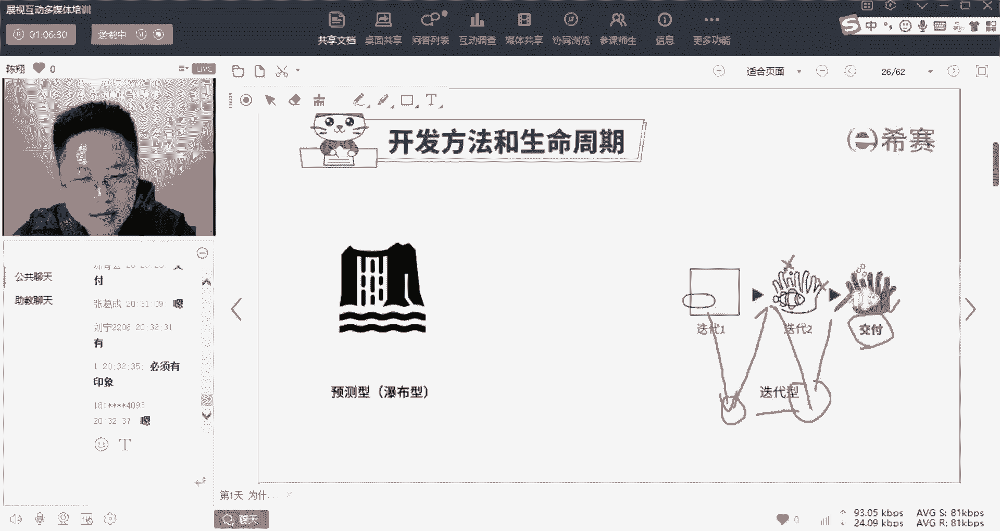

这样子。去试探他想要什么，直到最后东西通过他的验收，是不是这种生命周期呢，我们每个人应该都经历过，就是你大学写论文，对吧？有没有人敢拍着胸脯说，我大学论文或者研究生论文一次从我老板那过了的。

是不是永远不会，对吧？好，这版交上去，老板批一顿改一下，批一顿再改一下啊。10这次打死都不改了啊，结果上去还得改，最后改了10086版。😡，啊，然后终于再改一版以后通过了，是不是？所以我们说写论文。

打回同改，打回重改，最后通过，这个是典型的迭代型生命周期。它讲究什么呢？讲究去通过哎逐步的靠近你的目标，通过最后一次交付啊，这是迭代型。那么除了迭代型的，还有一种叫增量型。啥叫增量型呢？

就是每次交一部分。啊，比如说我们还是拿这个做建筑来说啊，大家都知道啊，有些建筑呢它是这样子的，就是下面三层是商场，上面330层呢，它是住宅，应该都建过吧。就万达万达商场下面上面的这个住宅啊。

那么这种楼呢，我们原来搞工程的时候，它都是一次性交的。什么意思呢？就是整个这个群我们叫裙楼啊，三层和30层都建完了啊，全部装修好，再一次性交付给甲方，甲方再去运营，但是这个太慢了啊，甲方等不了。

甲方现在都是什么要求呢？这个东西你给我分两次交，先把下面三层啊，做完了，交给我，交给我以后，我马上装修，马上引进店铺来开业，下面已经开业赚钱了啊，你上面同时还在建。这给甲方带来什么好处？

原来这种做法三年以后我才能开始有哎这个资金回笼，这样子呢，一年下面这个就交了，马上资金回笼了。呃，从第一年到第三年上面这个还在建，是不是就更快的投入到市场，更快的进行哎资金回笼，那么像这样。

同样的一个内容，我把它分多次啊，把它分多次交付出去啊，那么就是叫做增量，每交一次的东西叫多一点增量。好，陈俊云说的这个预售房跟我们现在说这个概念啊不太一样不太一样。预售房它是一个商业操作手段。

这呢我们说的是如何做项目的一种交付生命周期。

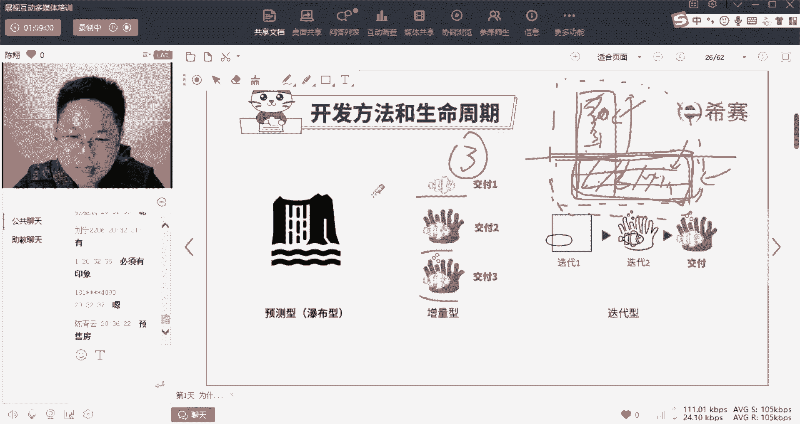

好。啊，预售房和期房啊都不是一个概念啊，都不是不是这个概念。对它应该是一个进度交付啊，你先交一块儿再交一块再交一块。原来呢你交一次，现在呢交三次。好，这个概念呢你们可能会有点模糊。

我们再来啊加一个例子再解释一下啊，那么这两种加在一块呢？就是我们现在常说的敏捷型了，它是什么特点呢？我们举个微信的例子。

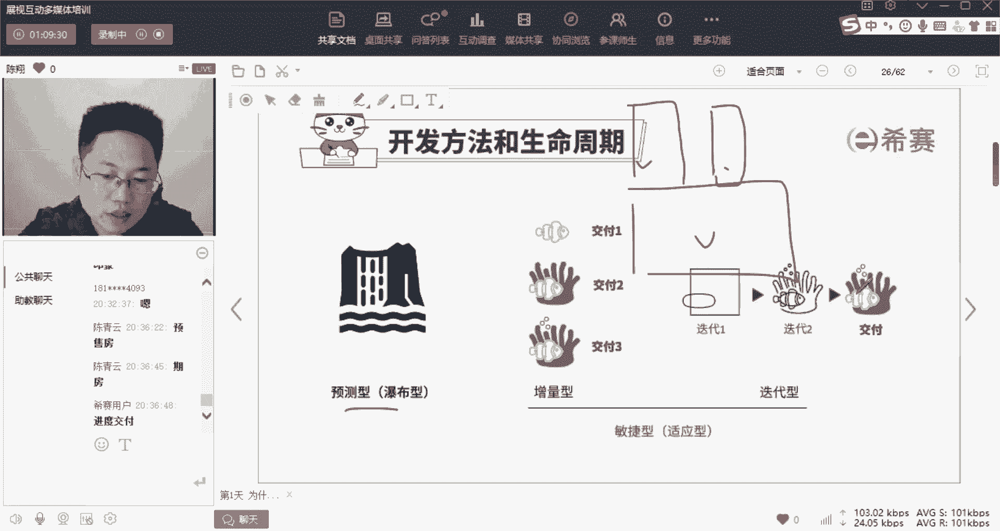

好，微信的例子，大家回忆一下，微信你的手机微信是不是越来越大。原来几百兆，然后一个G两个G三个G，现在可能十几个G，为什么？因为它一直在给你加工呢？大家知不知道微信的第一个版本。

对吧只有发消息和发图片这两个功能就跟我们当时的短信一样，应该是在13年还是11几年啊。那么第一版微信发出来的时候，这么少的功能。

跟现在不可同日而已。啊，那么问题是什么？

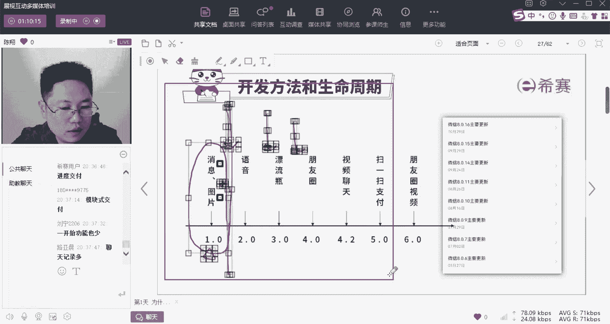

为什么他不把这个微信开发到哎能发朋友圈，能视频聊天，能扫一扫，能啊视频这个朋友圈视频，发视频号，这些功能都开发出来了，开发的这么完整了，才把它投放市场。大家想一想它为什么分多个版本发。

每个版本发一点出来，很简陋的功能就赶紧把它发出来了，而不是把所有东西都完全做好了，很齐全了，再统一发。😡。

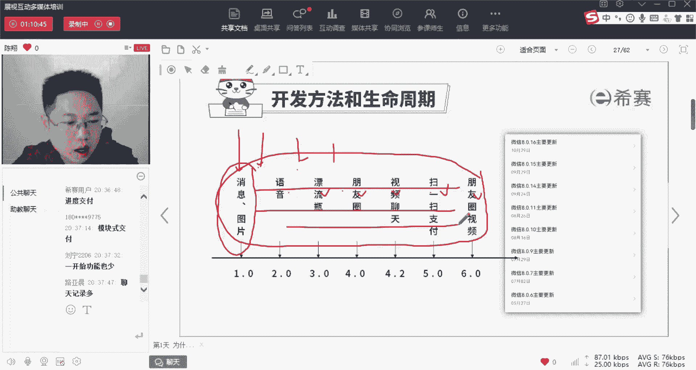

为什么？😡。

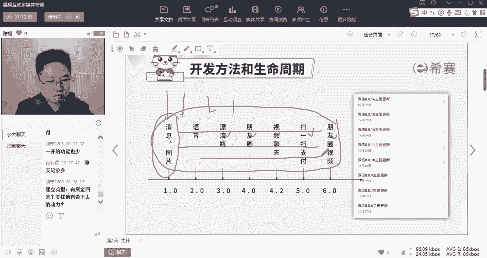

。あ。

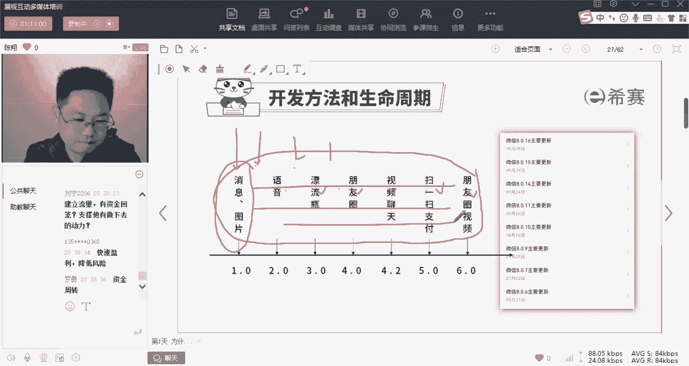

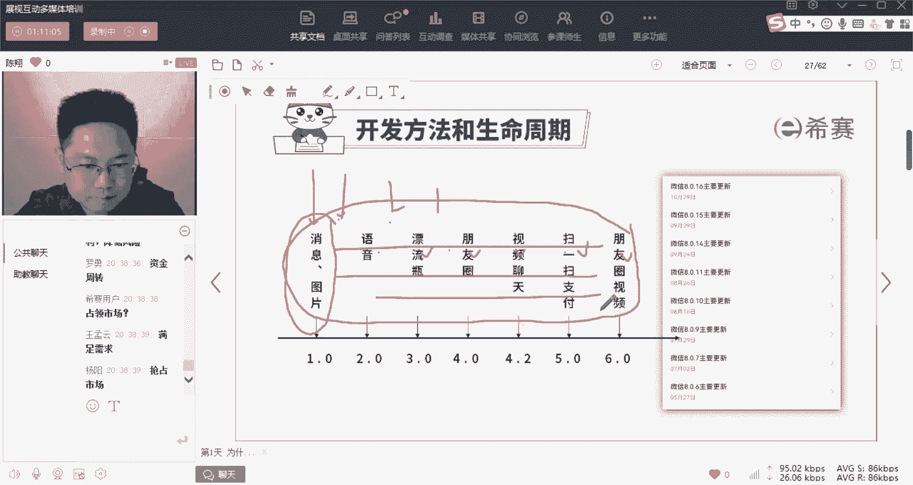

对大家说的都对，是不是尽早的进入市场，尽早的抢占市场份额，尽早的建立用户，尽早的收回成本。对吧总之就一个字，你得快。对啊，你得快。

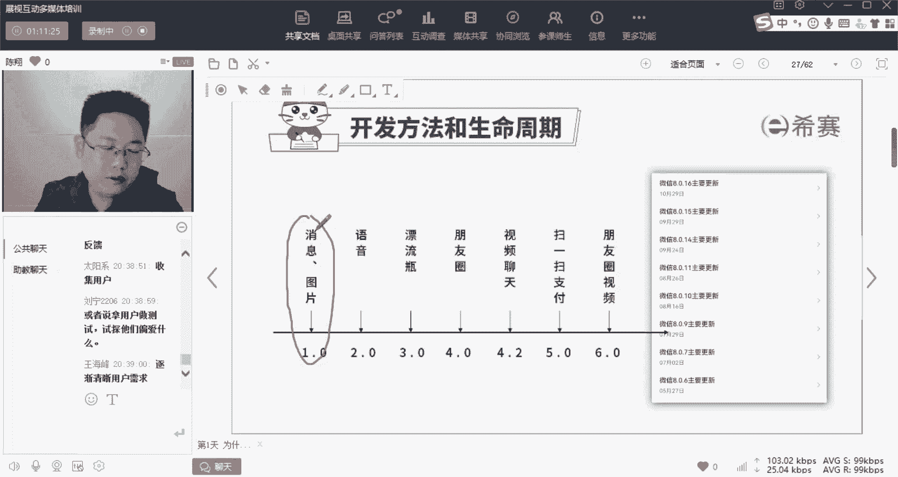

所以如果还是我们的原来预测型，把所有东西都做齐了，再一次性发出来啊，别人早就把这个市场抢完了。对吧那么我们把它切成很碎的小块儿。第一次做了点什么，赶紧发。比如说去年我记得很清楚。

应该是2月12月25号的样子。百度大家最近有没有一个在关注这个元宇宙是吧？百度在去年12月15号推出了它的一个第一个啊元宇宙APP。是吧元宇宙APP刚出来的时候，很多人就赶紧去看了，然后一片骂声。

这个APP里面什么都没有啊，就只能登录进去体验一下原宇宙是个什么样子啊，完全没有什么好的体验感和功能。一片骂声。那么大家我问一下大家，百度它是赢了还是输了？😡，在这种情况下，百度是赢了还是输了？

推出了一个很简陋的，啥都没有的APP。源宇宙APP。对吧只有他对吧？除了他被骂以外，还有其他的他的哪些竞品，腾讯、阿里。😡，他们被骂了吗？都没有骂他他就赢了，因为他推出来就有有了，大家就体验。

就把它跟第一个元宇宙建立起来了观感，对吧？没关系，你第一版粗糙的先出来，先抢占了市场，然后在一个版本一个版本去迭代。只要你的每个版本优先于别人一步，你就永远抢占了领先的位置。

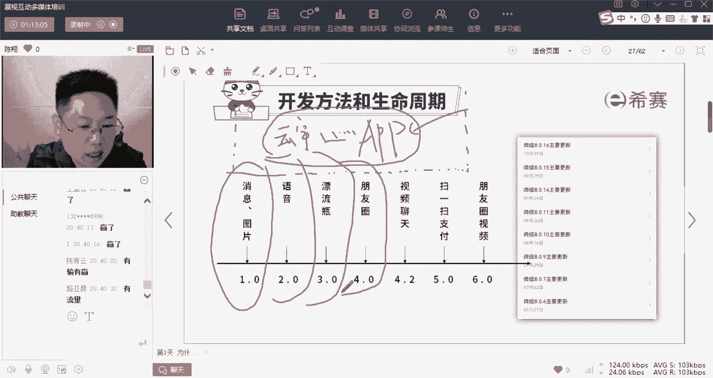

对吧这就是我们迭代这个增量的核心思想。现在做软件的几乎都在用这个思想在玩事情，对吧？对，微信至于米聊，你说米聊比微信好在哪吗？其实不然，那么米聊大家知道他是谁吗？他几99%的人都不知道为什么。

因为他就慢了微信一步，对吧？他就慢了微信一步，然后就没人知道他是谁了。😡，所以增量型生命周期就是这么来的啊，优先找到MVP就是最核心的那一小丁点而已没有它就运行不了的那些功能先给它做出来。

然后在一个版本一个版本的去增量，对吧？这就是增量型生命周期与预测型的优势之所在。好，这是一个第二个呢？是不是？那么每一个版本啊，它在发布之前也经历过多次迭代的内部测试啊，适用客户测试。

然后小规模测试是不是都已经经听过很多人的意见了，改过很多版了，然后再发出来，这是不是就是迭代的一个。所以呢现在做软件大部分都是这个增量型和这个迭代型融合的。在这儿啊。

大家不要把增量和迭代当成两个事来看了，他们俩完全可以融合在一块儿的对吧？那么他们融合在一块儿，就是我们所说的敏捷型。

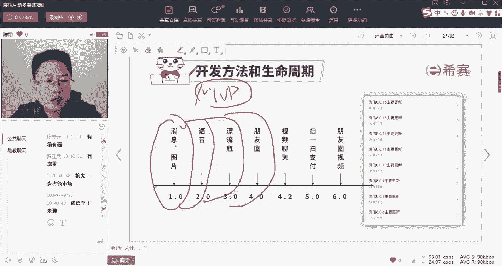

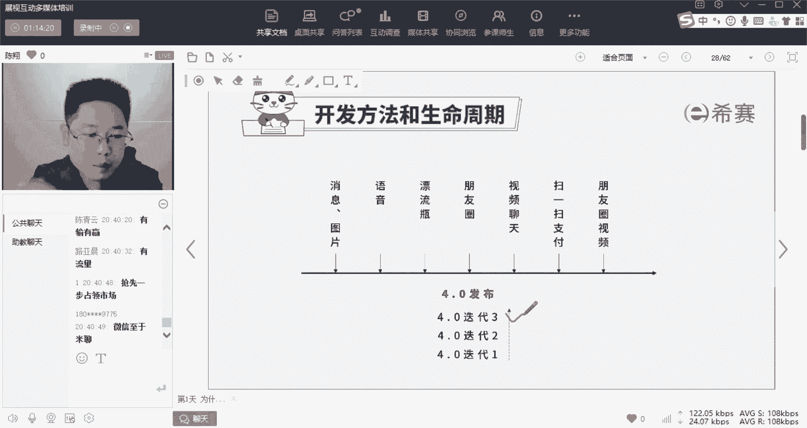

啊，好，讲到这儿呢，应该这几个啊生命周期类型的特点和用法。也差不多了啊，那么如果还不懂课后呢，我们在群里你再讨论啊。那么我先来讲一下这个地方怎么考啊，说这么多呢，其实考法很简单。

它就是给你用二维构建了四个象限，哪个二维呢？一个就是交付的频率啊，就是交付的次数，一个呢就是变更的程度或者叫做需求的清晰度。如果需求一开始就是非常明确的也说的清楚，也不会变啊。那么就是叫做变更程度低。

如果一次性交付，不分多次交付，就叫做交付频率少。那么这种呢最典型的就是我们做建筑工程啊，一开始就知道你是什么啊，以及不会变，那么一次性做完一次性交叫预测性啊，如果一开始就知道我要什么啊。

那么但是呢我分多次交付。这个呢啊交付频率高，这叫增量性。而如果是搞好多次了之后，最后一次性通过验收。但是在这个过程中呢，你的这个变更这个需求已经变化了好多了啊，或者是不清楚，逐渐多次探明才清楚的。

那么叫做迭代。如果两个都具备这个特性，那么叫做敏捷啊，就是敏捷。这个呢实际上如果到了我们工作中面临实际情况，它反而没那么好分辨。但是考试呢它也不至于这么来为难你啊。

一般有几个关键词能够帮助我们判断它在两个维度上分别是什么啊，听清楚了。如果提到了几个词叫做多轮交付，多次交付，分多阶段来做是吧？但凡这几个东西你一定识别到了，交付频率高。第二个就是什么呢？

要快速进入市场。要快速的资金回笼抢占市场。那么这些通通都是啊这个款。那么如果有另外一类词叫做什么呢？叫做需求并不清楚啊，并不清晰，或者呢因为环境变化，我们需求也会快速变化。那么这样两类词。

那么往这个方向赢啊。那么如果这两类词周都找到了，那么你就定义到敏捷这。

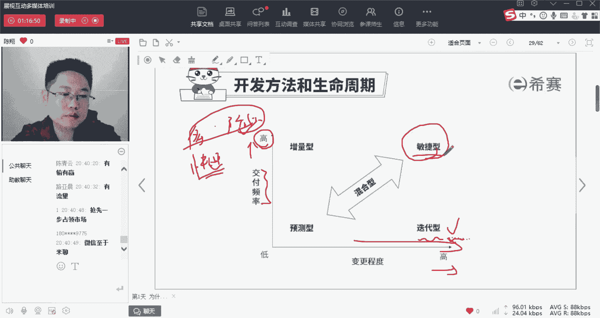

啊，就到定义到敏捷这儿。