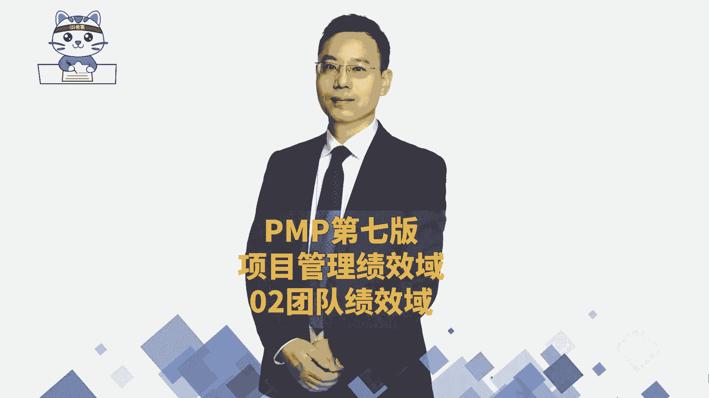
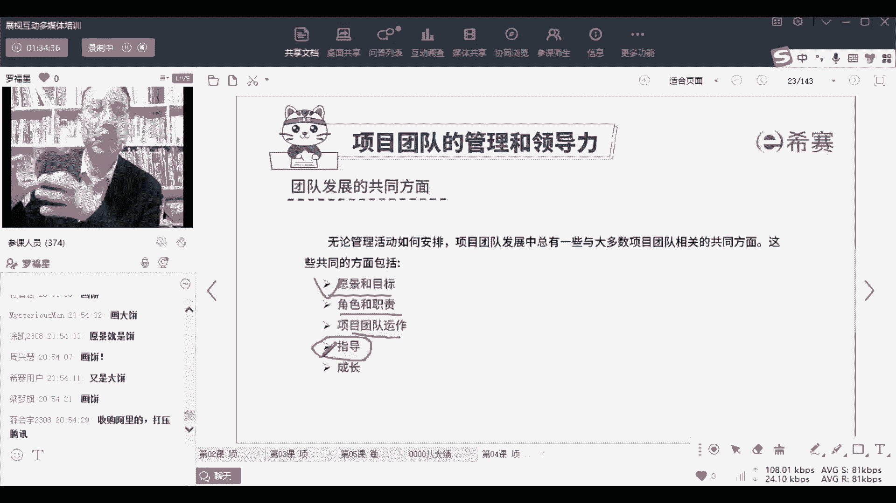

# 24年PMP项目管理考试，每天1小时，全套零基础通关视频免费观看！第六版114集全+考纲讲解+第七版37集全 - P142：PMP第七版8大绩效域之02团队绩效域-中 - 冬x溪 - BV13e4JeiEta

那关于团队绩效率呢，我们刚看了一下啊，就是关于领导和管理对吧，然后还讲了一个叫集中式的管理，和分布式的管理，而这里呢是对于集中式管理和分布式管理，做了一个解释，比方说所谓的分布式管理中，人人都是领导。

对类似于这样的，那真正领导说什么呢，真正的领导你就做一个服务型领导，或者叫仆人式领导，就真正的领导你就做一个服务型领导，或者是叫仆人式领导，你怎么样去做呢，就是团队成员他需要什么支持和帮助的时候。

你来给他提供对应的帮助和支持，用这样一种方式来去做事情，你看你能够聚教育满足团队的需要，也是团队需要什么什么东西的时候，你能够去给他提供呃，团队有什么东西不会的时候，你能够帮他去找到呃，那个什么。

比方说是能够去帮他找到对应的资源，来去辅助他，支持他，帮助他哎这都是这叫仆人式领导，你说仆人都是那个滴在尘埃里面的，那领导都是高高在上的，他是仆人，是领导，有点像是你的管家对吧。

有一点点像是你的管家的这种方式，他的管家能够帮你管所有东西，能够你需要什么东西，你去找管家，他都会给你提供这样一个帮助，OK这样的话你能够更好的去帮助团队来成长，能够去帮助团队成长。

而而事实上人才是生产力，人是第一生产力，所以你要去帮助团队的成长，你要去能够更好的来管理团队成员，并不是真的去管理他，而是能够去支持他变得更牛逼，它变得更牛逼，它的生产效率就可以提升。

它的效果也会变得更好，是这样一回事，所以你看你要去关注什么，他说服务型领导要强调聚焦于解，解决以下的这些问题，来培养团队成员，你怎么样去培养团队成员呢，你要关注他们有没有在成长诶，有没有能力变得更强。

变得更优秀，变得更强大对吧，而团队是不是一种比较健康的方式，明智的方式，自由的方式在处理事情啊，还有就是说啊，团队成员是否能够去成为服务型领导，也就是说他们是否可以成为下一个你，你把这件事情交代给他。

让他坐你的位置，你再做一个更高的位置，是否可以，很多时候你为什么能够升迁，就是你能够把底下的员工给培养起来，你能够把下面的人拔起来的时候，你就有机会能够去升迁，就能够伸到下面去了，哎就会是这样一种情况。

OK所以这个服务型领导呢，我们也是在敏捷项目管理中会展开讲，在敏捷项目管理中会展开讲啊，这个怎么像传销，你想的太多了啊，想太多了，你仔细去想一想，哪一个公司它不是这样一个逻辑，原来老的那种老的方式。

就是压榨的方式或压制的方式，我命令你要求你什么什么样这种方式，那种方式已经过时了，像现在的很多九零后，你们缺钱吗啊也不说缺钱这个字用的不太好，就说你们如果说没有这份工作的话，你能不能活下去。

你会发现你可以活下去，对不对，你爸爸妈妈其实就很多九零后啊，条件还不错，家里条件还是可以的，那零零后就更加不用说了，零零后就说他可以不去工作，也可以也可以生活的，所以他更加你要是还骂他呀。

责骂他什么什么之类的，但他分分钟就走，就就就就卷卷铺盖走人了，但是如果说他在你这里工作的时候，能够有一些呃进步啊，有一些愉悦啊，有一些前途啊，什么什么之类的，那么这种情况下，他其实就会诶更有意愿。

更有动力，所以这个时候逼迫着领导，必须得改变领导的风格和方式，明白吗，所以才会有这样一种服务型领导，这个逻辑出来，其实很多时候也是被迫的啊，也是迫不得已的，你你以为领导他不想高高在上。

他不想端着一杯咖啡，从一楼走到六楼，再从六楼走到一楼，他当然也想了，但是有的时候没办法嗯，这下面的这些员工条件也很好，也很任性，他没有，他没办法让你没没没没给你这个机会让你装逼，对不对。

所以慢慢的其实很多时候在调整，当然不是说马上，但是一定是在一个调整的过程，会有一个渐进的过程，会有一个渐进的过程，OK你看服务型领导也叫普通型领导，他主要干什么事情，主要干的第一个就是消除障碍。

也就是说你们一天到晚在做事情的时候，可能经常被打断，经常被打扰对吧，那么领导就是帮你把那些打扰和打断给处理掉，OK他就是帮你去把那些各种打扰给处理掉，让你能够专心致志的去搞事业，专心致志搞事情。

你看一看，现在那个普那个那个那个那个那叫什么，淄博淄博的市领导，他是不是类似于这些服务型领导，兄弟姐妹，你自己想一想，那个哎很卡了是吗，现在好了吗，现在好了吗，同志们，刚刚才讲到这。

OK那比方说你说淄博士的领导，他现在是不是有点那种服务型领导的方式，他能够去给大家提供一个很好的一个，营商的环境，给大家提供一个相对比较好的一个营商的环境，能够让你安心的去搞烧烤，干安心的搞事情。

对不对，他跟你把那个路也修好了，给你把那个烧烤那个那个什么东西也搞好了，跟你把那个什么的从高铁呃，高高铁从外地到淄博也那么方便呢，什么之类的，你就安安心的烤好你的串，撸好你考好你的串就可以了。

是不是他在帮你去消除障碍，OK能够让你好好的去搞事业，搞事情，让你干安心的搞事情好，还有呢是避免分心，怎么样去避免分心，其实就是说团队一定会受到很多干扰，这个避免分析还是在消除障碍。

能够让你更安心的去做事情，让你专注着做自己手头上的事情，你想如果说你考你，你本来你是一个烧烤店老板，你又想着说今天要有客人过来，然后明天又想着说，那个卫生局今天要过来罚你的款。

然后又是那个什么什么局进来过来罚你的款，什么之类的，多难受诶，但是如果换一种方式，你安心的去找，搞好烧烤，你把那些东西都按照垃圾怎么分类，然后会有那种环卫工人，你哪怕你开到晚上凌晨两点钟。

也有环卫工人过来去帮你收垃圾，你是不是可以更好的去安心的赚钱，去搞事业，类似这样的，那我们在工作中其实一定是这样，如果说你能够让团队专注于做手头上的事情，团资产效率会大大的提升，你自己去想一想。

在座的各位同学，你们一天到晚，你大概有几个小时在干自己的本职工作，又有几个小时在帮别人去擦屁股，或者是开会，或者是搞一些解决一些其他的一些问题，你来算算一算，就在前面那个数字是你做你本职的工作。

后面那个数字是你在帮别人搞这个搞那个，搞那个开会搞，搞一些什么其他一些事情，大概是几比几，一天八个小时，你自己算一下啊，来来给个数字吧，让我们现场看一下，所以你就知道如果有这样一个仆人士领导。

他能够帮你去清除那些障碍，能够让你安心的干活，是一件多么难能可贵的事情，就是这么一个逻辑可以理解吗，好第三个鼓励鼓励和发展机会，什么意思呢，鼓励员工可以变得更牛逼，员工才是第一生产力，人才是第一生产力。

员工变得牛了，你们公司就会牛，你们公司牛了，你们整个股价也会大涨，你们公司业务也会大增，各方面的东西都会变得很强，对不对，所以很多时候就是你作为一个服务型领导，其实你要想办法能够让团队变得更牛。

变得更强，就像比方说我在给我们团队，我们团队是一个小团队，我们这个团队目前是22个老师，我们团队一共有22个老师，但是我会跟他们讲的说，你不管说在这里工作一年，工作两年，工作3年，你工作几年。

你一定要有进步，你一定要有成长，你不要求你不要不要混吃等死，是不是，那就没意思了，再说这个地方也不会让你混，其实你要是能够学到一点东西，有自己成长并且有成就感，你就会很棒，你后面走出去以后。

你还会回忆起在这里的这一段时光，其实还可以，对不对，还是可以的，所以其实你自己做一个领导的时候，你一定要想办法能够去，能够去给到团队一些成长的机会，你让他能够去成长，你才会更轻松。

如果他能够成长不起来的话，你是你是很难轻松的，我现在啊呸我是打工人啊，我是打工人，但是我相对来讲会其实相相对来讲，稍微会可以不会管那么多事情，我会比较粗放式的管理，因为我们下面的那每一个老师都还比较强。

我觉得都还已经是比较念出来都还挺厉害的，所以有的时候你让他们变得更强，你就可以更轻松一点，你要不然的话，你一定会一天到晚会累死去，啥啥事你都要亲自去操心，那不就老了吗，我本来以前头发还也很也也不多。

但是现在头发变得更少了对吧，但是事实上就是我们可能会呃，通过做一些饭权呐，一些授权的这样一个方式，一些行为以及培养他的一种方式，能够让他成长起来以后，你会变得更轻松，那么事实上你看做团队发展。

你要给团队树立好的一个愿景愿景是吗，这个愿景有点大呀，然后呢能够给大家分工各自的角色和职责，分工要搞搞清楚，还有团队运作的规则，就是我们团队一起，我们怎么样去开会呃，我们怎么样去共事。

来了一个什么新的任务以后，大家怎么样去分哎，怎么样去搞这样一些事情，都是你需要去关心的，还有呢他不会的地方，你要去指导他，比方说啊呵呵啊，不管说是具体上课也好，回答问题也好。

然后像我们自己做课表啊什么之类的，这种杂杂杂杂七八糟一些小事情，一定都要有人去指导你，你才会变得更快，关于这个指导，还有一个很有意思的，我不知道你们有没有看过最近的一条视频，就是一个餐厅。

他就是客户点了餐以后。

