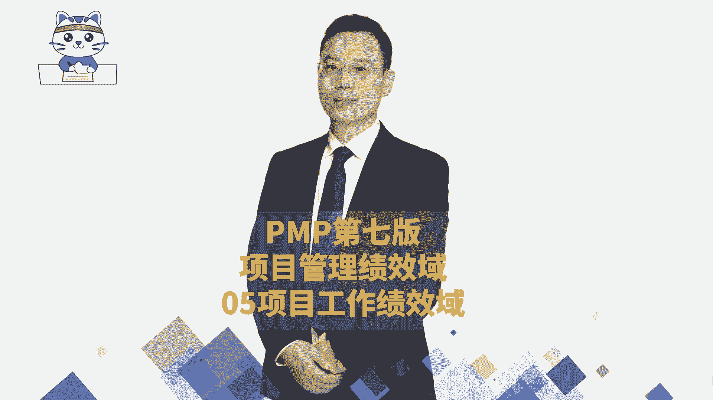
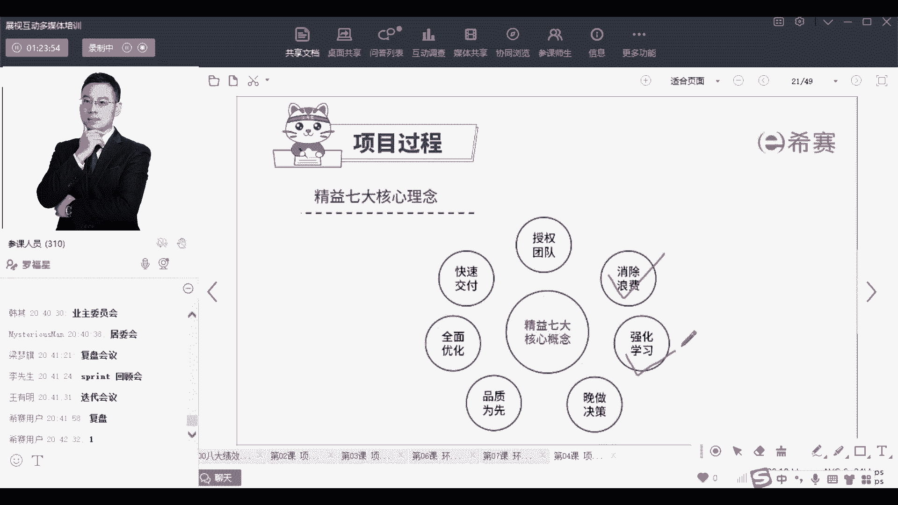

# 24年PMP项目管理考试，每天1小时，全套零基础通关视频免费观看！第六版114集全+考纲讲解+第七版37集全 - P149：PMP第七版8大绩效域之05项目工作绩效域-上 - 冬x溪 - BV13e4JeiEta

我们来分享的是这个呢叫项目的工作绩效率，通常情况下项目工作绩效率，它其实会重点讲到的是什么呢，他重点讲到就是说，我们要有效率且有效果的去做东西，更关注的是这样一个成果，而更关注是结果。

所以项目的工作绩效与，它涉及到是说做这个事情的过程中，咱们需要去有一些好的环境，能够有好的沟通，有好的一些实务的管理，通过各方面来去做这个事情，来产生一些好的结果，这是工作，其实呢它有点相当于我们在。

如果有同学已经是学过了880的话，它相当于是执行过程组，通过这样一个执行，来产生结果的这样一个绩效率，你看项目的工作绩效与，涉及到的是与建立一些项目过程，管理实务资源，营造学习氛围相关的。

这些活动能有效率有效果的来去做事情，有好的环境和氛围，然后能够有合适的这种沟通来去参与，有效地管理实务资源采购，但他把这个执行呢又分到两大，就是分到几大块，一块是工作绩效率，还有一块呢是交付。

等会那个交付它也是执行，他把这个把执行又分成两大块，我们先来认识一下，在这里面的话，认识这几个词，首先这两个词呢是招，是采购管理中会讲的，采购管理中有一个叫招标文件。

也就是如果说某一些东西我不想要自己亲自做，我想要请人来帮我做，那我可以发一个招标文件的方式，来请人帮我完成，我只要掏钱就可以了啊，这是招标文件，那如果说真的有人想要过来去来去中，我这个标的话。

他一定会去写一个那个投标文件对吧，他写投标文件的时候，有可能他会对这东西的认知有偏差，他对这东西认知有一些误解，那如果他对这东西认知有偏差，有误解怎么办呢，哎咱们还专门来去召开一些会议。

来帮他去澄清一些事情，那这个会议呢就叫投标人会议，投标人会议是在他去写这个建议书之前，你可以把它理解为说在投标之前，在投标之前跟这些潜在的卖方，其实也就是说潜在这种要去投标的这些这些人，一起来开会。

而这个开会呀，目的，就是让大家对于这个项目有清晰且一致的理解，大家对于这个项目上的一些需求，是清晰且一致的理解，这样的话呢哎我们就避免了那种不良的竞争啊，或者那种就是那种不不不正当呢。

不正确的这种东西哎，改的是这么一个逻辑，好这两个文件呢就是在采购中认识的，然后再有两个文件呢是在项目整合中认识的，叫隐性知识和显性知识呃，首先我们在做项目的时候。

我们前面看过一个词叫组织组织过程资产对吧，我们说组织过程资产，它会指的是说咱们去做项目的时候，有一些经验，有一些教训，这些东西可以留下来以后，让我们下一次可以做得更好，那么同时在做这个东西的时候呢。

我们会有一个叫隐性资产，隐性知识，他就是那种你难以说清楚的，可能一下子短时间内马上就把它讲清楚，东西有点困难的那些东西，比方说一个人的经验，一个人的洞察力，一个人的信念，坚定的信念。

这些都是你一时半会儿，很难一下就能够去传递给别人的，但是这种东西啊，我们可以通过这种叫知识管理工具，就是人和人之间开会议呀，开研讨会议呀，开那种茶话会呀，开各种会议的方式来去讲诶，这是可以的。

另外还有一种知识呢叫显性知识，显性知识就是能够看得见摸得着的，比方说咱们现在正在看的这些文件对吧，你看了一些书籍，你看了一些视频，那这些呢都是一种具体的显性知识啊，用文字呀，数字呀，图片啊，图表啊。

符号等这些东西来去编撰成册的，这些知识叫显性知识，那显性知识很多时候我们可能会更加希望的是，能够把它编撰到一个更有逻辑，就像有同学说啊，现在听的这东西有点散对吧，因为它目前这个。

我们其实只是在做一个偏概要性的介绍，就偏概要性的介绍没有特别去展开，展开的话，在后面后面会去展开的嗯，那稍微了解了一下这一个隐性知识和显性知识，那组织过程资产更多的对，更多的是显性知识。

因为那些隐性知识他也没有办法把它留下来，你要想办法把那种隐性知识变成显性知识，才能够留下来，一般是这样的一个情况啊，啊那整个在做项目的过程中，你看项目经理和团队，我们需要定期的去开展各种什么什么工作啊。

来开展工作呢，他这边给了一个叫任务委员会，就是关于委员会这个词来先认识一下，因为你们在最后真正去参加考试的时候呀，会遇到大量关于委员会这个词，其实也就是某一个群体，他们是受委托的，他既然能够受委托。

他就是代表了大家，他能够代表大家，他其实一定是有一定的声望和地位，或至少是能够被被挑选出来的，对不对，所以这个群体就是某某某某委员会，一定是有一定的身份和地位的，这些个领导的群体。

他们能够去代表大家的啊，是这样的一个意思，那某某任务委员会，比方说假如啊咱们是一个餐厅，那我们会专门有一个叫试菜委员会，那这个四菜委员会呢，他就会专门去品尝各种菜肴，看那各个各个厨师们做的菜怎么样。

对吧呃，就是大佬们一一群大佬们在一起来组成的，这样一个团体小团体啊，比方说我们会有一个叫变更控制委员会，就是关于一些变更产生了以后，那是否呃可以同意呢，不同意呢，由这个变更控制的这些委员会这些人来去做。

那发展改革委员会他会来去指导了呃，那个某某某某地区的什么什么发展对吧，类似这样的一种方式嗯，工会和委员会肯定不是一个概念，工会他什么工会是工人代表大会吧，应该是也不叫工人代表大会，他他是什么意思。

就是更多是为工人谋福利的，更多的是为工人去谋福利的委员会，他不一定是上市公司啊，你没有，你没小公司也可以设定一个什么什么委员会啊，就你只要知道你就是委员会这个词，你可以去自己去搜一下这个词的意思啊。

就是一小撮人能够代表大家，你既然能够代表大家，你就一定是有一定的权限的，你要不然的话他不会找一个那种平头老百姓，一个啥也不会的人来去代表大家，对不对，一定是找那种还比较比较靠谱的。

但在这方面稍微有所研究的人才能够去代表啊，对稽查委员会，伙食委员会，OK好有这个认识，那我们在做项目的时候呢，这里还给了一个，我们通过一定的方式和方法，来去把这个项目能够去优化，你怎么样去优化它。

就有一种叫精益生产的方法，精益生产的方法，我们在敏捷管理的最后面，会专门去讲一讲关于精益的方法，他们会有一个很好的工具叫价值流图，我们会通过价值流图的方式呃，来去来去看怎么样能够优化优化这个过程。

另外还有一个呢叫回顾会议，OK回顾会议也是在敏捷项目管理中，敏捷项目管理中，在SPRT实践里面呢会有一个迭代回顾会议，以及在敏捷的阶段框架里面，也会有一个回顾会议，好这里还有一个叫经验教训。

那么经验教训呢我们在预测型项目管理中，在每一段我们去整理知识，我们去做这些隐性知识，显性知识也会去整理一些经验和教训，就是这一个还有第三个，他说是我们去优化优化项目的过程中。

还有一个就说下一笔资金花到哪里去啊，这个词让你觉得很陌生，这个可能会觉得很陌生，他讲的是怎么回事呢，他讲的也就是说，咱们现在这个项目还值不值得做，值得做，我继续往里面去砸钱，不值得做，咱把他给叫停。

把他叫停，你以后我本来要砸进去的钱，我来去砸下一个项目，就是就这个逻辑，你你可以理解吗，他用的一个词很怪异，用了一句一句很怪异的话，他其实表示说我们要去确定，我们继续花的钱是花在什么地方，是值得的。

给的是这个意思，如果这个项目值得，我就继续砸钱，如果不值得，我就砸别的项目，就这个意思好，那我们来看一下啊，首先是精益，精益呢我们稍微捋一下，就是精益呢，它会有很多有各大核心的这些精英的理念。

它里面会有一个非常重要信息，我们先学一个吧，先认识一个叫消除浪费，什么意思呢，就是打个比方，在座的各位，你们有没有去去带带男朋友，女朋友或者是小朋友去一些游乐场啊，尤其一些大型的游乐场去游玩。

那你会发现其实游玩的时候呀，基本上就是排队的时间居多，就排队的时间居多，那这种排队它对你来讲其实不创造价值，没有什么价值可言对吧，那敏捷中它要消除浪费，有一种很好的方式。

就是尽量把这个排队的时间减少减少，减少少到呃，足够少就越少越好的这样一个逻辑，就是他要去做一个叫消除浪费，那么还有几个词呢，我相信一定有人会想要去问询，所以我稍微也一起来带过，一起来说一下。

还有一个词呢叫强化学习，其实也就是学习型组织，能够鼓励团队去不断的去学习和精进，当你能够不断去学习并精进的时候，你的团队变得更牛的时候，那么做什么事情其都会更快，效果也会更好，至于是经常有人会问我说啊。

我带这个团队到底怎么带才行，带的好累啊，你带他们带的很累，很有可能是因为他们真的太菜了，当他们真的太菜的时候，你带起来你让谁来带都带不动啊，所以你有的时候你需要去，你作为一个领导者，你在一定程度上。

你是需要去给团队去做一些培训，来帮他们成长的，OK你能够让他们去养成一种学习的态度，说到这里来跟大家分享一个很有意思的，就是我认识我听说啊我们我认识了一个人，但是我跟没跟他去交流过。

我跟他一起共同去参与过几次公益活动，但是没有去具体交流过，他们做了，他们去招人的时候做一个什么要求呢，要求大家去读一本书，读完那本书来以后再过来面试，然后你去讲一讲那本书里面的内容，哇，这个很神奇呵。

我说以后我自己做公司的时候，我也可以这样来去要求，就是想要想要想要过来面试工作的话，我提个要求，先看完这本书再再过来，说明你至少你能够耐得耐得下性子。

