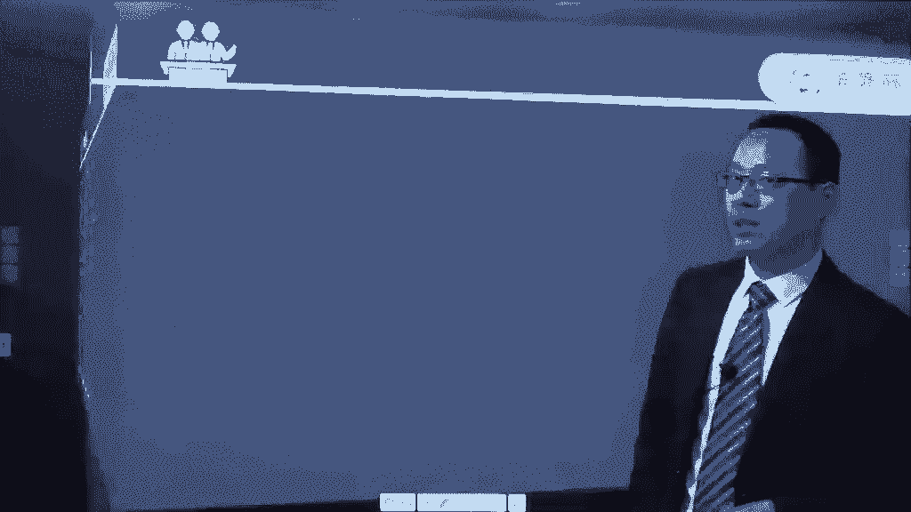

# 24年PMP项目管理考试，每天1小时，全套零基础通关视频免费观看！第六版114集全+考纲讲解+第七版37集全 - P42：0412结束项目或阶段 - 冬x溪 - BV13e4JeiEta

大家好，接下来我们一起看到的是，咱们这样一个项目整合管理知识领域中，最后的一个过程叫结束项目或阶段，好，我们一起来看一下啊，我们可以看到整个结束项目或阶段，这样一个过程呢，它的输入内容特别特别的多。

首先一个是项目章程，因为项目章程中会给到我们最初的那些要求，需求一些大的范围方向之类的信息啊，以及包括它的一个验收的标准，然后第二个呢是项目的管理计划，那项目管理项目管理计划。

他这边起到一个叫所有的组组件，也就是说项目管理计划中的所有的内容，我们之前知道，项目管理计划中包含的内容有两大块，一大块呢是这样一个项目的目标或者是范围，另外一块呢是为了达到这样一个目标，或者是范围。

我们要做哪些事情，要如何去做，那么在这边的话，他会告诉我们，就是我们这样一个项目到底做完还是没有做完，是需要去拿它来跟咱们项目管理计划中的内容，来做一些比对，然后除此以外呢，还有这样一些项目的文件。

也是作为一个重要的输入假设日志估算的依据，项目变更的日志啊，项目问题的日志啊，经验教训的登记册，里程碑清单，沟通计划，质量的测量的结果，质量报告，需求文件，风险登记册，风险报告啊，这个怎么说呢。

其实它是呃关于结束项目或阶段，他有几件事情要做，一个呢是啊，看我们该做的事情有没有去做完，对不对，另外一个呢是他还会要去关注，我们要做哪些经验或者是教训的这样一个总结，我们要去更新这样一个组织过程资产。

所以呢这里面会把所有过程中所遇到的，这样一些文件信息也都拿过来，来去帮助我们更好的去更新这样一个组织，工人资产，除此以外，还有一个很重要的讯息是验收的可交付成果，它来自于哪里呢。

它来自于确认范围这样一个过程，确认范围，这一过程的输出就是验收的可交付成果，呃既然都已经验收了，干嘛不久结束呢，事实上那个确认范围，他的验收是对于具体的一个一个，可交付成果的验收。

而咱们这边结束项目或阶段呢，它也会有一个验收，而这个验收呢更多的是一个走流程的这样，一个形式啊，嗯那么担任呢既然有这样一个东西，那么它最后它的输出呢，我们可以看到就是最终的产品，服务或成果的移交哎。

就是对应起来的，对不对，这样一对应啊，然后除此以外还有一个叫商业文件，这里面包含两个大的，一个叫商业论证，一个叫效益管理计划，那么商业论证呢，他重点关注的是说我们做这样一个项目的话。

最开始的这样一些商业需求，商业分析看有没有达到，而效益管理计划呢，它也是会关注，我们最开始所设定的这样一些效益，有没有满足到，有没有达到，而除此以外呢，如果说这样一个项目。

它是会涉及到跟甲方和乙方来相关联的，那么它会有一个输入叫做协议啊，协议会看我们呃，最初所设定的这样一些采购的协议，有没有满足到啊，包括说这样一次采购的话，有哪些经验啊，教训啊，下一次我们要如何做。

可以做的更好啊，他都是它的一个很重要的一个信息的更新者，然后除此以外呢还是采购文档，那就是跟他一起的啊，能够去帮助这样一个对于采购的审计呃，除此以外还有一个重要的是组织过程资产，那么组织过程资产呢。

当然是会帮助我们更好的去做好这样一个，收尾的工作了，结束项目或阶段，他说是整个是终结项目阶段，或是合同所需要做的这样一些活动哦，我们看一下它的工具和技术啊，一个是叫专家判断，我们已经看了我很多次了。

那么事实上在这一次上面的专家呢，可能更多的真的是一些专家啊，更多的是那种呃level比较高一些的这样一些人群，这样一些专家人员，他们会来对这样一个项目做判定，说啊已经是达到了。

或是哪些方面可能还有所欠缺之类的，第二个是数据分析，数据分析呢这边有这样四个，一个叫文件的分析，一个叫回归分析，一个叫偏差分析，一个叫啊那个趋势分析，首先文件分析呢，它更多的关注的是说。

我们可以通过在做这样一个项目过程中，所遇到的所用到的这样一些文件，来去更新咱们的这样一个经验教训库，或者是更新咱们的这样一个组织工资产库呃，而回归分析呢，它关注的是说我们的这样一些可交付成果里面。

哪些个变量它可能会有所调整的话，让结果会有些不一致的地方，或者会有些不一样，这样的话呢能够让未来做同样的事情的时候，可以有一个参考，可以做的更好一些，而趋势分析的话，当然就是说拿现在来去推测将来对不对。

就是看做这样一个事情的话，对未来有什么样的一些帮助，或者说有什么样的一些好处，而至于偏差分析，我们都知道啊，偏差分析都是拿那个实际执行的情况，和我们所计划的情况来做一个比对，看它们之间有多大的距离啊。

这样一个偏差是否是你可以去承受的，是可以接受的这样一个范围之内啊，当然还有一个是会议，我们在做验收的时候，不可避免的事，一定会有这样一个会议的，这样一个事情的发生啊，那么它的输出一个叫项目文件的更新。

这里面重点给到一个叫经验教训登记册，还记得它是来自于哪里吗，就是咱们这个章节中有一个叫管理项目知识，管理项目知识的输出，就是经验教训登，就是那个经验教训登记册，对不对，那么在这边呢它会有被更新。

就是我们在做项目的过程中，我们不只是在过程中要去更新这样一个经验，教训登记册，我们在做完以后，最后的时候呢也一定有一个大的更新啊，一定会是有很多的更新，就是千言万语在最后的时候哈。

一定要把它给整理出来啊，第二个呢我们刚刚已经有说过，比如我们做这样的做这样一个项目的话，最开始的目标就是要产生这样一个呃，产品服务或成果，那么最后呢做到了以后，把这个东西移交给需要的人员。

或是移交给需要的团队，第三个是要做一个最终报告，那么当然就是有始有终要做一个结论性的报告，说这样一个东西呃，做到了什么样，然后可能或者说有哪些不足的地方，最后是组织过程资产的更新。

那么组织过程资产的更新呢，它跟这个还是有所不同的，它是属于它的一部分，经验教训登记册只是属于组织工资产的一部分，它除了这个以外呢，它还包括所有的债项目管理的过程中，在项目执行的过程中。

所有遇到的那样一些文件文档，都算是它的这样一部分，好让我们一起来看一下整个结束项目或阶段啊。

他的一些相关的信息，首先可能会做一些主要活动呃，结束项目或阶段，首先他说是呃终结这样一个项目阶段，或是合同要做的这样一些活动，对不对，主要作用一个是存档项目或阶段的一些信息。

所以可以看到一些文件要做一个呃归纳整理，最后要存档，这个肯定是要做的对吧，然后要完成计划的工作，唉这个肯定是要去比对的，就是要去比对我们实际完成的工作，和我们所计划的有多大的一个差异，对不对。

还有一个呢是释放项目团队资源，来开展新的工作，我们前面也有说过，我们会有一个假设条件，我们假设做这样一个项目的时候呢，咱们是在一个甲方的矩阵型的这样一个，组织结构里面，那么做完项目以后呢。

这个项目团队的成员他要被示范掉以后，再回到他自己的这样一个职能团队里面来，然后再等待着下一个项目的召唤，所以我们做完以后呢，要去释放团队的资源，就是要解散团队，为了达到项目或者阶段的完工或退出。

所必须要做的活动，就是我们看要做哪些事情啊，一个是要去达到它的完工的这样一个标准，或者说是退出的标准，要做的活动，第二个呢是为了向下一个阶段，因为我们可能是做一个项目。

但是也有可能会是一个项目比较大的话，我们可能是会分到多个阶段来进行，对不对，那么可能是为了到下一个阶段，或是向其他的部门去移交这样一些东西的时候，我们可能需要做的工作诶，这也是一种，第三种。

说为收集项目或是阶段的这样一些记录信息，审核项目的一些成败，然后收集他的一些经验和教训，以及存档项目的一些讯息，就是我们过往过程中，所有的这些来来往往的文件，都应该被存档的信息所要去进行那些活动。

或者换一句话来讲，其实就说我们要做这些类似的类似的事情，对不对，就是我们要去做我们计划要做的事情，我们要去做，为了达到这样一个下一个阶段的话，我们可能要做哪些事情，以及我们要去做这样一些什么阶段审查呀。

然后经验教训啊，存档啊的这样一些相关的事情，以及为了关闭合同协议或是阶段的合同协议，关闭合阶段的合同协议，然后要开展的工作，就是如果说这样一个项目，涉及到甲方和乙方的话，那咱们是需要去考虑到诶。

这个协议他要求的事项，做完多少才算是关闭它对吧，以及还要做一个事情，是测量相关方的满意程度，我们呃在项目管理中，其实有一个很重要的一个参考指标，说这个项目到底成功不成功，其中有一点就是客户满意度。

如果客户满意度比较高，那么这个项目当然了，还有就是说它本身应该有的这样一些，应该有的这样一些嗯，必须做的一些行动或者活动，达到了，就是可交付的这样一个产品成果或者服务达到，另外呢客户的满意度也很高。

那么这个项目呢应该说就是非常的成功啊，呃这边还有一个特别要说明的地方，就是如果只是说把这样一些该做的事情做完了，并不表示说这个项目就结束了，通常我们还有一个关门的这样一个动作。

也就是说我们要演唱一首难忘今宵，这个春节联欢晚会才算是结了啊，就是只有必须经过一个正式的这样一个，收尾的过程来去对项目进行关门，才能够去真正的去结束它，诶我们这个要去注意了。

所以这是我们所谓的说要有仪式感，做项目呢要有仪式感，过生活呢也要有仪式感对吧，所以我们会有很多重大的节日啊呃之类的呃，在项目过程中也会有，包括说前面有个kick off meeting，开工会议啊。

这边会有一个收尾呀，会有个验收的会议呀，对吧好，在结束项目的过程中，虽然也需要获得发起人或是客户，对于产品服务或成果的一个最终验收，但是呢它是一个必须要做的流流程程序。

所以可以看到它跟前面的那个嗯确认范围，他们会是有不一样的，确认范围呢是去验收那些具体的可交付成果呃，看他到底是满意或者不满意，而这边呢是我们必须要走这样一个过程，走这样一个流程，它是一种形式上的验收。

而不是实质的技术性的验收，这个在哪里，在确认范围，还记得我前面说过那个记忆的七大原则吗，所以该记的地方你还得要记一记啊，该画的地方给画一画，所以是确认范围这样一个过程。

是去做实质性的这样一个技术性的验收啊，这边也写了啊，他已经在确认范围，这边已经就已经有完成了，另外呢提前终止，如果说有提前终止的话呢，那么我们也需要去走这样一个结束范围的，这样一个流程。

同时呢还要去调查一下，到底提前终止的原因是什么呃，当然了，就是说该付的账款要付掉，然后该移交的成果也要移交掉，然后呢，同时导致他发生这样一个事情的原因是什么，也需要去了解清楚啊。

这是咱们结束项目或阶段的一些主要活动，简单说到这边，然后我们接下来给大家分享两个呃讯息，这个呢在书上面呢不是一个必输的必须的内容，但是呢我们是做一个补充，让大家了解一下呃，我应该说加一个字叫选选择选呢。

呃一个叫行政收尾，一个叫那个合同收尾，我们简单看一下啊，行政收尾，他说的是为了使项目或是项目管理的工作，有一个正规的结束，来去收集整理分发和归档各种相关的资料，来正式的去确认他已经是合格了。

然后并且总结经验教训，来更新组织管机场啊，说了一句嗯，就是跟我们前面所谓的所谓的，其实说的是同一回事，对不对，也就是说我们要收尾这样一个事情的话，我们要做这样一些事情，我们要做这样一些相关的事情。

我们要做这样一些相关的事情，我们要做这样一些相关的事情，这是行政收尾，行政收尾通常在什么时候做呢，一个是在项目结束的时候要做，第二个呢是提前终止的时候，提前终止的时候也要做。

还有第三个是每一个阶段结束的时候，我们也要去做做这样一个行政的收尾，行政收尾可能要做的事情，一个是要做产品的核实，也就是说我们做这样一个项目，该做的部分是否有做到，该做的部分是否有完成。

或者说是否能够被接受到，第二个呢是财务的收尾，那么也就是说该付的账款是不是有结清呢，这也是我们需要去关心的，第三呢是要去更新项目的记录，也是我们在做项目的过程中，我们可能会有很多的这样一些相关的讯息。

一些什么业绩的记录信息啊等等，那么都需要去做一个记流程和更新，总结经验和教训，这是以备未来，对不对，帮助未来，当然同时它也是对于项目本身的一个评价，就说做这样一个项目到底做得好还是不好呀。

有哪些地方是呃取得了可喜的成绩啊，哪些不足我们下一次要做的更好呀之类的啊，这也是对他本身的一个完工后的一个评价，进行组织观资产的更新啊，当然了，就这些内容都应该会把它列进来。

成为组织过程资产更新的一部分，除此以外呢还包括了之前一些归档的各种资料，也都是咱们组织过程资产的一个部分，还有结束相关的这样一些工作关系，最后呢要解散团队，所以整个这样一个呃行政收尾。

其实跟咱们说的结束项目或阶段所要做的事情，其实说的是一回事对吧，但是它会跟有一个词有关联，但是呢也有区分开来，那你们就是叫合同收尾，当然这里也要写一个叫选啊，就是可选的了解一下合同收尾呢。

它通常是结束于采购的这样一个过程，就是在采购结束以后呢，我们通常会有一个合同收尾的这样一个动作，当然了，这个动作呢也许项目经理，你本身没有这样一个权限来去处理，但是很多时候有可能会发起人。

直接赋予你某一种权限，你就充当了被赋予的那个权限，而那个时候你你的角色其实不是项目经理，你是一个啊被赋予来参与做结束和呃，这样一个合同的这样一个工作人员啊，他指的是合同工作呃，结束这样一个合同工作。

进行采购的审计，采购审计是干嘛呢，采购审计单，就是指咱们这一次采购到底哪些地方做得好，哪些地方做的不好，然后如何如何啊，我们下一次可以在哪些方面有进步等等，就是这样一个事情啊。

结束当事人之间的这样一个合同关系，然后呢并且呢要将有关的资料做归档，其实我们会发现很多时候都是呃什么信息，重要信息都应该要被归档下来，这样的话呢下一次万一出现什么样一些情况，然后需要去回顾的话。

我们可以找到相对应的资料，以及下一次我们做事情的话，我们可以把上一次走过的弯路给绕过来走啊，行政收尾和合同收尾，他们是又有联系，又有区别，它们之间的联系是什么呢，首先他们联系是都需要进行产品的核实。

也就是说你做合同收尾的时候，也要进行这样一个产品的核实，唉这些产品到底是OK不OK接受不接受，都需要做总结经验和教训，就是做这样一次采购的话，或是做这样一个项目的话，都有哪些地方比较不错的地方。

有哪些地方是我们下次需要加强的地方，都需要对资料进行整理和归档，其实我们所有的过程到收尾的时候，都需要有这样一个就是整理这样一些内容，并去把它承担下来，以及更新组织过程资产啊，这是他们相同的地方。

而不同的地方呢是这样的，首先一个行政收尾，它是指针对各个阶段每一个阶段结束的时候，一个阶段一个阶段每一个阶段结束的时候，我们都需要做立即呢就是整个项目收尾的时候，我们也要需要去做这样一个行政的收尾。

而合同收尾呢，它是关注的是我们才签了这样一份合同呃，每一个合同需要做一次，并且只需要做一次合同收尾，也就是说我们可能在做这样一个项目的时候，可能会涉及到好多个不同的合同。

那么每一个合同要有它自己的一个收尾，就是表示说关于这个合同，这样一部分已经结束了，那打个比方哈，我们做这样一个项目，可能会需要去采购啊，十个不同的那个大的物件，那么这些物件的话。

有可能是一种定制化的物件呃，包括说要去做开发呀，做研发呀什么之类的啊，或者说是要去临时生产的东西，那么都会跟不同的单位来，签订了十个这样的合同以后呢，每一个合同在结束的时候，都要去进行一个合同的收尾。

但是呢整个项目最后结束的时候，有一个项目的收尾，当然也有可能说这个项目分到很多个，不同阶段的时候呢，那么就每一个阶段会有一次这样的，一个行政的收尾，从整个项目来说。

合同收尾它通常是会发生在那个行政收尾之前，也就是说它是会作为它的一个支撑的信息，先把这样一个采购的事情给了结了，然后再去做这样一个行政的收尾呃，如果以合同形式来进行项目的话呢，在收尾的时候。

通常是要先进行一个采购的审计和合同收尾，那么采购审计其实就是关于合同收尾，对不对，然后呢再去进行行政的收尾，他说从某一个合同的角度来讲的话，合同收尾中又包含了一些行政收尾的工作。

其实事实上我们如果你有仔细看书，你会发现呃，其实呢在咱们书上的每一个知识领域，就是第四章，第五章，第六章，一直到第13章，每一个知识领域中，在最前面都有这样类似的一句话说啊，在咱们这样一个拼搏指南中呢。

呃虽然说我们会把过程有一个严格的区分，有一个明确的界限和严格的区分，呃但是呢在实际的工作中，其实他们相互之间会有一种难以描述的，相互交叠的这样一个工作，也说都是可能会交织在一起，混在一起。

那么在这边的话，其实行政收尾和合同收尾它也有类似的，就没有办法说完全严格的去区分说啊，谁就是行政收尾，谁就是那个嗯合同收尾，你要知道是他们之间，本身就是为了这样一件大的事情来进行。

只是说大方向来讲的话呢，合同收尾是指跟这个合同相关的，跟这个合同该要了结的时候的这个内容，而行政收尾呢更多的是说这个项目要结束，或者说是这个阶段要结束的时候，我们要做的事情。

行政社会它通常是由主要的发起人，或是由高级管理层来给项目经理签发的，这样一个阶段结束，或者说是整合的这样一个结束的，这样一个书面确认，所以你看项目经理他是一个什么样的存在，它是一个被的存在啊。

被动的存在，也就是说你是被任命的，所以你最后呢你不能宣布这样一个项目结束，只能是由他们来宣布他们是谁，项目发起人或是高级管理层来宣布，而合同收尾呢通常是由买方，买方是谁，甲方啊，买方是甲方。

OK甲方的这样一个采购管理员，或者也可能是由一些其他的他们的项目经理啊，什么人员来去向卖方，卖方是乙方啊，乙方来去签发这样一个书面的确认哎，这是关于合同收尾的内容。

然后这边呢有一个关于项目收尾的一些活动，我这边列了两个，一个呢是以前书上面给到了一个，类似的这样一些活动，或者说是大家所普通普遍认为的，另外呢另外一个呢是一位项目管理专家，叫RITA的这样一个人。

他所列出的关于说结束项目或阶段的活动，而这些没有说对比哪个对哪个错，只是说在工作过程中，我们可以去参考一下，大概可能要做这样一些相对应的事情，我们简单看一下啊，首先一个是叫核实产品。

也就是说哪些地方哪些东西做的到底怎么样，做了没做做的，OK不OK然后呢要做一个正式的验收啊，通过或者不通过哦，我接受或者不接受对吧，然后呢要去收集这样一些记录，并且去更新记录和记录存档。

OK所有的过程中的一些互动的部分，都应该要被保存下来，所有信息都要去归档，然后要做一个经验和教训的总结，以及项目团队的话呢，我们还要做一个什么做绩效的考评，觉得大家哎最后要分奖金了。

分项目奖金的话怎么分呢，谁得10%，谁得20%对吧，最后会有一个庆功的活动，一个庆祝活动，当然这个很多时候就直接被盖掉了，是不是通常没有啊，呃你假装是有好了，然后最后呢需要去释放这样一个资源。

释放资源以后呢，他们可以去做下一个项目，可以进行下一个项目啊，而这样一个RITA他给的这样一个讯息呢，他说是，首先一个是确认已经按照需求完成了工作，其实跟那边是一样对吧，完成结束采购的工作。

OK那么如果说是有这样一个甲方乙方的话呢，要完成结束采购里面的工作，获得对于产品的正式的验收，诶这也是这边有的，对不对，关于验收以及完成最终的一个绩效的报告，那么这边诶我们这边有一个关于绩效的考评。

关于绩效的报告，也说你们做的到底好不好，然后每一个人的表现怎么样，然后整个团队的这样一个表现又是什么样啊，索引和归档记录的信息诶在这边啊，这样一些归档，这样一些讯息更新经验教训知识库，诶。

在这里经验教训总结移交完成的产品，那这边呢他没有说这一句话，但事实上我们都知道结束的话，他一定是有这样一个动作的啊，就是我们要去移交这样一部分东西，给到对应的这样一个组织，它可能是啊咱们这个团啊。

单位里面的其他的部门，也可能是一个其他的单位的是吧，最后呢是示范资源，所以这是看到这样一些讯息后，我们大致的可以去了解，无非是说那个要做的事情有没有做到，然后有没有被就是客户通不通过这样一个验收。

然后呢我们的这样一些过过往的一些文档，是不是要去存档，然后有没有总结一些经验教训，做这样一个项目的过程中，咱们每个人的表现怎么样，整个团队的表现怎么样，这样一个绩效要做一个考评。

然后把这样一个可交付成果要移交给对方，然后要示范资源，大概就是咱们要做的这样一个事情啊。