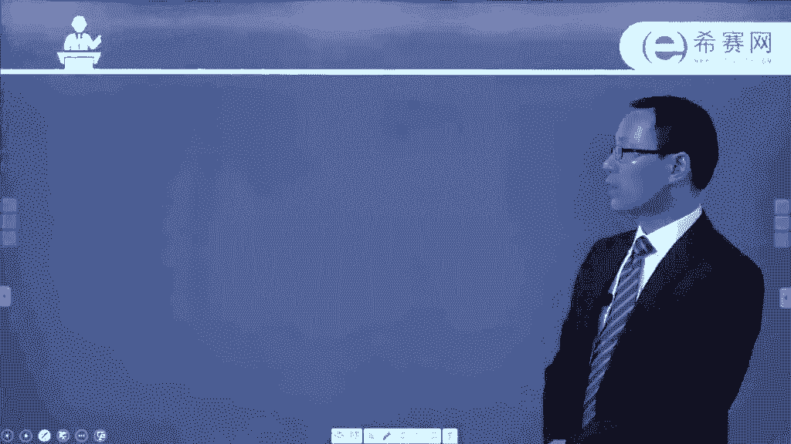

# 24年PMP项目管理考试，每天1小时，全套零基础通关视频免费观看！第六版114集全+考纲讲解+第七版37集全 - P90：0806项目质量管理核心概念 - 冬x溪 - BV13e4JeiEta

呃接下来我们看到的是关于项目资源管理，这样一个知识领域中的一些核心概念，事实上我想要说明一下，就是说我们前面的那些内容中，好多都是在这样一个什么核心概念呢，发展趋势啊，这些内容里面啊。

比如说对于前面的那些内容，你是需要有所了解的，我们这边呢就是把那些重复内容就已经去掉了，只把那些没有重复内容给展现了一下，首先项目质量管理，它需要去兼顾到项目管理和项目可交付成果，两个方面啊。

什么这是什么意思呢，就是说兼顾到项目管理，也就是过程的这样一个维度，对不对，而可交付成果说的是最后交付的这样一个，成果的维度，结果的维度，也就是说过程和结果都很重要，都是我们质量管理需要去关心的。

质量测量的方法和测量技术，需要专门针对项目所产生的可交付成，果的类型来定，也说不同的项目它产生的可交付成果不同，那么你用来做测试的方式和方法，可能会有很大的一个差别，无论是什么项目。

他如果没有达到质量的要求，那么都是不行的，都是会带来严重的负面后果，比如说我们前面有说了一个赶工对吧，赶工快速跟进，那么赶工的话有可能就让大家去大量的加班，如果让大家大量加班，让大家超负荷的去工作。

有可能会导致一些各种风险，导致什么员工有疲劳啊，出错呀，返工啊，这些的话都是一个很严重的后果，还有说为了抢进度，去仓促的完成预定的这样一些质量检查，有可能会导致检查有疏漏。

有可能会是有一部分重要的东西没有被检查到，那么项目质量管理呢，其实呃在不同的情形下出现一些质量问题，然后我们去响应他付的代价是有很大的不同，那这边给质量的管理做了一个梳理。

就是有通过有效性的递增的这种方式，来去排列五种质量管理的水平，首先水平最low的就是也是付出代价最大的，就是让客户去发现缺陷，我们说那个项目的质量的成本，用非一致性成本来衡量。

那么就说产生这样一些外部的非一致性成本，然后这种方式，然后我们来去管理质量，那么这个质量管理水平是最烂的，是最应该要去避免掉的啊，第二种呢是控制质量过程中，包括先检查和纠正缺陷，然后呢再去交付成果。

那这个过程中我们是去检查和纠正缺陷，我们前面已经有讲过，预防生育检查，检查只能够把已有的这样一些bug给找出来，是尽量找出来，还不一定完全能找出来，那么这种方式呢，也不是比较理想的这样一个状态。

所以它排在倒数第二，第三个通过质量保证检查和纠正过程本身，而不是做一个特性的特殊的缺陷，也就是说它会关注整个在实施过程中，关注这个过程，也是我们做了一个质量管理，做质量保证的本身，关注过程的话。

因为通过对过程的关注，所以呢它的结果往往会相对来讲会比较好一些，或它总体来讲他那个好的概率会大很多啊，它也能够更加的让客户满意，所以这种方式是比较可行的，第四个。

将质量融入到项目和产品的这些规划和设计中，这里面把它放到更前面去，放到规划和设计中，也就是说我在前期做质量规划的时候，我在做一些其他的规划的时候，我都会考虑质量这样一个维度的信息。

那么这个的话当然是更加好了，就是好上加好，对不对，然后到了最后一个，他说将整个组织类创建一种关注，并致力于实现过程和产品质量的文化，就是不断优化的这样一个感觉在里面，这个的话就已经是很难得啊。

就只是真的是把质量作为一个生命线来去对待，来，去把所有东西把它融入到你的日常的工作中呃，这是一个质量管理的一些核心概念，然后我们再看一下质量管理中的一些，趋势和新兴实践啊，我再一次说明额。

趋势和新兴实践书上的这样一些内容呢，有一些在前面已经有讲过了，我们就把它给不再重复讲，我们就只讲就是少部分啊，现在的质量管理方法中会力求缩减差异，然后交付满足既定相关方要求的这样一些成果。

那么它的趋势可能包含一个是客户满意，OK要说是我们需要去了解客户，他的这样一些期望，然后呢尽可能去评估，然后发现如果OK的话，我们要去实现它的这样一个期望，这是很重要的一个内容。

因为你最后做的这样一个产品，最后是要送到客户手上，是要去给他使用的，所以客户满意度是一个很重要的一个参考信息，然后第二个呢是持续改进，这个我们其实也有已经有讲过对吧，就是通过PDCA环的这种方式。

来去不断的循环，来去持续对这样一个项目的质量有改进，每一轮不说是一定要改进有多大，但是呢我们持续的在这样一个状态中，那么它早晚会变得越来越强，第三个是管理层的责任。

就是说管理层对于整个质量的这样一个情形，是有很大的一部分责任，甚至说超过了80%以上的责任，因为老板越重视这个事情就越好，做老板不重视质量就会也会比较马虎啊，因为本身的话。

你老板才能够给到大家提供这样一些资源，但我说的老板，他不一定就能说说是那个公司的董事长，就叫老板啊，就说是那个管理层，那些boss层好，还一个呢是与供应商的互利合作的关系，事实上现在这个社会。

很少有一个事情是你一个人单打独斗，可以做完的对吧，通常都是有一个很多人来去互助协作，才能够完成的，那么你跟供应商的关系，其实不是一个对立的关系，你们之间要去合作的话，能够让这样一个事情更好的去进展。

这是关于趋势和新兴实践。

然后我们再看一下关于裁剪，对于质量管理的裁剪呢，他需要考虑的因素包括这样一些，一个是政策的合规和审计，就是我们有哪些质量的政策和程序，我们在这样一个组织中，我们去做项目的质量管理的话。

可能会用到哪些工具和技术，这个的话我们是需要去考量的，那么如果觉得是完全不要用的，我们可以把它给裁剪掉对吧，裁剪其实是两个维度啊，一个维度是把过程直接给裁掉，就不需要这样一个项目的管理过程。

还有一个呢是把过程中的一些输入呀，工具和技术呀，还有输出啊这样一些内容给裁掉，就是根据你的需要，只选择某一些输入工具和技术，还有输出，这是两是两个不同的裁剪啊，第二个说是标准和法规，合规性。

是否存在一些必须要遵循的这样一些行业标准，如果是必须遵循的话，你肯定是不可避免对吧，这个的话作为一个重要的一些输入信息，持续改进的这样一个维度，如果说你的项目中，怎么样去做这样一个持续改进。

在组织层面上，还是在单个项目中做持续改进，你也是需要去考虑，那么对于你的裁剪也是有一些要求，相关方参与这些信息的话，其实说实在对我们来讲，只是有一个大致的印象啊，然后再看一下说关于敏捷适应性的环境中的。

这些要考虑的因素，因为整个敏捷的环境的话，他其实不断的去做一些新的需求过来，然后不断的去响应这样性的需求，不断去面对或者是拥抱这样一些变化对吧，所以他这边对于质量的要求，他是这样来说的。

他说敏捷方法呢要求多个质量和审查步骤，贯穿在项目的整个过程中，而不只是命令在结束的时候才执行，也就是说我们其实可能说是每一轮迭代的时候，每一轮的时候，我们都要有一个完整的这样一些讯息。

就是包括去做管理质量啊，去控制质量啊，都要去做循环回顾，定期的检查质量过程的一些效果，寻找问题的根本原因，这都是质量的东西啊，然后去建议实施新的这样一些质量改进的方法，这还是质量管理的内容啊。

后续回顾会议评估实验的过程，然后确定是否可行，是否应该技术以以及做出一些什么调整，以及啊或者直接弃用，这都是质量管理中的内容，你可以看到它有一个词叫循环回顾，这些东西定期做检查呃。

为了促进频繁的增量交付，敏捷方法，关注于小批量的工作，尽量纳入到尽可能多的这样一些交付成果，那么也就是说我其实每一批的这样一个成果，我都需要去做这样一个控制质量的过程啊，我们我们在后面会看到。

就是控制质量呢，是对于这样一些可交付成果来去做检查，看质量到底过关不过关，所以但凡是在这种敏捷性的方法中的话，其实很多事情，原来是说在某一个时间段做的事情，现在是从头到尾一直要做。

一直一直不断不断的去做。