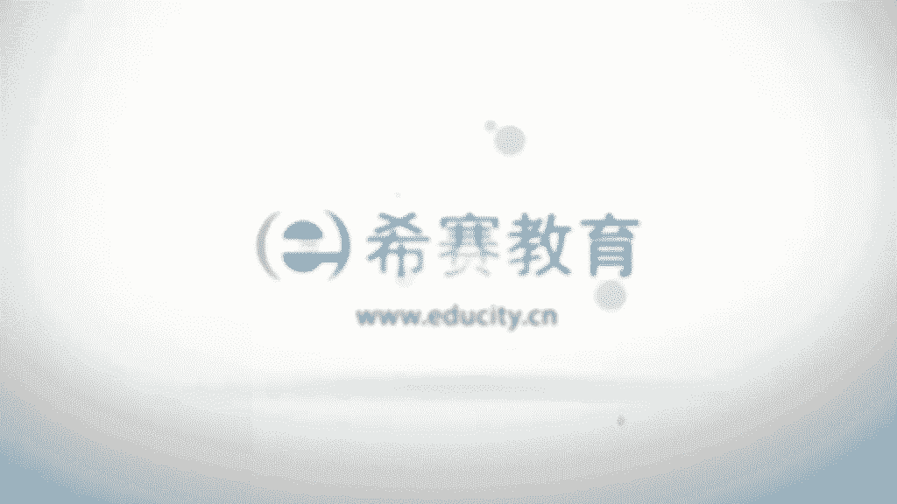

# 24年PMP项目管理考试，每天1小时，全套零基础通关视频免费观看！第六版114集全+考纲讲解+第七版37集全 - P105：0909建设团队工具与技术 - 冬x溪 - BV13e4JeiEta

接下来我们一起看到的是，建设团队这样一个过程，它的工具和技术，首先看到一个叫集中办公，那么集中办公看这个名字我们也知道啊，顾名思义就是把大家放到一起来工作，对不对，他说是把许多或者说是全部的这样一些。

最活跃的这样一些人员，然后放到一起来去，安排在同一个物理地点来工作，那么这个最大的好处是什么呢，一个是大家团队凝聚力能够得到提高，第二呢是他们沟通和互动会比较简单，这样的话就是因为沟通导致的那些原因。

在这里就基本上不太会再出现了，所以有的时候大家可能会发现说啊，有些项目组他就是征用了某一个办公室，说啊我们可能从几月几号到几月几号这么的呃，30多天或40多天，我们要一直使用这样一个办公室诶。

因为进入了这样一个办公室以后呢，大家都在这样一个办公室里面，每天去办公，大重点聊的都是这个项目上的事情，它的进展会更快对吧，包括集中办公，其实在软件行业里面，还有一个比较常用的叫做封闭式开发。

就是当使用封闭式开发的时候，大家就一起在某一个呃，那个同一个物理地点朝夕相处，这样的话呢就就专心的做某一件事情，它的效率也是会有大量的一个提升好，然后第二个工具呢叫虚拟团队，我们其实前面也已经有看过啊。

虚拟团队它还是有很多好处的，它是可能会使用不在你本地，但是呢那些人他技术更熟练的这样一些资源，可以用降低成本的一些方式，因为大家不是你的这样一个团队，成，那个就不是说天天得让人来去坐班的这种方式，对吧。

还有一个呢是能够去减少出差以及搬迁的费用，因为很多时候有些项目，他那种差旅成本也是非常的昂贵的啊，那么用这样一种虚拟团队的方式，能够去让你这样一个项目比较好的去推进下，去，拉近团队成员和供应商啊。

客户啊，以及其他一些重要相关方的这样一个距离，虚拟团队，他利用的技术来去营造在线团队这样一个环境，就是很多时候，我们可能会用这种网络的这种方式来去，有互动对吧，其实包括咱们现在的课堂。

当然我现在是在做录这样一个课程啊，咱们有直播课堂对吧，那么直播课堂，其实我们是一个虚拟课堂的形形式呃，大家感觉好像老师其实也好像在你的旁边，在这边一起来讲课，你问问题的话呢，我们也会做一个响应对吧。

就是这样一个关于虚拟团队，他是有它的一些好处的，然后再看它的工具和技术，还有一个呢是沟通技术，那么沟通技术呢，他说在解决集中办公或是虚拟团队时候的，那个建设方面的话，沟通技术本身是至关重要的。

它有助于去啊，为集中办公团队营造一个融洽的环境，以及促进虚拟团队，他们能够去更好的相互理解，因为事实上人和人之间呵呵，我们说有人的地方就有江湖啊，如果不能够很好的去互动和沟通的话。

大家都不知道对方在想什么，就有很多的疑惑，很多的这样一个误解和误会，是一个很麻烦的事情，而项目的话呢是，我们希望大家能够去为着同样的一个目标，去努力去奋斗，那如果说彼此心里面都有一些嫌隙的话。

这个是奋斗就不好说了，对吧好，第二个工具呢叫做人际关系与团队技能，那人际关系与团队技能呢这边又说了很多个，首先应该是冲突管理，那么冲突管理我们会单独来讲啊，专门会讲冲突管理。

我们会在呃下一个过程管理团队的时候来去讲，然后呢是影响力，就说我们通过一些影响力，能够去让别人更好地做一些事情，发挥你的影响力，你知道最好的影响力的方式是什么吗，就是你变得更牛逼。

当你真的是变得更牛逼的时候，通常你的影响力会扩大，会扩大，当然除了牛逼以外呢，另外还有一些其他的因素，这个的话你得要去慢慢的去钻研了，呃第三个呢是激励我们这个人和人之间的话，其实人是需要被肯定被鼓励的。

被激励的啊，那么使用一些激励的方式，也是能够更好的让大家去前进，还有呢谈判我们前面其实也看过，说谈判呢是找职能经理去谈判对吧，那么在这样一个项目执行的过程中，你可能也需要有一些谈判的这样一个场场合。

场景去聊到一些事情，然后是团队建设，团队建设估计是你最熟悉的了对吧，就是大家一起去吃吃喝喝，去玩一玩之类的，就是通过这种非正式的这样一些方式来去，团队建设，能够去让大家呃。

比如说在忙碌紧张的这样一个工作环境下，能够放松下来诶，就是相当于是给内心充点电，对不对，同时呢人和人之间在一起去放松的时候，彼此也会有更多的一些，除了工作以外的一些话题去聊，这样的话呢。

彼此之间的这一个距离感又会更加接近一些啊，所以有的时候可能会开办各种活动，比如说是那个周末的一些party呀，酒会呀，嗯这种就是出去搓一顿呐，撸个串呐，洗洗脚呀，都上啊。

都是我们的这种团队建设的这样一种一些方式，对吧，有人喜欢去什么唱K之类的，曾经我也是麦霸，哈哈哈哈呃，团队建设在前期那是必不可少，但是它是一个持续的过程，因为刚开始的时候我们知道刚开始形成阶段。

然后会到一个震荡的阶段，我们通过这样一个团队建设的方式，能够让他比较快速的去走过，这样一个震荡的阶段，到一个一个啊正规的阶段对吧好，我们再来看还有一些工具呢，一个是认可和奖励，那么在项目的进行的过程中。

我们说需要对成员的一些优良行为，来做任何奖励，诶，注意哦，嗯发现国外的人，他的这样一个处理方式，和国内的人的处理方式还有点不相同，他关注的是什么优良的行为，OK他不是说要奖励这个人。

而是奖励这个人的好的行为，好的行为主错或者是一些一些结果，而不是说啊这个人有多么的优秀，而是说他做这样一件事情做的不错，因为事实上呢呃人和人的确是有很大的不同，但是呢我们重点关注的是说这个人。

他在某一个层面上，某一件事情上或者某一类事情上，他的一个表现，最初的奖励设计计划是在规呃，规划资源管理中就编制的，只有能够满足被奖励者的某个重要需求的，这样一些奖励才是有效的，这个怎么说呢。

呃就是说嗯有一些人，他对有些东西他不是很在乎的话，你给的再多，他也不会，他也i don't care对吧，如果说刚好你打中他那个要的点就不一样了，比如说现在有很多人会说啊，九零后很难管。

那么到底为什么说九零后很难管，其实可能是因为他们的生长环境跟八零后，七零后的生长环境不相同，他们更加会崇尚这样一些自由，然后有一个内在一个被认可，被是被肯定的这样一些维度，然后是自我成长的这些维度。

可能会比一些其他因素要更浓一些，所以你要关注到他自己所喜欢的那个点的话，你会发现他其实还好，也能够比较好的去配合你去做一些工作对吧，在当然了，这是一个很大的话题，事实上不是一句两句说得清楚的。

然后在管理团队建设的过程中呢，他说可以是正式或非正式的，做出一些奖励的决定，最便宜的奖励是什么，拍拍肩膀说唉那个小伙子做得不错对吧，及时去肯定对方，很多时候人是需要被肯定的。

当然不是说你一天到晚去拍别人肩膀，这样的话显得他太假了，事实上呢就说在适当的时候，我们去给予别人一些肯定，这是很有价值的，当人们感受到自己在组织中的价值的时候呢，那么他就可以通过获得奖励。

来去体现这样一种价值，诶这是一种载体，看到没有，这个奖励是一种载体，能够让他知道自己真的是有价值的，是一种载体啊，有的时候嗯比如说有一句话，别人说是那种嗯，不要跟我谈理想和我的理想是不工作对吧。

就是真正的那个好的老板，他其实会愿意跟你谈钱的，因为钱是一个载体，它能够体现你的一些价值，先有钱，然后再有这样一个理想，这种方式的话诶就齐了啊，呃通常情况下，金钱是奖励制度中的一个有形奖励。

但是呢不是说所有的每一次有形奖励，都管用对吧，尤其是比如说你像在以前，我在北京工作的时候呢，有一些土著，有些同事别人有N多的资产的情况下，然后跑过来，每个月拿那么几千块钱的工资上班。

他其实在乎的不是这点东西，他有他更多在乎东西，他到底在乎的是什么呢，有些人估计是知道的啊，那么除了这样一个有形的奖励以外呢，事实上还会关注一些无形的奖励，包括说成长的机会，包括说获得一些成就感。

包括说获得一些赞赏，以及或者说专业技能方面有一个提高以后，能够去迎接更多的挑战，唉这些都是不同人，他会有一些不同的追求，所以我们有的时候是，其实是需要去跟别人去聊天，为什么说项目经理要花80%。

甚至85%以上的时间，去跟不同人去沟通和互动，一方面是要聊正经事，一方面也可以聊一些非正经事啊，可以去知道更多的讯息以后呢，你可以有意识的去给到对方，他所需要的部分，项目经理应该在整个项目的生命周期中。

尽可能的去给予表彰，而不是等到项目完成的时候，这个很重要，就说有些事情它是有个时效性，你当时做了诶就很管用，过了以后再做，别人就说是黄花菜都凉了啊，他都已经不太记得这样一个事情了，那就是没有意义的。

这是关于这样一个认可和奖励，然后还有一些工具，一个呢教培训，我们前面其实也说过，培训是一个能够最快速的，让大家有成长的这样一种方式，对不对，他是，其实我甚至觉得，他是一种付出代价最小的一种方式。

就看上去付出了一点点钱，一点点时间，但是真的是相比，如果说在工作中犯了一个什么样的错误，然后绕了一大圈那个代价，这个已经是极小极小的啊，培训包括提高团队成员，他的一些能力的全部活动，OK可以是正式的。

也可以是非正式的，包括一些课堂的培训诶，比如说像现在对吧，在线的一个培训，OK然后计算机的辅助的培训，在岗的培训就是工作嗯，在工作中，然后由其他团队成员来去给你做一些培训，这些都是OK的。

如果团队成员缺乏必要的管理或是技术的技能，也可以把这种技能的培养作为你工作的一部分，作为你这样一个项目工作的一部分，应该要按照资源管理计划中安排的，计那个计划来去实施这样一些预定的培训。

有的时候尤其是我们很多员工，他到了就是比如说像现在的员工，他其实没有那么急切的说，看重这么一点点小钱的情况下，他其实会更愿意说，你如果能够给我提供一些培训的机会，我就啊觉得很很enjoy。

包括说可能会要出去呃，开一开眼界呀，看一看不同的世界呀，看一看不同的那些老师的培训的东西对吧，都是一个把它当成一个福利来对待，也应该根据管理项目团队过程中的一个观察，交谈和项目绩效评估。

来开展必要的这样一些计划外的培训，也就是说根据实际情况来呗，有弹性对吧，你发现什么样的一个情形，缺少一些些什么东西的时候，你就去开展一些相关的培训的事情啊，事实上我自己呢我比较喜欢做这样一个东西。

做这样一个事情，有的时候在工作中的过程中，然后干着干着我发现就不会是这样的一个情况，然后我就忍不住诶，就开始去整理一些东西，然后去跟别人去做一些分享，因为本身呃有些人是比较愿意去分享。

有些人是不怎么愿意去分享的，像我这种就是比较爱分享的这种，因为我始终觉得给别人分享的时候，对我自己也是很有价值，很有帮助的啊，不是说自己多么的大公无私，而是说在这个过程中，我是一个利他的行为。

同时也在利己呃，然后培训的成本，通常应该要包含在项目的预算中诶，哎我们在前面做估算的时候，在制定预算的时候，你会发现把这一个东西也要加进来啊，或者如果增加了技能，有利于未来项目的话呢。

可能由执行组织来承担，就说可以由那个整个大的这样一个机构组织，来去承担，但是呢，也可以是由这样一个项目组本身来去承担，就根据你的需要来培训，你可以是自己请讲师，也可以是找外面请讲师。

比如说像以前曾经有一个时间段里面工作，我们好像是在每个礼拜四的下午，和礼拜五的下午四点钟，然后我们就会有一个讨论会，然后就大家就可能某一个人员工，就会把一些东西整理了以后跟大家分享。

这样的话每个人轮一次，一轮就轮了几个月下来对吧，呃然后分享的时候也不是他一个人在讲，然后大家再去讨论和交流，我觉得这种方式其实也是比较能够，有利于大家一起来进步的。

并且呢能够去练就大家这种分享的技能和心态，挺好的啊，然后还有一个工具呢是个人或团队的一个评估，个人和团队评估的工具，能够让项目经理和项目团队的洞察，他们的一些优势和劣势，也就是说大家当下的这样一个情形。

那么这样一个个人和团队评估的，这样一个工具呢，能够让项目经理更好的去知道，大家的一些偏好呀，愿望呐，以及如何去更好的来去跟别人去打交道，那这个工具有很多种不同的工具啊，什么态度调查，专项评估。

结构化的反弹能力，测试，焦点小组等等这些工具，事实上这些工具好像我都没怎么用过啊，可能是说他加了一些专业的名词，根据你的需要来，事实上呢就是我们每个人都会心里面有一杆秤，对不对，都会去判定呃。

我当下的这样一个项目团队的这样一些成员，这些小伙子这些小姑娘她的表现怎么样，我心里面肯定会有一个想法对吧，然后当他当觉得他可能在某些方面，需要去加把劲的时候，我们就可能会哎来聊一聊，然后去互动一下。

可能是这样的一个情形，那么通过这样一些评估的话，其实是能够得到一个结果，结果呢会是一个评判，同时我们在项目结束的时候，不是要给大家发奖金吗，项目奖金的话可能也是这一，这在这一部分也是有一些参考的啊。

好然后再来看到是团队绩效的评价，这是他的一个输出，那么建设团队输出中，团队计要评价呢，是说我们应该要对团队成员有一个有效的进行，正式或非正式的评价，有效的团队建设策略和活动，可以提高团队的绩效。

从而实现项目目标的可能性，那么这样一些有效的评价，你看一下包含这样一些内容，一个是个人技能的改进诶，然后从而使得他能够去更好的去完成任务，更能够去胜任这些工作对吧，一个是团队能力的改进。

就整个团队成员能够更好的去胜任，这样一些工作，能够去完成一些任务，以及团队成员离职率有下降，呃事实上在不同的行业里面有不同啊，比如说在IT行业的话，这个离职率其实一直都是还唉，一直都会有人进进出出哈。

我一直都记得我第一次有人离职的时候，我哇内心里一个难受啊，后来看多了以后也就习惯习惯了啊，还有一个是团队凝聚力的加强，能够使得团队成员能够去公开，公开分享这样一些信息和经验。

我觉得这个呢其实你可以用这种呃，一个团队的行为意识来去做到，比如说就像我们之前有曾经有过的，就是每一周的定一个时间，大家一起去交流讨论和分享，发现还比较有效果啊，觉得比较不错。

当大家觉得分享是一个常态的时候，他就不会觉得这个事情有多么有多么夸张，多么难呃，通过对于整体的绩效的评价呢，项目团队能够去更好的去识别出，所需要的一些一些什么特殊的培训，什么辅导，然后协助这样的话呢。

我们可以有意识的去给到他对吧，嗯比如说像我们自己的话，现在现在我从所从事这样一份工作，是培训讲师，那培训讲师的话，其中有一个很重要的技能就是做PPT，所以我们发现诶做PPT做的好惨，好菜啊。

做的是好丑啊啊，专，就专门会去找一些这种课程，来去给大家做培训对吧，事实上你在自自己做的这样一个过程中，不断的去做一些调整。

