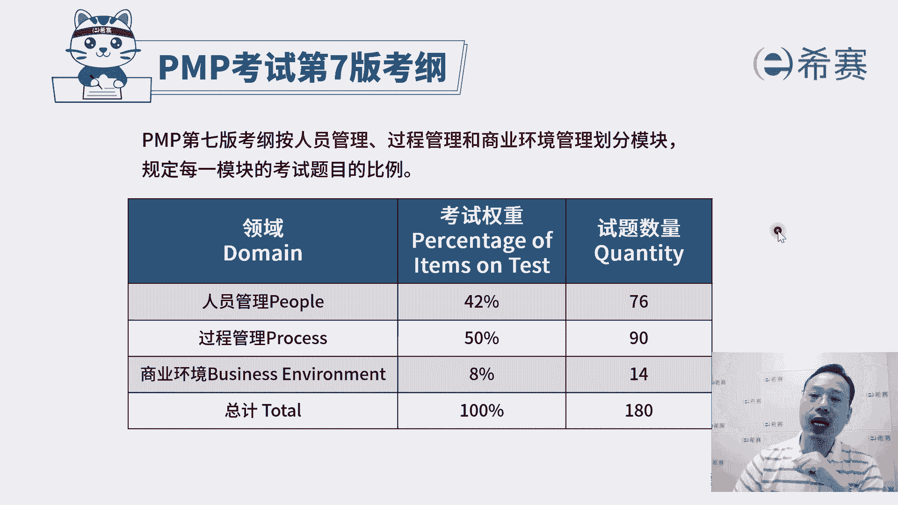
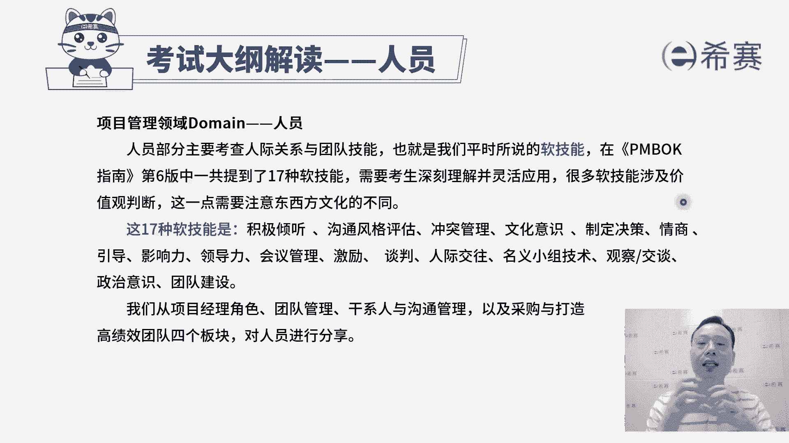
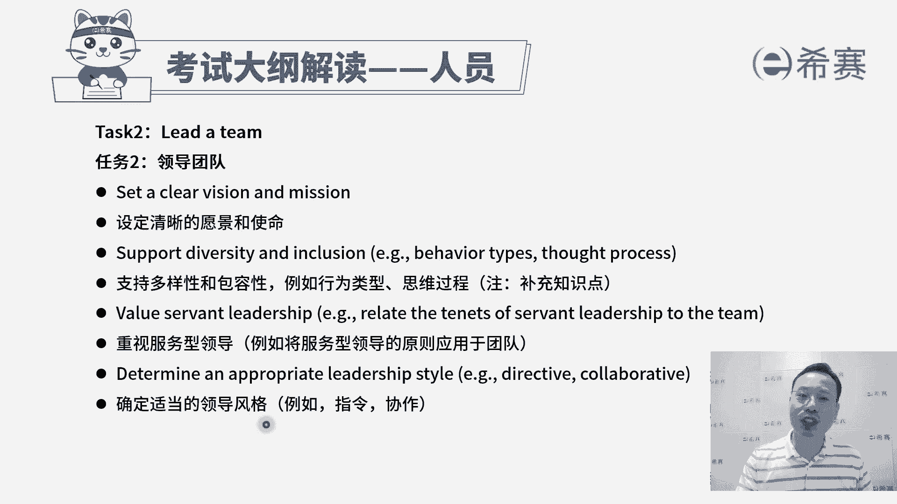
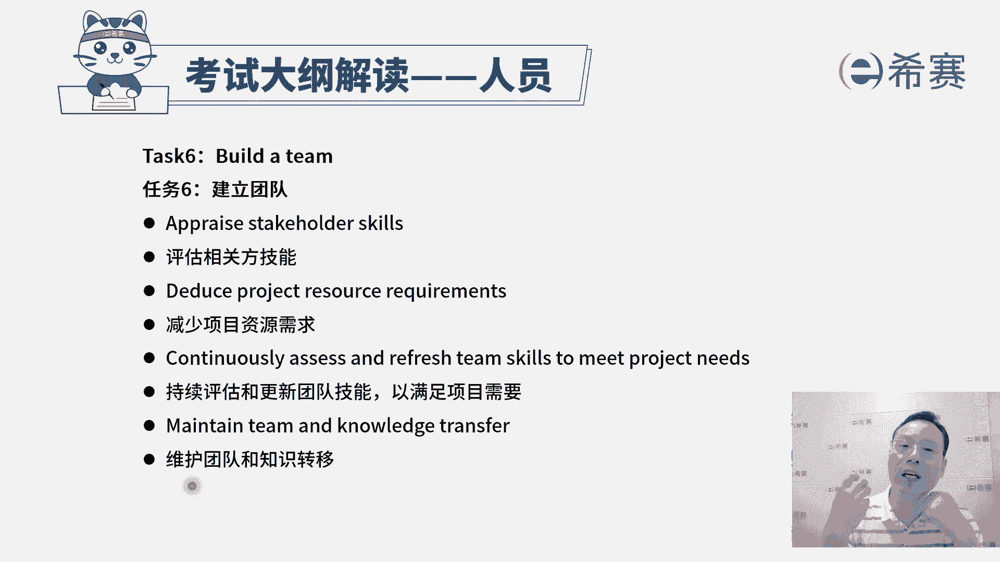

# 24年PMP项目管理考试，每天1小时，全套零基础通关视频免费观看！第六版114集全+考纲讲解+第七版37集全 - P119：第七版考纲之人员板块A - 冬x溪 - BV13e4JeiEta

大家好，我们一起来看到的是PMP考试第七版考纲中，关于人员的这个板块，那整个第七版考试呢，它目前是按照人员的这个板块占比，占到42%，有76道题目，然后过程呢占到一半，有90道题目。

然后还有商业环境占到8%，有14道题目，我们来看一下整个关于人员这个板块呢，它的这些考纲一共有14条task。

整个考纲，他其实讲到的是关于人际关系与团队技能，就是我们的软技能，包括沟通能力啊，倾听的能力啊，冲突处理的能力啊，情商啊，影响力，领导力，谈判的能力，然后观察交谈，政治意识，团队建设等等这些。

那我们重点会是按照这样一个项目经理呀，团队呀，跟干系人呐。

还有沟通这几个维度来去考虑，我们一起来看到，首先第一个任务task叫管理冲突，我们经常会讲到说有人的地方就有江湖，就有是非，那有冲突是在所难免的，我们得要了解一下到底是为什么会有这样冲突。

冲突的来源有哪一些，以及目前冲突的严重程度是什么样子，然后呢，再去分析一下可能导致的这一个背景是什么，再来去找到一些可能的解决方案，可以去评估一下解决方案，推荐解决方案，然后去协调解决方案。

这个呢我们在冲突管理这一段，已经是有学过了啊，这是冲突管理，这是我们需要去了解的，那人员的第二个内容叫领导，团队，其实也就是有领导力，所谓领导力我们前面也讲过，说兄弟们给我上。

兄弟们跟我上都是一种领导力，就是能够去引领别人，来去完成工作内容的这样一种能力，那你要去引领别人，首先你自己要有一个清晰的目标，所以是设定清晰的愿景和使命，这样才能够去激发大家。

然后第二个呢支持多样性和包容性，也就是说大家可能是各不相同的，其实可能每一个人，他的这样一种行为习惯和行为处事，那那个唐僧他要带领着像猪八戒这样的人，孙悟空这样的人，和沙和尚这样的人是完全不一样的人。

那你要去领导不一样的人，包括他们这种行为呀，想法呀，习惯呐，能力啊各不相同，第三个要重视服务型领导，也就是这个是我们在后面讲，敏捷项目管理的时候，会展开来讲的一种叫仆人式领导，或叫服务型领导。

也就是领导，你不是那个高高在上的，来去发号司令的这样一个角色，你更多的是能够去为团队提供支持和帮助，让团队更有效的去做某些事情，把这事情往前推进啊，会更加重视服务型领导，其实在敏捷中会重点强调好。

最后一个要确定适当的领导风格，嗯就是其实你在不同的场景下，你管理不同的群体，你这种领导风格一定是要有所调整，你去管蓝领工人和管这些白领阶层，你管那种文化工作者和管这些程序员，他的管理方式一定是不相同的。

你需要去有效的调动大家的积极性，来去参与一些事情。

来去解决事情，所以这是你要有这个领导力，能够去领导团队，并且呢在整个过程中，你需要去懂得一些关于激励因素啊，激励模型，因为其实我们在前面已经是学过了很多，激励模型啊，就是这些激励模型它不相同的时候。

他的这种操作方式是不一样的，你能否去激发激励，鼓励大家来做某些事情，并且呢我们大家一起去共事的时候，你也要善于去利用这样一种所谓叫做团队章程，或者呢叫社会契约，就团队章程。

社会契约它就是我们经常会讲到一个词，没有规矩不成方圆，那这个呢就是我们的团队规矩，咱把规矩列好，不管说是共同共事的规矩，沟通的规矩，产生冲突的规矩，汇报的这个制度规矩，奖励的这样一个制度规矩。

惩罚的制度规矩，我们提前把这东西列好，并且有效去落实，这是去激发激励和影响团队，然后再有一条叫分析团队成员和相关方的影响，哎我们需要去了解大家的这个，比方说他的权利呀，他的利益啊，他的这些个影响力啊。

他会看重什么东西啊，你对他有越多的了解，那么你才能够越有效的去打动他，去引领他，去影响他区分各种方案，以领导各种团队成员和相关方案，其实也就是说我们的这种领导方式，针对不同的人。

你的这种管理风格和领导策略方式是不一样的，以及针对同一个人，他在不同阶段的时候，他在作为一个新手阶段的时候，作为一个正在学习的阶段的时候，已经是比较熟练阶，段时候已经是可以独当一面的时候。

我们都是会有一些不同的方式和方法，来去领导他们，引领他们好，这是关于领导团队，其实也是你的领导力好，第三个任务呢叫支持团队绩效，其实也就是说你要有一些好的方式和方法，能够去让团队成员成长起来。

并且它到底有没有成长，你需要有一套这种度量的指标，来去测量它是不是真的成长了，所以第一句话叫，根据关键绩效指标KPI来评估团队成员的绩效，看每一个人他的这样一个行为模型啊，能力模型啊。

各方面是不是达到一个我所期待的，这个状态和水平好，然后是支持并认可团队成员的成长和发展，也就是说团队成员他如果在这一岗位上，他还不足的话，他需要去弥补某些技能才能够去完成，胜任的话。

我们需要去帮他来找到这些东西来支持他，让他去成长，并且呢他如果真的有成长，我们也要对他表示认可，还有就是他为这个团队做出的贡献，我们也要去认可他啊，去支持他，确定适当的反馈方法。

因为他可能在做事情的过程中，我们其实需要很多的这种正向反馈对吧，我们自己需要一些正向反馈，那同样的我们的团队成员，他也需要一些正向反馈，他做的不好的时候，我要告诉他诶你可以怎么弄，就变得更好。

他做的好的时候，我们说诶这样做非常好，你继续加油，可以做的更好，类似这样一个方式，我们需要有一些反馈的机制，需要给到他反馈，其实这也是在给他指路指路指路啊，给他导航，那还有一条呢是核实绩效的改进。

就是他如果说目前的这个表现情况，有点差强人意，有什么样的一些方式和方法能够去优化改进，提升，让大家更有的动力以及能力更强，能够更好的去往前冲，这都是你作为项目经理，你所需要去关心的。

这是关于支持团队绩效，然后第四个任务呢叫授权团队成员和相关方，你要知道你在什么情况下，你才舍得授权，一定是他做的还不错，所以我们有一个基本认识，就是当我们想办法让他提升起来，并且让他做的还不错的时候。

我们才会去授权他去做一些事情，对吧好，您看，首先是围绕团队优势进行组织，什么叫围绕团队优势，经营者组织其实就是这个团队，他如果在某一方面很强，那么在这个维度上，我们是可以授权让他去做这个事情。

他如果说是在这方面很弱，那这个事情上呢，他其实还是要受管控，受控制的对吧好，还有第二个呢支持团队任务的责任，什么叫支持团队任务，责任就是他们是自我组织，自我管理，这个呢我们在敏捷中会看的更加仔细一点啊。

大家是自我认自我认领任务，自我组织，自我管理，你不要去微观管理，你要避免微观管理，你要管大条，管大内容，我只管给你一个，就是我给你定一个目标，然后我要一个结果，你只要做到了都是OK的。

过程中我可以适当的去考察，但是我不会盯的那么细，那么细好，这是支持团队的这个任务责任，还有一个呢是评估任务责任的这个证据，其实也就是你要有依据，你说他表现的好，你有依据，你说谁表现的还不太够。

你也要有依据，你要有数据说话，我们前面学过一个叫政治分析对吧，拿正直来去看待这个人的这样一个完成情况，也是可以的一种方式啊，还有就是说确定并赋予不同等级的，这个决策权限，他的水平是这么高。

那么你就可以给他多一些这种权限，让他去自主自主裁量，他的水平是这么高，那么我给他自由裁量权就少一些，他如果水平在这里，什么也不要自己做决定，什么东西都听我的，我告诉你，这里我指哪，你打哪就可以了对吧。

我按按我的要求来进行就可以，所以不同的水平，不同人员，你的这种授权方式是不一样的，以及同一个人他在不同的阶段的时候，你的授权方式也是不一样的，然后看到第五个任务，确保团队成员得到充分的培训。

以及确保相关方得到充分的培训，相关方也叫干系人，首先就是你要去知道团队成员，他并不一定说一定，都能够满足我们这个工作的需要和要求，他如果不满足怎么办呢，我们需要去把那个能力给拉上来，拉起来怎么拉。

有一种最快的方式就是培训，那我们先要去了解他需要一些什么培训，他需要一些什么样的技能和能力好，如果说发现或明白了以后，接下来就是根据这些要求，我们来去定一个培训方案，比方说很多企业他会去找席散来去啊。

做这样一个团队这个成长的培训方案，那我们也就是罗老师也会经常去一些企业，给他们做一些项目管理培训呢，产品管理培训哪啊，这些就我们还有些很多老师，去给他们做各种技能培训，那你有这样一个培训的需求。

并且是基于这个需求来定一个培训方案，然后接下来就是去找到对应的资源，这个找到对应的资源，它不一定是项目经理自己亲自找，甚至说不一定是项目经理亲自来给大家培训，可以亲自做，也可以是寻求其他的帮助。

找PMO啊，那找公司的人力资源部啊，呃找这样一些个团队来去获取资源，可以是公司内部的这样一些内训师，也可以是外部的这样一些培训师，也不一定是非得是内训师，也可以是公司内部的一些其他的工作人员。

他不一定是专门的工类型师，他就是普通的工作人员，但他在这一方面做的非常好，他也可以给大家提供培训，这都是可以的啊，当然也可以去从外部找人都是可以的，并且呢我们培训，其实你不能够是光是靠这一个培训。

因为有的时候如果没有考核呀，很多人他就不认不认真，所以呢这还有一个叫度量培训的结果，我们需要有一些考核，需要有些考察，来看大家的这个进展情况，看到底做的怎么样啊，这是第五条。

要去确保团队成员他得到充分的培训，DANA这个充分这个词，你不要去非得叫钻牛角尖说啊，我怎么样才叫充分，他的意思就是说，我们要想办法让他能够达到这个工作岗位，所需要具备的技能和能力，尽量让他达到。

是这个意思啊，然后呢再有一个叫建设团队，那建设团队其实我们让他去达到，这也是建设团队的方式之一，但是建设团队中还包含了什么呢，就是人和人之间，那么这里你看，首先第一个要评估相关方的这些技能。

或者说团队这些技能，第二个减少项目资源需求，嗯也就是说如果说我们的技能水平越行的话，那我可能就不需要那么多人来去做，对不对，我水平不太行的时候，我觉得需要更多的人来去完成，那么我们团队成员开水平。

我们要去评估一下，如果达到某种状态或水平的时候呢，可以适当的去减少一些对应的资源，把这个资源释放出去，可以去做一些其他的事情，并且呢要持续评估和更新团队技能，刚开始小五进来的时候呢，他是一个初级工程师。

现在呢他已经成长为一个中级工程师，他已经可以去负责好多好多事情了，他就不需要专门有一个师傅去带着他呀，还需要嗯他一天只能做一点东西呀，他可以甚至两个小时就可以完成某些事情对吧，那么我们要不断去评估。

这样的话呢，对他的这一工作任务的分配也会有一些调整，还有就是维护团队和知识转移，这个什么意思，就我们后面会其实专门也会讲到，就是他在做这个事情的过程中，一定会有一些经验和教训，那么好的经验要传承下来。

要分享出去，坏的教训也要留下来同步出去，这样的话，避免下一个人在这个类似的事情上栽跟头，以及说能够让下一个人在类似的事情上，可以做的更好一些，这些都是能够让我们团队变得更牛的，一种方式啊。

