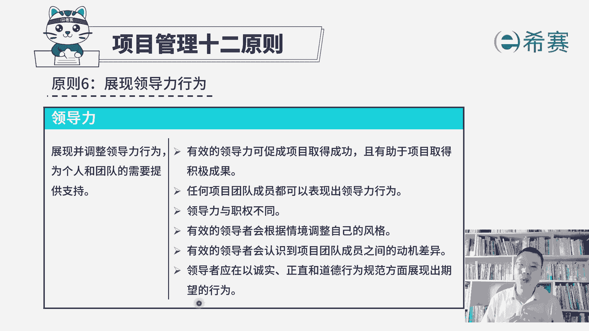
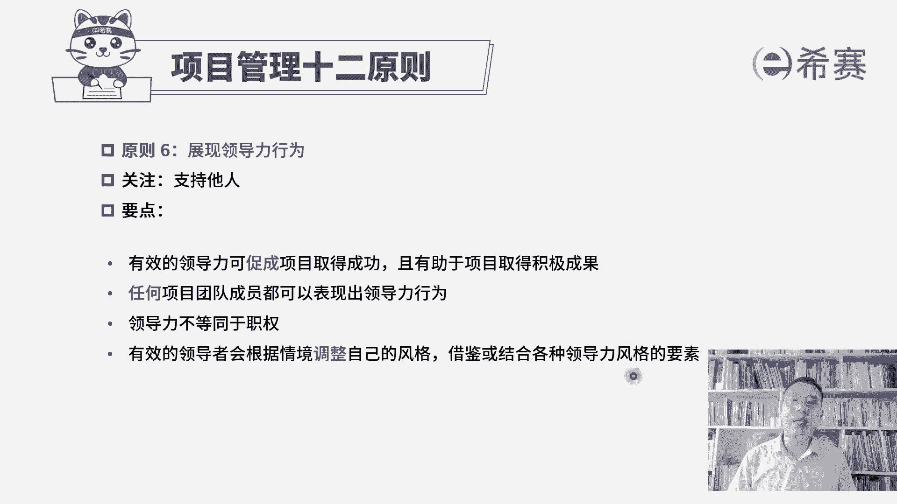

# 24年PMP项目管理考试，每天1小时，全套零基础通关视频免费观看！第六版114集全+考纲讲解+第七版37集全 - P130：PMP第七版项目管理原则之06领导力 - 冬x溪 - BV13e4JeiEta

接下来我们一起看到的是，项目管理12原则中的第六个，叫展现领导力行为，它的焦点就是领导力，我们在前面讲课的时候呢，有讲过说兄弟们给我上，或是兄弟们跟我上，他都是能够去激发兄弟们的热情斗志。

能够去一起往前冲，来完成某一件事情，那项目管理的原则中有这么一条，就是说我们需要去展现领导力，同时这里有一个不同的点，就是不仅仅是项目经理，可以去展现自己的领导力，项目团队成员。

每一个人都可以展现自己的领导力，能够去引领别人或带动大家，激发大家的热情和动力，来一起完成事情，我们一起来看一下啊，展现领导力行为，他说是要展现并调整领导力行为，为个人和团队的需要提供支持。

我们前面有看过一个叫情境领导力模型，我们还看过塔克曼阶梯理论，我们知道说团队的成员，他进来的时候学了一段时间以后，已经能够正常操作以后，以及可以独当一面以后，在不同的时间段。

我们的这种领导力行为其实是不完全相同的，所以这就是对于领导力的调整，你需要根据当下环境的情况，员工的能力水平来去调整你自身的领导力，那目的呢就是能够去支持团队往前走，我们来看一下具体内容，第一条。

有效的领导力可促进项目取得成功，且有助于项目取得积极成果，如果说能够让兄弟们都给你上，或是让兄弟们都跟你上，肯定这个项目更容易成对吧，并且呢如果大家一个良好的状态中，一个激昂的状态中去做事情。

他能够更好的激发他的斗志，激发他的热情，他的这样一种聪明才智，这个事情也能够更好的去成功，取得更好的一个结果，这个基本上是非常好理解的啊，不要解释了，第二句，任何项目团队成员都可以表现出领导力行为。

诶我们以前都觉得说啊，领导力一定是领导们干的事情，其实并不是这样子啊，嗯大家知道一个案例，就是曾经有一个团队，他们这种飞机失事，然后在一个好像说是北极的某一个冰川上面，然后后来能够带领大家走出来的。

其实是团队中的某一个人，呃这个故事不扯开讲啊，其实呢不只是有领导者，他能够去让兄弟们给我上，兄弟们跟我上，任何一个人，你都可以展现你自己的领导力和影响力，你能够去激发别人的斗志。

或者说是激发别人想要去完成某件事情的力量，来去一起推进这个事情，这都是可以的，好第三句说领导力和职权不同，正好是对第二句来做一个很好的补充，也就是说领导力不是说我要求你做这个，要求你做那个。

这是职权所赋予的权利，而领导力是你能够去让别人，愿意去完成某一些事情，不管说是心甘情愿还是呃不得不，总之就是让他能够去完成事情都算，所以他的这一种权利的方式，和职权的方式是不完全相同的，好，下一条。

有效的领导者会根据情境调整自己的风格，也就是你不要说啊，我一直都是放羊的这种方式，他在什么都不会的时候，你不能放羊，你得要去督促他，盯着他，你会要去指导他好，当他会一些的时候呢。

如你可能要通过教练的方式来去提问题，提醒他啊，到后面你再慢慢就可以开始呃，做这些，陪他走一段时间以后，发现他真的是基本上完全掌握了这些个内容，掌握了这些个技巧以后，你才可以去做放羊。

你要去根据团队的情况，以及根据项目当下的情况，来去调整你自己的领导风格，这也是我们在情境领导力模型，和塔克曼阶梯理论中都讲到的这样一个内容，再往下面看，有效的领导者会认识到项目，团队成员之间的动机差异。

我们前面也讲过一个叫成就动机理论，不同的人他的动机是不一样的，有人可能会更关注是成就，关注做这些挑战性的工作，有人呢可能会更想要拥有一些权利，还有一些人想要一些亲和。

并且我们在讲马斯洛需求层次理论的时候，有讲过不同层次的这样一个需求，他其实力量是不一样的，而人在不同状态中，他的这种需求会不一样，所以他的这种动机，他的这一个需求点也是不相同。

你需要根据团队这样一个不同的情形，来做出你适应的领导力行为好第最后一条，领导者应该以诚实正直和道德行为规范方面，展现出期望的行为，也就是说我凭什么服你，你说兄弟们给我上，我就上啊，我凭什么服气。

那一定是你自己本身是应该是一个靠谱的，也就是说你是这样一个具有管家精神的，正直的诚实的这样一个人啊，我觉得你是可靠的，这样我你说兄弟们给我上，我才会愿意跟你上对吧，哎这是展现领导力行为。

并且呢其实关于不同领导力风格中，还有一个点就是有一些人他是专制型的领导，也有一些呢是知识型的领导，有一些是共识型的领导，不同的这种领导风格，在不同的团队中会起到作用。

没有一种风格是通用的啊，那我们来看一下整个展现领导力行为，他其实重点展现你的领导力，是为了去支持别人，是为了去支持团队，所以有效的领导力可以促进项目成功，能够有助于项目取得积极的成果，以及任何团队成员。

你都可以表现出你的领导力行为，他跟职权是不相同的，有效的领导者会根据情境调整自己的风格，借鉴或者是结合各种领导力风格的要素，那你有可能会多跟别人去做沟通啊，或者你有可能说是不做任何沟通。

让他自己去琢磨啊，去想事情呢，你有各种各样的方式，总之能够去引领大家往前走，这是关于项目管理原则的第六条。

