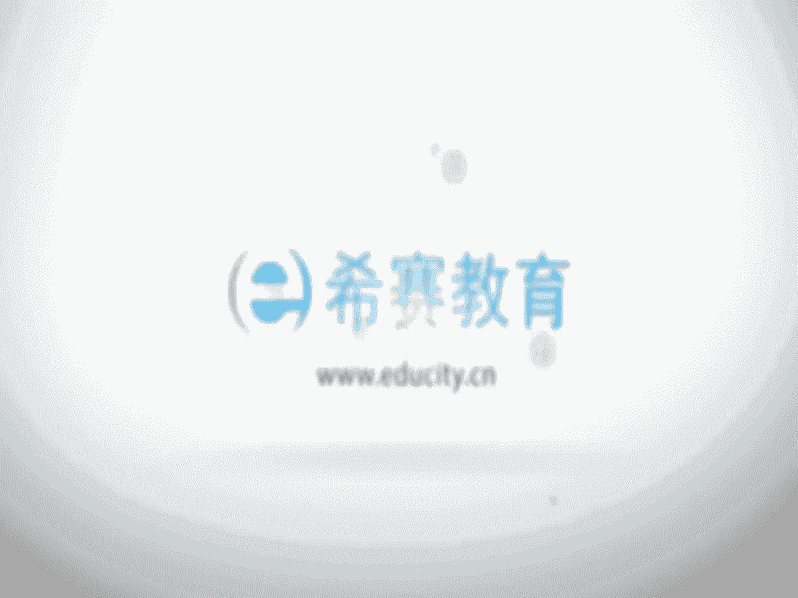

# 24年PMP项目管理考试，每天1小时，全套零基础通关视频免费观看！第六版114集全+考纲讲解+第七版37集全 - P13：0104、运营管理与组织级项目管理 - 冬x溪 - BV13e4JeiEta

接下来看到的呢是一个运营的概念啊，运营是什么意思呢，开展一个持续的活动，或是生产一个相同的一个产品，来提供这样一个重复的服务，OK也就是说他会希望说这样一个事情，是可以源源不断的一直做下去。

他会希望说是细水长流一直做下去，所以运营管理关注的是说持续的生产或是服务，的一个持续的运作，探测项目是本质的不相同，我们项目是为了创造一个独特的产品，成果或服务而进行的临时性的工作，还记得吗。

他是临时的K项目呢，是临时的，而这个运营呢他是会希望能够持续的，这是他们最显著的不同，也就是说我们做项目本身我们是临时的，我们会希望说他能够达到目标以后呢，就可以结束掉项目，就可以close掉。

而运营呢它是一个持续的，并且呢他会希望说一直能够去维系，去维持这样一个业务的进行，但是他们也有相同的地方，不管说是项目也好还是运营也好，它都是由人来做，同时呢都是有些资源的限制。

并且呢我们不管做项目还是做运营，我们都需要去规划执行和监控，当然规划执行和监控也是我们五大过程组中的，三个过程组，是三个最重要的过程组好，还有呢，就是说都是为了实现这样一个组织的目标。

或是战略计划来去做的这样一个东西，也许我们不管是做一些项目也好，还是呃去做一些运营也好，都是为了能够达到或满足，建一个组织的战略目标，我为了满足一个组织战略目标，我会去做一干一些项目。

做完一些项目以后呢，有一部分有一些项目可能会投入到运营，那么这样一个运营呢，也是可能为了能够去源源不断的去有收益呀，来产生对吧，那么项目和运营，他们之间是有一些交互的时点的，他们交互的时点。

比如说呃我本来一个运营好好的，结果呢，我会希望说能够去有所改进，有所改动，那这个时候我就可能需要一个新的项目的产生，那么这个时候呢，就是我项目和运营的一个交叉点，那比如说当这样一个项目做完完成以后呢。

要去交付到使用来投入运营，那这个时候也也是它的一个交叉的时间点，所以他说在新的产品开发，产品升级或是提高产量的时候，它都是一个交付的点，然后再去改进这样一些运营或是产品，开发的流程的时候。

以及那个在产品的生命周期的，最后的阶段的时候，每一个阶段结束的时候，都有他们的这些交叉的时间节点，这是关于运营啊，接下来我们会看到一个叫组织级，项目管理和战略，组织级项目管理和战略呢。

他说是为了去实现战略目标而整合项目组合，项目及项目管理与项目，组织驱动因素的这样一个框架，或者你可以理解为它是一个更大的一个框架，它是会希望说为了实现战略目标，我们有一个更大的方向上来去把项目的组合呀。

项目集呀，项目管理都给管理起来，组织级项目管理，它是旨在说组织开展一个正确的项目，AK这个信息，其实跟我们那个项目组合是一个概念，对不对，开展正确的项目来去呃，做事情，然后开展证券项目来去分配资源。

分配关键资源，组织级项目管理，它是有助于确保组织的各个层级，都了解组织的这些战略愿景，支持愿景的一些举措，目标以及可交付成果，这是一个很有意思的事情，很多时候我们在做项目的时候。

做着做着都不知道为什么要去做，好像就是领导让我们去做的，但是在新的版本中，在新的pm指南的版本中会给到一个讯息，就是我们项目经理你也要站在一个更高的点，你需要去知道一些组织的战略愿景，战略目标。

你要去支持这样一个战略目标，而组织的战略呢他是说面对一些很激烈的变化，很严峻的挑战环境下，为了求得长期的生存和发展而不断进行的一个，总体性的谋划，也就是他要面对一个变动的这样一个场景，来做一些挑战。

它跟长期计划是本质上不相同的，长期计划，它会是说在一个相对比较稳定的环境下，我要做一个长期的计划，而战略的计划呢，它是说未来可能是迷局的情况下，我要如何才能够面对这样一个迷局，才能够突破。

才能够更好的去啊，一直进行下去，那不管是长期计划也好呀，战略组织也好呀，那么项目它都是隶属于某一个项目集，或是项目组合，而项目呢它也是实现这样一个组织战略和目标，的一种手段，就通过一个一个的项目的实现。

来达到项目的这样一个组织的战略目标，而一个项目呢被批准的，那个典型的一些考量的依据，比如说是可能有市场的需求，或是一些战略机会或是业务的需求呃，打个比方，比如说当下的这样一个汽油比较紧缺的情况下。

某个汽车制造商，它就可能会要产生一个，低油耗的这样一个车型哎，这就是属于当下的这样一个市场的需求，可能会有一些是社会的需求或是环境的要求，比如说在呃当今的社会，可能雾霾显得越来越严重的情况下。

那对于这样一些环保的概念啊，不管说是那种排污啊，排废气呀，排废水呀，呃包括说是去燃烧一些东西呀，那么都会有更多的要求，所以很多很多这些做环保相关的这样一些企业，它最近的这样一个工作压力就会更大。

当然工作机会也是更多，有更多的项目可能会是客户的要求，或者说是包括一些技术的进步，呃比如说我们一个新的企业园区，然后有供电的这样一个需求，所以呢啊那种供电所呢，他就会去批准一个电站的一个建设项目嗯。

包括这个技术的进步，比如说当前呃大家在使用手机的时候，你会发现这种手机的摄像头，手机的录影呃，摄像都会越来越清晰，那么现在是哪怕是一个很低成本的这样一个，一个，手机它都会有这样的一个功能的满足。

还有一个是法律的要求，比如说有一些项目的话，本身在法律的维度，嗯比如说那种有毒气体的排放或排污，这个就是一个很严重的事情，是不允许不被允许的，那么可能有一家企业，他就会去制定这样一些计划。

