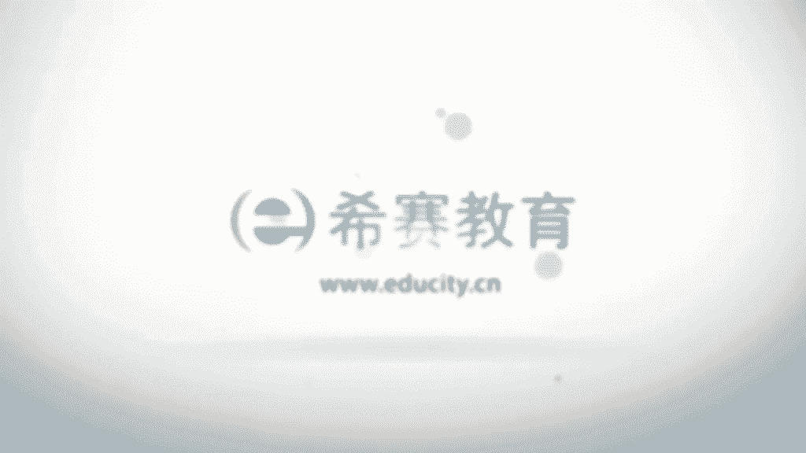
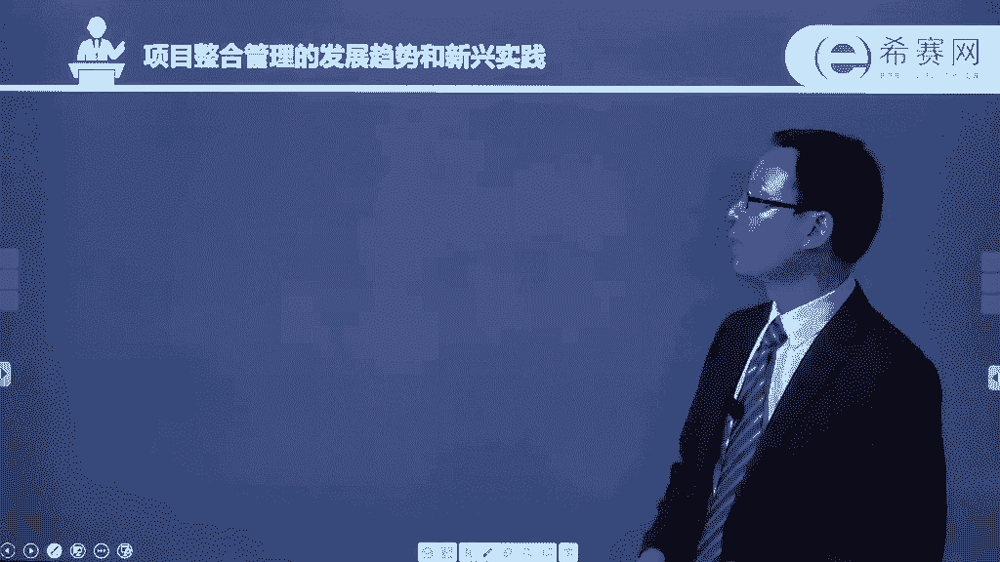

# 24年PMP项目管理考试，每天1小时，全套零基础通关视频免费观看！第六版114集全+考纲讲解+第七版37集全 - P31：0401整合管理核心概念 - 冬x溪 - BV13e4JeiEta

大家好，欢迎大家来到西夏教育，接下来我们一起看到的是项目整合管理，我是罗福兴呃，项目整合管理这一章节呢它的内容是比较的多，然后呢也是最为重要的一个章节，关于整合的话呢，它本身是一个很有意思的概念。

就是我们说项目的范围管理，他会专注在项目的范围，这样一个维度来去管理一些事项，那项目的成本管理呢，也是会专注在成本这样一个维度呃，不同的包括说进度管理呀，资源管理呀，沟通管理呀，它都是这样的。

它都是一个很明确的一个主题，那项目整合管理讲什么呢，它是讲的是一个大方向的一个整合呃，然后拼搏指南的第六版，它跟之前的所有的版本中的一个，最大的差异是呃，他会把所有的章节。

所有的这样一些知识领域的章节呢，做了一个调整，他们前面部分加了四个板块，一个板块是叫做呃某某管理的核心概念，然后第二个板块呢叫做它的这样一个，发展趋势和新兴实践，第三个板块呢叫做它的。

在裁剪的时候需要考虑的因素，也就是说我们通常做项目的话，不可能是把这样的五大过程组，十大知识领域中的49个过程全部都用上，尤其是一些很小的项目，它可能好多过程它都会被裁剪掉，裁缝的裁剪刀的剪啊。

那么裁剪的时候可能会需要考虑哪些因素，它也把它列出来，以及第四个板块，也是啊被大家所津津乐道的这样一个板块，叫做在敏捷或适应型环境中需要考虑的因素，就是当下他会把敏捷管理这样一个思想，会越来越重视。

因为当下在整个具体的项目管理过程中，敏捷开发敏捷管理也是会被使用的越来越多呃，他在从第四章开始到第13章，每个章节的前面都会先有这样的，四个小板块的内容，然后呢再开始去讲这样一个章节的具体知识。

那我们也是用同样的方式来做了一个排版，然后一起来看到，首先我们来看到的是关于项目整合管理，这样一个知识领域中的一些核心概念啊，核心概念这边有这样一些，首先项目整合管理，它是由项目经理来负责。

项目经理是被任命的这样一个角色，他是被任命过来管理这样一个项目，来去动用资源，去管理团队的这样一个角色，那么他来负责整个项目的一些整合，包含包括范围呀，时间啊，成本啊等等这些维度的整合。

项目经理需要对整个项目承担最终的责任，就是他来负责，同时呢他承担这样一个责任，整合所有其他知识领域者的成果，并且去掌握总体的这样一个情况，所以从这里面也可以看到，其他知识领域和它之间关系是密不可分的。

间接关系，它们之间本身就是交织在一起，我们在前面也有看过呃，事实上在这个章节也会也会发现，他有这样的一句话，他会说在具体项目管理中，这样一些过程和过程，它不一定会这么一个严格的去区分呃。

但是我们未来去方便讲解呢，会去把它作为一个过程，一个过程来去区分，事实上本身是混在一起的，很多东西都是没有那么一个完整，明确的这样一个界限呃，包括所有的其他知识领域，和这样一个项目整合管理。

他们之间也是同样的，就不是说绝对的这样一个很明确的界限啊，那我们一起来看一下在项目整合管理中，可能重点需要去关注的一些事情，首先他说要去确保产品服务或成果的这样一个，交付日期，也是在进度的管理上。

我们是需要去关注的，然后以及整个项目生命周期及效益管理计划，这样一些那关于效益管理的话，也会涉及到成本的这样一个维度的信息，然后编制项目管理计划，就是我们先要有计划。

这样的话呢才能够去有参考的依据去实施，以及在监测的时候也会有一个参对对比的，这样一个参考信息对吧，然后要去确保创造合适的这样一些知识，并且运用到项目中，因为我们做事情的话，如果说每一次都是从头开始。

这样是一个很困难的事情，但是过往的这样一些经验和教训，过往的这样一些组织过程，资产对我们的未来是有很大的一个帮助，能够让我们省掉很多麻烦的事情，可以去直接运用，是非常方便的一个呃。

所以呢在这边说要去确保有一些知识，整个在项目的整合管理中，有一个过程叫管理项目知识，对不对，好，然后再看项目管理计划呢，它的活动的绩效和变更，也是需要去呃关注和管理，以及如果说是会有一些变更的话。

哪一些是它的一个关键因素，就哪一些因素会去影响这样一些变更，也是我们需要去管理，因为我们说有变更走流程，那当然我们也要去知道是什么，导致了这样一个变更，哪些信息对他会是比较重要。

需要去关注测量监督项目的这样一个进展情况，就我们前面说的交付日期其实也是的一个进展，说是进度对不对，然后如果是有必要的话呢，我们需要去采取一些措施来实现目标，也就是如果说进度有延迟的话。

我们可能需要去赶工，我们需要去快速跟进嗯，或者如果说有一些特定的情形下，我们也可能会用采用这种分步骤提交的方式，来去跟对方来呃，达成这样一致，采取这样的措施来进行对吧，呃以及在项目执行过程中。

要去收集这样一些数据，并且分析得到这样一些呃项目的绩效信息对吧，然后要跟对方去分享，那就是关于项目的那个绩效报告了，整个工作完成要去正式的关闭各个阶段，或者说关闭合同以及关闭整个项目。

当然还有对应的一些需要的一些讯息，这是啊书上给到的项目整合管理，这样一个知识领域中的一些核心的概念。

然后再往下面来看到的是，他的这样一个发展趋势和新兴实践，首先项目管理的项目，整合管理的这样一个知识领域，他说要求整合所有其他知识领域的过程，那么这里边的那个趋势，它是包括一个是使用一些自动化的工具。

来去管理，事实上这样一些机器啊，设备啊，这样一些自动化的工具啊，真的是能够给我们的呃，工作带来很多很多的便利，而说可以使用一些呃自动化的一些工具来去，收集分析以及使用一些信息啊。

包括说在很多公司都会有什么OA系统呢，ERP系统呢，呃类似这样的一些东西，对不对，都会能够让你的工作变得更加的方便一些，使用一些可视化的管理工具哈，OK有界面的操作对吧，包括咱们现在用的这样一个电脑。

都是用的windows的操作系统，然后这样的话有信息可以一个可视化的操作，界面的话，操作起来就会非常的简单，就不说完全需要那么专业的技能的人，才能够操作这样一些信息，有的时候是哪怕是稍微受过。

接受过一些培训和训练，都可以去使用，要关注的是项目知识的管理，因为整个知识的话它的积累，积累知识并且传递给受众，这个的话能够让他没有白费，就这样一个过程中的所有的经验呐，教训呢都应该被收集下来。

能够去传递给后面，能够去为后面的供更多的项目来做服务，这也是啊一个趋势，那事实上包括说他的这样一个趋势，我之前有一个朋友，他在他们那个公司，当时那是3年以前，34年以前。

但是他们公司就任命他作为这样一个呃，算是呃叫什么具体名称，不记得什么信息收集或嗯就是信息整理，类似这样的一个嗯，就是配置整理相关的这样一个工作人员，他还有个团队，有四个人的这样一个团队。

他们专门做的事情就是整合一些知识，管理一些知识，就是他们呃是做很多这种呃，给很多单位来做这种OA系统相关的，做类似的这样一些系统，那么他们每年都会做很多很多系统，而在这样一个过程中。

事实上有很多东西都是可以去拿过来啊，重复利用或者说是借鉴使用的，所以在这一过程中的话，把一些知识如果没有很好的去管理起来，那么下一次会浪费更多的时间和精力，而如果说能够比较好的去管理，这样一些知识的话。

能够把它积累下来，管理起来的话，后续会省掉很多的麻烦，今天项目经理的这样一些职责，这个的话其实很有意思，我们已经看过第三章，大概也清楚，对不对，看过第三层，大家也知道项目经理的那个职责是非常的多。

当然呢要求也特别的高，那么在这边说到项目经理他要介入启动和结束，也说在最前面的时候你要参与进来，在最后面的时候你也要去参与进来，呃，他是包括比如说呃那个项目的商业论证，你说值不值得存在。

像以效应的管理啊，这样一个项目，怎么样一种方式才能够让这样一个嗯回本对吧，呃，然后以及盈利，项目经理也需要去更全面的去识别相关相关方，我们只有去识别到各路的相关方，不会遗漏的话，不会遗漏。

尤其是重要的相关方的话，才不会导致于说啊突然有一个相关方说啊，这个项目要停掉对吧，这种情形就是会比较尴尬，所以如果说我们尽可能多的去识别相关方，也同时能够去识别到更多的风险。

然后也能够去啊了解到大家的这样一些需求，或者是诉求，这样的话能够更好的去管理这样一个项目，引导他们去参与到项目中来，这是整个项目参与相关班管理中会去关注的，当识首先得识别到它，才能够去呃。

邀请他来参与到项目的一个部分来对吧，还有一个叫混合型的方法，他说的是什么呢，他说呃通常会有很多很多一些新的方法进来，我们不要去拘泥，说完全是热力去追逐一种最新的方法，那个的话未必就是最好的。

但是呢也不要说我只能我就用，我现在这一套已经非常OK，他说的是我们要可以去，他说采用一些经过实践检验的一些新的做法，可能会能够让我们的项目的管理的这种方法，有所提升啊，包括一些敏捷的方法啊，迭代的方法。

现在敏捷也是越来越被大家所接受，对不对，他说以及说开展需求管理，采用一些什么商业需求分析的技术呀，然后分析一些复杂性，采用一些什么相关的工具啊，就是我们可以去不是局限在某一种情形。

当然也不是说完全只是去追逐一些新的东西，我们是要用实用的原则，实用的这样一个情形下，然后去参考使用不同的东西，这是简单的说，关于一个发展趋势和新兴的实践啊，然后再下来看到的是关于裁剪。

那么整个项目整合管理，这样一个知识领域中的内容，我们如果说去管理项目，管理一个小项目，然后可能需要裁剪一部分，怎么样去裁剪啊，这个裁剪的话，不一定说是非得把那个过程给拿掉啊。

他有可能是要把这样一个过程给裁掉，当然也有可能是把过程中的一些，工具和技术给裁掉，只是选啊这个才或者换一句话来说，我们叫选择吧，就是只选择你所需要的这样一些工具和技术，只选择你所需要的这样一些过程。

那么关于项目整合管理它的那个裁剪，我们看一下，他说关注，首先一个是项目的生命周期，你这个项目的话，适合用一种什么样的一个生命周期，那么应该是要包含哪些阶段，比如说通常可能会有一些概念阶段呐，开发阶段呢。

然后那个后面的那个维护的阶段呢，然后是最后是消亡的阶段呢之类，但是看你的这种项目，它可能有特定的一些因素，特定的一些状况，然后他需要采用一些什么样的生命周期呃，这边还讲了一个叫项目的开发生命周期这个词。

我们看一下啊，对于特定的产品服务或成果而言，什么是合适的开发生命周期和开发的方法，是用这种预测型的，还是用这种适应型，预测型，什么意思呢，预测型就是老夫掐指一算，我知道未来是什么样子，就叫预测型。

对不对，他说的是说我未来的东西都已经，就是我要做的这样一些事情，其实都已经比较明确，信息比较明确，当我比较明确的时候，我能够去知道啊，下一步该怎么做，再下一步是什么时候做，以及做什么，再下一步什么样的。

这个很明确，我就用一种叫预测型，包括在项目开发的时候，有一种叫瀑布型的这样一个开发模型啊，然后适应型呢，它指的是说可能有很多的变动或变更，那么呢就不断的去迎合这样一些新的变更，不断去做调整，我不断调整。

不断的迎迎，迎合这样一个当前的一些，一些一些变更的形式啊，他说还有如果说是采用这种适应性的话，是用一种增量的方式，还是用迭代的方式，那么增量的方式呢，它指的是比如说我们当下已经做好一个版本，然后呢。

下一个版本呢只是说会加一些新的东西进来，而这个版本是已经完完整整是可以去使用，那用的应该说还很好的这样一个版本，然后再加一些新的进来，然后再下一个再下一个生命周期，再下一个迭代周期里面呢。

我又加了一些新的东西进来，不断的做一个增量的方式，而迭代呢它更多的是可能是第一轮，就是一个粗略的一个东西，然后下一轮呢就是会精细一些，再下一轮就更加精细或者准确，或者是更加的完善。

或是那个容错能力更强等等，当然也包括功能可能更丰富之类的，他的他的这种处理的方式呃，管理方法，考虑到组织文化和项目的这样一个复杂性，用哪一种管理过程会最为有效嗯，以及知识管理。

在项目管理过程中如何去管理知识，都说的是我们在项目管理过程中，可能会要涉及到这样一些方方面面，这样的话才能够去知道啊，用什么样一种方式去处理，我们之前其实也有说过，那个企业的文化。

对于一个组织呃来管理项目是有很大的影响，不同的企业文化下的管理方式，真的是差别千差万别对吧，所以你要去裁剪，你要去选择的话，你肯定是要需要去考虑这样的因素，这边还有一个叫关于考虑到变更。

就是如果如果说中间发生变更以后，我们要如何去管理，如何去管理变更啊，正常的这样一个就是官方推荐的这种方式的，但是有变更走流程是呃，先去提出这样一些变更请求，然后呢去评估一下。

看这样一个变更请求行还是不行，最后呢就是决定是批准或否决，这样一个变更请求，那如果被批准的话呢，我们就会去实施，要实施这样一些被批准的变更请求，以及后面要去跟踪，要去监督对吧。

但是也有可能会有它的一些特定的一些状况，在不同的这样一些行业，不同的情形下，可能有特殊的情况，你是需要去考虑的，以及关于治理，治理这个词的话，我们前面也说过，其实你可以简单来理解为。

就是我要如何去做这样一些事，情，如何去安排一些人或者是物件来去分派，这做相对应的一些事情，这边说到治理也是我们需要去考虑的一个信息，还有一个是经验教训，这个就不用说了，有经验教训的话。

能够帮我们省掉一些事情，少走一些弯路，对不对，那么在裁剪的时候呢，也是需要去考虑到这样一些经验教训，可能会对未来有帮助，还包括效益，他说应该在核实以何种方式来报告，我们的这些效益，在结束的时候。

还是每次迭代的时候啊，这些都是我们需要去考虑的。