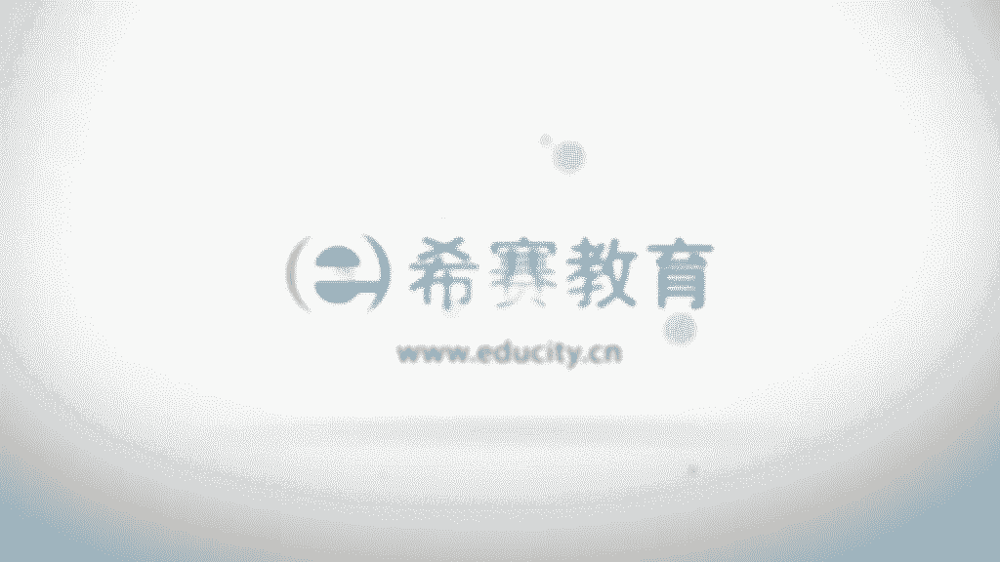

# 24年PMP项目管理考试，每天1小时，全套零基础通关视频免费观看！第六版114集全+考纲讲解+第七版37集全 - P87：0803田口、石川、六西格玛、质量改进、全面质量管理 - 冬x溪 - BV13e4JeiEta

呃接下来我们一起看到的呢是叫田口理论啊，田口是一个日本人的名字对吧，一看这名字就像日本人啊，他是提出了一个叫质量的损失函数，怎么说呢，他就是说可能会根据质量的不相同，导致用户或者说是社会会有一些损失。

所以的话我们要去比较，他其实从另外一个角度来讲，它就是会比较关注这样一个东西，最后的使用对吧，所以那为了让这样一个东西的质量，达到比较好的要求的话，他也提出来是要前期去设计质量，首先得要设计出来。

然后呢才能够制造出来，所以他会把设计的这样一个事情，放到一个很重点的位置，他会重点做设计，并且呢他把设计放到了三个阶段，分成了三个不同阶段，一个呢叫系统的设计，然后呢是参数设计，然后是容错设计啊。

容错当然也大，大家也知道啊，有的时候可能会发生什么鲁棒性啊，什么健壮性啊之类的吧，就说这个东西，你用一些很不一样的东西搬进来去做测试以后，会不会让它给崩掉对吧，就是这种容错设计，所以他重点关注。

其实也是说把质量要提前做一些预防，做一些设计，它提出来就用运用实验的方法来去做这样一些，质量相关的内容好，然后再往下面来看，这边呢说的是石川理论，石川可能会在整个项目管理中比较有名一些啊。

因为有一个图的名字，就是拿它的名字来命名的，叫因果图，就是我们有一个因果图，那个因果图呢也叫石川图，因为是因为由他来去发明出来的，然后呢还叫鱼骨图，是因为长得像一个鱼的刺，长得像鱼的骨头啊。

鱼骨图我们来看一下石川理论呢，他提出来一个著名的质量圈的这样一个运动，也就是说呃把质量他说识别一些质量问题的话，可以用这种因果图也好呀，核对表也好呀，帕里托图啊，趋势图这种方式可以去识别很多相关的信息。

然后对一些东西做一个分析，他说是呃什么因果图，直方图，散点图，控制图和趋势图，可以对质量做一些分析，以下这些图呢都会在这一章的后面的部分，会一个一个的去跟大家去讲解，然后呢，实际上他还最有名的。

就是说提出了这样一个因果图，也说是由他来弄出来的，公，他主张公开的小组讨论和绘制图表，有同等重要的作用，其实这些东西还应该说，你要你不要站在现在这样一个时间段去看，你要退回到几十年前，甚至是更多年以前。

在那个时候什么都没有的时候，让别人能够想出这样一些东西来，真的是很了不起啊，现在都已经是别人已经弄出来以后，你看了以后就司空见惯，都觉得是，那不就应该是这样吗，但是把你往前推，让你去穿越一下又会怎么样。

好这边还有一个叫六西格玛的管理，六西格玛管理呢，其实我们在项目的那个进度管理中，我们其实给大家也简单说过一下，当时是有一个正态分布图，还记得吗，正态分布图，我当然我也告诉你说那个其实不不重要啊。

并不是我们考试会重点关注的，只是说在这边顺便讲了一下正态分布图呢，它正一个标准差，在期望值的正一个标准差，他那个完成的概率是多少，正两个标准差它完成的概率又是多少，正三个标准差它完成的概率是多少。

而六西格玛呢说的是正六个标准差的情况下，在正六个标准差的这样一个情况下，完成它的概率是多少，这个概率呢通常是达到了9%，19。999几啊，是非常高的啊，99。99966%，或者反过来讲。

就是说是呃100万中有3。4个bug，你这样记很可能会比较容易记啊，100万，100万中有3。4个bug啊，这样来去记它会比较好一点，这是关于这样一个六西格玛的管理，那么这样一个六西格玛管理呢。

它其实它是重点会说要强调对组织过程，满足顾客要求的这样一个能力，进行一个量化的一个估算，也就是说你做出来的东西能够达到百分之多少，是满足的，比如说一个很具体的量化，比如说六西格玛是99。9%。

9999666，对不对，然后什么三个西格玛拉是99。73%，两个西格玛是99%点多少，都是一个很具体量化的，整个六西格玛管理，它的核心是关于说把所有的工作都设为一个，工作的流程，然后呢。

不同流程我们都可以用量化的方式来去管理到，从而能够去提高客户的满意度，当然他还用了一个叫DMAID，就是确定测量分析改进和控制，来对组织的关键流程进行改进，而这些内容的话，事实上它本身就是一个就是项目。

质量管理本身就是一个很大的一个学科，可以单独作为一个巨大的一个学科去对待的，所以呢咱们这边只是简单的去说介绍一下，有这样一个东西啊，如果你对它刚好有兴趣的话，你自己可以去深入的去研究，去探讨好。

然后再接下来我们一起看到呢，是关于持续改进以及及时制，什么叫持续改进呢，我们刚其实有看过，就是持续对这些东西，不断的去做一些更新和改进对吧，他说按照持续改进的理论，每一次的改进不一定非得要有多么的大。

但是呢要不断的去持续进行下去，嗯就像我们在学习的时候，我们也有说啊，你不是每天都要花很多很多时间去学习，但是你每天都得要花一个多小时来去学习，持续让自己泡在这样一个学习里面。

这样的话你的状态可能会更好一些对吧，就是嗯哪怕说早上没有时间的话，你早上可以听一听音频，听一下喜马拉雅山的这样一个呃，西夏教育的PMP的音频也可以啊，啊晚上你实在是不方便的，什么的时候。

你也可以去听一下，总归也是在听了一点东西，还可以学到一点东西对吧，嗯当然时间方面的话，你可以看视频会更好一点啊，呃也就是说我们要持续的进行下去，这样的话呢会会有帮助。

他说意味着呃质量的提高不是一次性的事件，只有持续进行，才有可能取得比较好的效果，并且呢质量的改进它是没有极限的，可以一直去精益求精，要求更好，做得更好，持续改进的主体是执行的组织。

而不是而不仅是这样一个项目团队，所以呢它是以那个组织来去倡导的，这样一个事情，然后另外一个概念呢叫即时制，即时制，他说的是这样一个意思，就是说可能很多单位在库存上面花费比较大，那如果说我不用库存的话呢。

一方面是节省大量的开支，另外一方面是用一种叫什么来料加工的，这种形式，比如说你来了多少订单，来了订单我再加工，这种叫即时制而来了，订单维修加工的话，其实对我们的质量的要求也是更高。

也说你必须专心致的去做，并且呢做完了这样一批里面是没有bug，因为有bug的话，你就没办法交货对吧，所以呢零库存它其实是没有余料，然后呢能够促使人们更加的快去关注质量，争取一次就把事情做好。

去争取零缺陷，你要清楚有这样一个概念在里面，啊啊这也是项目管理中的一种思想，事实上像像现在的话，比如说是嗯让我想一想啊，其实这两天我还看到我们小区有人在发信息，说呃，我们现场做东西，你当场下订单。

我当场做一些什么食材都是最新鲜的，那类似这样的一个情形啊，然后这边还有一个叫全面管理，全面质量管理，他说的是要全员参与进来，就质量管理这样一个事情呢，如果说所有人都关心这样一个事情。

这个事情可能会做的更好一点，然后呢是全过程都要被管理起来，就是从开始到最后的所有的过程都要去管理，以及各个维度，各个方位都要去管理，他说要以满足用户需求为导向，不断的去改善来。

最终达到用户的一个全面的需求，全员参与到以全员参与为基础，进行全过程的质量管理，然后这样一个质量管理呢，一方面是要求全员都参与进来，另外呢是全过程中都要把他管理起来，然后是用于一些相对比较全面的方法。

也是各种质量管理的方法都要去参考，以及对于所有的结果都要管理起来。