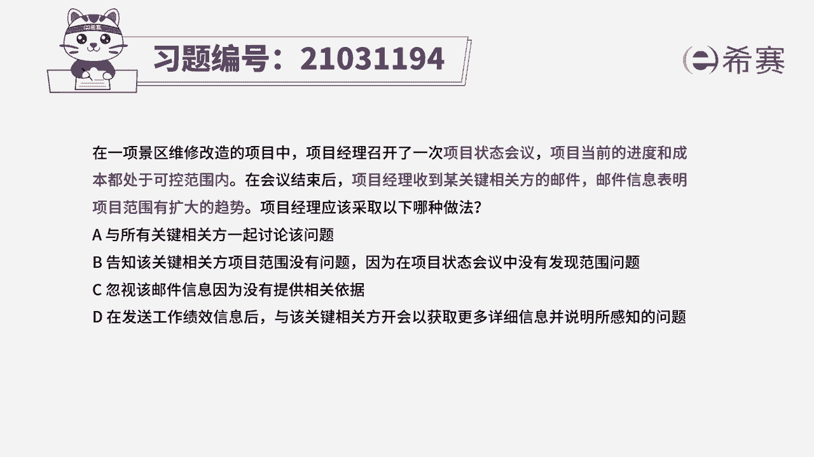
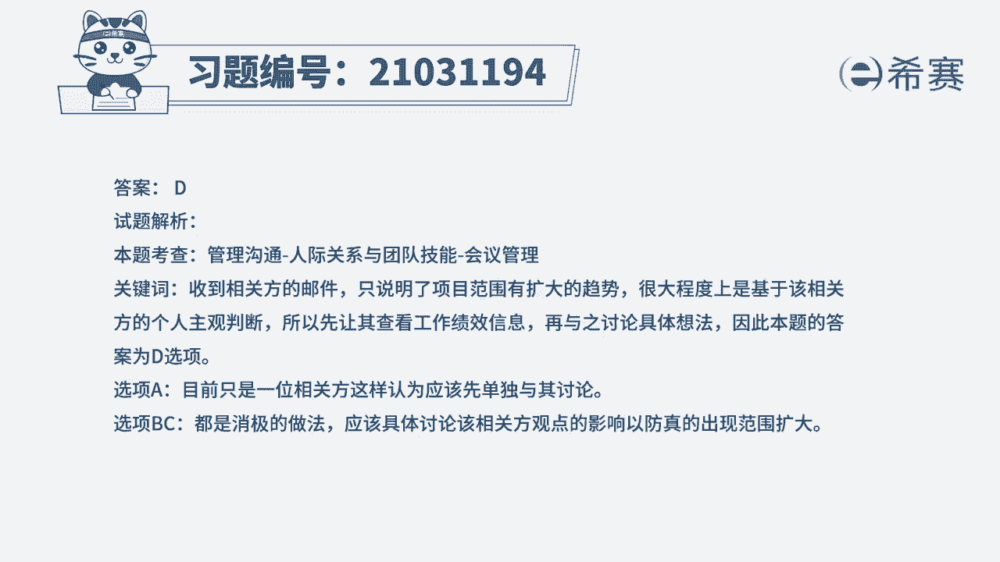

# 41.2022年PMP模拟视频教程、习题解析#PMP  #PMP考试  - 抖音 - P1 - 数字化转型培训李家贵 - BV1G8411Z7zv

在一项景区维修改造的项目中，项目经理召开了一次项目状态会议，项目当前的进度和成本都处于可控范围内，在会议结束后，项目经理收到某关键相关方的邮件，邮件信息表明项目范围有扩大的趋势。

项目经理应该采取以下哪种做法，a与所有关键相关方一起讨论的问题，并告知该关键相关方项目范围没有问题，因为在项目状态会议中没有发现范围问题，c忽视该邮件信息，因为没有提供相关依据，d在发送工作绩效信息后。

与该关键相关方开会，以获取更多详细信息，并说明所感知的问题，读完题目，我们可以找到题干中的关键句，题干中说项目经理召开了一次项目状态会议，项目当前的进度成本都可控。

但是会议后项目经理收到关键相关方的邮件，邮件表明向范围有扩大趋势，也就是说相关方只提出范围有扩大趋势，并没有说明原因及其他详细的信息，所以并不是一定就发生范围扩大的问题，提纲问项目经理应该怎么做。

那就应该先了解相关方所说的范围，有扩大趋势的详细信息，了解对应的原因，如果确定了范围确实会扩大的这个问题，再对应的去解决问题，我们先看选项，首先a选项现在只是一位相关方，认为项目范围出现了问题。

但是实际上还不确定，所以直接与所有关键相关方一起讨论的做法，是很唐突的，所以a不合适，我们再看bc选项，bc选项的做法相当于没有理会相关方的问题，是非常消极的做法，尤其是c选项。

直接忽视相关方的邮件是非常不可取的，所以bc都不合适，我们最后看d选项，d选项发送工作绩效信息，提供了真实有力的凭据，证明了目前项目范围正常，在与关键相关方开会，获取更多详细信息并感知问题。

就是要去了解相关方给出的观点的原因，找出问题所在，所以d选项是符合的，因此我们本题最佳的答案就是d选项。

本题考察的知识点是项目沟通管理中。

