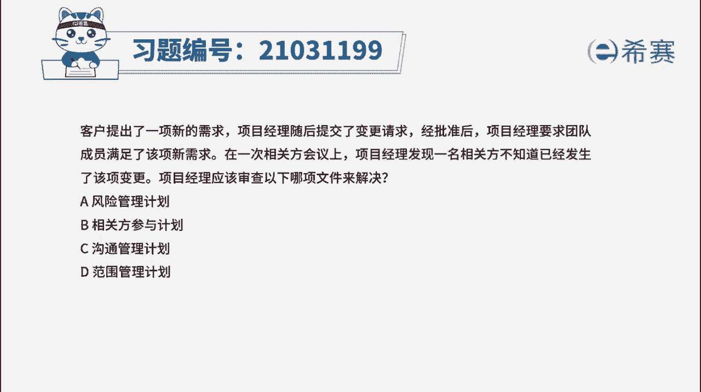
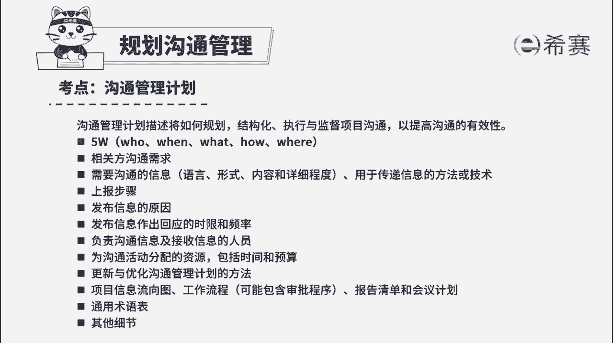
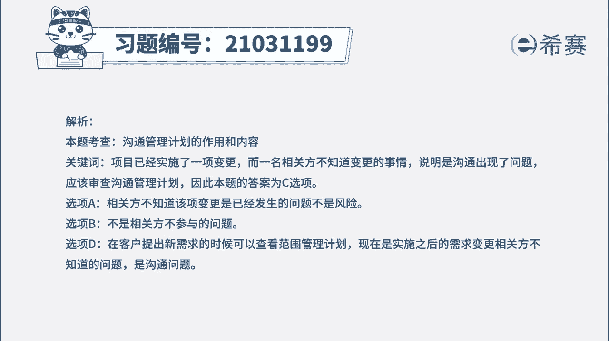

# 42.2022年PMP模拟视频教程、习题解析#PMP  #PMP考试  - 抖音 - P1 - 数字化转型培训李家贵 - BV1NP411B7u7

客户提出了一项新的需求，项目经理随后提交了变更请求，经批准后，项目经理要求团队成员满足了该项新需求，在一次相关方会议上，项目经理发现一名相关方，不知道已经发生了该项变更。

项目经理应该审查以下哪项文件来解决，a风险管理计划，b相关方参与计划，c沟通管理计划，d范围管理计划，读完题目，我们可以找到题干中的关键句，项目经理发现一名相关方，不知道已经发生了项目的一项变更。

也就是说，已经变更的这项信息，是没有正确传递到该相关方手中的，也就是沟通出了问题，那就要去审查沟通管理计划，看有没有在按照相关方的沟通需求，进行信息传递，所以c选项是正确的，我们再看其他选项。

首先看a选项，相关方不知道该项变更是已经发生的问题，不是风险，所以a不对，再看b选项，相关方不了解变更不是相关方参与度的问题，所以不是相关方参与计划，b也不对，最后看d选项，d选项说的是范围管理计划。

在客户提出新需求的时候，是可以查看范围管理计划的，看是否在范围内，但是现在是实施之后的需求变更，相关方不知道的问题，所以属于沟通层面的问题，不是范围问题，所以d也不选。

因此本题最佳的答案就是c选项，本题考察的内容是项目沟通管理中规划。

