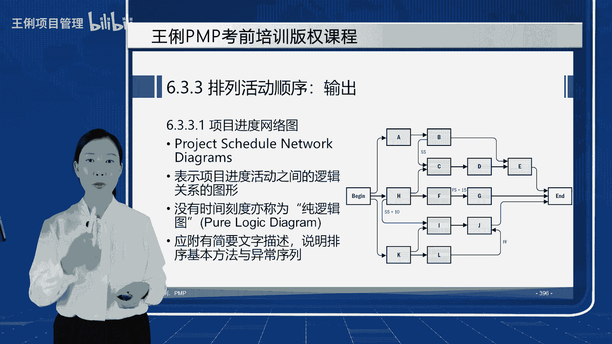

# 6.1规划进度管理+6.2定义活动+6.3排列活动顺序 - P1 - 王俐项目管理 - BV13k4y1X7YS

好同学们好，我们现在开始学习第六章项目进度管理，进度管理呢是项目管理过程中，历史最悠久的一个项目管理领域，因为呀自打有项目开始呢，时间这个不可再生资源，就是所有的项目管理者非常关注的。

而我们这里的进度管理呢，其实它管理的颗粒度更细，它不仅仅等同于中国项目中的工期管理，它包括工作时长，工作日以及具体工作和活动之间的对应关系，我们首先来看一下进度管理的过程，进度管理呢在25页的表格中呢。

一共有六个具体的过程，但是他跟范围管理一样，只有规划和监控两大过程组，前五个过程呢都是规划过程，一直到6。5，制定进度计划，这时候计划做完了，也就说明我们的第二大基准，进度基准在这里边就输出了，6。

6呢，就是在执行的过程中进行进度的监督和控制，在这个章节中比较重要的过程是哪个呢，最关键的就是制定进度计划，它的工具需要大家做一个重点的掌握，以及输出进度计划的几种形式，进度数据进度模型的样子。

我们也要做一个了解，所以他是第一重要的，其次呢就是6。2，6。3和6。4这三个小节，尤其是6。4，估算活动持续时间的工具非常重要，因为6。4的工具啊，跟后面我们要学到的7。2估算成本，9。2估算资源。

它的工具呢几乎是一模一样的，除了单位，比如进度的估算活动持续时间，它的单位可能是小10分钟，天周月年成本的单位呢可能是圆角分，人民币美元，包括十百千万百万千万，而资源的公公那个单位呢就是个儿呀，价儿啊。

人啊等等，这些单位变了，但工具的内容，我们只在6。41次性把它交付清楚，在后面的流程中呢，咱们就换一个单位也就会用了，那么6。2和6。3呢，也有一些具体的工具和输出，需要大家了解和掌握，6。1和6。

6呢考到的知识点非常少，那我们现在就开始进入进度的学习，首先呢也是先来看进度的发展趋势和新兴实践，以及裁剪和敏捷的考虑，进度的发展趋势和新兴实践呢，有引入了一个未完象blog的迭代计划。

这个呢实际上是在敏捷里面用的，更适用于那种就是敏捷生命周期中的这种，滚动式计划，滚动规划，比如说敏捷中的time box，一个sprint2到四周，这就是time box，订好了两周，那就固定了两周。

两周两周作为一个时间盒子，一个sprint plenty meeting计划，会议也是一个time box，迭代会议回顾会议也是time box，评审会议也是time box，也是一个时间盒子。

按照进度计划，另外也要基于看板体系，看板呢实际上就是丰田，基于丰田的工作法TPS得来的，它里面呢有三个列表，To do doing，和大，然后展示我要完成的工作和我正在进行的工作。

已经我已经完成了的工作，其实他展示的更多的是范围，但它在范围和进度中做了一个结合，可以做到按需拉动，来自丰田的精益生产的模型，以及呢我们可以看到燃尽图中进度的进展情况，这是新兴的趋势和实践。

进度呢有一个专门的认证，PMI中呢，在十个第四章到第13章的十个知识领域中，只有进度，第六章和第11章，风险管理是有单独的专家认证，所以进度管理呢会有一个P的专家认证，叫进度管理。

专业人士认证用的就是这本教材，另外裁剪呢我们可以根据生命周期的方法，开发的方法，比如你是瀑布啊，还是敏捷呀，还是迭代呀，还是增量啊，这些方法了，来裁剪进度的使用，然后资源的可用性。

项目的维度和技术这些方面来考虑，进度的模型的使用和裁剪工具的裁剪，在敏捷中呢，因为环境是比较复杂多变的，所以我们不能做特别长期的规划了，采用哪种方法来降低风险呢，采用短周期的方法来开展工作。

必要的时候呢做出调整，大型的组织环境，下面我们可以把阶段，也就是瀑布模型和敏捷，在某一阶段内的使用相结合，所以呢大型的项目可以用预测型，生命周期和敏捷混合方法，基本上现在的组织在顶层的产品路线，地图。

使命和愿景的落地的时候，它实际上全产品生命周期基本还是stage gate，就是阶段门型的方式，但是到了细节某一个stage尤其在开发生命周期，或者我们DIO所说的开发加运营生命周期。

可能会用一些敏捷和精力的方法而结合，使用效果非常好，所以这也是一个趋势，叫混合型生命周期，无论采用哪种方法，项目经理的角色在其中都是有的，所以说项目经理的角色在PMI的观点中是不变的。

我们的很多考试题中也会说，你是敏捷项目中的项目经理，其实啊他的意思就是你这个pm啊，有点像sm square master的教练了这种形式了，那么你也不要感到意外，反正他认为。

无论是传统的P瀑布模型还是挨着的模型下，我们都是有项目经理角色的，讲完了前言，我们接下来呢就开始学习流程，6。1呢是规划进度管理，他是写一个计划，叫进度管理计划，然后呢讲一讲进度的后面五件事应该怎么做。

所以这是一个方法论型的计划指导文件，并没有什么切实的呃，实实在在的进度的模型和基准在里面，它的使用工具也很简单，跟规划范围管理一样，都是专家开个会分析一下这个进度计划呢，包括模型怎么制定。

迭代的长度是多少，这一般敏捷教练呀和PO啊和team呀，他们商量着定准确达到我这个时间的波动，准确度，就是这个估算的这个临界的这个控制的临界值，以及我的这个绩效测量的这个准确值，它都有一个目标计量单位。

是天月周还是什么样的单位，与组织ca程序的链接，就是我们怎么做政治分析，这个要到7。4去讲进度模型的维护，控制的阈值，所以进度如果大幅超支的话，可能就是控制的临界值没做好，报告的格式。

这都是规划进度管理的输出嗯，所以进度管理计划的内容呢，我们做一个简单了解即可，接下来呢我们来学习6。2定义活动，定义活动是指，还记得我们前面在讲5。4的时候，提过这个流程吗，他呀就是针对根据5。

4输出的WBS的，最底下的那个叫什么呢，工作包，那个叫名词的工作包，也就是项目的可交付成果，最小颗粒的可交付成果再进行进一步的分解，它往往在项目执行的过程中，可以连WBS带活动的定义一股脑做完的。

你也可以分阶段，但是你分解到WBS呢，我们就叫它可交付成果阶段，也就是说具体的名词，而你要把这个可交付成果是怎么做出来的，一步一步也把它分解过来呢，我们就叫它任务阶段，任务呢实际上就是活动。

就是task任务就是活动，它是动词一段一段不为零的时间段，这有点像什么呀，比如说我有一个项目是做一顿丰盛的晚餐，这是我的项目，那么项目分解成为主食菜汤，这是第二层主食，米饭包子面条饼菜红烧肉。

西红柿炒鸡蛋，土豆炖牛肉，这是菜汤，什么什么饮品和汤，土豆炖牛肉，这就已经是WB了，工作包了，不是只拿土豆去炖牛肉，就是指那叫那道叫土豆炖牛肉的菜，而什么叫活动呢，你得先买吧，买完了你得洗吧。

洗完了你得切吧，然后先放啥后放啥，这个叫task活动，所以理解了吗，活动是时间角度的，为什么放到第六章呢，时间管理以前进度管理这一章就叫时间管理啊，是时间角度的，而土豆炖牛肉啊，腥味炒鸡蛋呀。

这是成果角度的，我要交付这个叫这个名字的那个可交付成果，所以一个是名词，一个是动词啊，非常清楚的，不为零的时间段，电影活动的工具呢跟5。4的工具是一样的，分解滚动式规划，就近期的详细。

远期的粗略输出的时候，我们关注一下活动清单属性以及里程碑清单，这三个输出依次来看什么叫分解，基于范围的可交付成果，也就WBSWBS词典，然后呢分解为更小的，易于管理的，具体的工作内容就是步骤。

就跟那把大象放冰箱，先把冰箱门打开，这是一个task，再把大象放进去，这是task，再把冰箱门关上，又一个task，这个就叫活动了，它不是可交付成果啊，不是成果，而是活动，它可以跟5。

4同时或在他后面编织，但他一定得在WBS分解完了之后，才能制定活动的清单，因为你是基于工作包分解的，而且WBS有一个原则叫做百分之百原则，也就是说项目中所有的工作没有多余，也没有遗漏。

百分之百的都会被分解为工作包，活动也是一样，他要把所有的工作包百分之百的都分解为活动，所以呢我们的活动也有百分之百原则，没有多余的活，也没有遗漏的活，这就是项目管理。

项目管理者跟团队成员进行团建的一个过程，很多同学呀项目经理不懂技术，在这一步呢就会比较为难，创建WBS，你要懂技术，你才知道一个项目的高层成果，是由哪些具体的组成部分，组件项目组成的子父子规则。

然后呢活动这你又要懂成果，你就相当于知道这个成果是怎么干出来的，而且呢我们在跟团队成员共同讨论，分解项目任务的时候，也能让大家群策群力，积极思考，主动发言，沟通和促进团队成员的凝聚力。

所以经常会把WBS的分解和活动清单的制定，当做一个非常好的内部学习和团队建设的过程，团建的过程啊，每个工作包都要分解为活动，不能漏啊，近期的要详细，远期的要粗略，这个呢是不浪费我们本身啊。

计划会随着项目的进展有着微调和变更，所以我们一次性，如果周周详详的把所有都分解完了，那么后期的变了，工作量也就浪费了我们呀，最好的就是把现在眼前要做的工作，详细的分解过来，WBS还有规划包呢。

活动呢也可以远端的粗略规划一下，输出的这个成果呢是长得像一张二维表一样的，活动清单里面列好了活动的一些编码呀，名称啊，它前头是谁呀，后头是谁呀，彼此之间有什么逻辑关系呀，他和他之间需要什么资源呀。

有哪些假设和制约呀，找一找活动的描述，这个呢就是活动清单和属性，活动呢我们大体啊会把它分成三类，按照活动的投入的精力和资源，或者活动的产出分成以下三类，最核心的呢就是中间这个叫做独立型活动。

什么叫独立型活动呢，整个活动啊是相对来说比较内聚的，高度的独立的，它实际上就能形成WBS的具体的工作任务，跟成果强相关的，也就是我们通常做完了这个活，就会产生一个工作的成果，具体的技术工作活动独立性的。

那么还有两类是什么活动呢，一类呀是左边的支持型活动，什么叫支持型活动呢，它虽然不直接铲除可交付成果，但是它会辅助你的独立性活动产生可交付成果，比如说呀我们做一些项目的管理工作，做一些咨询，做一些沟通。

然后呢在成本中心呢做一些核算，所以它能帮助独立型活动更成功，这种呢就是支持独立性活动，能让他交付的更完整，成功的这种管理类的工作或者支撑类的工作，我们叫它支持性工作，你发现项目管理的很多工作。

比如沟通啊，咨询呀，成本啊，监督啊，这都是支持性活动，那么什么叫依附型活动呢，依附型活动就是伴随独立型活动的出现，而出现的，他的投入啊可以分解依附在那个独立性活动上，你比如说我们的后勤保障。

为了保障独立型活动能正常地做完，那我们可能会做一些人员的支撑，比如说给他一些后勤的保障，餐饮呀，然后交通啊这种保障的工作，还有一个，比如说有一些工作的工作量难以独立分割，不容易分成一个独立的工作。

它是伴随在独立性工作上面的，比如说我们有施工项目，我们还有一个叫监理项目，那么监理项目的这种叫旁站，它就是依附型的，你只要开挖隐蔽工程，我就会旁站监理，他就是一个依附型的工作。

所以这三种具体的干活的方式，这就是我们项目中常见的活动，地域活动还会输出一个成果，除了活动清单和清单的属性之外，我们还有里程碑清单，如果说活动是大于零的时间段，那么里程碑呢就是等于零的时间点。

里程碑在第一章中呢，我们其实有讲过，第一章中讲过很多概念，有一个呢叫做阶段关口阶段关卡，阶段门或者get口，或者我们叫阶段入口，阶段出口以及male stone，就是里程碑，这些呢就是里程碑。

只不过那是一个项目中，分成若干生命周期的阶段，而我们这是把一个项目具体在细化成一小段，一小段的具体的工作，所以可能在这些活动中，也会碰到一些那些可以用来量化和检测的，时间点，我们就把它定义为里程碑。

注意不是每一个合同结束后都会是里程碑哦，活动千千万，里程碑可能只有几个，里程碑是什么呢，用空心的菱形号表示的，项目中重要的时点或事件点，比如说我们的考试假如定下来了，在6月20号。

那么6月20号就是一个里程碑，或者呢我们定好看完第一遍书进行总复习，那么看完第一遍pm book就是一个里程碑，你如果是3月5号看完了，3月5号到达，如果是4月5号看完了，4月5号到达。

总之里程碑的这个重要的时点或事件点，都是指到达，他没有二异性，就没什么可犹豫的，他呢就是来了就来了，大家都是明确的知道他到达了，虽然里程碑经历的时间是零，但是为了到达里程碑，所要花费的资源并不为零啊。

他只是持续的时间为零，但资源肯定不等于零，比如你为了看书看完一遍，你是不是要花很多个活动才到达这个里程碑呀，里程碑呢在实际的项目工作中呢主要有两类，第一类呢就是甲方或者法律要求。

我们必须在这个地方抬起头来检测一下的，比如说甲方通常在合同里面规定的，像付款方式啊，合同签订之日起付30%，合同验收合格付60%，质保期满付10%，所以这三个时间点呢就非常好。

没有二异性的清楚地辨明出来，然后我们就进行付款工作，或者是检验付款工作是否做了，还有呢一些我们推荐的，因为我们做项目经验上，从这几个点分成里程碑进行检测，可以让项目更好地保证它实施，比如说我们收集需求。

需求规格说明书，过审之后，我们才开始概要设计，所以你看哦，需求规格说明书，过审就是一个里程碑诶，概要设计方案过审可以又是一个里程碑，然后我的单元测试一个里程碑，我的系统验收测试一个里程碑。

上线运行一个里程碑，所以我可以根据经验，历史信息就是经验，我做过这么多年项目，我知道项目从哪些点进行管控，它才能降低风险，所以我可以根据经验做可选的选择性里程碑，也可以根据法律合同规定的做强制性里程碑。

总之一些活动结束，可能会碰到一个要检测的重要时点或事件点，我们就叫它里程碑，活动清单呢大概的样子就这样，这个呢就是清单的属性描述，里程碑清单呢也是那样的，二维表列的，只不过是里程碑的时点而已。

活动呢就是十段，好呢，我们把活动定义出来了，整个项目所有的活动都列出来，接下来我们要想知道，从开始做第一个活动到结束，做最后一个活动需要多长时间，我们是不是得知道这些活动是怎样进展的呀，这件事就叫排列。

活动顺序就是谁在前，谁在后，谁和谁可以并行，谁和谁只能串行，以及谁和谁有着哪些依赖关系，谁和谁是我做完了，你必须马上开始，谁和谁是，我做完了，你可以等等再开始，基于我们所有现实的假设和制约。

就得到活动和活动之间的逻辑顺序，这个叫6。3排列活动顺序，在排列活动顺序的过程中，我们需要碰到一个工具叫紧前关系绘图法，也叫PDM，在PMP的考试中，PDM通常不会让你绘制，因为它是单项选择题吗。

不容易让你画图，可是呢你如果不止于规划了一个PMP考试，你说老师，我实际上啊，还想考一些更多的项目管理专业认证，比如国内有很多非常具有含金量的，项目管理认证向住建部的一建二建，一级建造师和二级建造师。

计算机软件资格与等级考试中的高级工程师，信息系统项目管理师和中级系统集成，项目管理工程师，他呀都要求我们手工绘绘图，实际上对项目管理者的人员的要求呢，也要求大家至少要手工会绘制图纸。

你才能知道怎么安排进度，所以呢PDM图呢，还是要求大家尽可能的应该掌握它的手工绘制，我们后面呢会在6。5规划，制定进度基准和计划的时候，教大家如何绘制前导图，也就是紧前关系绘图法。

这个图形呢其实就是甘特图，就由它变形，或者说就是展示的意思差不多的啊，确定和整合依赖关系，早早提前量，滞后量，你也可以用p miss，像项目管理新系统是绘图最快的方法，会输出网络图。

所以我们在这儿呢看看网络图有哪几种，书上呢只讲了一种叫紧前关系绘图法，我们需要掌握它的名字啊，有一年直接就考它的名字分别叫啥，它有四个名字，紧前关系绘图法呢又叫PDM英文名字，它又叫活动节点法。

AON又一个英文名字，它又叫单代号网络图，它还有一个中文最常用的名字，它又叫前导图，就从前往后推导的过程，这个呢是紧前关系绘图法的几个名称，他为什么要叫单代号网络图呢，在这种图形绘制过程中。

我们用一个矩形块来代表一个活动，句型块里面呢用来写活动的代号，矩形块的左边这根边代表活动的star开始，右边那根边代表活动的finish结束，所以呢他可以表达活动和活动之间的，是开始结束还是结束。

开始或者开始开始结束结束四种逻辑关系，他表达的信息量大而完整，所以它是最完整的，目前进度图形的展示方法，那我们在绘制前导图之前呢，还得做一些准备动作，比如确定一下活动之间的依赖关系。

有一些活动有这样的特征，必须前一个活动做完，他输出的成果，才能作为后一个活动开始的必备条件，也就前一个活动的输出，是后一个活动必不可少的输入，那么这种活动呢就只能强制依赖了，所以他必须串行了。

我结束了你才能开始，比如说我必须收集完需求才能开始设计，哎我必须写作完，然后才能进行编写，如果你有这种管理要求的话，它就叫强制性，我必须浇筑好混凝土，然后等它晾干以后才能进行预制板的搭建。

所以很多强制性依赖关系，要么是法律限制，要不然是技术必须要求的，它是不能改变的，通常在选择题里面有两个字，必须你就知道了，他就是强制性的，又把他这种不能改变的叫heart硬逻辑。

硬依赖或者客观条件限制的，我们不能人为改变的，这是一类，还有呢跟它对应的有不能改的，是不是就有能改的，有一些活动是可以先做A也可以先做B，我们又叫它软逻辑，也叫选择性依赖关系，就是你可以任意选择。

比如说你早上起来是先洗脸还是先刷牙，你吃饭的时候先吃饭还是先喝汤，这个呢就叫首选逻辑优先逻辑，软逻辑或最佳实践，什么叫最佳实践呢，就是经验，根据经验得出来，你愿意先干这个，就先干这个。

你愿意先做那个就做，先做那个，你们自己承担着这个经验所带来的后果，所以我们就叫做选择性依赖关系，如果资源充足的话，选择性依赖关系的活动实际上是可以并行的，因为他们彼此并不形成输入输出关系。

另外两种呢划分活动的方法呢，分别叫外部依赖关系和内部依赖关系，外部依赖关系呢，就是指项目团队成员所做的工作，不在他控制的范围内，也就是说呀它是由项目之外的人做出来的，比如说我们有了外包的工作。

有了一些采购的工作，假如说我现在要集成一个设备，前提是呢我们团队成员只开发软件，还得有厂商提供的硬件设备到位，我才能在服务器上测试和集成，可是厂商又不是我的团队成员，它呢是我需要合作的另外的组织。

这时候啊就叫外部依赖关系，其他的公司，其他的部门只要不是你的项目团队成员之一，WBS上虽然有这个工作包，但是我没法控制，所以外部依赖关系如果同时又是强制的话，那么它就蕴含着很多风险。

我们就要考量到万一他不能及时到位，项目可能就不能及时联调，而内部依赖关系呢其实就是强制选择的，刚才我们讲过的都是团队成员自己完成的，这个图形呢就是前导图，PDM的一个最简单的展示方法。

我们可以通过这个图来看，开始之后，我们首先第一个做的项目呢是A活动，项目中的A活动，A的右边出来两条线，所以A结束之后走到了B和C，B和E的左侧进入箭头，所以A结束输入到B开始。

就表示A活动先做A做完之后做B和E，B做完之后呢，做CC做完之后呢，做D和FF的开始呢还得有E作为前置的结束，当D和F做完了之后，整个项目结束，所以通过这个图形，你是不是就可以搞搞清楚活动之间谁在前面。

谁在后面了，所以这就能看出活动的前后的依赖关系，以及传导的过程，所以它的名字，我们在这里面就将它的英文缩写都列出来了，大多数project软件前面我们说的project，2016。

微软的和P6oracle的，他都是用这种方法来绘图，因为它信息量比较完整，另外呢这种方法可以表达四种逻辑关系，我们来看内部怎么表达这四种逻辑关系啊，其实是强调，管理角度，就是从管理者的角度。

你更强调他们之间是怎样的，往往在实际工作中啊，你不要较真，它实际上是可以并行出现的，但是我们更强调在这个项目中突出他的哪一点，我们就只描述它突出的那一点，比如说我们更强调只有A结束后，B才能开始。

我们就这么画，叫做完成开始，Finish star，比如说我只有挖好坑才能栽树，前一个工作是挖坑，后一个工作是栽树，只有栽好树才能填土，那么前一个活动是栽树，后一个活动是填土之后，填好土才能浇水。

就这意思，我只有前一个工作做完，后一个工作才能开始，就叫FS，这是最常见的啊，项目中最常见的活动就是这个样子的，那我们有没有两个活动呢，我们不强调他的什么时候开始，我们强调他两个必须同时完成。

或者说我从A完成了以后，B才能完成，比如说前一个活动A做完了B才能做完，前一个活动A写作B是编辑，只有A写完了最后一个字，你才可能编辑完最后一个字，如果A还没写完，编辑工作是肯定没法完成的。

那有同学说写作和编辑不能同时开始吗，当然也可以，但我们不强调你爱什么时候开始，什么时候开始，但是呢你必须在我做完了之后，你才能完成结束，结束到结束，还有开始到开始，我开始了你才能开始。

比如说我只有地基开始浇灌你的混凝土，才能开始找平，我只有开始做一个什么样的工作，后一个工作才能接着，我标志着他开始，比如我只有开始收集需求，我才能开始写验收测试用力，我如果连需求都不知道，我怎么写。

按验收用力呢，他不强调你什么时候写完，但我强调你什么时候开始，最后一个呢，最罕有的就是开始到完成，就是前一个工作的开始，就标志着后一个工作才能完成，如果前一个工作不开始，后一个工作就不能完成。

比如说A活动是新系统上线star开始，那么老系统才能下线，finish才能结束，只有后一个保安开始上班，star前一个保安才能下班，你看这是不是一个管理制度上为了保证不断线，所有的过程都有人监控。

我们做到的一个管理的逻辑关系，所以更强调什么，你就在画图的时候用它来绘制，这样的话呢团队成员就知道了哦，管理层更强调我跟他的关系是怎样的，所以这是强调哪个点，另外呢。

我们还为大家补充了两种其他的绘图方法，一种呢其实手工绘图特别适合，因为它简洁方便，叫ADM，还记得前导图叫什么DM吗，PDM这个图形啊叫界线图，它叫DM又叫AOA，前导图呢叫ao on。

前导图叫单代号网络图，界线图呢叫双代号网络图，他用一根带有箭头的直线代表一个活动，这个箭头的尾部和头部各有一个节点，所以它叫双节点嘛，双代号节点里面都会有一个代号，这个代号可以是1234。

也可以是ABCD，它不代表任何活动节点里的数字，只代表活动从前到后的流转，所以接线图呢它呀因为是两个点儿，它就不像那两条线了，可以FSSF你两个点你怎么表达呢，所以它只能表达最常见的一种FS关系。

因为我们项目里面大部分是这种关系，所以如果你的项目里没有那些个特殊的，你就可以画界线图，根据刚才的图形A活动先开始，A完了之后做B和E，B结束之后做CC结束之后做D，然后呢C和E都结束之后做F。

所以会把前导图都能，只要只是FS关系都能一比一的转换成界线图，计算方法也更简单，所以在绘图实际工作中呢，很多项目经理徒手画的时候，我们基本上画的是界线图，就因为它快简单明了，它呢也可以绘绘制成为就是线。

如果线线的长度变成活动的历史的话，你看它是不是就很像甘特图啊，所以他就是活动节点法，甘特图也可以通过它变形过来啊，接线图，有的细心的同学可能发现了，我这个图形中有一条红线，而且是虚的，上面没有活动诶。

线线图中最复杂的一种画法就是虚线的绘制，什么叫虚线呢，就是指这里无活动，就是虚活动就等于无活动，这里没有活动，活动在哪呢，活动在虚线箭尾的节点处，只要汇入它的实线都是这个虚线。

所以你看啊这个虚线就是什么呢，就是活动B相当于活动E的前置，就是活动BC和F3个活动都做完了，E才能开始，有人说，那干嘛不把B直接划过来呢，因为啊B和C在二和四之间同始同终了，你就没法画它。

要求在两个节点中不能有两根实线，所以我们绘制虚活动的方法就这两种方式，一种呢是两个活动同始同终，我们用时间画不出来了，嘘他一下吧，还有一种呢就是A活动跟B活动是C的前置，而A呢又跟D是E的前置。

我们发现A要劈叉了，这个也画不出来了，用虚的，所以虚线画质的都是实线，无法完成绘制，基本上就这两种情况，你要是初学者呢，可能经验图绘制的会觉得有点丑，有点没有前瞻性。

那个实线虚线呀可能画的会比较歪歪扭扭的，不要担心，慢慢的练习呢就会形成一个比较好看的接线图，也就反复练习的一个过程，当然PMP考试是不需要你知道，你知道名字就行了，这个呢刚才我们讲过了。

强制性的外部依赖关系呢，要关注风险，然后还有选择性的内外部依赖关系，可以对应的结合，它是两种分类方法，还有一个工具呢叫做提前量和滞后量，什么叫提前量呢，就是前后两个活动之间可以并行的量。

本来A活动结束B才开始，但是我在A活动和B活动结束，到开始的中间减了二，看FX减二，就说明在A活动结束前两天B就可以开始，是不是就并行了一部分呀，这样的话不是可以节约时间吗。

比如前一个活动是收集需求以及需求定稿，然后一个活动呢是开始设计我的需求，定稿需要两天，那实际上两天前我已经收集完需求了，我就可以开始设计了，你后面定稿，我后面设计它不就是可以压缩一点时间。

节约时间是我们这一章的重要的要关注的点吗，所以这是提前有提前呢就有滞后，滞后量呢就是加，比如说前一个活动呢是墙壁粉刷，后一个活动呢是家具进场，本来呀我墙壁粉刷完了之后，马上就可以FS家具进场了。

但是我不得晾两天嘛，我可能就是FS加二，就是墙壁粉刷完了之后晾两天，等它干了以后家具再进场，这就有加N减N，那取决于具体的项目，还有这种SS的四种都可以用，比如说撰写草案和编辑草案，前面我在写稿。

当我写了15天之后，你再开始编辑，这样你才有内容可以编辑，所以在开始之后15天就用正的加号，也就是说滞后的时间，推迟的时间，而那是提前的时间，他呢不仅是一个做计划的方式，还是一个调计划的方式。

所以我们后面在6。5，6。6里面也会看到提前和滞后量，这是逻辑关系和提前和滞后量的表达，再给大家补充一种叫条件绘图法CDM，什么叫CDM呢，它里面有这样的是否判断，如果是是可能就走活动B。

如果不是就走活动C，所以呢他有分支，那还有一种如果判断什么，有什么其他问题呢，我可能就会循环走活动A这个就叫分支和循环，会有回路，了解一下就行了，它通常跟图形评审技术GRT共同使用，这个只要知道名字好。

我把我们补充的外加上讲解的，所有的绘图方法都给大家做了一个表格，列了列，关于PDM呢，书上既然提到了，我们就需要了解名字，了解特点，最好呢能看懂它绘制它，这是我们要求的考纲的掌握部分。

关于DM呢我们就了解或者能阅读是最好的，CDM呢只需要知道名字就可以了，根据刚才的PDM的介绍呢，在课本上就给了我们一个样板的绘制，这就是一个项目的前导图，就是我们虽然这时候还不知道每个活动的长度。

就是历时的时间，但是我们已经知道它的逻辑关系了，所以看这个项目从开始的时候先做AH和K，A结束之后做B然后呢H结束之后做F和C，H开始后十天呢可以做I，当B和C也可以同时开始，就B开始了C才能开始。

然后C结束之后做DF结束后15天之后，做GK结束之后呢，做I和LI结束之后做G，然后当我的G活动就是L结束后G才能结束，而DGGD结束之后做EEG，这三个活动都结束之后，整个项目结束。

所以你就能很清楚的知道，我的项目一共有多少活动，他们彼此之间谁在前，谁在后头，谁和谁并行，谁和谁串行，谁和谁是前后之间，是开始开始还是结束结束，还是等一等十几天再结束再开始，这些呢没有时间刻度的。

叫它纯逻辑图，我们可以有简要的文字描述，来帮助团队成员读懂这个图形，好，以上呢就是我们关于6。3排列。

