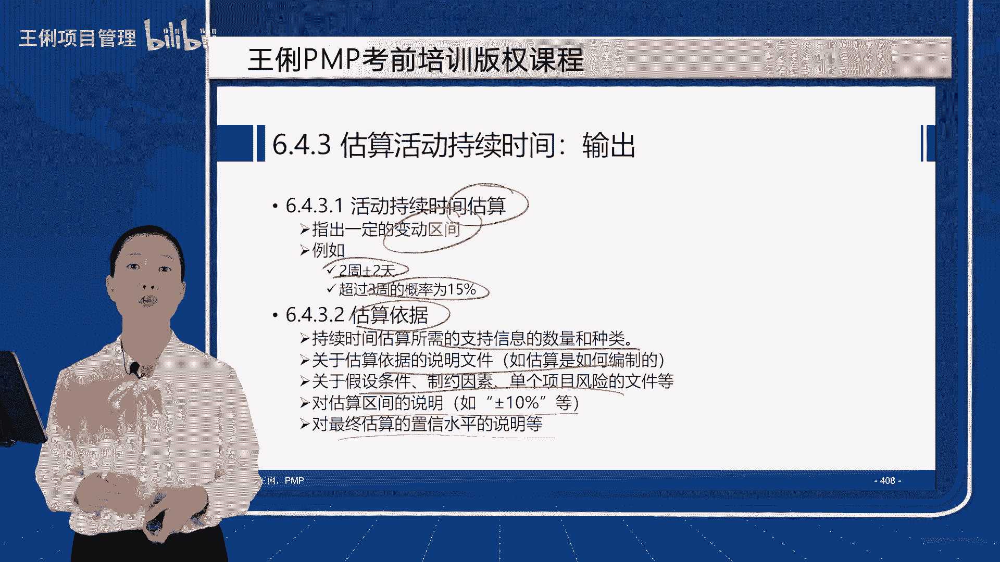

# 6.4估算活动持续时间 - P1 - 王俐项目管理 - BV1e64y1E7ka

好同学们，我们接下来来学习6。4，估算活动持续时间，它是指基于每一个活动，我们算每一个活动所要完成的时间，那么估算每一个活动上面的资源，确定了之后，要完成多少，花多少时间呢。

主要是应该由啊最了解你能力的人来完成，他才会准确度偏高一点，所以说这个事儿呢，应该由团队中最熟悉具体活动的个人和小组，来提供这个估算的输入，它也可以体现一个渐进明细性，就近期的我们把它估算出来。

然后根据近期的慢慢的在推断，远期的活动是多少，估算的时候可以考虑到收益递减，学习曲线，技术进步和员工激励这几点是什么呢，它会影响到我们估算的这个时间长短，比如收益递减规律，就是随着呃熟练程度的增加。

然后以及它是这样的一条线啊，以随着这个嗯工作效能的增加，你的工作时间应该是越来越短的，就完成相同的工作，但是最终他是压不下去的，就最终它会有一个比较趋于平缓的线路，学习曲线也是这样，熟练程度越来越长。

越来越熟悉，那么它的时间呢也就趋于固定了，技术进步呢可以大大的减少员工，激励呢也可以提升时间的过这个完成效率，估算活动时间所需要的公式，需要我们掌握这几个公式是考试必考的，第一个呢叫类比，第二个是参数。

第三个是三点，第四个呢是自下而上，第五个是储备分析，然后输出呢需要了解一下持续时间的估算结果，以及估算的依据，这几个工具一共五个啊，其他的我们在前面都讲过了，这五个工具跟7。2，前面讲的9。

2的工具都差不多的，依次来看第一个类比估算，什么叫类比，就是基于过去我曾经做过类似的活动，花了多久，然后我这个活动呢大概跟他差不多，也花这么长时间，比如说过去我做过一个类似的项目，里面也有这个工作。

我花了两周，那么一看这个工作跟那个工作差不多，于是我也给出来一个时间两周吧，那么大家想一下这种估算的特点是什么呢，第一个特别快，叫耗时较少，第二个呢几乎不花什么成本。

就是内部的专家判断团队成员只要有经验，那我就可以估出来，所以成本较低，但是它有一个致命的缺点，就是他忽略了项目的独一无二的特性，如果你都能拿过去的来估算现在的话，那么你项目的独特性是怎么体现的呢。

既因为项目是不一样的，那么可能他会有一些个性化的差异，类比估算就没有考虑到这个，所以它的准确定比较低，他不是特别准确，什么时候用它呢，早期，所以凡是考试题出现这两个字，项目刚刚启动，项目刚刚中标。

还正在制定章程，我为了快速估算出时间是多少，请问应该用什么方法就要用类比了，就是早期粗略详细的一些资料信息，文档不足的时候，我们得出一个结论，那么它就是类比估算的适用场景，那么类比估算既然不准。

我们怎么样能让它尽可能准一点呢，有两点做到可能会稍微准一点，第一个呢就是你这两个活是本质上相似，而不只是表面上听起来相似，比如说我给清华大学做了一个项目，我又给北大做了一个项目，你说给清华用了两个月。

给北大也用两个月，这就不准，有可能你给清华做的是OA，给北大做的是教务管理系统，这俩没有可比性，所以他就不准，但如果你给清华的高校做的OA，给北大也是高校做OA，这就叫本质上相似，就会比较准。

第二个就是类比估算啊，其实属于一个内部的专家判断，前面我们不是讲专家判断吗，如果你都是来自于内部的专家，就是你的团队成员具备比较专业的这个知识，那么他就会比较准，就是人家确实是真正干过这么多项目的。

然后确实是一线的技术工程师团队，他就会比较准，如果说你的团队成员都是新手的话，他没有什么过去可参考的，或者过去做的很少，那么它估出来也就不准，所以类比估算早期使用快，但是准确率比较低，大家发现了吗。

学到现在啊，几乎所有特征是快的工具，准确度都不高，比如什么头脑风暴啊，什么问卷调查呀，什么类比呀，他都不是特别准确的，然后第二个工具需要我们掌握的呢，就是参数估算，什么叫参数呢。

参数实际上是中国团队项目管理团队最爱用的，因为中国人数学好，他没事，就算他也是借助历史，但是他不是直接拿历史来比，今天它是要在历史数据中找到一种规律，这个规律叫什么呢，我们叫它统计关系。

比如说过去我是铺地板的，我呢十天铺完了一个100平米的房子，然后又给了我一个活儿是200平米的，我大概花了20天，然后又给了我一个50平米的，我呢花了五天我就能得出一个规律是什么呀，我一天能铺十个平方。

今天你跟我说，王老师，我这有一栋楼，一共有1000个平方，请问你多长时间能干完，如果就我一个资源来做的话，就用1000去除，以我的速度也就是100天，看到没，它不是从历史去比。

是历史数据中得出这个统计关系，然后用工作量乘以单位时间内的工时，或者用工作量除以速度都可以，单位时间的工时，就每做完一个需要多少时间一除，那不就是100天吗，所以这就是我们得出了活动的持续时间。

人月神话，我们经常这么做，一个工程师一天能写多少代码，然后我大概有多少代码量，然后用它除以工程师整个的数量和工作的，这个效率不就得等于这个需要多少的时间吗，所以我们在很多行业的项目管理过程中呢。

也经常用参数估算，就用员工的工时，然后和整个的工作量去相乘，就能得出活动的持续时间估算，那么它跟类比比呢，好像听起来是不是要准一点呀，但是他仍然没有摆脱类比估算的那个弊端，也就是它依然是用过去。

我曾经做过的工作来估算，现在也是忽略了项目的本项目独一无二的特性，那么如果这个项目跟过去，那个项目有很大的差异呢，你用过去的速率来估算现在是不是就不准了呀，所以参数估算呀它不准的原因也在这儿。

他们都忽略了项目的独特性，但是参数估算呢也可以稍微准一点，看它取决于哪两点呢，第一个参数模型的成熟度也就一天铺十平方，这个单位是不是准的，我要是过去已经铺了5年八年十年地板了，那基本上这书就比较准。

如果说我就租过一个房子，他是100平米，然后呢我用了十天，他就不一定准，因为也许呢我那房子是特殊的形状，我那房子的楼层啊，然后间距呀，木地板的要求啊，都有特殊的，那就不一定能映射到其他的房子上面。

所以呢这个模型的成熟度，也跟经验有很大的关系，第二个呢就是基础数据的可靠性，什么叫基础数据的可靠性呢，就是我们是否整栋楼是1000个平方，这事你准不准，可能一栋楼是多少个平方，我们还好量。

但是你说一个软件开发系统，尤其是创新型的项目，它需要多少代码量，这是不是就是一个猜的过程啊，所以如果这个你猜得不准的话，那你那基础数据就参数模型再准，它除出来乘出来也是不准的。

所以我们就有这种代码量超出好几倍的项目，那最终用参数估算还是不准，诶，这块呢要参照，还有一个就是学习曲线，我们的熟练程度回归分析，这就是回归分析的公式啊，就是看一下你这个到底达到一个什么样的趋势。

这就是我们参数估算常用的，所以它通常是要计算的，按单位时间，单位效率，然后乘以工作量，就是我们整个活动的工作时间，学习曲线理论前面讲了，什么叫学习曲线，不断的学习，然后就会有规律的递减。

但是他也压不到零，就像一个人复习备考PMP需要两个月的话，那你也不能说60个人一天就过了，他压不下去的，有很多活动是压不下去的，你越来越熟练，只能一定程度的诶降低，但是降低到这个必须具备的时间的时候。

他就没法减下去了，还有一个工具呢叫三点估算，它能弥补类比和参数，针对这个项目独特的特征的这个顾忌，所以三点估算呢，是充分考虑了本项目的不确定性和风险，它的独特性，它估算呢是比较准的。

只不过这种估算方法呢我们需要学会它的计算，通常在考试的时候呢，这个地儿会有一道计算题，三点估算，顾名思义哦，我们肯定要找到三个点是哪三个点呢，是完成一个活动，我们先粗略的，无论你用类比也好，用参数也好。

然后或者用什么其他的方法也好，先粗略的得出来他最可能的完成时间，然后以及他最乐观的完成时间，和他最悲观的就是最好最坏最可能三个时间点，这三个时间点如果我们都得出来了的话，那么我们就可以用公式了。

这就叫三点啊，这种方法呢又叫就来源于PERT技术，又叫计划评审技术，它出自1958年，美国的海军，在研发北极星潜水艇的远程导弹技术的过程中，军方开发出来的，所以PPT技术在军方上面。

把我们整个协调问题的时间，至少在北极星导弹项目，这个潜水艇的这个项目上，节约了25%的时间，就1/4还是有着非常卓越的这个效率的，我们接下来看它是怎么算的，它其实里面还要用到概率率啊。

它是这样通过一个正态分布图来判断最好最坏，最可能结合整个项目，然后算出来的概率，比如说啊，我把这个例子给大家做一个具体的举例，咱们来看这个具体的举例，比如说平时你回家如果不堵车。

最坏最快也就是说最好30分钟，如果堵车最慢最慢就是最坏两小时，两小时是多少，120分钟，大多数情况是不是就是最可能啊，最可能一个小时也就60分钟，然后我们怎么算呢，我们用贝塔估算啊。

就PERTPERT计划评审技术的贝塔估算，我们这样算，用一倍的最好加上一倍的最坏，再加上最可能，但因为最可能发生的效率最就是可能性最高，所以我们给它一个权重，给多少权重呢，四倍的权重，然后用这个数字呀。

再去除以六，为什么除以六啊，上面有一份最好一份最坏四份，最可能是不是一共六份，所以除以六算出来这个数字等于多少啊，我们就能算出这个数字是65分钟，65分钟，然后呢我们再用算出标准差啊。

这是我们PERT值是65分钟，然后再用最坏120减去最好30，然后再除以六，这个呢就是算德尔塔，也就是标准差算来等于多少啊，等于15分钟，接下来我们第三步就是绘制正态分布图，正态分布图在哪呢，在左边。

咱们来看我前一副幻灯片，咱们就画出这样一个正态分布图，你叫它波松分布也可以，中型分布也可以，左右两边是沿对称的，并且绝对相等的啊，这么一个图，然后呢从最高点对称分割，左右两边等的这个值呢就是65分钟。

然后向左和向右各偏离一倍，标准差，向左偏离一倍，就是65-15等于多少呢，等于50，向右偏了一倍，就是65+15等于多少呢，等于80，所以正一倍标准差，它所占的概率，就是我的50到80分钟之内。

到家的概率是多少呢，就是这块面积，根据微积分啊，占整个面积的百分比，这个百分比是多少呢，是68。26，这是微积分算出来的固定值啊，68。26，然后再向左偏离一倍，标准差50，再减15，等于35分钟。

再向右偏离一倍，标准差80，加15等于95分钟，也就是你35分钟到95分钟，到家的概率是多大呢，是这块面积，占整个面积的百分比，看这块面积就很满了啊，占95。462%倍的正两倍，然后再向左偏离一倍。

有的同学说了，老师不是最好才是多好吗，没有最好，只有更好，就是任何情况下都是有概率的，只是它发生的可能性多少而已啊，再向这边偏离一倍，它是20，再向右边偏离一倍，就是110，它的概率是多少呢。

你看基本上满了啊，就是99。73哎，就差0。2几了就满了，有的同学老师，你这是95。46，这是95。43，这是为什么不一样啊，因为微积分都是约等于，有些教材呢是95。462倍，有些教材呢是95。43。

我专门把两个数字给大家举出来，你呢在考试的时候就不要纠结，这个小数点后面的第二位了，95。4级就可以了，就能答对啊，因为它是取决于算的时候，那个四舍五入微积分嘛概率率，然后如果你再往右，我就不画了啊。

因为这个图不够了，到了六倍，这不是一倍两倍三倍吗，就一德尔塔二德尔塔，三德尔塔，如果你到了六倍的德尔塔，它是多少呢，它是三倍，都是99。7啊，六倍是99。9999997级，也就是百万分之三以内的出错率。

说白了就是我们特别有名的六西格玛，很多企业在质量管理上要达到六倍的标准差，就大概从这儿来的，也就是每100万件产品只有三件以内，就是二点几件是出错的，相当于一座小型图书馆中只有一个错别字。

所以这就是质量标准非常高啊，就一般制造业，他们对质量达到了这个要求达到极致的时候，就会追求6S，而我们项目管理，尤其是在针对信息化项目的代码量，我问大家，你们单位的代码的bug数量。

就是每百万条代码或者百条代码，它出错的概率是多少呢，bug的数量是多少呢，是一西格玛68。26，还是二西格玛95。46，还是三西格玛99。73呢，我问过这么多同学，达到3S的都很少，就是你们的代码数量。

会不会每百条能达到9%，19。7以上的正确率呢，就是千条代码指出错两条，所以PMP不太强调正确率达到6S，因为它针对信息化行业嘛，我们能做到3C西格玛，3S就觉得已经不错了啊，就是100件，我只有0。

2件有问题，所以这是我们六西格玛的计算考试的时候，要求大家掌握什么呢，第一个最好最坏加四倍的，最可能除以六这个公式你要掌握，最坏和最好之差除以六这个公式你要掌握，然后正态分布图中的。

就这两个公式要求大家掌握，此外就是正态分布图里边的这三个一倍两倍，三倍标准差所默认的比例，我们要背下来，因为考试的时候这个比例是不会给到你的，这个比例默认你是背下来的。

那么刚才题目问80分钟内到家的概率是多少，大家看50~80之间是68。2，六，80分钟内是不是还得加上这边啊，那大家知道怎么算吗，有两种思路，一种呢是你以中线左边是50%，右边是多少呢，是不是68。

26的一半啊，所以就是0。5+2分之68。26，就是80分钟内到家的概率了，还有一种是这样，中间这块是68。26，再加上1-68。26，是不是左右两边我只要内就是左侧这边，所以68。26+1减68。

26，除以二，这个和前一种算出来的方法是一样的，所以我们考试题考你每一块以及每一块的左右，你应该知道，这就不是咱们PMP的解决的问题了啊，而是一个小学的一个数学题啊，15%左右的就一测。

所以这是我们说的三点估算中的贝塔估算方法，考试呢大概率都会考这个贝塔分布，就是PERT技术，还有的时候个别考试题诶，很简单，它就考你一种叫三角分布的，注意贝塔分布就是这种泊松分布啊。

三角分布呢就是三角形，它怎么做的呢，它是用最好最坏最可能就一倍一加除以三，根本就没有概率，那它也就没有标准差了，所以当你在一道考试题中，用贝塔估算算不出来的时候，你再考虑它会不会是三角估算。

最好最坏最可能直接除以三，没有，没有标准差，所以这是我们的计算题，好学完了三点估算呢，我们接下来来学自下而上的估算，自下而上呢，这个下就是指WBS工作包的那一层级，然后上呢是指WB上面的项目级别。

就基于每一个工作包或者每一个活动，它所需要的时长，然后层层向上相加，就得出整个项目的这个估算，当然了，这个工具呢放在这里面稍微有一点欠妥，因为这个叫做活动持续时间，它实际上是一个活动持续时间的汇总。

而且在实际使用的过程中，我们也我们也不能简单粗暴的直接把它相加，因为如果A活动需要五天，B活动需要十天的话，整个ab两个活动做完并不一定需要15天，他们有可能并行，所以你得把活动的时间放到网络图里边。

找到前后依赖关系，然后再进行汇总，总之他的思路是没问题的，自下而上的估算，就是从底向上汇总WBS的各个组成部分，最后得出整个项目的时间估算，第六数据分析，数据分析里面，除了之前我们在5。3学过的。

备选方案分析之外呢，在这儿我们还要学一个储备分析，这个工具呀，很重要，这个工具在哪会出现呢，除了7。2，9。2之外呢，它会在11。7监控风险，就监督风险，那里边也会出现储备分析，什么叫储备分析呢。

就是为了应对风险，注意它的关键词用的跟三点估算不一样，三点估算是基于风险，就是为了考虑风险，基于风险考量的最好最坏最可能，而这里呢是为了应对风险，怎么应对呢，就是你活动如果A是五天。

难道你就找领导要五天吗，你可能心里会想着，万一有一个什么不确定的事件发生了，影响了我的活动呢，我可能啊把这些有可能出现的不确定性的事件，列一列，找一找它的概率和可能性，然后得出来一个数值。

指我需要额外的两天来应对这些风险，所以这时候你会向高层申请的时间，就是五天的活动基本时间加上两天的应急储备，于是你找领导要的是七天的A活动的时间，所以这个就叫应急储备，对已识别的风险做一个估算。

然后得出一些为了应对，以识别风险所预留的时间，那么还有管理层可能也会想，每个项目经理管我要的时间，难道就一定可以百分之百的够用吗，所以公司高层可能会在你预留的这七天之外。

再额外留一些时间来应对你没有识别到的风险，所以这个呢就叫管理储备，管理储备是指公司的管理层，也就是高层为了应对，项目经理所没有考虑到的风险，也是未知的未知而进行的留预留，比如说你留了七天。

管理层又留了一天，那么整个为你这个项目，为你这个活动留下的是八天时间，但是你可以自由支配的是其中的七天，也就是说这个应急储备是包含在基准里面的，项目经理可以直接使用和支配的。

而管理储备呢是公司预留在项目之外的，是管理层将来为了应对不时之需而留下的，要想使用管理储备，需要项目经理打变更申请报告，按照4。6实施整体变更控制的流程，批准多少用多少。

比如现在突发了一个你的风险列表中，没有出现的风险，这时候怎么办呢，你申请使用一天，管理层一看，这个风险不需要一天就给你批了0。5天，那么你就只能把0。5天纳入到你的基准里面，然后形成新的基准。

再进行重新的规划和管理，所以批多少用多少，管理储备是要走变更流程才能用的好，我们接下来呢来学习决策的一种，简单的表示方法，这个呀通常在敏捷里面用，但实际上传统项目管理，我觉得这也是一种特别好的方法。

因为它可以使我们的每次表态啊，速度非常快，叫做全无法，就是拳头的拳哦，12345的五全无法，什么叫全无法呢，项目经理提出一个提案，然后问大家同意不，如果每个人呢都伸出五根手指，就表示啊我举双手赞成。

我认为这个想法棒极了，并且我还愿意带头执行这个工作，如果是四根指头举出来呢，就代表这个想法不错，我愿意为其工作，我不愿意带头了，如果是三根手指呢，我很呃不是完全同意，但是呢我也不反对，我可以支持通过。

可是呀我呢还是有些顾虑，就是同意，但是有顾虑就是不完全同意的意思啊，两根手指呢就基本上他就算不同意了，我要讨论一些小问题，这些问题讨论完了，我才有可能同意，一根手指呢代表我非常非常担心。

我认为这问题比较大，然后拳头一个手指都没了，这个代表反对反对就是不同意，坚决反对的意思，所以敏捷项目管理，我们为了表决速度快，我们不断的讨论，不断的举手，大家就避免了用语言这样浪费时间，所以不断的举手。

直到所有的团队成员都伸出了，三根或以上的手指，就是表达方式，通过这种决策的全无法，可以结合前面所有的什么，百分之百同意啊，50%同意啊，相对多数同意，还有我们其他的各种表决方法，都可以用全无法啊来表达。

就手指头越多，同意的比例越高，至少得三根，60%以上的手指头都伸出来才算同意，还有敏捷中呢有冲刺计划会议，这个之前我们讲敏捷的时候讲过，在这给大家复盘一下。

Sprint planting meeting，冲刺计划会议在每个sprint的第一天开，然后将产品未完相product backlog里面的story选出来，选择到本次的sprint中。

形成sprint backlog迭代冲刺列表，然后并且呢要将用户故事分解为按小时估算的，底层任务，就是分解为task，再分解为理想时间，然后判断团队成员有没有时间做完，它其实特别简单。

比如说你以十天的迭代为例，五个团队成员，每个团队成员每天的工时是八小时，然后十天呢就是80小时，五个呢就是400个小时，你就选400个小时的工作就行了，当然我们不可能400个小时全部都用来工作。

我们还有工作之间的切换呀，还会有开会和沟通啊，所以正常情况下我们给他打个折，比如0。8选320个小时的工作，大概就差不多了，所以敏捷呀，为什么不加班，因为他选的就是自己能干完的，量力而行啊。

所以在迭代的第一天开这个计划会议，就是选工作的过程，由po team和SM，SM就是我们说的这个项目经理共同召开，把迭代问完项会生成假设制约，还有风险依赖等等，这些就是敏捷中的第一个仪式。

就四个仪式中的第一个估算的时间输出呢，第一个就是多长时间，比如ABCD每个活动需要多长时间，我们最好啊要给出一个时间的变动区间，这样比较靠谱，如果你给出一个时点呢，那准确率不会太高的，比如说两周正两天。

超过三周的概率是15%，哎这就时间会比较可控，也会给相关方一个合理的期望，还有就是为什么它为什么是两周，你要把这些支撑的数据说明的文件，假设制约置信水平，还有这个嗯估算的区间描述一下。

