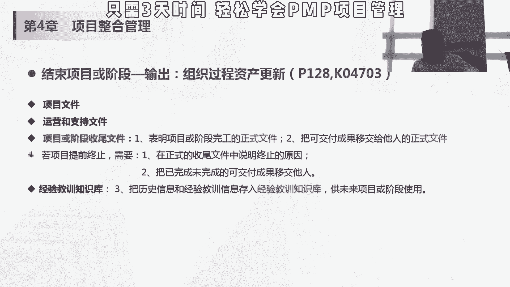
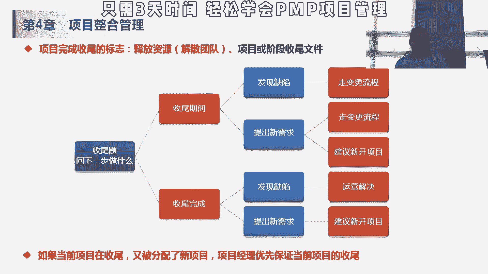

# 90分钟PMP项目管理，小白也能听懂的项目管理技巧 - P1 - PMP小雪球 - BV1bV4y1a7M7

如果软件的话，可能是测试，如果是房子装修的话，可能是最后这个呃，这个监理部门自己的这个check对吧，他是项目内部，先从从一个可核实的可交付成果，变成一个核实了的交付成果，核实过的交付成果的话。

交给客户去验收，就变成了验收的可交付成果，这里面有点绕哈，所以可交付成果呢是可核实的，通过内部核实qc变成核实的可见和成果，那核实的可交付成果，经过客户的验收验收变成验收的可交付成果。

验收的可交付成果是当前项目的这个输入，所以我说这个真正的验收，他不是在这个项目收尾阶段做的，他是在其他阶段其他管理过程里面做的，那当然我们要比对这个商业文件，确定我们是否达到了经济的可可行性。

还有预期的这种计划的收益，结束物的话我们会有组织过程资产，对，组织过程资产是指的是说项目或者阶段，收尾和指南或者要求，对吧，我要创造，我们讲组织过程资产的话是可以裁剪，是需要多积累一下，那怎么去验收。

怎么去评价项目怎么样一个验收标准，怎么做，合同收尾这东西的话，如果组织有相关的要求和规定的话，我们可以作为我们参照的这个这个过程哎，然后在我们上面应用，然后呢配置管理数据库，包含组织标准。

政策程序和项目文件的各种版本以及基准，我们讲这个变更的时候，我们讲了一个配置管理，配置管理用来确定哪些东西要变更，然后如何执行变更，如何审计这些变更，那这些本身它是属于配置管理里面的，一些配置项。

应该是我们讲的是configure的item，他这个配置项各种项目文件的各种版本的基准，包含，比如说我现在我整体的这个进度基准，已经变成二点了，我在按照二点这个基准，然后完成了整个项目。

那这些也是需要进行作为我们管理配置的，配置管理的知识库，作为整个这个服务的，然后工具的话包括数据分析这些东西，我们后面都会讲啊，文件分析回归趋势偏差，然后会议呢主要是说确认可交付通过，已通过验收。

达到退出标准，正式关闭合同评估满意度，分级教育进入成功会有收尾报告，对客户总结会，经验教育会听证会，这些东西大家了解一些，你看这些地方都没有考点啊，没有配开头的给大家讲，知道这个东西。

就是那输出的话是最终产品服务或成果移交，把项目交付的这种产品，服务和成果移交给另一个团队或者组织，并在其整个生命周期内进行运营维护和支持，那我们比如说我们做的软件项目，我们要交给，这个一方面要交给客户。

要拿去用的对吧，如果客户在过一生过程中，可能会有一些运维方面的这种工作，那会有运维团队来做，所以通常嗯比如说我们软件项目或者sap项目，做完了之后，做完实施之后上线了，那要对客户进行培训对吧。

客户端能够用这套系统，然后呢我们要把我们这些配置项呢，我们整个这个蓝图啊，这样的文件移交给运维团队，有可能是说实施团队和运营团队，不是一个组织的话，那就要做运维团队。

那这个时候其实中间的这种层楼物或者文档，对它进行移交的啊，最终会有一个总结的项目绩效报告，这个是项目的收尾，另外一个输出呢组织过程资产的更新，刚才我们讲输入也有啊，输入论说我们参照组织过程资产。

但如何做收尾，有哪些指南，有哪些模板来帮助我们做收尾，然后呢在结束之后呢，会有一个组织过程，市场的更新，包括项目文件，对言和知识文件，项目或阶段收尾性的文件，然后如果提前终止的话。

要在正式的社会文件中说明终止原因，并且也要把未完成的可交付成果移交给别人，说到哪就加到哪，然后经验教育知识库，这个是说我们把历史的信息和经验，通过这个知识库可以将来从未来的上面去使用。

要做组织过程资产分析。

然后这里呢，可能在我们实际的这个考试题目中，会出现各种各样的一个情况，问你后面怎么办，项目，玩收尾，首先的标志项目或阶段性收尾文件已经完成，或者说团队已经解散，我们刚才讲释放资源是收人的最后一步事项。

资源结束之后，那已经受理完成了，如果在收尾期间发现缺陷，我们讲缺陷也是一种变更对吧，我们讲那个变更分几种啊，纠正预防缺陷，还有那个叫更新，就举个简单的例子哈，这个时候还没有结束，收尾还属于项目期间。

你这个时候还要做变更的流程，如果客户提出新需求，一定要在这个里面去变的话，其实还要走遍原神，但是同时可以建议客户k2 期开一些新项，如果收尾已经完成了，我团队都解散了，你这时候发炎去世。

一般来说国内项目可能会讲我交给运营团，就是运维团队，但是呢在这个pm顾客里面有没有运维团队，这个概念就是讲的运营就是项目和运营，所以这些东西会交给越南，不解的叫法不越权不解，如果是提出新的需求。

这时候我项目都没人了，我也对应不了，所以还是建议开新项目，那如果说当前项目在收尾，然后呢相片里被分配的新项目，所以这个时候应该优先完成完成项目收尾开，就是这样，这个是我可能会考的一部分。

所以大家可要记一下，就是收尾完成的标志是释放资源，或者说所有文件已经完成，嗯在期间项目没结束，没有作业完成的时候，其实正常还是按照在项目中去走，需需求或者是曲线的函数变动，当然你可以建议开新项目啊。

他不同意的话，你只能走电动，但在收尾的时候，在偏p的原则下，我们是可以交给运营解决的，建议心态项目，但是在实际项目过程中，可能设备完成，也有可能会被客户要求再去改动一下，做一个，所以但大家还是要了解哈。

我们是在p m p考试中的这个大环境下，大框架大语境下的，要按照p m p的这个原则去选这样的答案，不同，这个地方不能完全套用自己的这个项目经验。

对，所以第四章刚才结尾这个项目收尾这块，我这边有几道题哈。