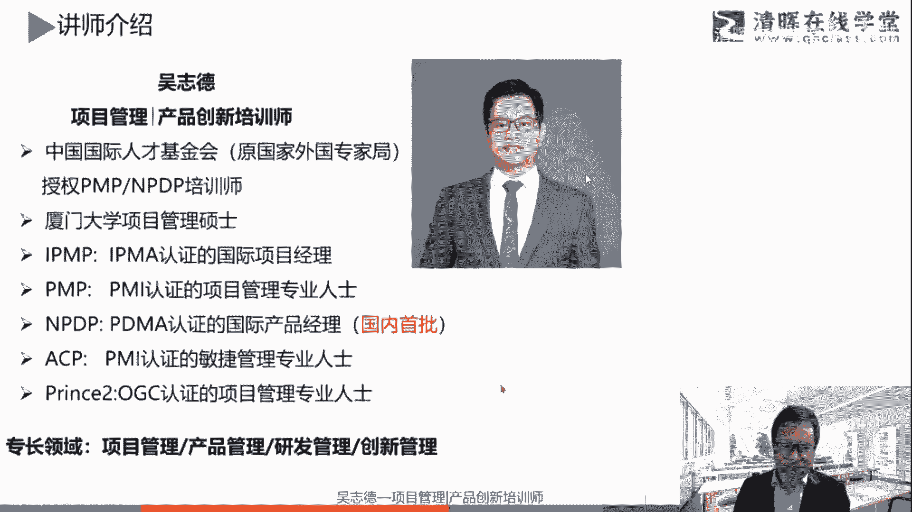

# 90分钟掌握思维导图常见玩法，PM必看！ - P4：思维导图怎么画？用项目管理思维看世界！ - 清晖在线学堂 - BV1WP411s7GW

好今天晚上跟各位线上的伙伴进行一个分享啊，分享的主题叫做项目经理的思维导图，那其实这一个对大家都可以看到，其实不只是项目经理哈，我们其实更多延伸，其实应该是所有职场人士，许多需要的一个项目呃。

那个思维导图啊，所以这是今天的一个主题，那我们就进入到对应的内容。

那个人的一个简单信息作为简单了解哈，其实就是大家看很多对应的内容，其实整体围绕起来就两个P啊，一个是project manager，项目管理，一个是product manager。

就是产品管理相关的这个内容啊，那相信咱参加清辉的很多小伙伴，都对这些对应的认证啊，都是比较了解的啊，那我个人也是那个官方授权的PNP，跟NPDP的一个授权培训师，那至于其他的各种认证啊，如果大家感兴趣。

都可以像咱们清辉对应的各个课程的伙伴，去了解和咨询相关的内容啊，可以集齐各种的批啊，我个曾经之前开玩笑说及西七个pk召唤神龙啊，当然其实P有很多啊。

这个就不展开了哈，作为一个了解好，那今天跟大家分享的一个主题，是关于项目经理的思维导图，或者说职场人士的思维导图，所以这个不限于项目经理哈，所以整体是所有咱们都是有工作的，都是职场人士都需要的。

各种的相关思维导图的一个应用，那首先这一个主题哈，围绕就是思维导图，大家会觉得唉这个思维导图现在应该不陌生，那首先思维导图这个词，其实又可以拆分成两个啊，一个是思维，一个是导图。

那思维导图其实大家也觉得它其实可以调转，思维导图，一想起来就是一个图对吧，是我们日常工作中经常用各种软件，比如h m MAD manager等等的，或者百度脑图等等的工具啊。

大家职场人士可能用电子弹用得多，但其实反转一下，其实就是导图思维思维，导导图只是呈现对吧，那在背后更多是一个导图思维啊，所以先有一个思维，再有一个导图，我们常说任何事物的产生其实都有两次。

第一次是在大脑里的产生，第二次才是在真实世界的存在，那所以第一次在大脑里的产生，其实就是想法思维，那第二次在真实世界的存在，那可能有很多对应的存在啊，包括最开始的一种呈现方式，可能一种存在。

可能是一张图纸或一张导图或一个手绘稿，或者一种视觉语言表达的方式，包括可以你要通过口头语言把它说出来啊，这也只是把想法传递出来的，那传递出来，完成之后可能才去真实世界中把它做出来，把它呈现出来。

这就是最终的第二次的一个产生啊，所以这个思维导图，其实所以开始的原点其实是一个思维。

我们要有导图的一个思维，那所以大家可能会觉得诶，思维导图这个事情是不是很简单，在工作中经常用啊，相信很多伙伴都经常用哈，不陌生，但是通过今天的一个分享，相信大家晚上分享完再去总结。

也许会觉得唉原来之前是进行思维导图，但是可能只是做了思维导图的其中一一部分啊，或者一个方向的内容，可能更多是基于逻辑性的呃，对归纳总结整理的啊，对应的一个内容，那我们今天还会展开来更全面的啊。

把把整体的一个思维导图，整体的一个方式，包括做法啊，整体的前面的包括新法的部分呢，比如说我们刚才说的导图思维，这个对应的思维给他对应介绍一下，当然本身思维导图在现在，相信大家啊并不陌生啊。

那另外我们结合这个整体的主题，叫项目经理的思维导图，那相信很多在线上的伙伴都学习过相关的，项目管理的对应的课程啊，比如PNP对应的一个学习，那既然介绍这个主题，我们结合项目管理对应的一些思维。

做一个简单的一个导入啊，包括用项目管理的一个思维去看世界，包括这个项目管理的思维，这个核心的思维啊，整合分解系统思维，跟我们今天的主题思维导图，有什么对应的关系啊。

这第一部分更多只是一个简单的一个导入哈，不是主要围绕项目管理在展开的内容，那第二部分是涂鸦思维导图哈，这第二部分是今天的一个主体框架内容啊，我这个涂鸦思维导图，我个人认为这个课程是我那个手串啊。

对于加了两个涂鸦啊，进行对应的一个结合，它并不是画画，也不是电子版，更多是一种涂鸦，那至于为什么叫涂鸦思维导图，那我待会跟大家进行展开来介绍一下啊，那第三个啊，我们常常说的干货啊。

或者说对应的一个工具本身的内容，那我们结合实际工作中，大家都是职场人士啊，包括我们实际的一个项目管理过程中呃，对应的一个思维导图的一些应用，做一个举例哈，这些相信大家平常工作中，都会经常都有使用到啊。

包括你用的一个电子版的，用电脑的一个方式，那今天结合跟大家在工具部分也介绍一个对应，好用的工具，那至于是什么啊，先卖个八，卖个关子啊，待会进行介绍啊，好那今今天整体的一个内容框架。

我同样也用一张思维导图的方式，跟大家进行呈现结合，那虽然只有短短的一个两个小时的时间，来让大家也一起重温一下哈，因为可能线上很多伙伴都是学过项目管理，比如PMP对应的一个内容啊。

我们只是简单重温一下一些核心思维，那结合这个重温的核心思维，导入到同样思维导图这些整体的一个介绍，它的基本原理跟画画，包括简单说一下它的来龙去脉，那也许大家平常实际工作中都在用，但是也许没有那么的考究。

去追究它的来龙去脉，以及它的整体的一个背后的框架原理，新华部分分别是什么，也就我们常说的思维对应的部分的内容，那接着就是我们也常说了，那既然参加对应的一个分享，要有干货能够获得，那通过今天的内容啊。

上完之后拿来就能用啊，对应有些好用的东西分享给大家啊，这些都是免费的啊，多对应网络对应的旧友，好的一个免费的一些资源，那比如好用的工具，待会跟大家介绍，而且里面有很多好的。

一个职场中能应用到的一个模板好。

那整体我们就先进行第一个部分的一个导入，用项目管理的思维去看待世界，那相信很多伙伴上完项目管理相关的课程，包括通过NPNP或者P2等等的，其他项目管理相关的认证课程，那也许你会思考诶，我考完这个认证。

或者说我还没考之前，参加完这个认证有没有什么好处，从性价比的角度，这些投入产出有没有对应的收益，其实我个人认为其实一个很好的一个收益，就是你可能不能直接从目前看得到的去衡量，但是从思维的角度你会发现。

可能你看待这个世界的方式不一样的，你带着向管理的思维去看待这个世界，那我这里举例一个效应，就叫孕妇效应，什么意思呢，就是如果你怀孕了，你会发现好像走在哪里都会经常看到孕妇，那以前没注意。

突然间因为自己怀孕了，就发现身边都是孕妇，这就叫做孕妇效应，那我这个是自己有感同身受的哈，那当然不是说因为我怀孕了，所以就有用户效应啊，就当然是我哭了啊，我老婆怀孕的那阵子哈。

我就经常会看到周边好像也有很多孕妇，那这就是对应的一个孕妇效应啊，有问道课件可以分享吗，呃那个我今今天有分享的一个版本哈，可以你连对应到链接到相关的一些我们的课程，小伙伴啊，可以回头课程结束完啊。

可以获得对应的一些课件啊，好那所以这就是用户效应啊，那用户效应延伸到我们项目管理思维是什么呢，你学完项目管理，你带着这个用户效应，你带着项目管理的思维方式去看待这个世界，哎你也许会发现有不一样的内容啊。

所以我们这些简单的总结一下哈，管理项目管理的话，数据当然这个道法术器其实源于我们我国呃，老祖宗关于道家的一些整理，唉，其实你带着道法术去去刨，解析任何的学科或者知识，会发现。

他无非也是围绕这些不同层次进行展开啊，那这个道者天道啊，就是我们常说的思维方式啊，或者说那个方方式内容不同啊，这那法为人定就是人为的方法，战略那数是技术层面的一个操作方法啊，战术那气就是有形的物质。

还有形的工具，还有体系模板，软件表单等等，你发现如果你学习任何的一个学科或者知识，你去理解它，也许就会看待到某些不同的层面的解析，然后可能这些对应对应的是进行对应的一个，结合的。

那这个我们就简单说一下哈，比如说从交通的角度哈，到就是你的方向啊，比如你我们乘以常数的南辕北辙，也就你方向要选择正确，那反而就是选择的路径啊，那气就是开车技术，我们说是新手还是老司机。

这对达到的目标的一个效用度是不一样的，那气我们说用好用的工具，用什么样的车，是开奥迪还是开奥拓，对于这达到目标的一个效果，效率上也是有不同，那项目管理上啊，包括我们对应说到的，今天结合这个主题。

到就是我们说项目管理的一个思维方式，这些也许我们不能很直接的去衡量它，但是它可能融入到我们对应的生活中，你学完项目管理也许更有统筹思维，更有统筹协调，整合分解对应的这种思维做事方式在里面啊。

逐渐的也许你身边的人会感受到诶，好像这个小王今天这几年，最近好像做管理方面，做统筹事情的一个方面好像不大一样哦，啊有进步啊，这其实就是项目管理对应的提升啊，对对应。

往下来我们说对应的法就是对应的一些方法论，然后树上面哎，我们有一些项目管理里特有的一些技术，比如WBS怎么分解，比如网络计划技术啊，网络图啊，政治分析如何进行啊，这些相信我们在项目管理对应的课程。

大家都要学习到，那七就是项目管理相关的一些对应的工具，表单啊，模板等等，那包括我们今天学的思维导图，其实你也在理解哈，对应的道法术器也有它对应的层面，我们通常如果没有学习。

直接拿个工具来用mana manager sm，然后用个套用别人的模板表单等等，这其实是开始从去的层面，我们经常说诶上干货啊，直接一来就是上干货，但其实不要忽略了他底。

所以上层的这些对应的道法术对应的一个内容，所以这是就是今天的道法数据。

跟大家进行导入啊，或者重温一下项目管理，那我整理一下项目管理，其实有一些核心的一些思维，比如这三大核心思维，第一个以终为始啊，结果导向啊，我们要有对应的一个结果导向，第二个就是我们是有计划执行控制啊。

我们的项目管理的一个五大过程组，启动规划执行监控收尾啊，做任何事情，凡事预则立，不预则废啊，这就是对应的是有计划啊，包括过程中对应的执行跟对应的监控，那今天还要跟大家重点说明的，跟这个主题相关的。

其实是这个整合分解系统思维，让我们看思维导图，相信大家不陌生不陌生，它有一个中心向外围不断的划算，那这其实就是一种系统思维整合，包括结合的项目管理的整合分解，其实是一一对应的啊。

我们把这一个进行整合分解，跟思维导图如何对应，跟大家进行说明一下，第一个就是项目管理的整合分解啊，系统思维，但我们常说要有整合的能力，做一个项目经理，当然作为一个高效的职场人士。

也是需要有整合的一个能力，那既有整合可能也还不行，还需要事情落地，需要进行分解，所以需既要有更全局观，也要有不断的一个分解去安排，就像这鹰的眼睛一样啊，鹰的眼睛在整个天空中去盘旋。

它需要能够广阔的去看待这个视野，这个草原，这就是一种整合啊，细广角的一个镜头的一个角度去看待，当快速要聚焦到一个兔子去定位的时候，又能够快速的不断的聚焦，去分解定位以及俯冲去捕获这个猎物。

这就是对应的一个鹰眼的一个作用啊，就像我们说现在的摄像机一样，或者说单反一样啊，同样有广角镜头，有长焦镜头啊，既能拍更广角的角度，就是一种更大的一个格局视野，又能够快速的不断的一个聚焦。

但这个清晰度更高啊。

这就是对应的一个两个方面，所以整从项目管理的角度整合，需要更大的一个全局观，更大的一个格局，能够站得更高，看得更远，需要有更大的一个境界，比如我们强调在，为什么项目经理要有，结合到组织战略的一个能力。

能够看到这个项目跟这个组织战略的一个，定位的一致性，为什么要做这个项目，这就是需要站在更高的格局跟角度，去看待这个事情，同样要能够整合更多的一个资源，更多的人为你所用的任何事情，来去完成这个项目。

那只有整合能力可能不行，然后还需要对应的一个分解。

那我们想象一下哈，其实整合分解，包括你看待事情的一个视野的角度。

你想象一下你在开车，其实可能有两个维度的视野，想象一下不断的一个抽离，比如说你想象现在能看到的是，眼前的视野在不断的抽离，你能看到自己的方向盘在不断的抽离，你假设能看到自己这台车在公路上跑，再想象一下。

可能你的车你移动的轨迹就是导航中的一个点，这个点就在整个地图中进行盘旋啊，这就是你看到的可能就是导航的页面，这就是不断的一个抽离，能够看到更大的一个视觉的一个角度，那同样的，如果你把它不断的聚焦。

比如你把它不断的一个缩进去，能看到这棵树树旁边有个电线杆，然后树上可能停着一只小鸟，小鸟可能嘴上正着了一只小蚯蚓，这就是不断的一个聚焦到中间的一个点，的一个过程，这就是两个看待事物的一个方向。

那他结合我们的思维的方式，就是发散跟聚合思维。

就是结合我们今天的一个主题，那这个聚合思维和发散思维同样，如果是写NPTP，它其实也是我们在讨论事情，看待事情的一个两个方向的维度的一个内容啊，所以我们学任何一个知识之后。

发现知识之间有相对的一个关联性。

那结合这个整体的今天的一个思维导图哈，那我们后面会谈到思维导图无非就是两个方向，一个向内，一个向外的一个发散聚合跟对应的过程，那从项目管理的整合，我们做项目经理是一个整合者，你要整合各个对应的约束条件。

包括整合各种资源整合，最终让整个项目能够完成啊，达到对应的主要干系人对项目的一个满意。

那同样的事情还需要落地跟进行分解啊，事情要有人干，要落地，要分配啊，活要有人干，事项要不断的细化啊，这就是进行分解，所以在写项目管理中，有一个非常重要的就是WBS，先如何来把这个事情给进行分解。

那工进行工作分解结构的一个划分，那有了WBS，它就是我们整体的很多事情的一个原点，跟基础等于BS，你再结合时间可以整理成对应的甘特图，然后再加责任人，可能就再整理一下，有了责任论，责任举证。

再结合资源的维度再进行整理，有资源分解结构，再结合风险，有风险分解结构等等的内容啊。

我们这些只是做一个重温，所以那另外从综合的角度，你要又要在全局的角度看待，这整个项目如何去实现项目管理的一个，可视化的一个全过程，如何结合你项目的目标啊，进行对应的拆解，然后如何进行做计划。

然后在整个按照这个计划如何去执行，那过程中需要实时的监控，是否需要进行调整，那最终才能够让干系人多对应的满意好。

这就是我们进行一个简单的回顾，回顾一下项目管理的一个整合分解的思维，那项目管理整合分解这些这个核心思维，结合思维导图，我们就说发散收敛对应的内容，相信这个思维导图这种图示方式，在现在大家应该都不陌生。

那有一个中心图多级的分支，一层一层的展开，那再用对应的一个曲线方式进行连接，那上面再有对应的关键词啊，这个相信大家经常对应的使用，特别是用软件，但是经过过往统计哈，相信大家可能用手绘的方式应该做得少啊。

那其实用手绘的话。

也是有思维导图的一个零粉啊，我们待会儿会来跟大家介绍。

所以前面这一个部分作为一个导入啊，再接着往下呢是进行进行，到今天晚上分享的一个主题，叫做涂鸦思维导图哈，那既不是手绘啊，也既不是绘画式维导图，也不是电子式维导图，那我们其实要回归原点。

这个思维导图的原曲是什来进行跟大家介绍。

那首先其实我个人这一个情况，跟思维导图的一些联系，跟大家报告一下哈，首先这是我最早接触思维导图相关的书籍，大家这个看过手写的日期是2000年6月购买的，距离现在过去的22年的时间对吧。

那当然这个其实是经典的，那个通灵波战的思维导图对应的书籍是的，对应内容最开始其实只有四本，那到现在应该不止有好多本，那最开始有包括启动知识记忆，快速阅读啊，思维导图启动大脑等等对应的一个内容，那这就是。

2000年啊，那这时候我应该是在咱们国内比较早，也使用思维导图这个对应的一个方式，那相信大家现在使用思维导图应该也很多，特别是在进行备考，不管你是学生时代还是现在工作中，考证备考学习。

包括工作中心整理知识树或者笔记数的方式，会用或者工作数据的方式会应用应用的多。

那我们今天围绕进行对应跟大家展开，那这里有几张例子哈，就是我个人平常中画的一些思维导图，当然也有电子版做的一个思维导图，那这一张比如我理着一张图啊，这个就是我们常说的图啊，我常说的涂鸦思维导图。

那为什么是涂鸦吗，第一那可能大家网上会看到，有很多精美的绘画的思维导图，大家会为之一愣啊，那是不是美术生才能绘绘，绘画出这么好的一个思维导图，咱们实际那个画画水平有限啊，可能做不出这种方式，那以基于此。

可能只能用电脑敲一敲了，所以其实不见得啊，所以既然是涂鸦，大家就觉得诶不一定要画的有多精美，但是有点配图对应的一个方式啊，这些对应的一个画的啊，我这个取得一个主题是师傅和师傅啊。

这个师傅这个一个是父亲的父哈，一个就是我们常说打个比师傅去哪里啊，这对应着一个师傅的对应的词啊，两个词是有不同的哈，这只是举例就不展开，做这个图是什么啊，那同样的呃这个我是对应的做一个笔记，是关于涂鸦。

涂鸦是什么啊的对应的一个展开的一个说明，那具体咱也不说明这个涂鸦是啥了啊，待会的一个课程会展开，那同样的呃这个有手绘的，也有一些电子港港的方式，比如这一个是关于一看就是读书笔记对吧，那这是一本书。

叫关键20小时，快速学会任何技能的一个，这个读书笔记啊，同样是用思维导图的一个方式跟进行整理，那也是用软件啊，这个软件相机有挺多人用啊，以前我其实用思维导图软件，用的最多的是MAD manager啊。

那这几年有转换的另一个软件，那待会跟大家介绍，那同样的这也是另一个，这只是一级分支哈，这还有一个下级分支的一个内容啊，这是关于家道的一些对应的一个主题，每个主题要展开对应的其他的内容啊。

有一期是这一也是一个体系课程啊，有11节课是一个主题啊。

好那这张图也是我原创哈，在我整个培训师成长过程中，后来我进行对应的一个总结啊，关于TTT的在培训时期是对应的一个舞演啊，包括讲演导演推演，排眼跟路演对应的内容啊，所以大家可能看到。

咱们报过不同的一个培训师啊，为什么来进行到对应的一个授课或者分享，那其实背后也是有很多不为人知的一个部分，可能大家看得到的可能往往只是道，讲演这一块啊，比如现在现在对应的内容，也就这其实是外显的部分。

那其实可能看不到的是后面对应的一个内容啊，这也不跟大家展开了，但是从这张图来看，大家会看到整体的一个思维导图的一个呈现，包括有配图，包括连接，包括关键词的一个提炼，还是经过比较充分的一个考究的哈。

待会会给大家介绍，那图一下思维导图呢，其实这种动手的方式其实更好的一个方式哈，如果大家能够面对面来进行，会更丰富多彩啊，这一个比如像涂鸦思维导图的一个课程，以及对应的一些涂鸦思维导图的一个大赛。

比如这就是一个简单的一个体力啊，这个涂鸦思维导图的一个课程，我个人认为是我无心插柳，或者说不易不务正业的一个课程，但是我个人其实非常喜欢，包括参加的一个学员跟伙伴也发现，即第一他有意思。

第二他能够真正是好简单好用，但是能够提升大家的工作。

