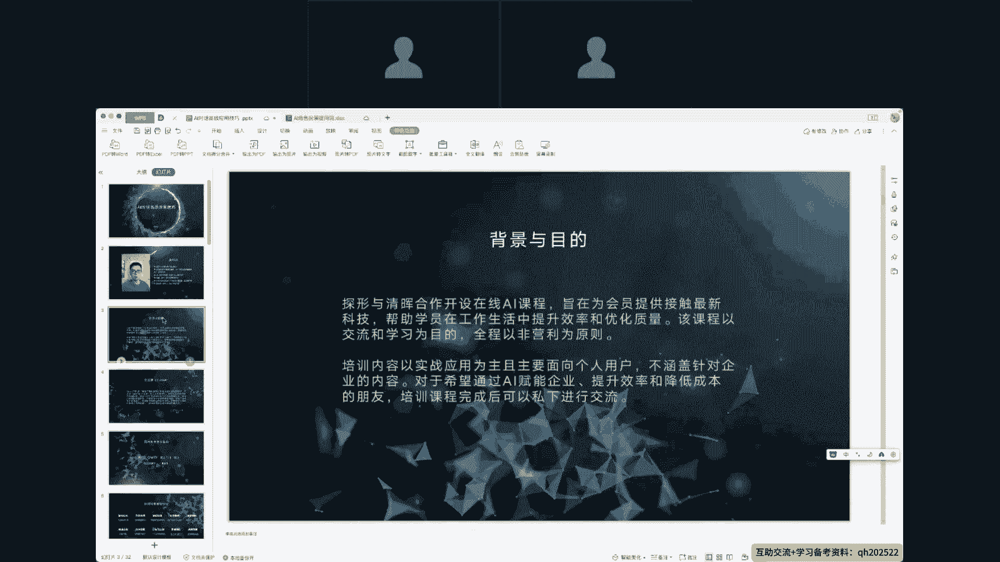
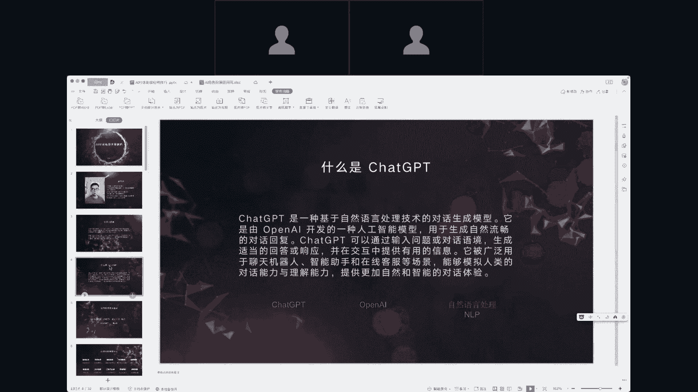
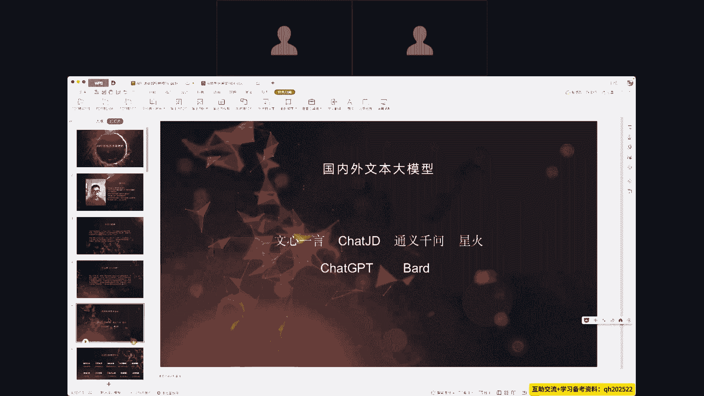
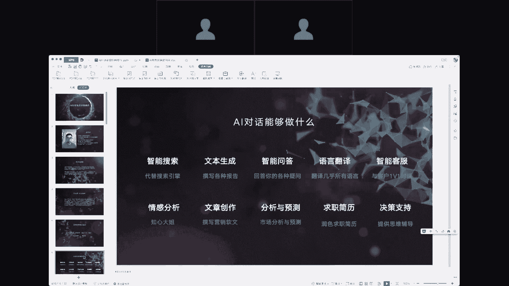
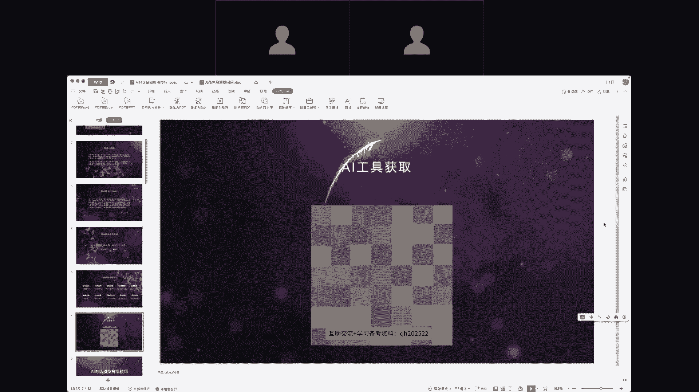

# AI 对话高级应用技巧 - P1：1、课程导读 - 清晖Amy - BV1kaWpeXErK

今天的这个课程呢是我们探寻和清辉一起合作，做的这么一个课程啊，中指呢是为大家谋福利，所以当前嗯讲到的内容，包括后续所用到的工具都会免费提供给大家。

大家可以直接申请使用，相信所有听咱们今天内容的朋友，或多或少都接触过相关的内容，有些人可能使用过，有些人没使用过，那么chat g b t它是一个什么产品呢，它是基于自然语言处理的这么一个。

可以把它叫做聊天机器人，它是由美国的一家公司OpenAI开发的，最核心的关键词呢是自然语言处理，也就是说我们在使用这个chat GB t的时候，和他的互动，全程是以我们的自然语言，我们和人如何沟通。

其实就和他如何交流就可以了，那么今天我们所聊的方向。

所使用到的工具也是基于ch了GBT的，现目前来讲，国内国外其实有非常多的大模型，但是从我们从业人员的观点来看，chat GB t他的能力上面还是要比其他的文本大，模型可能有一到两年的一个嗯差距。

就其他的模型相对于chat gbt，所以我后续讲到的内容所使用的工具，也是使用chat GB t来嗯做演示嗯。

首先AI对话能够做些什么，只要使用过的人或多或少啊都去尝试过了，那么可能没有使用过的朋友呢，还并不知道他是能做什么，我在这儿列了16种应用场景，比如说它能替代搜索引擎，帮我们搜索一些资料，最常见的。

或者说现在正在发生的就是微软的搜索引擎，它现在已经集成了AI对话的内容啊，文本生成，我们让他写报告，写简历啊，做各类事情都是可以的，这只是简单的列了一些他能做的事情。

实际上AI对话它所涉及的内容非常非常多，甚至连开发人员可能都不知道。

他未来会变成什么样子，今天我们的内容是以实战为主，所以关于chat gbt，它的里面的技术或者之类的方向，我们都不会提的太多，也包括方法论之类的之类的东西，我们也不会提到太多，所以接下来到技巧层面。

我会一边给大家讲这个技巧，然后一边让大家去实战使用，我们在这儿提供了一个网址，大家可以先注册一个账号，我们会免费给大家提供，chat gbt的一个对话的产品给大家，大家可以直接使用。

那么我先给大家可能2分钟的时间，大家可以先注册一个账号，如果是电脑使用，那么直接打开这个网址就行了，如果是手机呢，可能大家操作会相对不方便，可以先听我们的内容，然后后续再去注册，如果是手机。

大家要使用手机的浏览器来进行注册，大家在注册的过程中啊，我稍微介绍一下啊，我们探寻AI平台，这个平台是做什么的啊，首先AI平台它肯定是一个平台呃，基于这个平台呢，我们现在目前有三款产品啊。

分别是AI的数字人，它是可以利用数字人快速来制作短视频的，一个呢就是AI对话，就是今天我们主要探讨的事情，还有一个呢是我们最新上线的叫做实景AI直播，简单来讲就是让AI帮我们做直播啦，直播卖货啊。

这个平台会啊开放给所有参与的学员啊，大家可以随时注册账号，并且不仅仅是今天免费提供给大家，后续也会嗯永久免费提供给各位，如果有朋友需要使用。

