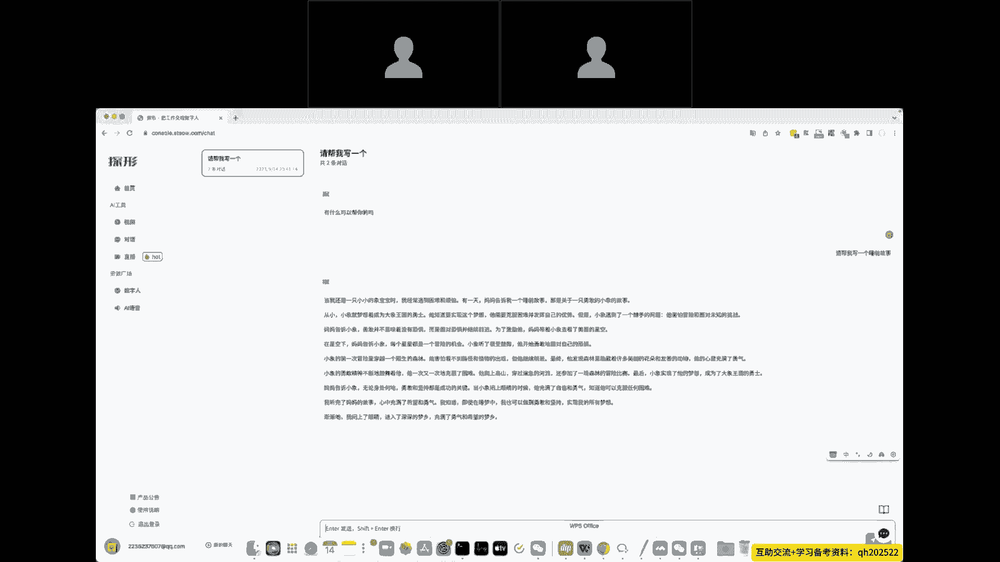
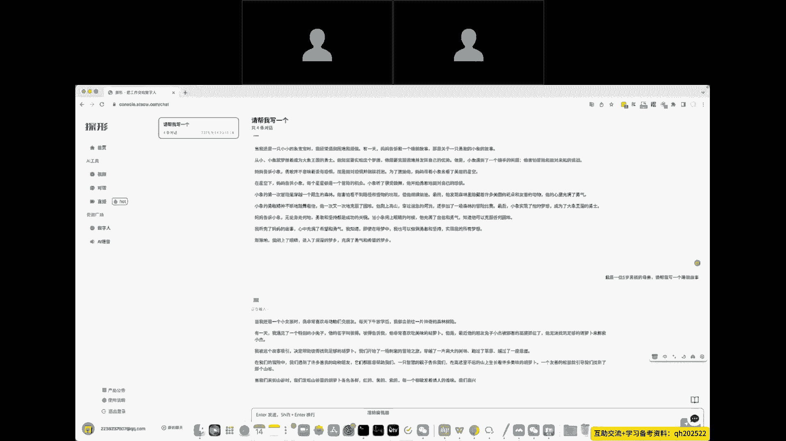
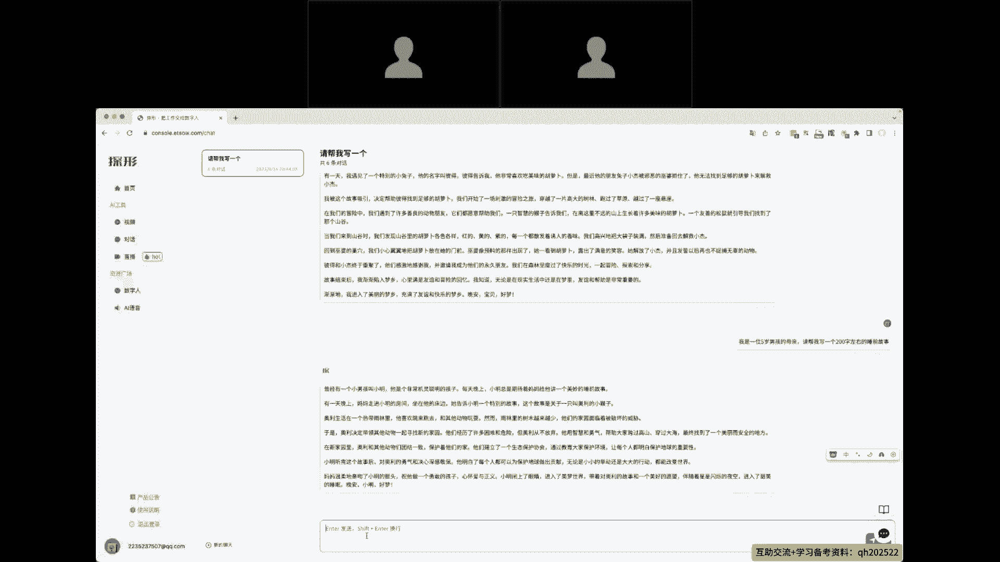
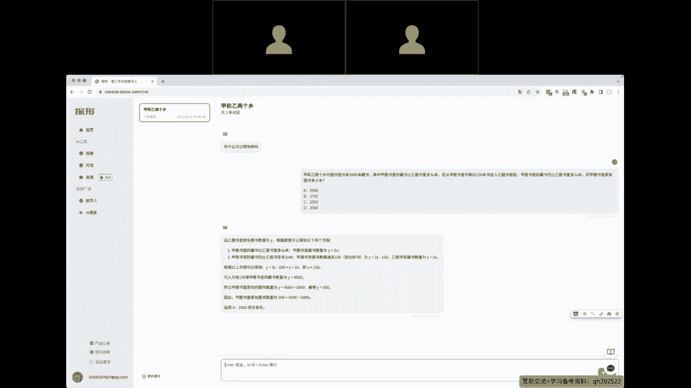

# AI 对话高级应用技巧 - P2：2、7个通用类技巧（1~7） - 清晖Amy - BV1kaWpeXErK

我们今天的技巧内容呢是分为三部分，第一部分是通用技巧，然后第二部分呢是工作效率上面的，第三个是学习效率，但是呢面向的内容方向都是个人技巧，一让AI来扮演专家的角色，在上一节啊郭老师讲的内容里面啊。

AI时代项目管理的成功技能，或者说项目经理这个是一个标准的角色，我们有非常非常多项目管理当中，可能会产生的问题，那么如何让AI来帮我们解决呢，这个就是技巧一所能带给我们的一个价值。

我们可以让AI来扮演很多很多的角色，那么我这整理了一个表格。

比如说让AI来充当我们的翻译，让AI来充当我们的面试官，我们可以和AI来进行一对一的沟通，在面试一家公司之前，我们提前就能和AI这位面试官来做一次模拟，让AI来作为辩手。

让AI来做到我们的项目经理的这么一个角色，让AI来担任小说，帮我们写小说，让AI来帮我做我们的老师，然后让AI来嗯当我们的职业顾问等等等等，这些都是可以的，我这个模板里面整理了100种。

让AI来当我们的这么一个角色的提问模板，大家只需要把右边的我提前编写好的模板，提交给AI之后，他就可以充当我们想要的角色，我们就可以和他一对一的进行交流，那么我们今天因为是实战课，所以尝试一下啊。

我们让他做一个，做做一个厨师吧，我们让他好，我们尝试一下啊，网站我已经提前注册登录了，进去之后，左边的对话里面就会进入到这个菜单好，我们把这个提示词发给他试试一下，我们让他帮忙，让他做一个厨师好。

接下来嗯，我们想要炒一个什么菜，可以看到这位厨师已经给了我们一个菜谱，那么我们按照这个菜谱，就可以做出我们想要的东西，回到。

呃这个表表里面的所有内容，后续我给我会发给嗯，老师或者发到群里面，大家可以直接使用，那么技巧二告诉AI你的身份，我们常常在使用AI对话的时候，会发现这么一个问题，我们让他写一段文案，写一个报告。

他给出来的内容永远是通用性的，如果以我的话来说，就是他永远是正确的废话，所以有些人总结AI这个还是不行，还是不能用，其实是不对的，技巧二就是要解决这个问题，我们在给AI对话的时候，需要给他限定一个范围。

如何限定一个范围呢，其实就是告诉他我们的身份。

那我举一个例子，我们让AI帮我们写一个睡前故事，好看可以看到他正在写嗯，睡前故事，我们细看的话，发现这个故事呢很正常，很通用，但是我们设身处地的想，假如我们的孩子想要听睡前故事。

那么我们的孩子是一个五岁的孩子，和我们的孩子是一个十岁的孩子，是女生和男生，他们想听的故事是不是不一样的，那对应到当前的技巧二。

我们就应该怎么提问呢，我们要告诉他我们的更细节的身份，细节的信息，那我换一个提法。

我是一位五岁男孩的母亲，请帮我写一个睡前故事，这个时候我们就发现，AI给到我们的答案是完全不同的，他已经在我们限定的范围内给到了我们的答案，这就是技巧二给到我们的价值。

利用这个技巧可以在非常非常多的地方使用，如我们让他写报告，写文案等等的方面，都可以用到这个技巧，那么技巧三限制AI的回答长度，AI的写作的内容一般来讲它会在100到200字，但根据情况也有可能不同。

我会发现之前有一些会员，那我们平台上的会员，他会让AI帮他写呃，一些宣传的营销的文案，那AI他并不知道真实的情况，所以他会按他的理解写出文案，那个文案我看了一下，普遍在两三百字之后呢。

我们的学员又会提另一个要求，就是你的这个文案再短一点啊，他会老是会去提短一点，可能AI也没理解到他的意思，所以他每次这样体验，AI也没怎么理他，那么技巧三我们怎么使用呢，很简单。

以刚刚的为例子，还是我是一位五岁男孩的母亲，请帮我写一个睡前故事，那么我们可以进一步提要求，请帮我们写一个200字左右的睡前故事，这样可以让AI给出来的内容更精简，这个地方要注意一个小技巧。

我会发现有些朋友让AI帮我们写小说，或者说写大段大段的文章，他会写啊，你帮我写一篇论文，举个例子是这个场景，你帮我写一篇论文，那么写多少字呢，写8000字，把这个文案提交给AI之后，好像没什么反应。

AI给出来的文章依然可能是800字啊，500字，这是什么原因呢。

是因为每一个平台所调用的接口，它都会有一个字数限制，所以无论你再写两千五千八千，他都不会触发那个数字呃，当前我们平台的字数限制是1000字符，也就是理论上讲可以生产800个字左右的文章。

所以这个大家要注意，每个平台它会有不同的限制，有些平台它限制更更严，所以并不是AI不能帮你写这么长，而是平台给你限制了啊，仅此而已，好技巧四，让AI1步一步的思考。

我们常常会给到AI1些逻辑非常复杂的内容，AI回答的内容呢也不是我们想要的，但是无论如何，我们重新问问题，他依然不能给到我们想要的，那么怎么办呢，我们应该让AI1步一步的思考，它和人是一样的。

我们看他如何思考，我们就知道他哪一步思考错了，当他哪一步思考错的时候，我们可以用文字来提醒他，这样让他可以修复他的思考，最后给到我们一个质量最高的内容。

那么我这做个演示，一道数学题，给了他之后，可以看到他是如何思考的，他会告诉你，哪一步错误了，我们就能够很清晰的知道，那么这个技巧在特别复杂的情况下。

逻辑特别复杂的内容，我们让它做非常复杂的事情，非常有用的，那么技巧五呢明确我们的要求和目的啊，我们常常会接触很多程序员啊，所以程序员用啊chat GB t的频率是非常高的啊。

他们会习惯的把一段错误代码给粘贴进去啊，提交给AI，有时候AI能正确理解他能想要做什么，有时候其实并不能哎，他有可能理解为是想要总结，那段错误代码是什么意思，也有可能理解为四。

那段错误代码之后应该如何解决，所以技巧五我们在任何情况下，都需要先告诉AI，我们的要求和目的是什么，否则AI会以他各自己的理解给到我们答案，技巧六要给到充分的背景信息。

我尝试做一个案例，我们让AI帮我们写一份减肥计计划，啊我们让他写一份减肥计划，看看他会给到什么内容，可以看到设定目标，饮食控制啊，运动计划等等吧，总结起来就是也算是正确的废话。

那么我们如何进一步让他给到我们更好，质量更高的呢，需要补充更充分的本体信息。

那么我把刚刚问的那个问题换的更细一点。

那么我是35岁男性，身高1米75，体重是多少，比较喜欢吃碳水，步行多少，那么我的目标是什么，我们把这段信息打给他之后，我们再看一下他怎么回复好，依然是设定目标，他把目标给你细化了，依然是隐私控制。

还给了了咱们具体的数量，具体的数据运动计划呢，每天要走多少步，全部给到我们了，我相信这个至少要比上一个内容要高很多，所以当我们发现AI给到的内容过于通用了。

过于正确的废话了，那么我们就要想一想技巧六，我们有没有给他充分的背景信息，让它在我们的范围内来回答我们的内容，技巧七是我们这一章节最最核心的内容，无论是chat GB t还是其他的AI对话。

我们都有一个公式，这个公式呢我把它叫做万能提问公式，那么大家要记得这个公式，我后续也会提供给大家。

大家可以看一下，这个公式呢是由四个部分组成，它是一个结构化的指令词，就是我们要让他做什么翻译，什么东西，写什么内容总结，什么东西都可以输入呢，就是如果是让他写总结。

那么我们让他写总结的内容得提供给他背景啊，刚刚有提到了，我们如果让他写一个销售计划，写给销售总监的销售计划和写给普通员工，那肯定是完全不一样的，那么这个背景就是让它可以缩小范围，最后呢是输出要求。

我们让他50个字以内，还是以表格的方式输出给我们，还是以额嗯呃图表的方式，或者说其他方式，它都在这个可选范围内，万能公式一定要记得，只要记得这个万能公式，那么我们之前这一章讲的所有技巧。

应该完成八九十%提升，八九十%的质量应该是没有问题，虽然说我们不需要每次提问，每一次和AI的沟通都使用这个万能公式，但是当我们发现它的质量不如我们预期，或者他写的方向不是我们想要的。

那么就可以用万能公式来尝试一下，那么通用类的技巧一共七个。

