# AI 对话高级应用技巧 - P3：3、8个工作效率类技巧（8~15） - 清晖Amy - BV1kaWpeXErK

接下来是工作效率的提升，技巧八，帮你写个性化的简历，我们在应聘工作的时候，常常会投简历，那么简历几乎是一模一样，我们投十家公司，100家公司我们不可能写100份简历，1000份简历对吧。

那么这个内容这个方向就是AI擅长的，我们如果要投一家公司，这家公司的JD常常会在啊网站上会提供出来，那么这个技巧如何使用呢，只需要把我们的简历提交给AI，并且把我们想要应聘那家公司的JD告诉AI。

让他帮我们合成一个新的简历，这样我们投任何一家公司，他就会千人千面，会帮我们生成个性化的简历。

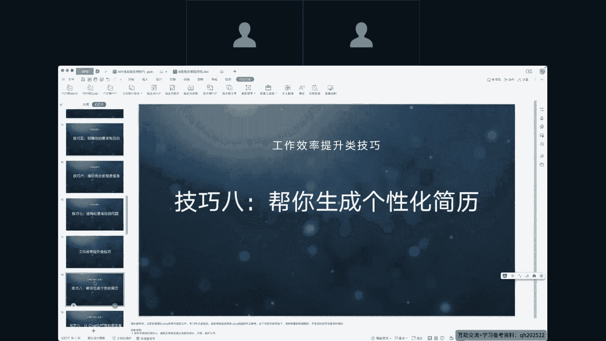

那么我这儿做一个简单的演示，我告诉他一个基本信息，但是最好呢是我们给他一份简历，我们之前写好的简历，让他和我们新获取到的JD进行融合，看一下实际的效果，可以看到，他已经帮我们。

把自己的工作经历和应聘公司的简历要求，进行了二次组合。

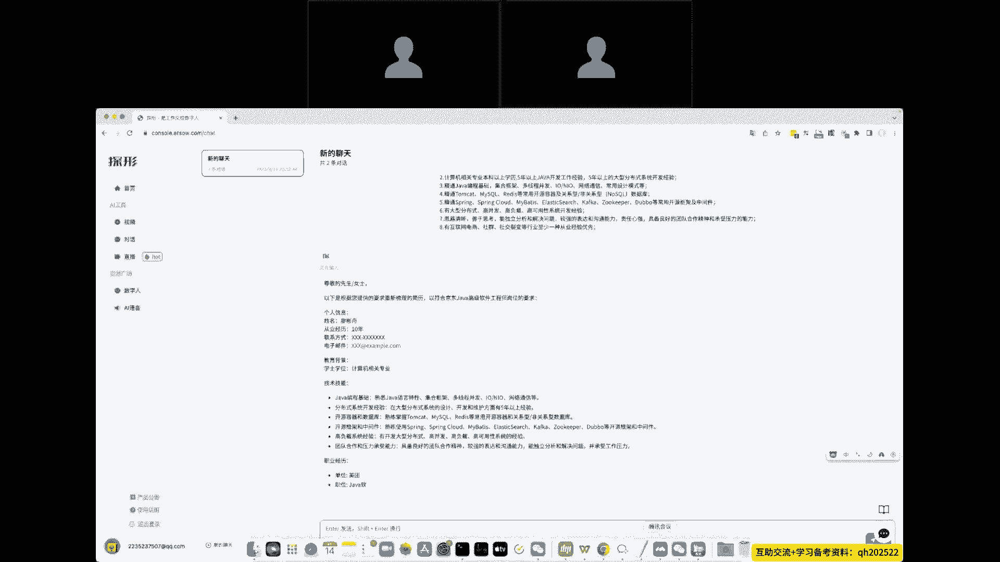

技巧九让chat chat gbt帮你写周报嗯，这个技巧我其实给很多人都说过，我说你可以让chat gbt随时帮你写周报，写报告啊，写月报年报都是可以的，他们给我的反馈是。

chat gbt写出来的周报完全没法用，这个首先一看就是AI写的，第二个呢它的内容质量也很差，技巧九就是解决这个么这么一个问题，我们如何chat gbt帮你写周报呢，我在这告诉大家一个技巧。

首先把我们之前不管是几个月还是几周里面，写的比较好的周报先发给AI，同时提问给到他，让他按我们之前的这种风格继续帮我们写周报，那么恰GBT就会使用之前的周报的格式和逻辑，继续为我们写周报。

所以写出来的周报质量上面不会比之前差，同时我们如果能给到一些数据层面的东西，让他给做二次整合，那么我们的周报就能完美的呈现出来啊，因为我这没找到周报，所以这个地方我就不做演示了，大家可以尝试一下。

把之前写的周报也好，写的报告也好，来做一次二次的整合，而技巧时让AI给我们提供一些思考方向，嗯我们常常在做营销活动也好，或者做更多的决策也罢啊，思路上面会陷入一些瓶颈。

这个时候让AI来帮我们提供一些思考方向，是非常有用的。

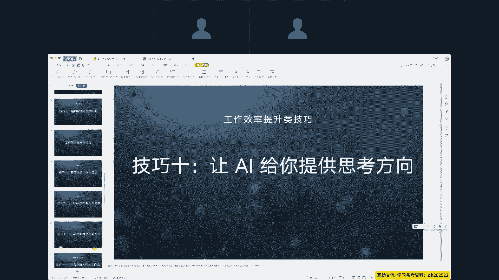

那么我这儿提供一个案例尝试一下啊，我是一家安全公司的销售总监啊，背景信息是啊，我们和呃对手正在抢夺啊，政企客户，我们的老客户受到很大影响，请帮我想三个力度不低的活动，我们看一下他会给到我们什么。

OKAI就会给到我们三个不同的活动，我们会会不会去使用这三个活动呢，不一定，但是这三个活动，至少给了我们一些思路上的提升，思路上的打开，那么我们换换到项目管理里面也是一样，当我们遇到一个问题的时候。

我们可以让AI给我们提供两个也好。

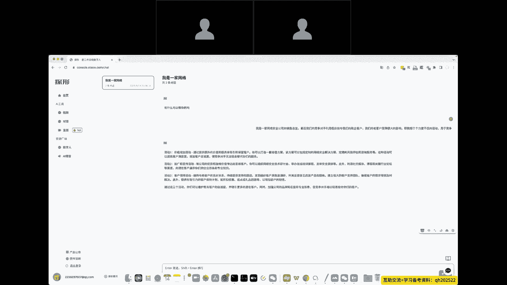

三个也罢，这种可能可以尝试的方案，那这就是技巧十所带给我们的一些价值，技巧11将角色融入我们的工作流额，现目前一家公司角色来讲是越来越细致了啊，前端开发，后端开发啊，什么产品经理，项目经理啊。

他的角色分的分公司越来越细了啊，因为越细代表了效率越高，这个也是一个社会正常发展的趋势，但是呢它带来的就是，每一个人在这个工作流里面，他都不能解决很多其他角色的问题。

但是用AI可以轻松的解决这么一个问题，那么假如我们是程序员，我们现在没有产品经理，我们这个公司没有产品经理，那怎么办呢，我也不能马上去学产品经理相关的东西，那么我们让AI来当这个产品经理。

让AI来分配我们的工作，让AI来把想法变成产品，同样的，我们这一条产品线上面所涉及到的所有人员，所有工作角色，所有这个工作流里面的人都可以让AI来提升它，我们不能说替代这个听着挺吓人，你提升它是可以的。

这也就是技巧11，技巧11从另一个角色另一个角度来说，我以后可能会越来越多的会出现一个公司，只有一个人，他就可以创业了，那么其他角色他会用AI来辅助他，好技巧12将方法论融入我们的工作嗯。

像PMP也好啊，像其他的一些项目管理里面，都会涉及到大量的方法论啊，敏捷也好啊，精液也罢啊，像营销里面啊什么4P理论，或者说什么斯沃特等等方法论，那如果是以常规的思维，我们肯定要去记这些方法论啦。

不仅是去记，还要去学，还要去用，还要等等，那么技巧12，就是让这些方法论随时随地可以为我们所用。

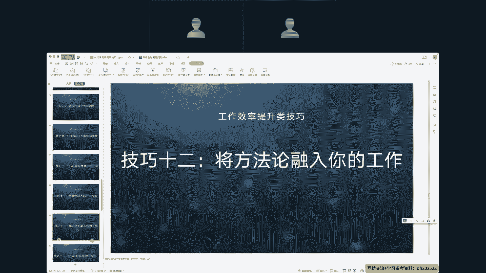

那么我们尝试一下啊，我们是一个嗯嗯和管理人员对吧，那么我们使用sword这个方法论啊，让他帮我们做一个产品分析啊，我是AI平台的产品经理，请帮我是使用swat，啊，嗯是分析什么呢。

啊我这就写的不是那么细致了哈，只是做这么一个演示，可以看到AI它完全可以使用方法论帮我们，做出我们想要的东西，无论是敏捷啊，项目管理层面轻轻松松的事，把方法论给到AI，他就可以直接使用方法论来完成。

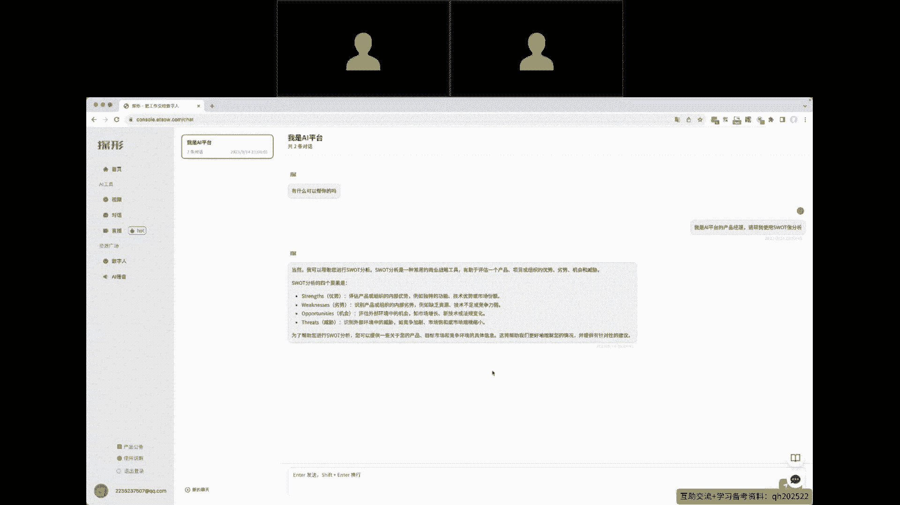

我们对应的工作技巧，13让AI来帮我们写小红书，小红书现在很火啊，小红书里面的文案这个体验类的会比较多，那么如果我们让AI直接帮我们写小红书啊，那我们简简单单的让他写一个风扇。

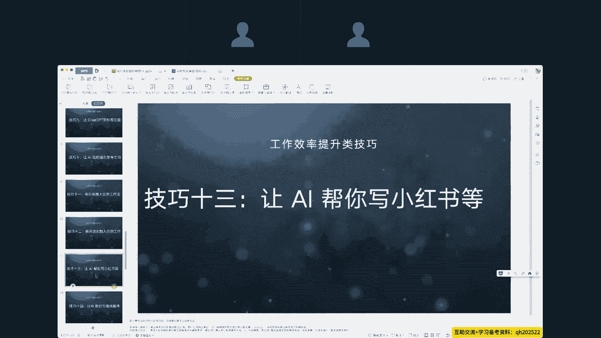

啊雨雨伞吧，哎，那么我们如果是以这种方式通用的方式给到AI，他写出来的内容必然也是通用的，如何写更好的文案呢。

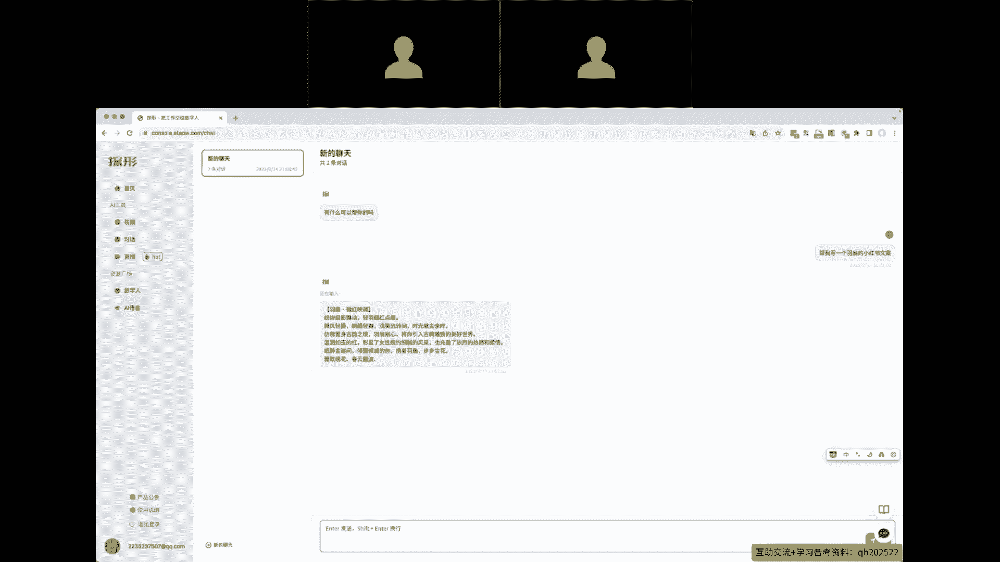

有两种方案，第一种方案呢是我们去网上找到小红书的文案，找到一些写的好的，我们自行解构，这里面包含哪些内容，它的方向是什么，我们把这些总结出来之后，告诉AI，让他帮我们写，这是第一种方案。

而第二种方案呢还是用到之前的这么一个技巧，我们去找一篇写的不错的小红书，提供给AI当做范例，让AI往这个方向这个逻辑上面靠，帮我们写一个我们需要的产品的小红书文案，这就是这个技巧。

那么我们这儿有一个案例做一下演示。

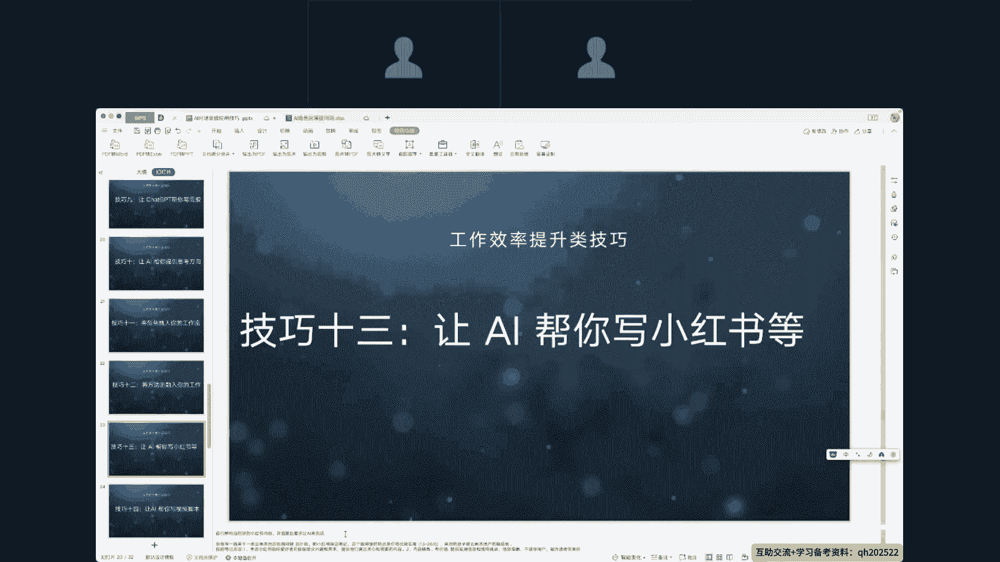

这个案例使用的是第一个技巧，就是自行把写的不错的文案做了一些解构，它里面包含哪些东西啊，让他考虑什么东西，考虑小红书呃，这个咖啡爱好者的呃，兴趣和需求，让他去考虑呃，内容要经验经验。

然后让他考虑文案要引人入胜，让他考虑互动要有参与感，那么这些事提炼出来之后给到他，这是演示的这个技巧里面的第一种方案，写出来的小红书基本上稍微修改修改就可以。

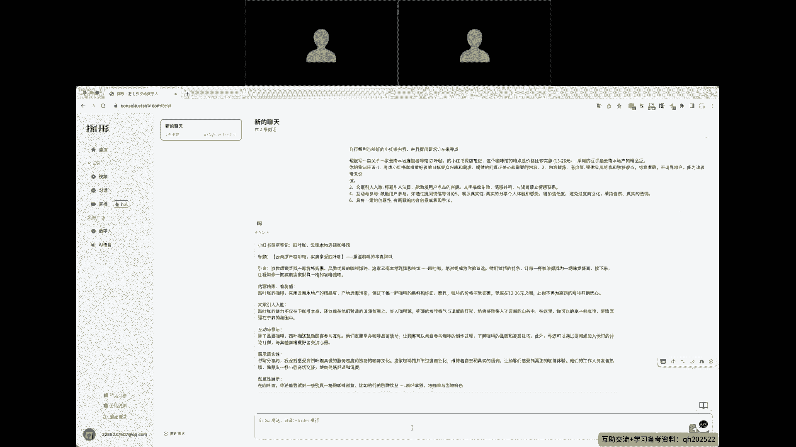

往往外面发了嘶，好技巧14，让AI来帮我们写视频的脚本啊，这个可能会做短视频的朋友或者自己拍嗯，抖音的朋友可能会用得到同样的方式，方法一呃，思考好我们的视频脚本整理成标准的提示词啊，告诉告诉AI啊。

千万不要写通用的东西，让AI来帮我们做我们的提问，提的越普通，他写出来的内容就有越普通，第二个方案呢也是网上找写的不错的脚本，那些场景也好啊，切换也罢，文案也可以直接提交给AI，AI是支持上下文的啊。

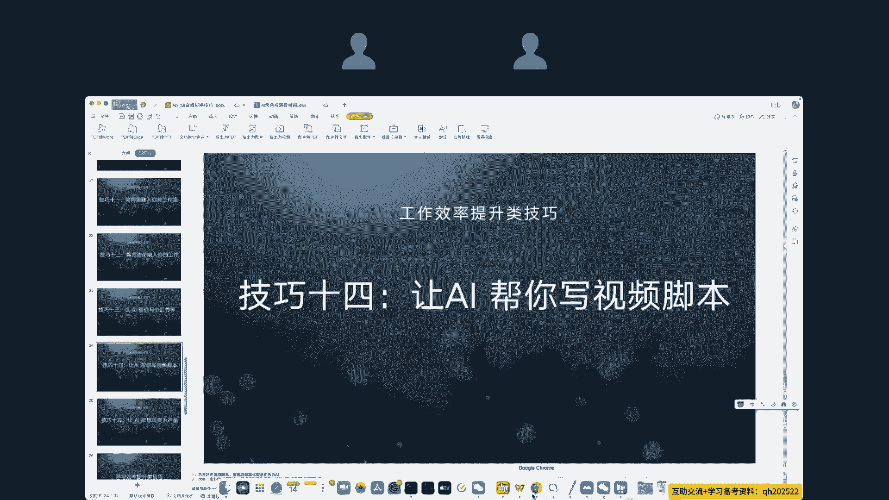

可以看到我们上面问他什么一个问题，我们下面是可以接着他问的，所以在使用的技巧上面可以直接提供一个文案，直接发给他之后，我们再要求他按那个文案继续做美化。

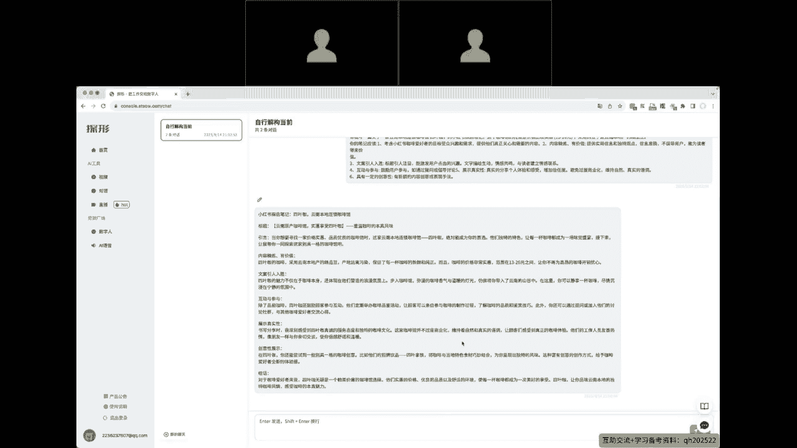

所以整个AI是支持上下文的，同时，那么我们和他的对话是可以持续对话的，持续做要求，这就是技巧14，技巧15，让AI把我们的想法直接变成产品，最简单最简单的或者最常用的这么一个呃，场景是我们想写一本书。

无论是网络安全的书还是项目管理嗯，这个方法上面的书我们都可以随时写，现在有了AI，其实任何人都可以当作家，我们只需要把一些核心的点提炼出来之后，告诉AI，让AI把它变成对应的东西就可以了。

无论是开发一呃，写一本书，刚刚讲到的，还是让他帮我们开发一款产品，把我们只是有想法，让他把这个想法变成嗯需求文档等等的东西，他都可以实现，那么我尝试一下，我想写一本书，那么书的内容大概是。

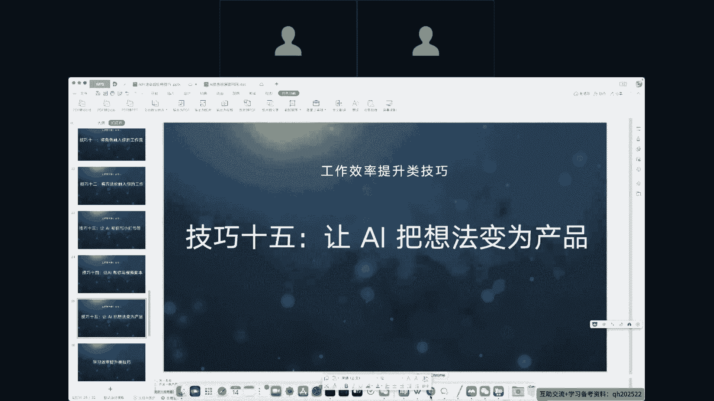

啊准备写一本网络安全那些事儿的书，可以看到AI告诉了我们应该怎么，接下来一步一步操作啊，确定目标读者的人群，那么我们想要写书怎么办呢，照着它就可以了，第一个目标人群是什么，第二个我们的大纲是什么。

大纲不会写怎么办，让AI也帮我们写大纲，有案例吗，有案例提供给他，没案例怎么办，让他帮我们写一个案例，这个就是AI这个技巧里面。

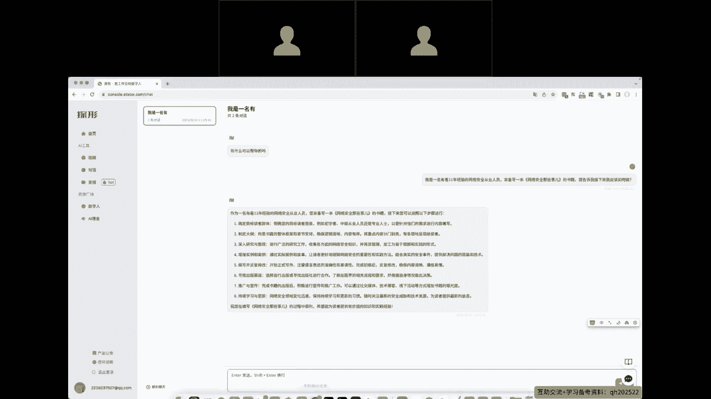

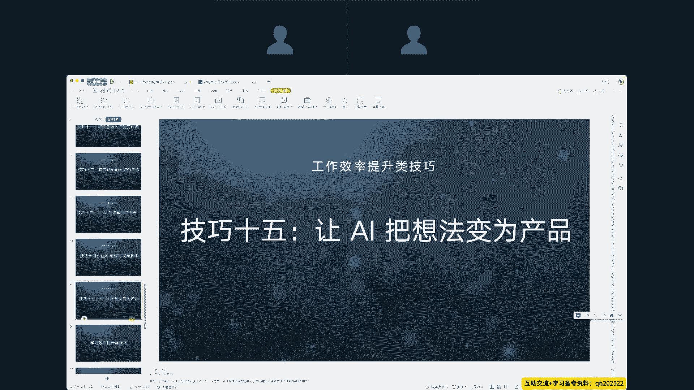