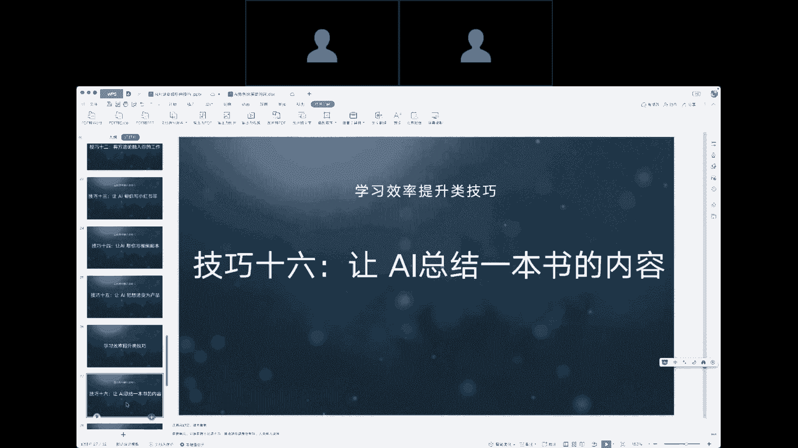
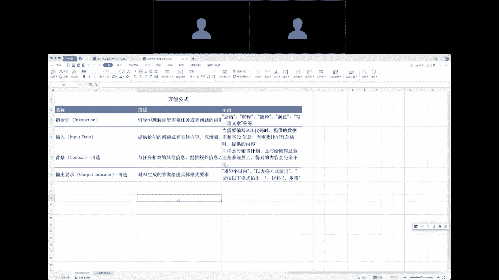
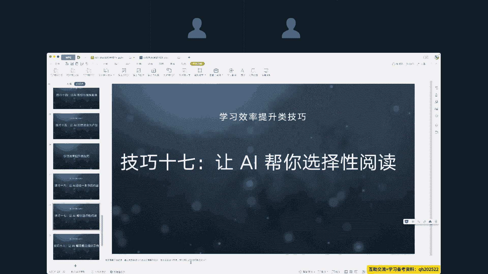
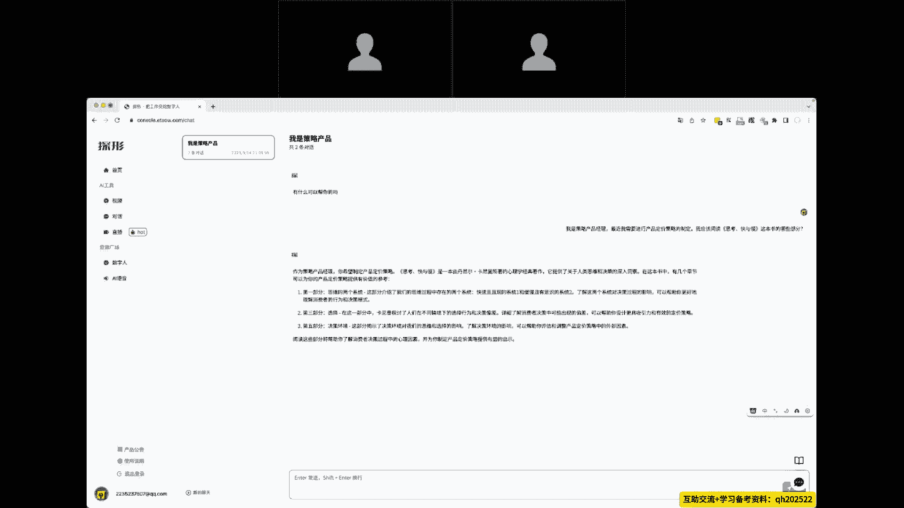
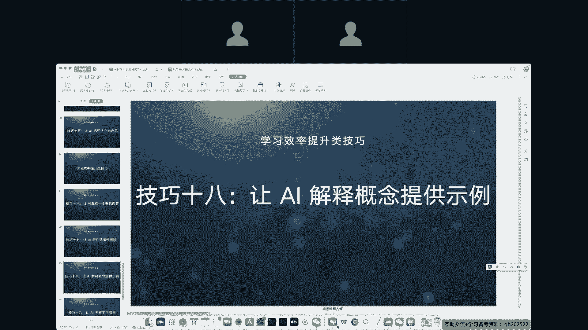
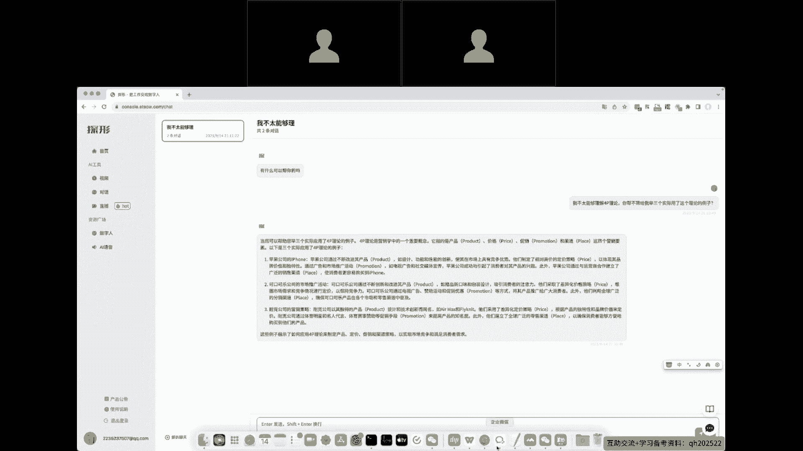
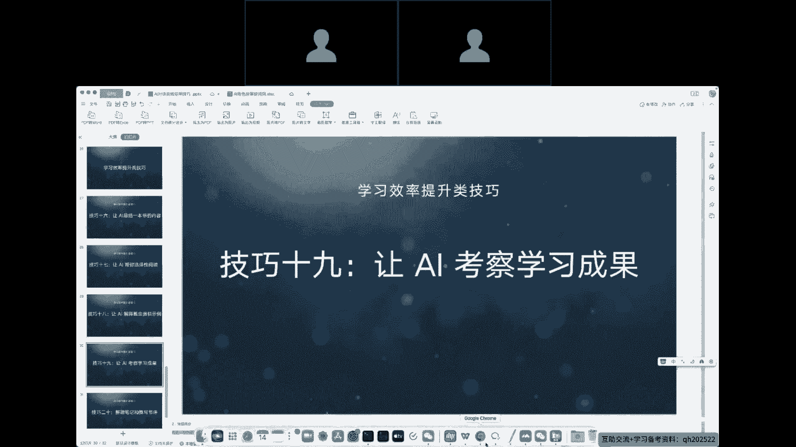
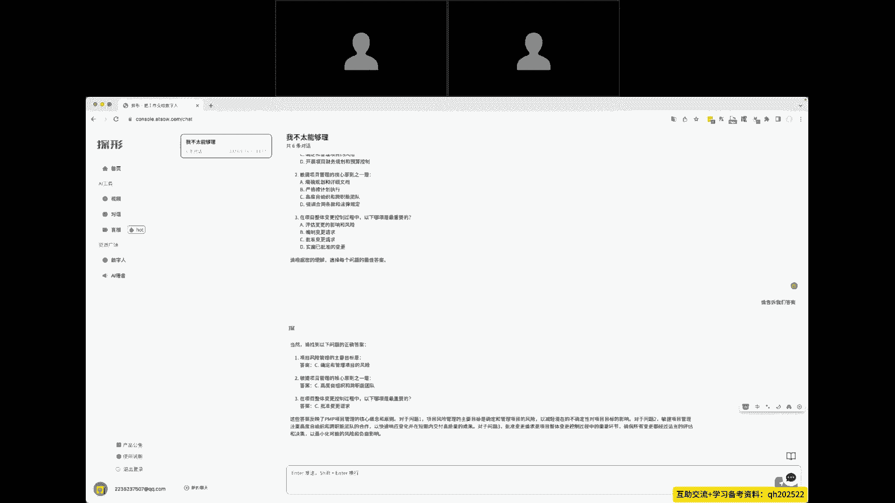
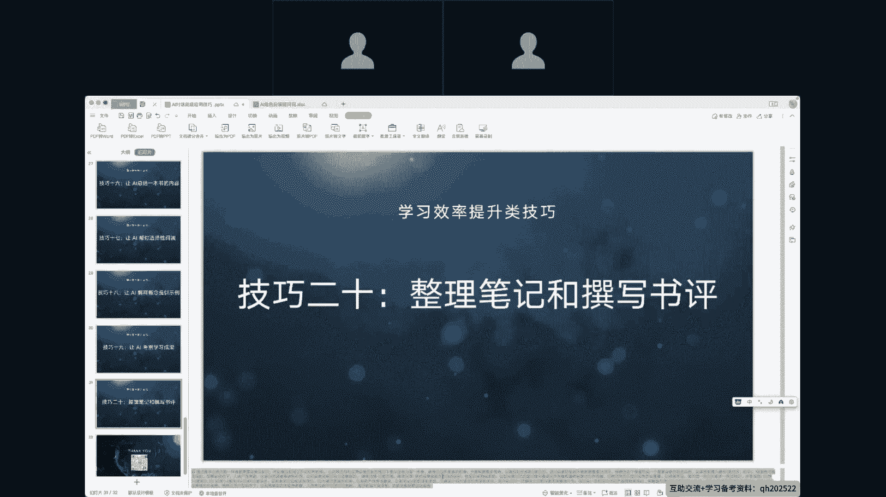
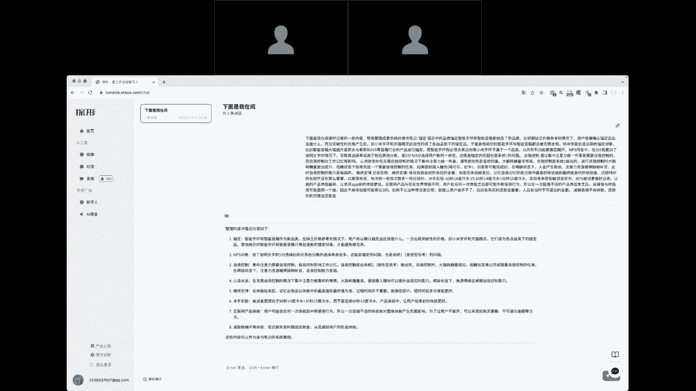

# AI 对话高级应用技巧 - P4：4、5个工作效率提升技巧 - 清晖Amy - BV1kaWpeXErK

好最后一个是学习效率的提升技巧，16让AI总结一本书的内容呃，欠了GBTN目前主流的是两个版本，一个是3。5版本，一个是4。0版本，3。5版本，它的学习时间嗯，他的训练时间吧是2021年。

所以说2021年之前的所有书籍啊，理论上讲AI是全部训练过的，我们想让他总结任何一本书，只需要以通用公式啊。

万能公式嗯，指令词输入背景输出要求给到他就可以了。

那这个地方技巧16特别要注意一个关键词，叫做AI幻听，AI幻听是所有AI对话模型都会出现，都会存在的这么一个嗯特殊的情况，那么什么是AI幻听呢，就是我们让AI帮我们写案例。

或者说让AI帮我们搜索一些东西的时候，当他发现没有，那怎么办呢，AI会自己给我们创造一个东西出来，所以之前有一个案例，一位律师让AI帮他整理这个法律当中的判例，就是判案的例子啊。

AI提供了很多很多的判例给到他，当他有一天去嗯这个上法庭的时候，法官去检查他的判例，会发现所有的判例历史上从来没存在过，这个就是标准的AI幻听，他会创造一些不是事实的事实，并且它与会认为那就是事实。

你随便如何给他说，他都会认为那个是真的，这个关键词叫做AI幻觉，AI幻觉的诞生它很复杂，现在总结起来基本上有这么几种说法，一种是数据偏见，就现在市面上呃网络数据它存在了大量的数据，有谣言，也有真实的。

也有故意放出来的，他对于AI来讲，他认为都是正的，所以他会有一个数据偏见，第二个呢训练量不足，虽然现在的训练量已经非常庞大了，但是依然训练量不足，第三个是算法的缺陷，目前还没办法去解决。

最后一个AI幻觉是是人类误导输入，让AI去学了之后产生出来的嗯，所以在律师行业也好，或者我们让AI帮我们搜索一些东西的时候，我们要特别注意AI幻觉的情况，不要相信AI，不要完全相信AI的内容。

我们让他帮我们做事情，可以让他帮我们搜索东西，哎现目前最好还是使用搜索引擎，技巧17，让AI来帮我们选择性阅读嗯，现在大面积的书籍知识爆炸，信息爆炸的社会，哪些书籍值得我们学，哪些信息值得我们听。

这个是让AI可以完全帮我们做选择的，我们尝试一下。

我们有一本书，我们告诉AI让它帮我们看看这本书，这本书里面哪些写得好，那我们可以读一读，写的不好了，我们就不理他了，这次这个技巧它能大量的节约我们的时间，那PMPPMP嗯的那个项目书籍很厚，好几百页啊。

除了考证我们需要全看以外，可能是普通人也用不了这么多，那么我们可以让AI帮我们整理里面，最最核心的东西，我们稍微学习一下，可以节约大量的时间。

嗯好技巧，18让AI来解释概念和提供一些事例，嗯我们有分的非常多的方法论啊，什么4P理论啊，敏捷等等，可以轻轻松松的让AI来解释这些概念，让他给我们说一说4P理论到底是什么意思，不仅如此。

我们可以让他给出几个例子，那么我这给了一个提示词，我们尝试一下。

嗯我不太理解4P理论，你能不能帮我举三个实际用了这个理论的例子，可以看到AI给到了我们视频理论的一个解释，同时呢还给到了我们案例，这个技巧我们放到产品经理，放到营销上面，它能给我们带来非常多的价值。

技巧19让AI来考察学习成果啊，学习的成果一般有两种方式，一种是费曼学习法，就我们学完PMP，学完这个AI对话的高级应用技巧之后，我们在用自己的理解，自己的话术讲给别人听，只要能讲明白。

那么说明我们学习的成果是不错的，如果我们自己都讲不明白，那么应该是没有学到位对吧，这个是费曼学习法，那么第二种方法呢就是做题，没有别的捷径，就是做题，让AI来考察我们的学习成果。

无论是费曼学习法还是做题都是可以实现，那么我们尝试一下，以我是一名PMP项目经理。

PMP项目经理的学学生学员也可以啊，AI是可以帮我们纠错的，所以打两个错别字影响不大，可以看到他会直接给到我们题目，在考各种各样的证书之前，大量刷题肯定是必不可少的，有了这个技巧。

其实我们轻轻松松随时随地都可以做题，让他出完题，并且还让他告诉我们答案，那么作为老师，可以随随便便轻轻松松出个100道题，200道题给到大家，让大家慢慢做啊，作为家里面的家长。

可以随随时时的让AI帮我们出题啊，让家里面的孩子也好啊，要要考试的人也好，可以随随便便随时都可以参与进来。

嗯好技巧，20，整理笔记和撰写书评，AI的能力，至少从目前的能力来讲，他有两个部分，一个部分呢是大数据层面，就是他学习的内容是比较多的，另一个能力就是他的整理归纳能力，我们利用这个整理归纳能力。

可以做非常非常多的事情，那么我们先看一下它的效果。

我们给到他一些基本的信息，就是我在阅读时记录了一些内容啊，想让他做一些整理，记录了哪些内容呢，你看一下我我提供的这些内容啊，锚定锚定中的品类或者锚定中的呃，各种各样乱七八糟的东西吧，它没有逻辑的。

并且有些长有些短，但这个方向的事情是AI最为擅长的，我们看一下它的效果，他以比较结构化的方式，把我们之前整理的一些嗯内容做了二次整理，那么这个技巧在我们嗯会议整理学习层面，它能帮助我们非常非常多。

那有些时候开会可能一开开一天两天，那么到底说了些什么，我们只记录一些关键词，记录完之后还要花可能两小时三小时，把这些关键词全部串起来，但是这个实际上是AI最擅长的，我们原来花两个小时，三个小时写出来。

AI只需要花五秒钟十秒钟，那么这些内容交给AI，对于我们无论是工作上的提升，还是生活上的提升。

