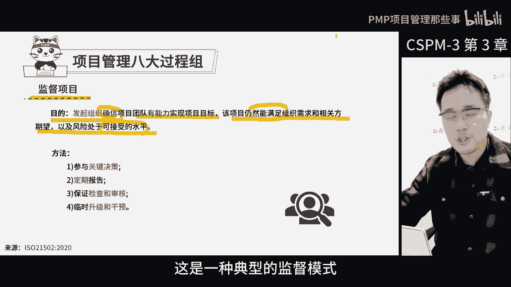

# CSPM-3项目管理认证考试内部直播课精讲视频合集 - P4：cspm-3 第3章 项目经理定位和受控环境 下 遮挡 - PMP项目管理那些事 - BV1s1421q7Fo

管理项目的时候有一个八大工程组的框架，这八大工程组呢被分成了四个层次啊，那最顶层是发起组织，它并不在项目管理团队里面，而是在项目管理团队的上级，他主要负责三个活动，项目开始前的准备。

监督项目进展以及项目结束后的收尾工作，那发起组织成员，比如说项目发起人，或者项目管理委员会里面的人，他们的作用就是指导项目怎么进行，项目经理，这里有三个重要的过程活动，分别是启动项目控制。

项目关闭或终止项目，有了项目管理委员会的批准，项目经理就可以开始做日常管理了，那在项目的过程中，项目经理得去经常控制工作包袱的人，他就是带队干活的人啊，工作包负责人，主要是确保项目在允许偏差范围之内。

完成项目的交付，那项目干完之后呢，项目经理就要申请结束，那做好收尾工作，然后得到委员会的批准才能正式结束，所以这八大国产组从开始到结束，还分了不同的层级，它们对应到了项目组织的不同层级上面去。

那每个过程都有核心决策，他们都有自己的工作内容，各司其职，这样整个项目组织环境才能受控，那如何受控呢，那首先大家得共同论证项目的价值，然后我们要决定选择怎么样的项目生命周期。

接着我们还要确定项目的组织结构，和各方的职责啊，有的是发起组织负责，有的是发起人负责，有的是项目经理负责，还有的是工作包负责人负责，那这时候我们把干活的目的分工，组织以及要干活都定义得清清楚楚了。

还定义了他们之间的关系，唉大家认同了项目的目的和价值，明确了各自的决策之后，按照各自的角色职责，在管理框架内做好各自的过程啊，这样哈整个过程才能真正的有机地结合在一起，这就是整个受控过程。

那接下来咱们就要详细讲讲这八大过程组，首先我们要看一看前三个发起组织的活动，这三个活动都有一个特点，就是在项目开始之前，项目经营中和项目求之后都有相应的监督措施，那这样就能确保每一个环节都受到了。

妥善的监管，让整个项目更加顺利的进行。

那说到项目的钱活动，这真不是项目管理的一环啊，这是项目开始之前，为了真正的启动项目而做的事情啊，关键啊就是组织得从投资的角度去考虑，问题你看公司里面有那么多事儿可以投。

但是按照公司的战略方向和有限的资源，得选出最值得投的项目，所以在决定同一个项目之前，得花好多时间去论证，那这个项目到底值不值得启动啊，那这个过程我们称之为商业论证，在做论证的时候得考虑组织和商业的需求。

一个是战略方向，就像下棋得提前布局好，另一个是商业需求，就是看短期能否赚到钱，那还得想清楚这个项目做出来之后能卖多久啊，能赚多少钱呢啊，基于战略和市场的角度，我们得好好琢磨一下。

这个项目能给公司带来多大的价值啊，当然了，手上不止一个项目的时候，最重要的就是确定好项目的价值之后，给他排好优先级，想清楚之后就可以准备授权项目启动了，那项目里是由人来做的。

所以授权之前呢关键的人员得到位，还得选对人啊，如果人没选对，再好的方法也白搭好，一开始的时候呢，项目中有两个最关键的人得确定好啊，这两个是谁啊啊一个是项目发起人，一个是项目经理，在国标中。

这俩人得由发起组织亲自确认，和人民发起组织，还得帮他们明确最初的职责和权限，为啥呢，因为项目要不要论证得他们决定啊，谁当发起人，谁当项目经理给他们任命啊，项目经理管什么，不管什么，得他们拍板啊。

好项目的台子怎么搭也得由他们来决定啊，好项目的资源还得由他们来解决呀，现在很多项目里啊，发起组织没把这个事儿承担起来啊，有的时候就派一个模糊不清的任务，就甩给项目经理啊，好发行人和项目经理。

也没有明确的挑选和任命过程，职责不清不楚的，还有啊项目管理框架，资源资金这些问题也是有企业做得好，有企业做的不好，就是说发起这个项目组织，得先把前期的工作都准备好，就像搭台子一样。

得先搭建好各种资源协调好，然后项目经理和发起人就可以登台开始忙活了，最怕的是前期工作啥都没开始准备啊，全让项目经理自己搞啊，问题是他项目经理真搞不定，项目做完呢，发起组织也不能闲着。

虽然项目团队把发起人定的目标都完成了，但是关键在于他们做出的这个成果，和发起人预期的后续效果是不一样的，这得去有人去验证一下，但是项目团队自己验证不了，因为项目做完团队就散伙了，人都走了。

所以谁发起的项目，谁就得去验证这个收益，因为预期收益的实现在项目结束之后才开始，而且实现周期很长，有的甚至好几年了啊，这事不能全交给项目团队去搞啊，他们最多提供收益测量的方法，但是不可能全程跟踪。

这点很重要啊，站在发起组织角度呢来看我们的项目收益，那不仅仅是要考虑项目本身能挣多少钱，那么简单了啊，更重要的是远期收益，比如说一个项目客户的定制化要求很高，就代表着有创新性。

而公司呢会考虑要不要投入更多的资源，比如说人力物力财力，花更多的时间去完成这个创新性的要求，虽然这个客户的要求可能很难，但是我们真的做成了，就可以把这个成功的经验啊，或者这个结果复制到其他的客户。

那句虽然这样的项目研发成本可能会很高啊，看起来本项目的利润不咋地啊，甚至可能单个项目还亏本了，但为什么公司还要做呢，因为公司认为这个项目上亏的钱，将来在其他项目上能挣回来，而且其他同类的项目数量。

还比这个项目多多了啊，这么就稀释了前期的投资和研发成本，所以这个时候的投资回报，就不体现在这个项目上，而是体现在后续的其他项目上，那换个角度想想啊，至少客户还给你付钱了吧，客户出钱让你做创新。

那总比没有客户出钱，你自己搞创新不是划算多了啊，这其实就是客户出钱支持咱们搞创新，这本质上就是联合客户做创新嘛，啊如果我们想不出来的，客户讲出来了，而且客户想出来这个需求呢。

我们发现很多客户还都需要上哪，找这么好的机会去，但这个时候我们单看这个客户，就发现可能不这么挣钱啊，就得考虑从别的项目上把钱赚回来啊，但别的项目到底能不能赚回来呢，这个事儿呢后续得有人去盯着呀，验证啊。

当期项目结束，团队解散，所以发起组织必须得去继续跟踪后续的收益，实践情况，合同交付，产品开发数字化转型都这样啊，很多时候啊，有些收益都是在项目快结束，或者结束之后才获得，那标准里面也说了啊。

项目后活动的目的就是验证应用的效果，和预期收益的可持续性，所以说项目后活动是一个关键。

那咱们再来说说项目执行中的几个重要环节啊，首先在项目开始之前呢，发起组织得为项目创造一个良好的环境，制定规则提供必要的资源，别忘了这可是为了确保项目的顺利进行啊，等到项目结束了。

发起组织还得跟踪收益的实际情况，这样下次发起项目的时候，他们就有一个决策的依据，那这样发起组织在修订决策时，也有个明确的规则吧，在项目执行中，发起组织他也不能闲着，因为项目执行过程中有很多工作要做的。

不能当甩手掌柜，所以这个时候就需要监督项目的工作了，其目的是发起组织，确信项目团队有能力实现项目标，以及风险处于可接受的水平，那这个时候就是监督项目啊，他是站在投资管理角度监督项目的。

什么叫投资管理角度监督项目呢，就是和散户买不同公司的股票，他是不是也得天天盯着它，是个投资市场，为什么盯着股票，你得关注下这个项目是不是有重大的信息披露，它的整个绩效好还是不好，这个股票是涨了还是跌了。

是跌的风险大还是涨的概率大，当然啊买股票的散户，他没有资格去参与这个项目的决策，那更没有机会啊参与到这个日常工作中来，那换句话说它影响不了这个项目，如何干这个活啊，但是呢仍然得去关心这个企业的状态。

这是一种典型的监督模式。

但是作为发起组织的身份。

