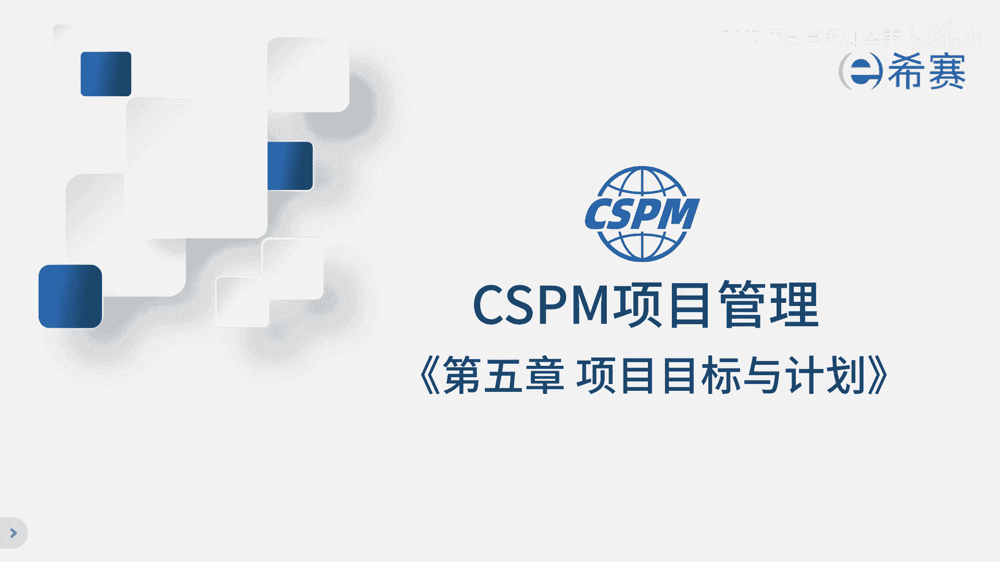
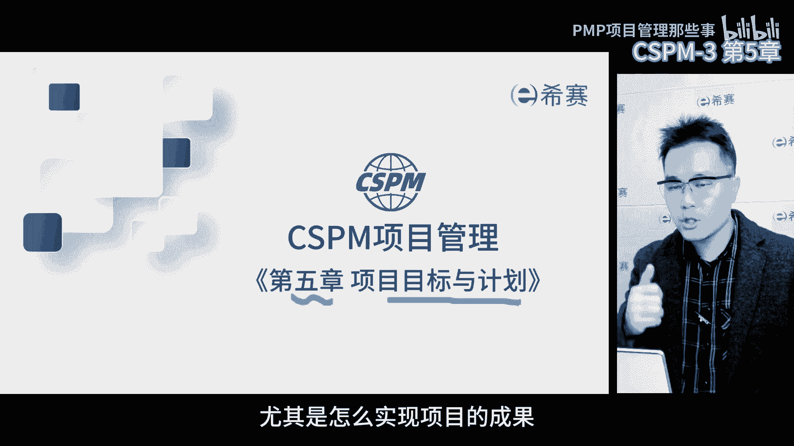
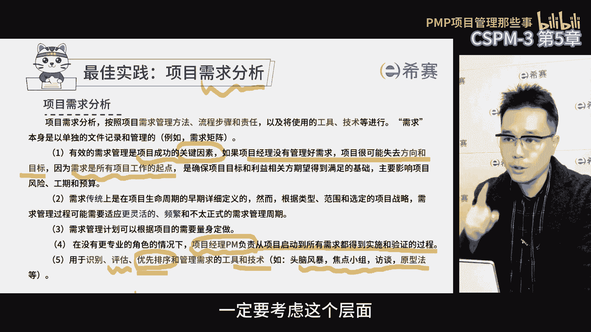
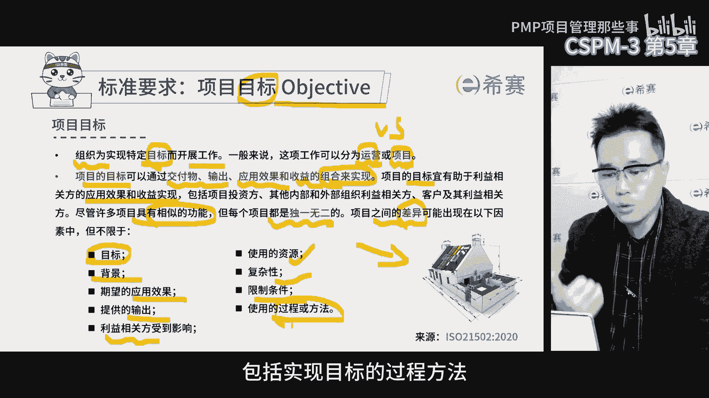
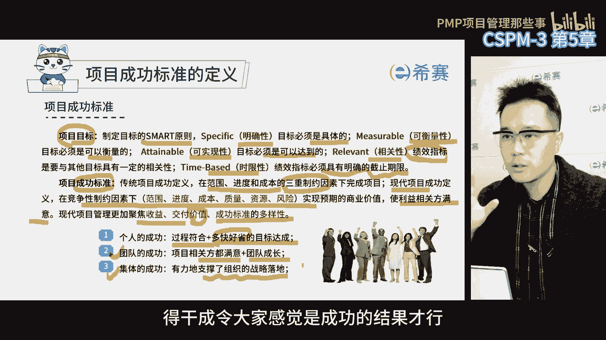
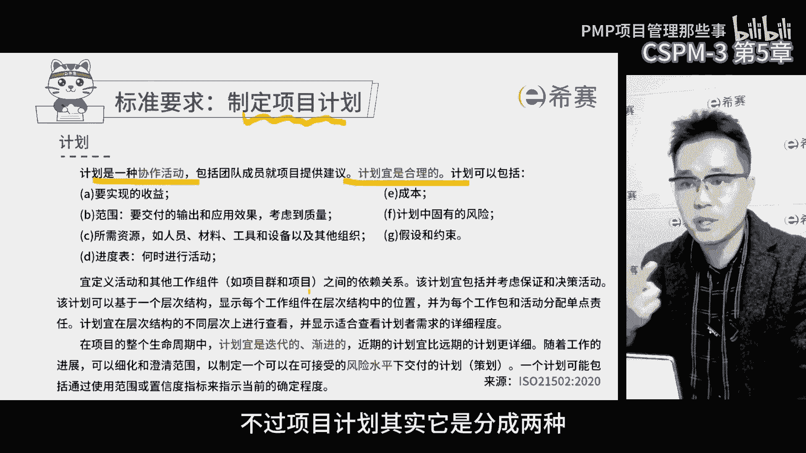
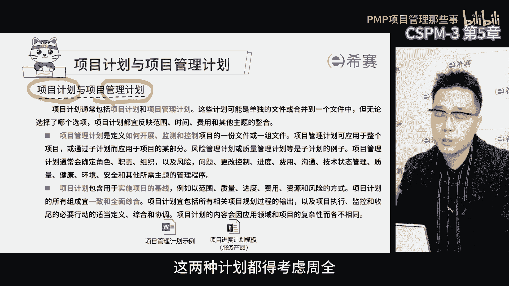

# CSPM-3项目管理认证考试内部直播课精讲视频合集 - P6：cspm-3 第5章 项目目标与计划 遮盖 - PMP项目管理那些事 - BV1s1421q7Fo

第五章项目标与计划，上一章讲的是项目的论证，它是解决为什么要做这个项目的问题，而本章项目标和计划，则是解决项目团队应该怎么做这个项目的问题，尤其是怎么实现项目的成果。

项目认证，关心的是做这个项目的价值和回报是什么，而项目目标和计划，则是从项目执行团队的角度去看待问题，关心到底要完成哪些工作和任务，才能实现预期的目标和成果，那通常领导们先要想明白。

做这个项目的理由和价值，然后再派给项目经理和团队，规定时间和成本要求，实现相同目标，这两章都非常非常重要，放到一起呢，逻辑更强，更容易理解，在项目标和计划这一章里，我们通常会明确目标计划的三个步骤。

首先在确定目标之前要进行需求分析，因为没有需求就不好确定目标，接着要基于目标进行分解，制定计划，最后在项目执行过程中进行管控，确保整个项目的目标和计划得以实现，需求分析目标制定计划，制定管控。

构成了咱们这整个章节的内容。

首先做需求分析这一步啊非常的重要，肯定要对客户进行需求的收集，收集需求呢不能光靠自己拍脑袋，得去找客户，用户去了解他们的想法，在项目管理过程中，项目经理要保证需求分析的结果准确无误。

这样才能确保项目标明确精准，那说到这里呢，要提醒大家，项目经理可是主要负责人，得确保我们准确地捕获到了每一个客户的需求，需求分析的方法有很多，比如说头脑风暴呀，焦点小组访谈啊等等。

那当我们去收集需求的时候，要同时考虑到优先级的评估，比如说优先级的排序，因为很多时候收集了一大堆需求啊，但实际上我们没有办法在有限的时间和资金内，完成这么多，这种时候就得对于需求进行优先级排序。

把最重要的最紧急的需求先纳入到项目范围内，不那么重要的，往后放一放，排一排，只要有需求收集，就得有评估和优先级排序，所以在做需求分析的时候，一定要考虑这个层面。

其次根据需求确定目标，我们会发现需求跟目标是两码事，那目标英文是objective，是项目结束时的事件，但目标不是只有项目，有企业日常的经营，总会有各种各样的目标，考核目标，战略目标，运营目标。

部门目标，各种目标，但是与企业目标相比，项目标有特别之处，项目的目标它典型的特点是通过产出，应用结果和收益的组合来实现项目标的，那项目的目标可能是交付物，也可能是交付落地后的结果。

还有可能是最后的预期收益，但实际上来说啊，按照之前讲的商业论证，它理论上这三点都要包括在内，那站在公司战略的角度，三者缺一不可，没有项目的产出将来就没有给用户用的东西，那客户没有用，那更不要说发挥效果。

也不要说能带来什么样的收益了，所以首先既要形成交付物，还要推动用户使用，使用完之后呢，再测量到底带来什么样的收益，最开始把项目的目标定义得越清晰，越精准，会越有利于实现预期的收益。

特别是项目投资方所需要的收益，再一点，因为项目具有独特性，有很多项目它的过程是类似的，但是项目的预期结果完全不一样，一般认为，项目管理是一种典型的目标管理的方法，换句话说。

我们一般认为项目的目标它是不一样的，比如说很多工程项目施工过程差不多吧，软件开发项目开发过程也差不多吧，产品研发研发过程也差不多吧，但是他们会受到很多因素的影响，从而导致目标不同，在项目管理过程中。

一定要先去收集需求，再确定目标，我们是基于目标做分解工作，分解结构嘛，WBS好分解的目的是为了方便我们去打包，把工作派出去之后，我们定义不同的活动之间的依赖关系，行程最短的进度计划。

便于项目经理做日常管理，在这里面我们一定要充分的注意到一点，项目即使过程相同，但是项目的目标，也会因为客户的需求和基本条件不一样而不同，我们要充分的注意目标的这个特点，当我们描述项目目标的时候。

我们需要考虑各种因素，这些因素呢会对项目的目标产生差异，比如说背景啊，落地的效果呀，提供的输出好，相关方使用资源的多少，项目的复杂程度限制条件，包括实现目标的过程方法。

那作为项目经理要考虑周全，才能把目标定得更清楚，学pp的时候，我们都知道项目的目标必须能够测量，这样我们才能知道目标到底有没有达成成果，好不好，通常我们会用smart原则来定义项目的目标啊。

这样明确具体可测量，而目标还必须是可以实现的，不可衡量的目标呢是没有办法确认的，也就不知道达没达成啊，目标的绩效指标跟其他目标有一定的关联，要考虑好，对于时间一定要有截止日期，除了项目标。

我们还得定义项目的成功标准，要知道怎么做才算成功，不同的项目和不同的领导，对于成功的标准是不一样的，传统的项目成功标准是范围进度成本，俗称铁三角，但是现在我们发现，项目成功不仅仅依赖这三重约束了。

因为相关方越来越多，对于项目经理要求也越来越高，我们不仅仅要在规定的时间，规定的范围，规定的成本内实现目标，还得考虑资源风险，更重要的还得考虑项目的价值，让相关方满意，支撑组织的战略目标。

这时候我们对于项目的成功标准呢就提高了，那这些内容对于第三集的项目经理，要求越来越严，而且占比越来越大，以前做项目的时候，我常说啊，项目的成功标准有三层啊，第一层叫项目经理。

个人的成功就是项目过程符合公司规定，同时达到了多快好省的目标，多快好省的背后就是时间范围，成本质量唉，咱们再加上过程符合要求，这是项目最初级的目标，如果想要达到第二层级的项目成功。

那就是项目利益相关方都满意，团队也得到了成长，得多考虑人的因素，让相关方都满意才行，要是项目完成了，结果却得罪了一批人，而客户客户不满意，领导领导不满意，团队团队不满意，那以后谁还敢跟你一起做项目呀。

想要做到这一点啊，我们得在项目初期就想明白，各方关心的收益是什么，包括咱们团队成员的，对于团队如果不能给他带来更多的钱，至少能帮助他成长吧，能力提升，技能提升，那也行啊，能在项目中干掉他。

原来在别的地方干不了的事啊，利用组织资源，项目的资源，让他发挥一下他自己的天赋啊，做一些想做的事情，能在项目中去提升一些他认为很重要的能力，对他来说也是收益，那这样。

大家对于项目的关注度和支持度也会加强，当然最好能达到第三层级的成功，就是站在公司的角度，有力地去支撑组织的战略落地，这样的话项目既达到了多快好省的结果，又符合公司的各项要求。

没有违规项目各方又都特别满意，项目团队成员能力也成长了，最重要的是项目成果，有力地支撑了组织战略落地，也就是说对于个人是成功的，团队是成功的，集体来说也是成功的，那这就是我们所说的最完美的项目。

对于这个点，咱们技术储存项目经理啊，一定要注意，管理过程中人的因素非常重要，不能光是把事干完就算完了，关键是得干成令大家感觉是成功的结果才行。

这个很关键，那我们在做项目之前呢，得先把项目的目标成功标准弄清楚，然后再来制定项目的计划，大家现在对这个词儿呢应该不陌生了啊，计划，那不过项目计划其实它是分成两种啊。

一个是项目管理计划，还有一个是项目计划，这两种计划都得考虑周全。

项目管理计划说白了就是一份管理文件，这份文件告诉我们项目该怎么开展，怎么控制，这个计划可以整个项目都适用。

