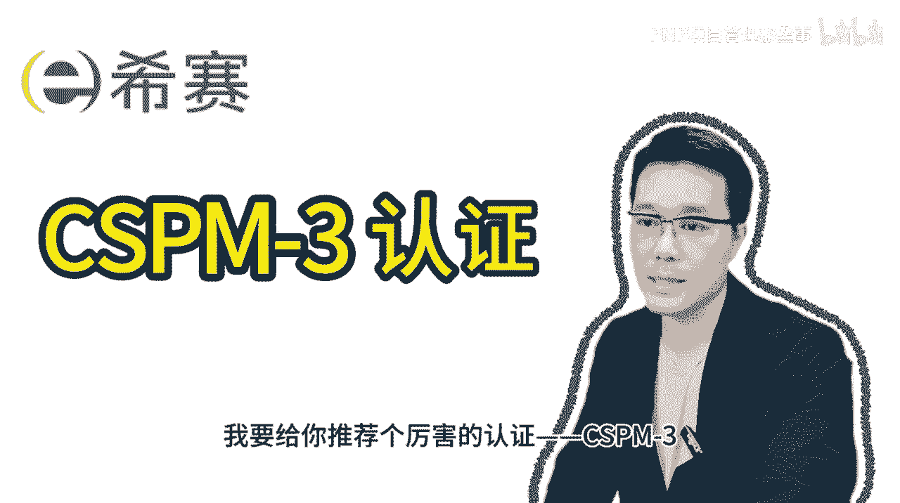
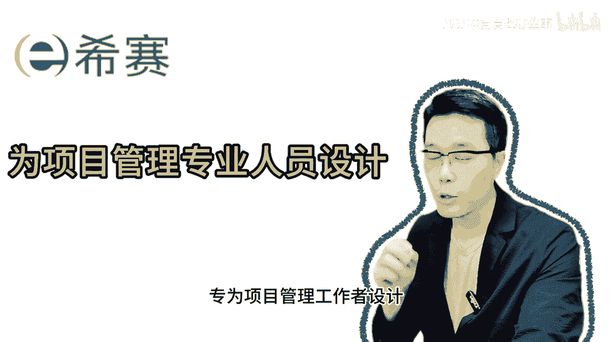
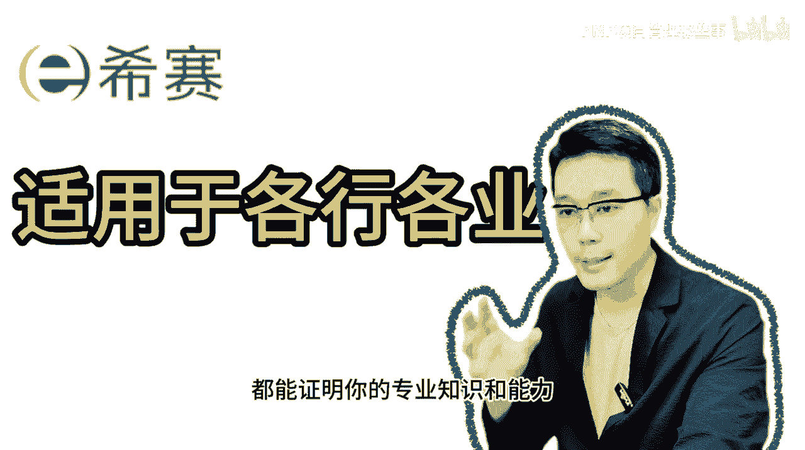
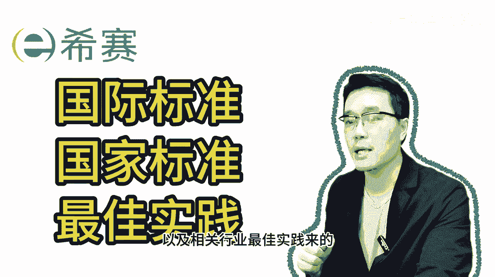
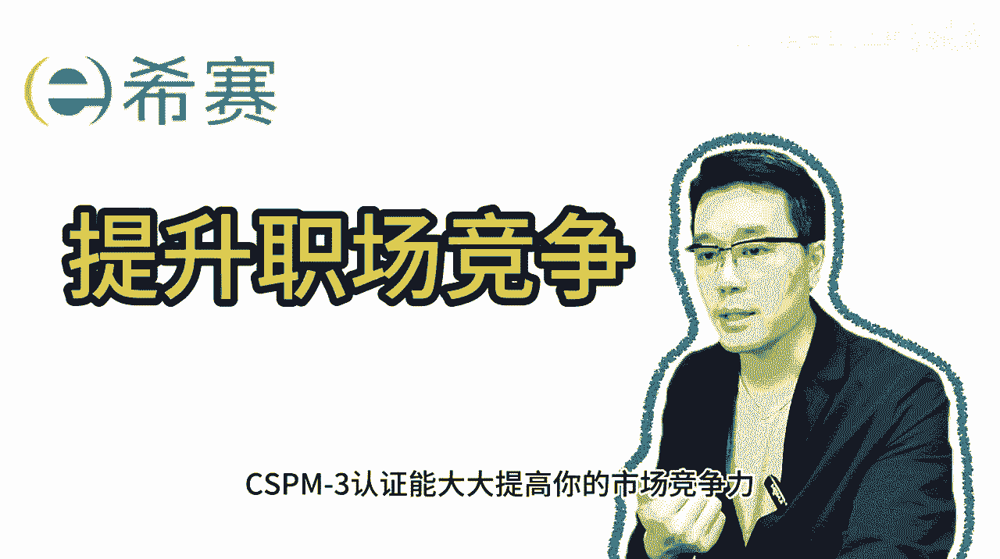

# CSPM-3项目管理认证考试内部直播课精讲视频合集 - P1：CSPM-3  第0章 精华版介绍 - PMP项目管理那些事 - BV1s1421q7Fo

大家好。

如果你是做项目管理的专业人士，我要给你推荐一个厉害的认证CSPM3。

这可是你职业发展的高速通道，CSPM3呢是我国中国标准化协会创办的。

中级项目管理专业人员能力评价认证，专为项目管理工作人员设计的。

这个认证的主要目的是，培养和评价项目管理专业人员的能力。

无论你在哪个行业，通过这个认证，就能证明你的专业知识和能力。

考试内容是根据国际和国家标准，以及相关行业的最佳实践。

确保你拿到认证之后，在实际工作中发挥出专业技能，首先从职业发展角度看。

CSM3认证能大大提升你的职场的竞争力。

学这个课程，你对于项目管理的理论和实践有了深入的理解，工作效率和项目的成功率自然就提高了。

其次有了这个国家级认证，你在找工作或者升职时就能展现出专业水平。

职业机会自然就更多了，最后这个认证是符合我国国家标准。

GBT41831的，得到了官方支持和认可。

我们的精华版课程内容精炼高效，让你能够在最短的时间内掌握核心知识和技能，这不仅适合忙碌的专业人士灵活学习，也是准备参加认证考试人员的最佳复习资料，赶紧参加我们cs t m3的精华版课程。

抓住提升自己验证专业能力的机会，别让沉重的课程负担拖慢你的步伐，通过我的课程，你将会更快地准备好。

迎接挑战，实现职业生涯的飞跃，期待在课程里面与你相见。

