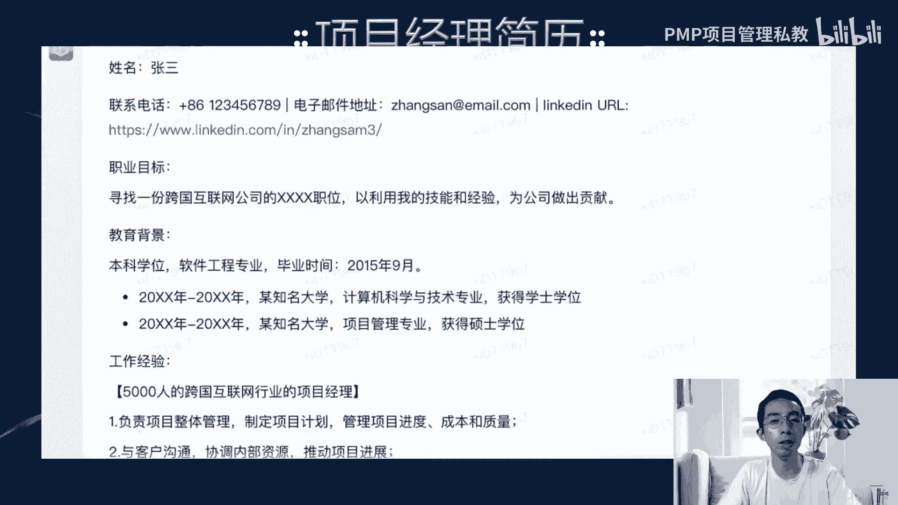

# ChatGPT+项目管理分享 - P1 - 老莫爱AI - BV1Mm4y1k7wo

我看一下直播平台看到吧，能够看到的同学打个一啊，我看一下，看一下大家那个，可能可以看的一些情况啊，看一下情况诶，这个b站怎么看不了啊，主播真的学习是什么意思啊，b站怎么是一层。

看一下一层一层一层有一个第一层，修改也修改不了啊，请移除一下这个平台，先从b站给你分析，先弄，是你的吗，保存就行了，再刷新一下，第三现在还是不一样，一层推理是不打开的意思，400多，可以可以听。

现在存在一次，好直播分类，我先在这里选一下，40，四把这个推流推上去，然后设备也是，不会啊，之前都是正常的，现在推流有问题了，诶现在可以了，现在可以了，ok听到同学打个一，好我回来了，听到打个一。

ok然后呃我先我先那个一下吧，先跟大家打个招呼啊，现在还没有开始啊，他同学打个一，然后你们如果是需要那个的话，我们可以把把那个把这个二维码可以传出去啊，就是我们可以更多的去把它转发。

然后希望更多人能够能够收到啊，我觉得这个是一件好事，希望越来越多的人参与进来，这个是好事啊，ok然后我这个这个这个这个这个这个，这个这个是cp d u的活动，cpdu的活动我也不动一下啊。

也这个是叫做2月3月21号，3月，1月21号，然后就是提交分享，如果今天要g pdu的同学啊，然后大家可以可以扫这个p的码啊，ok扫这个码可以gpu，如果同学问我要pdu的话，我们就可以扫这个码啊。

然后今天参加直播的也可以，五个pd就考过pp的学员都可以，我们先把衣服脱了，好热啊，哎这个心情是比较复杂的，因为我们可能会会做做这个项目管理方面的，最早能够把我们的这个恰恰vp这个东西，用起来的对吧。

然后我现在是plus版本啊，会员版，所以我跟大家打个招呼啊，作为作为一位主播，今天给大家分享下gp，加项目管理的课程给大家来一个很棒的开场白，可以看回放啊，这个就是下记笔记啊，大家好啊。

欢迎来到今天的课程，作为一位一位主播啊，我知道在互联网时代，项目管理已经成为许多企业和个人必备的技能，那么无论是在工作还是在生活当中，项目管理都可以帮助我们更好的组织啊，时间和资源，提高效率和质量。

实现更好的成成果和成就，作为菜鸡的p，我有幸能够参与项目管理的学习与运用，这说的啥呀，我啊还是有点不智能啊，还是有点不智能的对，然后我们现在目前的话，我们现在会有几个版本，一个是3。3。5。

一个是四点啊，不是有啥直播吗，我不是说了吗，ok啊我发了发了发了，ok这个声音太大了，我把声音声音敲一下企业微信的那个声音，企业微信的声音，我去写微信的声音怎么删，把声音开小一点啊。

ok好现在时间已经来到了20点整了，20点整，然后呃我们就开始吧，对然后先开四点啊，因为四点的话，他每天只有每三个小时，只有25个啊，然后啊大家如果想问一些什么问题啊，我们可以开四点跟大家去回答啊。

ok这个就是我们要开这个四点的东西。

ok那我们回到回到我们的。

我们今天要分享的这个课啊，我先先我先把这个东西打开，把课件打开，ok好，那我们今天要讲的主要内容呢，要分享的主要内容是人工智能啊，大家也知道恰gdp这个东西对吧，那恰gdp的话。

我们上次在那个吉大已经第一次跟大家讲过啊，然后第一次讲过就是恰gdp，其实对于我们来说有很大的这个触动对啊，我当时使用它的时候，我都惊呆了对吧，因为我我当时使用它的时候。

我发现第一个我帮别人改简历其实很厉害对吧，一下就一下子搞定，然后出培训方案啊啊然后出一个什么相机划，就非常快，把那个东西就瞬间就就已经产生了，基本上不用理那个，但是我我慢慢去使用的时候。

我发现就是你使用的时候有局限，就是你你去使用它的时候，你发现他回答的都是一些那个，什么比较泛的问题啊，然后很多问题他都是什么都是你，你就我给别人用的时候，我发现在群里面也是一样的。

就是大家不知道怎么会用啊，不怎么会知道用，然后就是不断的自己去调侃他呀，什么东西对吧，那他不是你想要的任务，我想我想说的是，我们作为项目管理者啊，我们怎么样让他为我们所用，在职场中啊。

帮助我们能够哎在职场中取得一些优势对吧，我们不应该把它当作洪水猛兽啊，我们应该去拥抱它，就跟它一起成长对吧，让他去帮助我们实现很多，本来我们没有去实现啊，不想去实现或者什么的感觉是吧。

我今天肯定会演示一下，ok那还还有很多同学他不认识我啊，因为我除了除了朋友圈啦，除了那个呃我们的偏僻学员是吧，还有很多的这个转发是吧，包括我们在b站在视频号啊，包括那个快手，我们都是同步直播的啊。

所以这个东西它就是很多直播端，那我们就就讲一下啊，ok那我自己我叫莫敏啊，是前腾讯高级产品经理，然后腾讯学院金牌讲师，然后我自己做过pp，做a c p对吧，我们现在还是在讲啊。

讲c p和p m p的老师，然后我是闵行科技的c o啊，就这个ok那话不多说，我们今天其实分为四个部分了。

就是我会教大家怎么去使用啊，至于那个怎么去注册批注册，怎么翻墙啊，这个大家去b站搜一下帖子就知道了啊，怎么注册，怎么翻墙，怎么注册账号啊，怎么去把账号充值啊，这些东西其实帖子很多，我就不说了。

我主要是说大家怎么去使用啊，好第一个部分是项目管理助手，就怎么样让它变成我们的小助手啊，这是第一部分，第二部分是五大模板助手就怎么样让他去呃，帮你写模板对吧，你的项目管理模板，第三个就是五大五大问题。

助手就是我会列举项目管理常见的五个问题，那么常见的五个问题他都可以你去你都去，你都去问他，他都不都可以帮你去回答对吧，而且他有时候，他回答的比你自己想的还要全面啊，所以你可以很好的去使用它。

然后最后就是pmp考试助手啊，就是这四大部分，然后讲完这四大部分以后，其实大家到时候可以加我个人微信啊，就是我个人微信，我写的这个这个讨论里面r7 r92792 ，加我个人微信。

然后我会把你拉那个pdu群，拉p u u群的话，我们下一周啊，我是计划下周我们的那个不用翻墙的啊，他就会就会呃给到大家，我会优先在群里面发，就是给到群里面的所有小伙伴们，以及我的p m p学员。

然后让他们自由的去使用对吧，但是自由的使用有一个条件，就是你也必须要去分享，你在使用过程当中的一些呃一些想法啊对吧，因为我们其实是一个社交的东西对吧，这个东西是需要钱的啊，就是你们你们使用的越多。

他用的是我的流量，因为他的那个api key它是要收费的，那么那个那个我我也会发起众筹啊，就是我会维持我的服务器的费用，因为我我那个在国外搭了一台服务器，那这个东西它也是要钱是吧，那你知道我其实不赚钱。

不靠这个东西赚钱，我是靠本身的p p赚钱，那么这一块的话，如果是说大家ok觉得ok觉得你使用k的话，是可以可以打赏啊，什么十块八块的其实都可以是吧，那你其实你自己去翻墙的话，你一个月至少25块钱对吧。

那你可以算一笔账，然后你去买一个稳定版本的，比如说你交20美元一个月，那一个月就是160块钱是吧，那你自己可以去算一下啊，去算一下这个使用的成本啊，所以我觉得这个这个东西是一个。

对自己很好的一个东西对吧好，那我就从第一个部分开始啊，就是呃破解项目管理的难题啊，它是一个得力助手，比如说你在使用它之前啊，就是呃所有的这个恰gdp你在使用它的时候，必须要去建个模型啊。

他在他的那个能力范围内，它会最大化的去发挥它的功效啊，所以我们第一个就是应该怎么样去，建立它的模型，当然我们我们给大家大家那个版本，它主要是关于职场和项目管理啊，职场和项目管理的这样一个模型。

而且在大家的这个使用过程当中，我们会不断的去优化那个模型，我们现在已经优化到那个模型，它可以可以就是90%的这个做题，就是p m p的题目，180套他能做对90%对吧，那我们不断的去把一些模型再导进去。

会让它变得更多，那它可能会变成百分之99%啊，99%就大家使用的越多，为什么我想把这个东西东西开放，就是因为大家使用的越多，这个模型越准确对吧，所以我觉得这个，这个确实确实是一件非常非常好的事情啊。

ok好，ok，好那我继续往下走啊，然后你你要去建模的话，你首先你要告诉他，你说你是一位资深的项目经理啊，我希望你能回答任何项目管理的问题，就是这个东西，它就是他就是把他的这个职责给框定了。

就第一个先框定职责，然后他的职责的具体说明他要做哪些事情，你要说清楚，你说包括但不限于传统项目管理，敏捷项目管理，跨团队管理，然后项目管理面试啊，项目管理面试还需要考pmp和建建议项目模板。

如果你准备好了，请回复，我准备好了，你问吧，那我我我给他敲了这个话以后。

他会回答什么东西啊，啊我我这里用两个平台作为对比啊，大家可以看一下啊，大家其实最近也在关心文学语言是吧，我们拿百度的文新预言跟那个恰gp比一下啊，文新预言呃，大家可以帮到。

当它当做他的那个呃小小孩子对吧，他可能是上个星期才出来的，所以他是一个小孩子，那么我们对小孩子他是有容忍度的对吧，那我们先看一下文学语言，它在在回答这个东西的时候，他讲了一堆啊，就是说我准备好了。

以下是一些项目管理的问题，然后巴拉巴拉把项目管理的很多问题，全部列出来了对吧，然后呃那个怎么做呢，恰c p怎么做的，我们看一下，我们看一下他是怎么做的，他是说ok他说我准备好了。

你可以问我任何项目管理相关的问题，就是说你你会觉得他下一个正常人对吧，跟你去对话的那个东西对吧，ok好当你建完模之后，那我们第二步我们就开始怎么样。

让他去帮我们写模板对吧，写模板那五那个项目管理模板是怎么样的，就是a b c d就比如说我们有五大模板对吧，那五大模板是比如说呃我要那个项目计划，我要列风险管理计划，要问题日志变更管理啊。

或者是状态报告对吧，这几个东西这是我们项目管理常用的东西，对不对，那我们就开始要去去问他是吧。

那我怎么问。

我先问我说同样一个问题啊，我说列出一个项目计划模板，该模板包含项目计划的所有关键要素，例如项目范围，时间表，里程碑，资源分配等等，用微信来举一个例子啊，请用表格表示啊，这个同样一个问题。

我是3月18号问的啊，问文心妍和那个恰gb t啊，你看一下他们是怎么回答的啊，文新预言是这样的啊，文新预言就给了一个项目计划模板。

然后把我刚才列的那些要点，你看它把它列上去，但是右边什什么东西都没有是吧，那可能他对，对于我这个东西他还不是很熟悉对吧，ok好我们看xgp是怎么做的，恰tp他就说以下是一个事例啊。

web chat就是微信的应用程序开发的项目模板，使用表格的形式是吧，他就诶，这给我的感觉就是说诶有点像我们怎么样，平时经常使用的项目项目模板是吧，比如说我们的项目的范围啊，项目的目标啊，范围说明啊。

时间表啊等等之类的，诶他就给我151 十的列出来了对吧，这个东西其实我们就觉得诶，这个东西其实很好用是吧啊，如果你觉得比较比较牛的话，你可以打得溜溜溜啊，ok好，那那我能够这样用，你们也是一样的。

可以这样用啊，我们待会去试一下，就讲完ppt以后，我们再试一下，去输入相应的文字啊，那我们要他列一个风险管理模板。

另外风险管理模板说请列出这些风险管理模板，该模板有助于识别，可以可能影响项目成功的风险，以及规规定如何使用这些风险，然后又用微信来举个例子啊，请用请用表格来表示好文。

新言是这样搞的对吧啊，这个也不意外了啊，也不意外了啊，叉gp是这样弄的啊，风险识别他还举了几个例子啊，开发人员缺乏经验，什么硬件故障或损坏啊，新功能频繁变动，技术问题是吧，他列的这个模板。

那这个模板的话，我们只要改吧改吧，其实我们就相对来说就可以比较有用了啊，当然因为我们没有，因为我没有加入一些行业的信息啊，就如果你是不同行业的，你还可以加入一些行业的信息，让它变成专属于你的模板啊。

啊这个是风险管理，那问题日志啊。

ok啊你们都觉得很牛是吧，那问题日志啊，我说请列出日问题日志，该项目中显示出现的问题列表，帮助补足和跟踪各种问题类型啊，比如说我念了一大堆，例如技术问题进度问题，资源问题就是你问了很多啊。

就是把它框定在一个范围之内啊，然后要有有描述啊，严重性啊，责任人啊，优先级解决方案啊，用那个微信的项目来举个例子，请用表格表示好。

那文学语言是这样的啊，我们就不看了啊，好那恰gdp就是这样的啊，问题描述严重性，责任人，优先级和解决方案啊，他举了一个例子啊，然后放在这里啊，就这个这样的话，我们就改吧改吧，有例子我们就知道我们怎么写。

对不对，这个是问题日志啊，然后变更管理是吧。

那大家就都知道变更管理其实比较复杂是吧，ok那我就不一个一个念了，变成管理它是这样的，那文心语言变更管理是这样的对吧。

ok好那恰gbt是这样的啊，变更请求描述，优先级状态，风险评估，批准状态对吧，他批准状态是什么啊，这个东西基本上我们就可以用了，还是挺挺牛的是吧，ok最后就是一个状态报告模板。

就是对有和无的区别嘛，就是对对对，我觉得这个小鲁车说的对啊，然后状态报告模板是什么，就是我们其实很多时候，我们需要写那个状态报告，对不对，比如说每周的周报啊，日报啊对吧，你的项目的百分比啊，进度更新啊。

问题和风险啊这些东西等等等等对吧，那我作为一个新手项目经理，可能我在公司里面，我发现公司没有一个很好的模板，那么我就建一个这样的模板对吧。

那我就问他，然后恰鸡p就给了一个这个啊，文熙言，文新言是给了这个文学语言。

就是给了这个，然后x g p就给了这个。

就是项目完成的百分比啊，已完成的任务啊，进度更新啊，本周计划啊等等等等对吧，那我们可能可以进一步说，哎我们这个这个模板上，我们我整个项目的完成这个完成百分比是多少，你是一个一个具体的给它。

它也能自动去生成啊，ok。

那还有一个啊四大问题助手，那么我们知道我们项目管理当中，我们会碰到很多问题对吧，那我们碰到问题，我们也可以让x gdp跟我们去帮忙去解决，对不对，那我们经常碰到的项目问题啊，比如说时间很紧迫对吧。

老板很压时间，那么我们在时间紧迫的这个过程当中，我们怎么样去自动生成这个进度计划，就是就是自动生成这个这么对，就是项目项目管理，项目管理计划对吧，这是第一个，第二个是风险对吧，风险多变。

第三个就是资源有限，就老板不给资源，反正我就这么多人，你要你要干就干对吧，是这样的，第四个就是我们沟通啊，沟通的问题啊，我们都可以询问下gdp帮我解决啊，然后看一下我是怎么询问询问的啊。

就你要大家我觉得大家会问问题啊，大家会问问题，如果你只是说哎帮我念一个时间计划，那可能他就对吧，他回答的东西就是不是你很很满意的，比如说给我念一个，啊等一下啊，我屏幕共享一下，别打个打个简单啊。

一个简单的那个项目管理计划啊，然后如果你只是这样问的话，我用的还是恰吉利v4 啊，就是已经是最新版本了啊，最的版本的，然后他就给了一大堆什么套话，对一大堆套话，那这个东西明显就是不是我们想要的东西对吧。

项目目标啊，什么东西对吧，那那我们怎么样让它变成我们想要的东西，其实就是要需要需要使用到这个东西，就使用到怎么样去问问题啊。

然后我就跟他说，我说我们现在时间很紧迫，今天是3月19号对吧啊，我们是周周天的时候啊，我们当时做了一个这个项目，是需要有一个网页能够实现登录和用户健全，并且对接下gdp的api。

然后最后是需要有后台管理系统，能够添加和删除用户手机号，然后项目只有一个月时间，请给出项目计划，细化到每周需要产出的功能啊，这个就是我给开发下的指令啊，就是我们这个计划我们应该怎么去去走对吧。

然后这个文新言就是这样去做的啊。

相比之前的那个模板啊，他计划已经已经很给力了，对不对，相比他自己来说，他已经很给力了，但是你会发现这个计划有个问题啊，他是按周来去给的，第一这是第一个，第二个它并没有详细的东西。

比如说你像他上面写的每周的，你看上面下写上面写的上项目计划，下面写的每周工作细节，但是每周工作细节，其实你发现他是复制项目计划里面的东西对吧，他只是把时间去掉了，对不对，ok对你互动要带小儿童互动啊。

ok好，然后呃我们我们先看一下啊，到到这来了，然后菜鸡皮是怎么给的，他说以下是一个可能的项目管理计划，细化到每周要产出的功能啊，所以它这个东西，它就是比如说第一周是什么样的对吧。

然后他的子计划是什么都会给，比如说这个计划是到3月26号，然后定义系统要求是到3月22号，然后进行用户调研是3月23号，编写需求文档是3月25号诶，那我基于这个计划我就去，我就知道我就跟开发同学说。

我们就诶这个东西是不是这样的，如果你能够按照这个产出啊，你就按照那个时间点，我找你要东西就行了对吧，那如果不行，我们再把这个时间点改改，那基本上我们能列的东西，跟这个八九不离十是吧。

那我就把这个东西给到开发，开发再返回过来，那多省事啊，对不对，对不对，所以我就觉得其实对于项目经理来说，你有这个东西，其实他也能能能帮你省去很多事情啊，对不对，所以我觉得大家可能要比较好好的使用啊。

好然后风险问题，风险问题你也要去给出具体的东西，比如说我需要你识别到这个系统的风险，也就是恰gb c的接口不稳定啊，这个是有实话实说啊，有可能会被封啊，我需要有风险应对计划来应对，这可能会影响进度。

有可能会影响资源，那请分别评估对进度的影响，对资源的影响，估出一个大概的范围，好我们看文心一言再说，那文心一言给出的这个建议啊，其实不叫建议啊，就是都是套话啊，因为他没有给出任何的这个建议啊。

文熙一言为什么不能生出这么高质量的内容呢，因为啊恰gdp它的用户已经在短短是三个星期，就已经超过一个亿了，就是一个亿的注册用户，所以它的用户很多，那么它的用户很多。

他在上面不停的就是大家会在上面不停的问他，去训练它，它会生成这样的模型，但是你你是你想文艺一言刚刚出来没多少人用，然后没多少人去刺激他，然后所以他就对啊，他就不能够这样去生存啊。

所以那个恰gdp和文献言，我们不说底层啊，底层可能它的算法也不一样对吧，不说底层的算法，就是我们说训练量它是一个问题，那底层的算法又是一个问题一同，就像我打个比方，就像两个人啊。

一个可能一个小孩他生出来天生就是一个学霸，他的那个算法，他的一些结构对知识的理解程度，它本来就要强一些，有也有可能，另外我生出一个小孩，这个小孩是很普通的，就你怎么教他也不会成为学霸啊，就是这样的。

就说人与人是有差别的，那么机器与机器它是有也有也是有差别的啊，这个我不知道，可能那个文学语言他是个学霸对吧，但是他现在没有太多的训练的东西，就是没有没有很好的老师去教他啊，或者是教的东西并不多。

所以他现在还是比较初级啊，所以我们觉得也不要对国产的东西就失去信心，觉得哎呀我们中国的ai不行啊，其实也不是这样的啊，说不定我们不断的训练它，它也会变得越来越强对吧。

但是现在我们还是要认可这个一个是是吧，成年人，一个是小学生的水平啊，这个就差不多是这样的啊，好那文学语言他怎么了啊，他就给了几个具体的计划，比如说寻找替代方案对吧，你可以用备选方案来去替代啊。

那我当时听了他的，我就注册了很多账号是吧，然后我这个账号如果被封的话，我们就用其他的账号，反正几个账号都都同时在用啊，第二个就是缓存的机制啊，那缓存的机制他可以去应对，第三个是风险管理团队啊。

然后所以我觉得这个东西对我来说，可能还是有一点借鉴的行借鉴的这个可能性啊，所以我会朝这个方面去做啊，至少有一些东西我能够我能够看出来，他是经过思考过的，好第四个就是资源有限啊，资源有限。

那我们现在面临的实际问题是怎么样。

我们恰gdp的接入资源非常有限啊，有一对只有一个前端开发和后端开发，然后他第一期的这个系统，需要16000块钱对吧，就是我们的开发工作量对吧，而且这个服务器的成本也要300多块钱，一个月啊。

那api接入也是100 100块钱呃，100个token两块钱，就这个api它本身也是要钱的，那我前期只有只有2万块钱预算，那我怎么样才能获得更多的钱呢，对不对对，这个也是我实打实的去问他了。

因为也是我最近遇到的问题对吧，然后恰gdp就这样说啊，他说呃采用自动化的这个资源管理方案啊。

通过云平台啊，这个时候我们在使用第二个与供应商合作啊，寻求更多的资源支持啊，所以供应商我现在没找到啊，大家如果有事，自己是供应商或者想找我合作的哈，大家可以找我合作一下，第三个是寻找外部的资源对吧啊。

通过社区和另呃，通过资源或者利用社区的力量来解决问题啊，ok我觉得这个这个东西还可以啊，就比之前那个强多了啊，好这个是恰gdp给我的，他说呃以下是有可能可能的资源管理方案，第一个是外包啊。

他觉得外包可能会缩减一些成本，第二个是众筹啊，众筹平台去这，跟大家一起去众筹一下这个钱对吧，那第三个就是贷款或者融资啊，贷款或者融资，那我我可能如果要走到第三步，那我可能会让他去帮我写一个这个。

这个什么叫做商业计划书，对不对，ok商业计划书他也会写啊。

我试过我真试过好，那最后一个问题是沟通问题，然后我就沟通，因为我们的那个开发团队现在还不在深圳对吧，他在郑州，然后我们的项目经理是在深圳啊，然后我觉得时间比较紧，每天我都要去同步进度啊。

我让他去使用项目管理工具，沟通工具，去沟通频率和沟通规则，这三三个方面列出沟通计划。

然后文新言给的是这个啊，但他给的这个东西我看的不是很满意啊，因为我让他，我跟他提的要求是每天沟通，他说每周周二和周四进行对吧，那我就觉得你你你你根本没听我的话是吧，不知道我在讲什么，老师上课他不听是吧。

我觉得这个东西啊，然后我就看了一下文学言，对我就看了一下文新言文心一言说沟通工具，我们使用什么重母tm或者cap对吧，这一看就是国外的东西是吧，哎怎么没有那个腾讯会一样的，ok然后沟通频率啊。

每天早上或者下午啊开一个那个同步会议，同步一下，每周有一个一小时的远程会议，诶，他知道我们是远程的是吧啊，说明你还分析了一下，然后沟通规则啊，每次会议之前要确定我们的会议目标，什么什么啊。

这个就是属于比较套话了啊，然后对对这个东西有有一些了解啊，就是这个了，所以我觉得哎这个东西确实有一些啊，有一些方案对于我们来说，那其实对我来说我就觉得有指导方案，因为我从项目管理做了好多年。

那对于那个像项目管理新手小白一样，那简直就是什么就是3d视角啊，就他他他听从那个那个恰，gp的那个去做就好了啊，然后能够能够做得很好，对不对，已经能比其他的做得很好了。

这个同学说就体现出国外和国内的差异，两个产品的答案还是有可能有属性的特点，对对对，我觉得现阶段可能大家用那个百度文新言用，用它调侃还是比较多，但真正的真正的让他让他去帮助大家，在职场上做一些东西。

我觉得还是需要现阶段，现阶段还是需要那个恰gbt一些对，所以这个就是我们，为什么这个东西是最近才想要推出，其实我早就想开发了，但是我一直在等一个东西就得等文新言，因为因为听说文新言3月16号出来。

那文新一言它出来之后，我使用了一下，我就觉得诶这个东西可能不需要再等了对吧，因为我等不起了啊，所以我就觉得这个东西，我们还是要早点去把这个东西用起来，那问了他这么多问题之后。

我又想他这两个一个文戏言和一个恰gp。

它有没有承上启下的功能，能不能理解上下文，对不对，后来我就拿了一个这个问了一个很小的问题啊，我就说你能列出这个项目可行的商业模式，画布没啊，就问了这个这个问题好，我们看文心眼怎么打。

他说是这个项目的可行的商业模式画布如下啊，项目目标功能特点，商业商业模式，收入来源，我一看不对啊，这也不是商业模式画布啊，对那我们看看gdp的商业模式化不对吧，商业模式画布应该是这几个啊。

客户细分价值主张渠道，客户关系，收入来源，关键资源，合作伙伴成本结构，他去他已经能够测算我这个项目的这个啊，初步的商业模式画布了啊，说明他其实我前面跟他说的那一堆话，他都记住了对吧。

所以它能够给你一个连续性，就是根据你的上下文给出来你一个答案对吧，所以我就觉得诶，这个这个这个阶段确实已经不叫人工智障了哈，已经可以作为我们的小助手去使用了啊，这个是一个很好的方式啊。

好这项目经理的项目管理的这些东西，我讲完了，那接下来这个东西对我们的培训有没有帮助，对吧，因为我们是做偏批培训机构的，我想他如果没有帮助我培训，那我我干嘛去这个大张旗鼓地去用它去搞他，对不对，好。

那我就说我说诶，要不你来做一个考试助手啊。

看看书啊，做题啊，这些东西你是不是都能搞定啊，啊所以我又开始问，我说请列出pm不可第六版的思维导图，包括详细的案例解读，然后第二个问题是pmbok，第六版的主要考点有哪些啊，一起问好。

那文心语言说的是什么，他说第六版的思维导图。

是一个非常有用的工具啊，然后第六版的主要考点它是把整整本书啊，他那个十大过程领域给我列出来了啊，这个是文兴言的东西啊，说明文新言还是看过这本书的啊，ok好恰gdp做了什么事情。

他说我在考察第六版的时候啊，我发现他有啊项目经验的领域，有管理过程啊，有管理知识体系与它，还有敏捷项目管理的东西啊，数据分析和角色定义啊，说明他其实不仅仅把目录给你看啊，他还能提炼出一些东西出来。

虽然提提提现的那个还不是很精确啊，所以他说项目管理包括47个子过程，我觉得这个东西还没训练到位啊，原来是49个子过程，对不对，五大过程组啊，这个已经写了，所以我觉得这个这两个东西啊其实各有千秋。

就看嘛啊，就看，那我就问他备考啊。

因为这个是我们经常会遇到的问题，我们的学员啊，我们的学员让学员，可能我我我让他给我出一个备考计划，那么我就会问他说，假如你是一位偏僻的培训老师啊，请给我一个偏不可的预习计划，为期半个月，以周为单位啊。

比如说第一周学什么，第二周学什么啊，以表格形式输出，需要的字段为周四，学习内容对应输液和训练营，诶我就发现这个预习计划其实给的很好啊对吧。

你发现它它半个月的预习，就是半个月我们要学习完所有的内容啊，所以它对应的那个书页啊，他给了，就说第一周我们要学文1123456章啊，就是相应的这个训练营的内容，我们要看啊他的一些东西。

第二周我们再看其他的，就是从第七章到第13章啊，这个东西他每天给你去安排123456啊，每天去给你安排一堆活了啊，居然和我备考的内容高度一致啊对啊，所以说他也其实已经可以帮你排几款了。

好我就想着他是不是可以排的更好一点对吧，拍得更好一点好后面我就我就问他，我再给一个案例啊，后来我就问他了，再一个问题，我先屏幕共享一下啊，这里，这个就是我们整个整个备考的东西啊。

这是我今天问的啊。

今天问的，我说假如你是pp老师，能够解总结一下第六版第四章的重难点啊，他是这样说的，他说偏不可，第四章遇到是整合管理是重要章节之一啊，以下是一些重难点和重重点和难点，然后123456诶，他全部列出来了。

而且对吧，就是书上的东西，我就觉得是不是我以后不要发纸质书了，我就给大家发电子书就好了，然后大家如果看电子书，你看那个比如说你看到第四章是吧，你把第四章内容往上一贴，你说你帮我解释一下第四章。

然后啪啪啪啪其书出来了啊，就免得你看书了，那本书其实你看这么厚是吧，700多页对吧，那看到啥时候对吧，那你用这个东西你改概括一下它的重点和难点，然后甚至说每一个重难点，你让他举个例子。

比如说那个项目管理的整合的概念和作用，你不是很清楚，你可以再继续问他啊，下一句话就是第一点举个例子，其实他就给你了对吧，那他他对于这种考证班啊，什么东西其实是很有帮助啊，那不仅仅是偏僻。

你想考个什么托福啊，雅思啊对吧，你考个什么会计证啊，这些东西都可以啊，举一反三都可以这样去用啊，然后他帮你去总结啊，你只要看看视频啊，然后我去问问他不懂的知识，他比百度搜索还快多对吧。

而且知识比较给给的比较完整，一个一个是联想出来的答案，文本长度啊，文本长度是有限的，我建议你不要把一本书去问他啊，你去问一下他每一个章节，然后继续往下去问啊，这个就比较比较ok了啊。

后面我们会慢慢会把它变成一个阅读器啊，啊就是我们可能会传一本书上去，然后让他去分析整本书的内容，然后再去你再去跟那个叔去对话啊，是这样的一个过程啊，那敬请期待啊，我们都会在这一方面去专精。

他就是把项目管理的这个能力模型啊，给他专精，那么其他同学如果你有其他领域的啊，你想训练他的能力模型，你也可以跟我去沟通一下，然后我们也可以是说互相交流一下，看怎么去做他。

他可以去影响很多这种考证的这个情况啊，影响很多这种考证好，然后比如说我去问他，问他什么东西呃，我说模拟的考试环境啊，我说你如果是一个老师，你能否出一道敏捷自组织的单选题，类型为场景题，四个选项。

并附上答案和解析，诶我发现他就出了一个这个这个东西啊，就敏捷项目的时候，你发现自己在决定了，在下个迭代要做的工作比你预期的少，你应该怎么做对吧，这个不就像极了我们的真题嘛，对不对。

然后他他我现在目前还没有太去训练它，那如果我是想，我能够找到市面上所有的这个pmp的题目，我如果全倒进去，然后又加上大量的训练，是不是，我今后我只要说你出真题给我去出，出跟真题相近的，他要去预测它。

就其实就可以预测真题，对不对，那可能以后就会做成什么样，哎呀我给学生发1000道题目，我说你把1000道题目做了，你肯定能过，对不对，其实就变成这个样子了，所以就相当于一种作弊啊。

我就觉得哎这个东西其实哎很好，对不对，那什么答案要解析啊，这个一堆都出来了对吧，o是不是，如果你觉得这个方式可以啊，挺牛的，你可以打666啊，你觉得这个方式不好的话，大家可以去交流一下啊。

ok大家可以互相交流啊，出版社哭晕在厕所，高考会不会啊，高考可能还还还更复杂一些啊，但如果有做高考领域的，也可以去让他去试一下啊，让他去试一下，你可以把所有的历年来这个高考真题，全部输进去。

然后让他去去完成，去做题，然后你可以让他去预测一下对吧，那高考的题目啊，看他预测准不准，可能刚开始不准是吧，可能再再再运行一个十几年是吧，你说不定他就很准了，对不对，所以他如果能够出题就很猛了，知道吗。

o，所以他能够预测就很猛，因为他掌握的数据比你多得多嘛，然后还有个性化的学习计划啊，然后这个是非常个性化的，比如说你是一个偏僻的学考生对吧，但是你从3月21号开始进入我们的学习啊，你是个插班生。

然后你又不想看书对吧，那你你又要有视频和刷题的计划，你又是项目管理零基础，那你就可以问他，让他给你去做一个学计划啊，我输进去以后，我就发现诶他真的可以了对吧，第一周什么什么我没截完啊。

第一周第二周他们下面都有，然后3月21号他要干什么东西，干什么事情，3月22号干什么事情，3月23号24，25，二进二七，所以我就惊呆了，你知道吗，就就他可以就以后你像我的话，我们我们现在怎么做的。

就是学生每次过来之后啊，我们有一个备考计划，当然我们的备考计划已经细化到，每天要做什么事情，但是我们对这个插班生没辙啊对吧，你不是从3月1号加入进来的，那么你在中途我只能告诉你。

你可能你要去赶这个进度对吧，但是我的进度我我这个进度是对了，几百号学生的，我不可能去每一个学生，我去生成一个进度计划，对不对，但这样的话这样的话就可以每个学生去生成，你可以根据你自己的情况去生成对吧。

就可以给你这个这个计划，所以我一直在想，我说用了这个东西以后，我想我自己的学生，我能不能以后以前pp是三个月备考，我能不能以后用这个东西教会学生怎么去用，然后让学生三个月变备考变成两个月备考。

或者以后说两个月备考变成一个月备考对吧，好一个月备考我们还能通过，那这个就是我们牛逼的地方了，对不对，ok好，这个就是一个很大的颠覆啊，很大的颠覆，就像你说你你准备nba一样，很多人其实准备nba也是。

而且他还准备大半年对吧，那如果说有个工具让他三个月啊，就准备好了，你说这个工具能不能卖出去，对不对，肯定能卖出去啊，对不对，好还有那个疑难解答，疑难解答，就我们经常会碰到一些疑疑难的问题。

那个那个学生也会问啊，学生会问问的最多的，比如说蓝镜图和蓝企图的区别是什么，这个是我们项目管理当中的一个非常容易搞，搞混淆的一个啊，然后不仅仅是区别是什么，我还想知道它在什么样的场合使用啊。

他请举一个例子，然后他说蓝鲸图是一种追踪剩余，工作量与时间关系的敏捷方法工具，然企图是一种用于追踪，已完成工作量与时间关系的工具啊，比如还举了个例子，他说假设一个团队正在制作一本书籍啊。

它然后去做一个蓝镜图，来反映下一个月所需要的任务和剩，余的工作量啊，然后可以用蓝曲图啦，可以显示工作的那个工作量的对比对吧，ok诶我就觉得啊这个东西真的是太神奇了对吧，他把我的事情都给做了。

那我做什么呢，我只我只告诉学生说你你怎么去使用它，对不对，当你使用出来的，你有问题，你不会使用，或者是说你使用的时候，你发现它的解析是错误的啊，我再来去纠正它啊，它就变成了我的一个小助理对吧。

而且这个小助理那个效率非常高对吧，有时候比我还聪明，然后又能24小时为大家服务，又不会换换迷糊对吧，你可能1212。一点，你要你我们一般像我们现在做偏僻，我们都是做到12点对吧。

晚上12点那12点完了之后，我要睡觉啊，但有些有些那个学生他卷的很厉害，他12点之后他还在做题对吧，那他他如果有问题问问题，他可以先去问恰鸡皮对吧，他反正不会睡觉，对不对，他就是一个很厉害的人啊，啊。

所以诶，我就他就其实把我的活力已经干了一半了，对不对，所以我觉得你像那像pp啊或者什么东西那些，就是说如果你不是很厉害的老师，那可能你你可能会被他代替啊，就因为这个说的不好听的对吧。

他能够代替一切不是很专家的事情，所以我今天在群里面讲，我说我说我们的这个就是程序员，他们说程序员有可能会被被替代对吧，有些人说替代不了高级程序员，替代不了，那我就问大家一个问题。

我说如果高级程序员替代不了，它，能够替代初级程序员，那么以后高级程序员从哪里来，就是会断板呢，哈哈其实就是直接断档了，因为高级程序员他总会老嘛，老去总会死掉嘛，对不对，初级程序员他又被干掉了，对不对。

所以我们就对这个可以大家大家想一想啊，ceo一个人就够了，对所以助理助理其实没那么重要了，在这里啊，ok那我们回到回到我们的课件啊，啊做题助手刚才跟大家都已经演示过了啊。

出题助手他真的可以出一道题目，你看自组织那个题目，我让他去出，然后他出了啊，这个是文学1年出的啊，文戏一言一样的问题，但是文戏一言出的题目不是场景题啊，但是他他出的这个题就是场景题，而且也带着答案的。

就是但答案很解析的文献言他没带，就这个东西它只是一个那个只是一个题目啊，ok出题出题我们讲完了，然后，写简历啊简历，然后你可以跟他说项目经理的简历怎么写，比如说我工作15年。

做过5000人的跨国行业的项目，能使用恰gb t，请给个模板，我发现我给的东西太太粗了，所以他给的这个简历啊。

它就不是我们想要的东西对吧，其实我们可以给的更细对吧。

然后他就生成了我们想要的啊，这是文心一言给的。

文心眼给的还是比较初级啊，但是恰鸡p它更好一点。

但是还是没有达到我们的要求，ok这个题目网上有原题吗，还是他新编的题，这是他新编的题啊，晚上没有原题的啊，但是你但是你如果不断的去训练它，就是你能力模型足够，你的体量足够，它是可以出无限接近原体的体重。

所以你要相信他的东西，现在目前来说可能恰gp在在这个整个广度上，它是有的，就是它的知识体系非常丰富，但是你发现它在某一个领域的，垂直深度其实不够，所以他需要去垂直深度，不断的去去训练它的这个能力模型。

学生学员自己能上恰gt，那不是培训机构也不用了，ceo也下岗啊，对是有这样的那个呀是有这样的问题啊对吧，那我不担心培训机构不要啊，本机构不不不不用了，我就去教别人，准备去使用xgp就行了对吧。

我就不叫pp了啊，就很简单，对不对，所以说我们就后面会产生一个新的行业啊，叫做ai对话师啊，就ai对话是至少这几年会很火对吧，所以我觉得乐在其中吧，就是你你接触一个新东西，你可以去做ai对话师啊。

说不定你的年薪还挺挺高的，对不对啊，问题就是你你用吗怎么样去跟ai对话去学习，然后跟他共同共同成长，让他去帮助你，所以我我我可能会后面会做一系列的东西，怎么去教大家去怎么用，在项目管理领域怎么用。

那么其他的领域就是我们群里面的群友啊，就是每个人你们要去，到时候要去分享你们所用的东西，你们所有的场景，你们觉得你用的好的地方啊对吧，那你们就就ok了，那每一个领域你都可以有一个人。

那我相信说其实我昨天啊，今天的时候在极大跟大家去分享的时候，吉林大学，然后有一位老教授啊，他是深圳软件协会的那个会长，然后他就说他说呃，其实未来最需要一个什么东西，像恰g d p这个东西，他打这个比方。

他很很比喻啊，他打的这个比喻很好啊，他说下棋p这个东西啊，它其实是相当于一个什么东西啊，它是相当于一个，工具就像一部车一样，但是这个车呢它还是需要驾驶员，所以你将来你要做的事情是你怎么去驾驭它啊。

你怎么去驾驶它，就很多人他遇到工具它不会驾驶，所以驾校的这个老师啊，他的那个价值就体现出来了啊，所以我就愿意去做驾校的老师啊，去教大家怎么去驾驶它，如何很好的去驾驭它对吧，那这个东西也是一个职业啊。

也是一个职业啊，ok一般性的业务场景数据库表示设计i对，恰gp都可以了，对整改了完了就就能用了对，所以我觉得这个东西唉大家可以思考一下，就是可能我觉得他颠覆的最多的啊，最最最最容易被颠覆的行业。

第一个是写代码对吧，就他他能够帮大家写代码了，而且恰gp p四点，他写代码的能力也很强，然后第二个被能力被颠覆的就是培训，培训行业啊，培训行业，因为培训行业整个来说的话呃，有很多都不是高精尖领域啊。

都是那些嗯比较平常的啊，培训领域其实更多的是车什么信息差，就你知道他不知道的对吧，所以他能够卖就是哦你不知道他知道，所以他能够卖钱给你，对不对，但是这个恰gdp，它能够进一步的去缩短这个信息差。

那这个培训行业其实他讲的东西有可能诶，你通过下级学习，你也能你也你也能收到啊，这个东西就不是很值钱，对不，所以我觉得这个行业可能会被会培训行业，会被容易会被颠覆就颠覆好。

那今天的最后呢我其实是想打广告啊，就是我们要考p mp的同学。

你可以找我啊，然后今天会给大家一个相当大的一个优惠啊，大概就在这个价格是跌破你的想象啊，是最低最低最低的一个价格啊，然后你来问的话，今天晚上都会都会有会比较优惠啊，然后还会送你一个恰gdp的项目小助手。

只要我下一周我的恰gdp的这个国内版啊出来，我一定会给你用啊，优先给你去使用啊，会不会用chargp去教自己怎么使用恰gp，可以问问他，你可以教我怎么样去向你提问，诶，那个也可以，那个也可以。

就是初级的，其实我们今天群里面有试过啊，就是初级的，你怎么教你，怎么样去自己向自己提问了什么东西，他是可以的啊，但是如果再进一步的话，那可能就是再往前走，再进一步的话，可能还是需要有人来去做这个事情啊。

好这个也是一个好好主意啊，好那今天想要这份材料，莫老师可以提供吗，可以啊，你加群吧，就是加我的微信，然后我会把你拉群，拉那个群以后呢，我会把今天的ppt发到一个群里面，我会把t ppt发到那个群里面。

ok好在群是吧，写个微信实时任务书啊，你可以给一个更具体的啊，你可以给一个更具体的东西啊，实时任务书是个啥玩意儿，乱加gdp协助我们开发一个文戏，一言你真够够的啊，你太牛逼了，我们先开始共享一下啊。

开始共享一下，我们先把ppt这个这个东西现场演示一下。

给大家哪个群，你加我微信吧，加我微信拉个群啊，27292792啊，先加我微信啊，加我微信，我就给你拉个群啊，然后今天时间有限，我们就不不打开四了啊，我们打开这个3。5，因为3。5速度要快一点啊，这3。

5速度会比较快啊，你可以让他给我一个商业计划书对吧，然后作为一位创业者对吧，我需要去，我觉得我现在有一个产品叫wechat对吧，需要，是一个社交的产品，需要，需要三页，需要给投，投资人演示，演示。

投资人也是对吧，然后这个项目估计，这个项目由是你首先要给他一个团队对吧，由腾讯原班人马组成对吧，腾讯高级产品经理，高级工程师等原班人马组成，组成对吧线需要融资，融资1000万，对吧，出让10%的股份。

请写出一个商业计划书，好我们看啊，如果是这样的话，能不能直接让它去生成一下啊，我也不知道啊，啊市场分析，竞争分析对吧，他已经有了社交领域，有所有知名的品牌对啊，这个还是3。5的啊，因为时间有限。

因为四点太慢了，3。5比较快啊，这还是3。5的，就已经给了比较，这个格式是没有问题的啊，那么产品描述什么的对吧，给了一堆参考是吧，及聊天社交支付友好的界面市场规模是吧。

2025年中国的社交媒体达到这么多钱，商业模式对吧，商业模式都帮你想好了，都不用你自己想了啊，团队有什么什么很多经验是吧，然后资金用途是吧，期望投资的期望，啊你还可以让他继续对吧。

进一步成为中国最大的社交媒体之一啊，然后风险分析，啊结论，对吧，所以完事了对吧，你还可以给他具体的，就是请把这个商业分析做成ppt大纲，对吧，广告和营收，你这个做第五页，第六页是什么，第七页是什么。

第八页是什么对吧，牛不牛，第九页，第十页，第11页啊，商业分析pp大纲，然后这个大纲可以直接拿过来用哦，就你可以把它那个下载，然后下载下来，下载下来以后这个东西啊，我我下下一期我再教大家一个简便方法。

就是怎么怎么把它输出的大纲直接变成ppt啊，这个有一个office，有一个功能就可以把它直接一键生成，那生成以后你把模板一换了，哇塞就一个崭新的商业商业大纲的这样一个ppt，然后把内容一填上去。

大概半个小时我们就可以做完，以前可能我们我要做一两个礼拜的事情，对吧对啊，是低端咨询的市场没了，对啊对啊，就是这样啊，所以这个这个这个东西就很厉害，对不对，o啊大家有想到啊，有想到一些其他的点子啊。

我们都可以去去让他去做啊，都可以让他去做啊，大家有没有其他行业的一些你的想法，让他帮你搞的啊，来来来，我们我们这个多花点时间来搞一下，让他变得更牛逼一点啊，来来来，有没有，不是新成员不能用。

老老成员也可以啊，我们的老学员也可以啊，有没有其他的一些想法要现场演示的啊，反正我觉得是自己使用这个东西，现在已经挺溜的啊，对，你甚至甚至能够帮你去写个剧本杀都可以啊，这个东西还是挺牛逼的，写个剧本杀。

对不对，你可以稍微说，啊看你剧本杀，可能大家理解会比较比较那个啊，比较比较不是那个太太，那个就是我们可以让他去写个，写个电影剧本对吧，写个电影剧本，这个就逐渐离谱啊，语语音对话其实他也有啊。

语音对话也有，比如比如说语音啊，我装了一个插件，大家可以看一下啊，ok我装了一个插件，我们先看一下，诶这个这个问题好，如何举办，举办一场那个p np那个培训课程，已获取新学员加入啊，是吧啊。

假如你是pp培训机构的老板啊，运营吧，问如何举办一次获取新的，举办一次pm p的培训课程啊，培训引流课程，流课程已获取新学员加入，啊去问他一下，确定受众，确定引流宣传包装诶，这个东西还不不算这个东西。

它可能问的问题还不够具体对吧，然后我们就可以看得到啊，他其实这个东西就会比较比较比较传统一点啊，确定上课邀请嘉宾发言，开免费试听，免费试听也是经常的套路啊，ok啊这个东西我们已经做了啊，打个勾。

比如说我们今天说挺优惠的价格啊，比如说1500块钱对吧，那就是很优惠的，对不对，大家看就可以了啊，ok比如说参与一些活动啊，宣传对吧，我们这个也是这个活动啊，培训结束后什么东西对吧，一秒备课了。

备课的速度的话肯定会增加嘛，对不对，那可不可以输入一本200页英文版的操作手册，翻译成中文的操作手册啊，这个东西他一次读不了这么多书啊，所以我们如果你要去做的话，你要去开发一个程序，就是什么程序呢。

就是他把pdf出来之后，他比如说他一次扫描2500个字是吧，你就让他根据把，把你那个开发的那个程序拿过来，然后呢他在上面去扫描，就不断的去扫扫扫，扫一次两次三次四次不断的扫进去。

然后再去分析分析完了最后给你一个结果啊，所以他能够这样的去生成啊，并不是简单的用这个对话页面去生成啊，这个需要去开发一个程序，对，如果你有有这样的想法，我们也可以去后续去做啊。

但是这个东西的实际意义在哪，因为这个东西它是一次性的，就是他如果生成完了之后就就没有啊，就就后面就就没有太多用了啊，我们之前我们最近最近不是说偏僻不可，第六版要被废了嘛，对不对，会出一本呃。

代替p m p偏不可第六版的那个书，那个书现在只有英文版的，但是我们那个呃有一有一位那个机构的人啊，他其实用那个他们有一个朋友啊，他帮他用那个恰gdp，把那个英文版全部翻译成中文版啊。

然后翻译的效果比用那个什么w p s的，那个什么自动翻译的ai要好多了，就可读性要很强啊，o写一个跨海大桥，你看你你如果讲这个东西，他写出来的东西就很虚了啊，就是跨跨海大桥施工方案啊，我们试一下。

那如果我问这个东西，我不知道是不是能不能帮到你啊，可能你是这个东西的这个行业上的专家啊，你可以看一下，你可以看一下他那个东西是不是满足的需求，是不是已经可以满足了。

软考pmp和cp的学习建议学习是什么样的啊，我建议是那个软考，其实跟这个没有必然关系啊，但是p np和a c p的我知道就是你要学的话，你先学pp再学c p会比较好啊，好牛逼是吧对啊，基本上就是这样的。

你也可以输出啊，你可以让他去问一下啊，我觉得这个这个同学的题目说，可不可以输入一本200页的经历，翻译成中文的操作手册，专业的翻译人员，我我觉得是这样的，我说应该是这样问，假如你是一位英文翻译者。

可不可以让我输入一本200页的操作手册，翻译成翻译成中文的操作手册，你翻译的原理是怎么样的，嗯这个好像不是不是我想要问的东西对吧，应该是翻，如果你要如果，假如你是恰gbt，对吧。

如果你要翻译一本200页英文版的操作手册啊，你要把，一本两本英英文版的操作手册，翻译成中文的操作手册，我应该怎么提交给你进行翻译，但他不愿意翻译，他不愿意翻译，你是不愿意，不愿意。

降低银行客户的入推入推率o如果你是，假如你是一位银行工作人员，银行职员，他那个东西是一样的，提前预警客户啊，跟跟那个阿b阿布出的那个东西差不多啊，第一条是一样的，提前预警客户，同样一个问题可能不同。

它出了不同的这个结果，说明他其实是不断不断的去思考的啊，不不是一模一样的，这些提供好的服务啊，什么东西，o，所以我觉得各行各业都可以啊，大家可以先都都去试一下啊，都去试一下，可能在你的专业领域上。

我觉得你有有那个啊，ok，好那我们我我我最后说一下，就是我们不断的会呃，把那个学习模型给他不断的去去建立啊，然后我现在也也现在还是比较缺钱的，因为我其实还是要搞很多的这种能力模型啊。

因为那些人力模型的那个数据我要拉取出来，他是要收钱收费的啊，还有一个就是敏感词，然后我希望做大家如果以后用，就是我如果公开给大家去用那个东西的时候，用那个恰gp的时候呃。

可能大家要避免去呃去问一些敏感词啊，或者是说一些政治上的事情啊，或者一些黄赌毒上的东西啊，对你如果你去讲一些敏感词，可能你的账号就会封掉了啊，那你的账号就会你到时候莫名其妙，你不能不能使用了。

你你到时候别说哎呀莫老师啊，你这个东西怎么怎么搞啊，我怎么搞不了对吧，大家还是要注意一下啊，这个敏感词的东西，然后不要用它来去进行，这个计算机自己的生成了，就是你如果想训练自己的模型。

你不要用那个账号啊，因为这样的话也有可能会被封掉，那封掉其实不仅仅用不了，这大家都用不了是吧，所以我觉得ok那就这样吧，我既然提供了一个让大家去好好使用的东西，大家就好好用，好好珍惜它。

因为国内的那个这个东西也越来越少了，就用一个少一个嗯，ok所以大家一般他没有没有人把它商用，其实我知道群里面也有很多人呢，就是自己搭建了这个恰几p p搭建了国内，但是他基本上都是自己用。

或者几个亲朋好友用，因为他一旦公开的话，他很多东西他就不可控，所以他还要控制他啊，所以我就觉得这个东西是不是，大家要好好的去去使用啊，那我觉得今天的那个呃效果已经达到了啊。

像我我要传达出来就已经传达到了，然后我就希望大家能够加入进来，然后每天我会不会抽一个同学，然后去排一下七，然后让他跟大家去分享一下，他怎么去用恰gt的啊，包括那个阿布啊，阿布我记得你了啊。

你要是在群里面我就呼唤你啊，就下一次可能就是你你你跟大家去分享了，所以群它社交就是一个东西啊，我就希望有一个不是我一个人讲啊，就是它是有一个抛砖引玉的过程对吧，我是一块砖，那我这个砖抛出来。

我就能想得到更多的这个玉对吧，这个玉不是造福我一个人，是造福我们群里面的所有人啊，那这样的话我们这个盘子才能够越来越大啊，那呃我我最后还把那个二维码传一下啊，如果你们那个要记pdu的同学啊。

你们可以扫一下去接那个pdu啊，对你要记住这个二维码，你可以把他那个截图一下，然后扫那个pdu，你可以积分啊，就这个，那今天的节目就就到此结束啊，如果你要再加入那个群的话，你可以加我微信啊。

我微信是27292792，这个是qq号，经过qq号，你可以加我微信就行了，那也辛苦大家了啊，我们希望我是一个很好的开头啊，然后持续给到大家。

