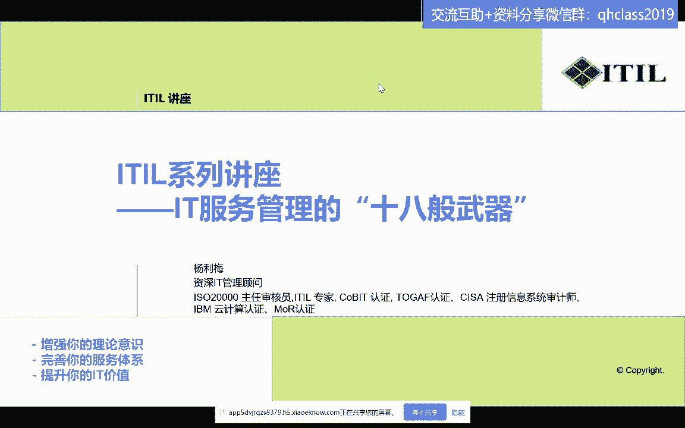
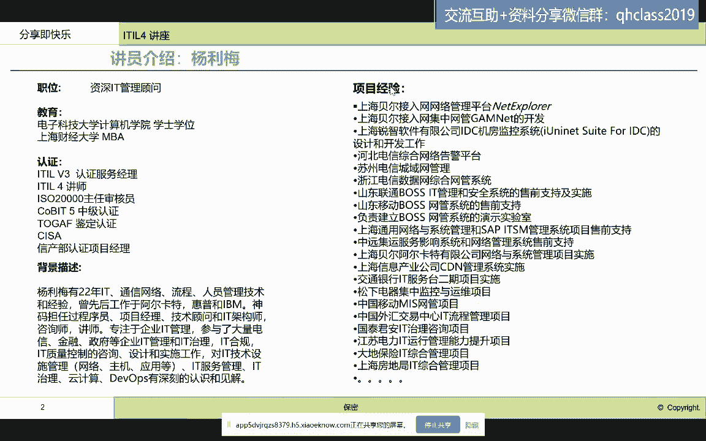
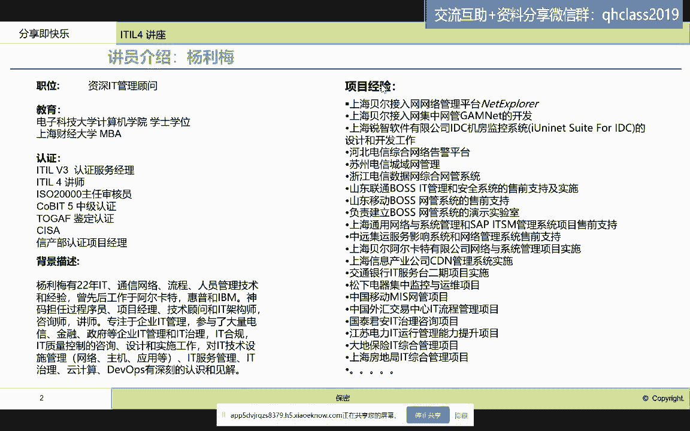
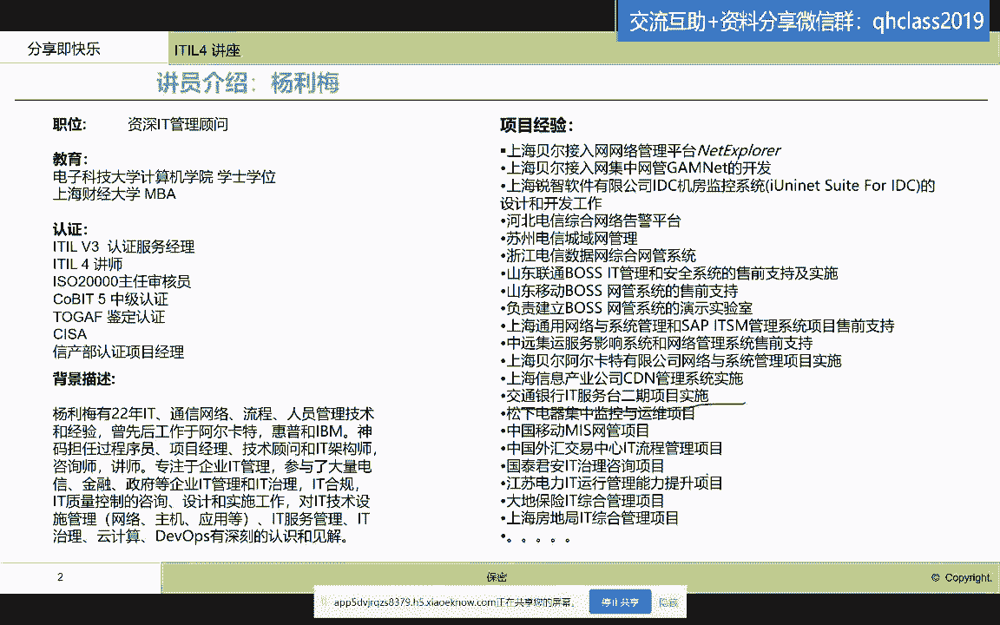
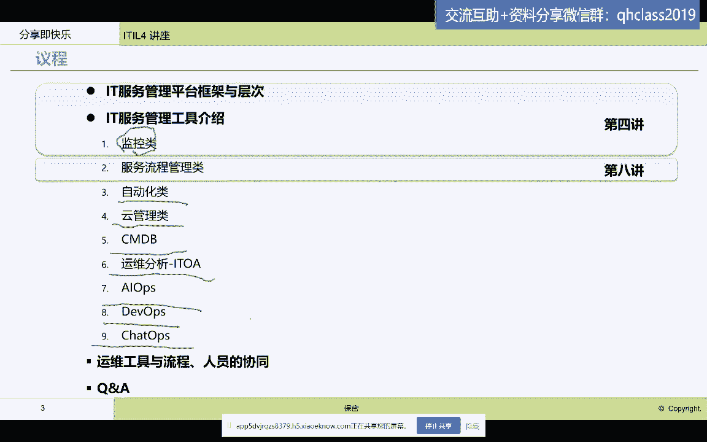
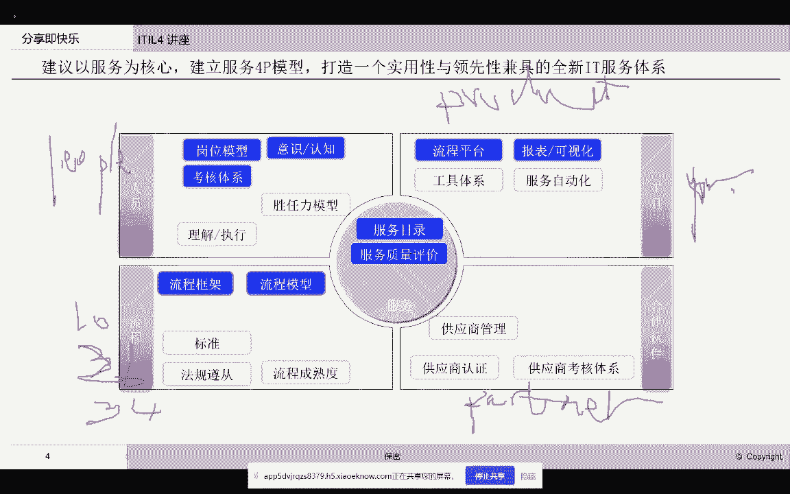

# IT服务管理的十八般武器之ITSM流程管路平台 - P1：1.课程导言 - 清晖Amy - BV1QZ421x7iW

好今天的讲座呢，这个也是隔了这个我们系列讲座的第八讲啊，那么我们又回到了这个讲IT服务管理工具，这一个系列里面，那么我们首先来看一下。

我们今天晚上要讲的内容。

那嗯因为有很多新的朋友嗯，加入到这个讲座里面来。

那我首先做个自我介绍啊，我我叫杨丽梅啊，那这个也是个资深的这个it从业者哈，这个24年的工作经验啊，那么呃我对爱豆的这个认知呢是比较早。

我2006年哈就拿过了这个ILEVR的service manager啊，2007年拿到了V3的啊expert，然后2018年拿到了idol4的讲师，2006年拿到了ISO20000的这个主任审核员。

那就是所以说呢，我自己本人对这个it服务管理的，这个嗯知识和实践啊，算是国内比较早的一批啊，也是这个现在还在这个呃领域奋斗的，一个这个老TSM哈，嗯所以说呢我今天呢是想给大家分享的。

是说我以前做这个IT服务管理啊，工具实施啊的一些经验啊，那也是希望给啊这些啊来听的这些小伙伴们啊，一些未来你们在企业里去实施it服务管理的，时候啊，一些经验啊，一些经验。

那这个我自己参与过很多it服务管理，项目的建设，那最早向这个我在这个交通银行啊，嗯去做了他的这个it服务管理台二期三期嗯，然后松做过松下电器的整个啊，这个就是啊，就是系腾龙系统的这个运维管理系统。

然后中国移动的miss网管系统，然后国泰君安的IT流程管理平台啊，然后还有像这个嗯我们像这个在上海移动，浙江移动他们的IT服务管理，所以说呢呃呃对于这个it服务管理的，这个认知啊，和这个实践经验啊。

我还是比较丰富的，我也希望在今天的这个课堂上。

跟大家一起来分享，那么呃我这个系列呢啊对于it服务管理啊，这个领域呢啊，我的工具呢我是实际上是分为了九章啊，九个章节，那我准备一个章节，一个章节跟大家来讲，我们前期是讲的第四讲，第四讲呢是这个监控类。

监控类呢嗯大家都知道，实际上是非常重要的一个平台，我所以说把它放在那第一部分跟大家讲啊，第一部分跟大家讲，那当时是在整个it服务管理体系里面，我们讲座里面，我们是在第四讲里面跟大家讲过了。

如果有感兴趣的小伙伴，大家可以去啊翻出来看一看哈，那当时也讲了接近两个小时讲这个监控类的，那么今天晚上跟大家讲的呢，是讲这个流程管理类啊，那这是第八讲，那中间呢实际上穿插了一些。

这个我们啊就是idol跟这个架构的关系，跟ky it治理的关系，ILE跟这个DIOS的这个关系的讲解啊，那主要是想帮助大家扩大一下，这个IT服务管理，不要认为是狭义的这个呃独立存在哈。

它其实跟我们现在很多管理思想，管理思潮啊，这个啊架构控制实际上是密切相关的啊，所以说也是想帮助大家拓展一下视野，那么今天晚上呢我们重点是讲第八讲，那么讲这个啊就是it服务管理流程平台啊，平台。

那么这一块呢呃其实内容也蛮多啊，那我今天呢可能准备的不是特别充分啊，那这个我想就是讲的随意一点啊，那这个呃希望大家能够在听的过程中呢，随时有问题呢，随时啊就是提出来啊，我们一起把它作为一种解答性质的啊。

教互动性质的这样一次讲座，那么后续呢我还会预告一下，我还会讲其他相关的一些it服务管理的工具，包括自动化类的啊，云管类的，然后CMDB类的，然后呃运营分析类啊，I t o a。

还有就是现在啊大家都在谈的，这个基于人工智能的啊，it运维IOS，那同时呢我还会后续还跟大家谈谈，DIOS的工具系列，以及呃现在嗯这个ChatGPT出来了以后啊。

这个cheat os又这个赋予了新的生命力，那后面想跟大家聊聊这个cheat os啊，Cheeos，那么呃这块是啊，后续啊还有蛮多内容，希望跟各位小伙伴一起来分享啊。

一起来分享好，那我们就开始今天讲座的这个内容，那我们今天讲座呢，我们首先是说还是想回顾一下，我们整个这个IT服务管理平台的，这个具体的这个工具的构成啊，工具的构成，因为我是想。

整个讲座是想告诉大家做一个it服务管理啊，至少需要从多个维度去看，第一个你的工具体系不是孤立的，单一的，这是第一个，第二个，你要成功地实施一个it服务管理啊，成功实施一个it服务管理。

你也不能只局限于用工具啊去实现啊，那么我们认为如果要去实施完整的，能够帮助企业通过服务管理，能够保障我们的系统稳定运行，能够保障我们的it服务给我们的业务部门，给我们的客户去产生业务价值的时候。

那我们需要建立一个什么样的it服务，管理体系呢，那么我们需要从4P入手啊，从4P入手，那第一个P就是people啊，people我想在这大家都知道哈啊，因为这里面今天来听课的可能有些是啊。

我以前的idol的这个学员，那么我也在课堂上跟大家强调，打造一个it服务管理体系，那工具是其中的一方面，那么除了工具以外，我们需要有人在这个人员方面，我们需要跟大家一起来建立这个岗位模型啊。

提倡大家对IT服务的认知水平，然后建立严格的it服务管理考核体系，以及嗯我们只有合格的人，具有胜任力的服务人员，才能够使用工具，遵照流程去提高服务质量水平，能够产生服务价值。

所以说呢我们第一部分是需要有人，去建立我们的服务体系，第二部分就是需要流程啊，流程大家可能是非常熟悉的啊，很多学过艾特V2V3V四啊，包括V4啊，包括四啊，sorry我的口误哈，应该idol4。

那么他们的这个呃核心哈，嗯从以流程为核心，以服务为核心，以这个价值为核心，但是我们看到流程在其中担任的角色是非常啊，关键的啊，关键的那么特别是艾特V2V3，它都是以流程框架，流程模型啊。

为一个主要的主线，去驱动我们的这个服务的交付啊，服务的交付，那么呃这是西方，我们大家都知道，爱豆实际上是西方的一种管理思维，那么西方的管理思维在管理领域里面，他们是以流程啊作为我们一种啊执行。

提高服务质量最最基础需要去改进的要素啊，呃改成要素，所以说呢我们在IOV2里面有十个流程啊，IOV3里面有30，这个这个这个26个流程啊，26个流程，在这个idol4里面有34个实践对吧。

这个上过课的小伙伴都知道啊，我们在这个呃学习的时候，会重点的去学习这些流程和实践好，那么第三个P是什么呢，就是我们的工具啊，这个P啊，这个P我们就称为PRODUCTOR啊。

product那么哎呀sorry啊，这个这个这个鼠标不太好使啊，product工具是我们讲的重点哈，我们这个系列讲的重点，那么我们说有人有流程，没有工具行不行行，但是效率很低，自动化水平低啊。

那就带来的是什么，带来的是大家执行人在执行流程的时候，可能由于没有工具的固化，人执行很随意啊，执行很随意，然后呃我们在执行过程中，信息不能统一收集，不能统一的贯穿啊，那这就需要我们工具来帮助我们。

把流程固化僵化，然后让人去执行啊，让人去执行，那我们在工具里面我们会谈流程平台完成嗯，来谈这个嗯这个流程执行的效率报表，然后我们来谈这个要建立完整的工具体系啊，要建立工具体系，那么最后一个P是什么呢。

就是我们的合作伙伴对吧，大家上过爱豆的课应该很了解啊，我们的这个partner，我们现在的所有的服务都离不开什么，我们的合作伙伴一起来共同的去创造价值啊，Partner，啊看到了那呃。

无论你是IT服务提供商还是内部的IT啊，内部的IT服务提供商，那你你的软件硬件啊，你甚至你的一些咨询商，你的一些工具提供商，这都是你们的合作伙伴，那你们的服务质量实际上是有依赖性的，依赖于这些合作伙伴。

他们给你提供的支撑服务啊，支撑服务，那我们就需要管理好我们的合作伙伴啊，管理好的合作伙伴，所以说我们看到强调的第一个观点是什么，我们要去建立服务体系，工具只是一方面，但是缺了工具又不行啊。

确实有工具飞行，第二个观点需要带告诉大家的是，不能以工具，认为这就是建立的it服务管理体系，以偏概全啊，因为我自己经历过这个国内大大的企业，他们建立这个it服务体系的时候，很多人的认知都是买了一个工具。

就认为实现了it服务管理，实现了idol的这种核心要义啊，很多领导特别是领导是这么认为的啊，甚至很多领导认为买了工具直接使用，那没有任何的这个定制化啊，那这种理念呢我认为都是其实是蛮片面的啊，蛮片面的。

那我们实际上是需要告诉大家，我们需要结合人员流程，工具，合作伙伴来去，建立我们完整的it服务管理体系啊，服务管理体系好。

