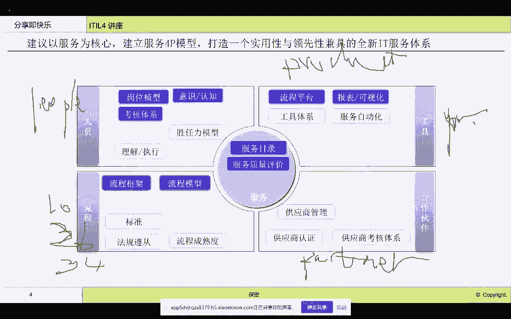
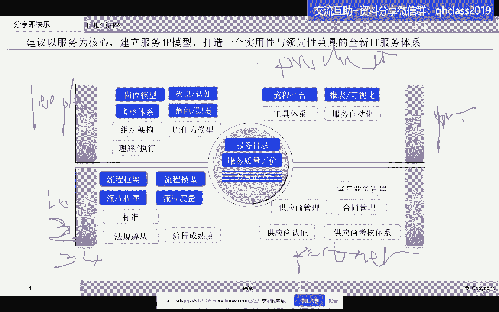
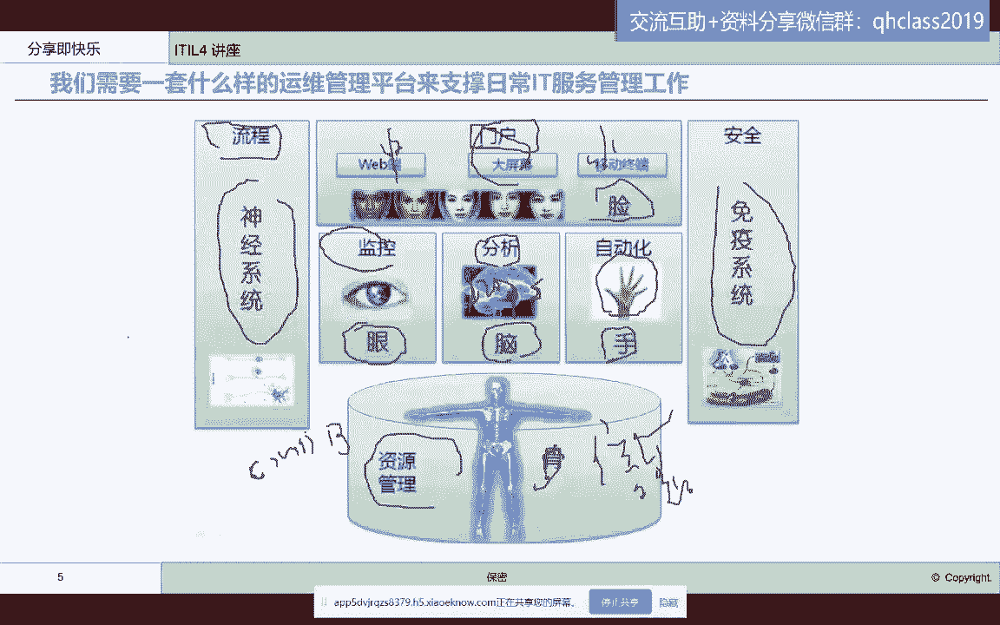
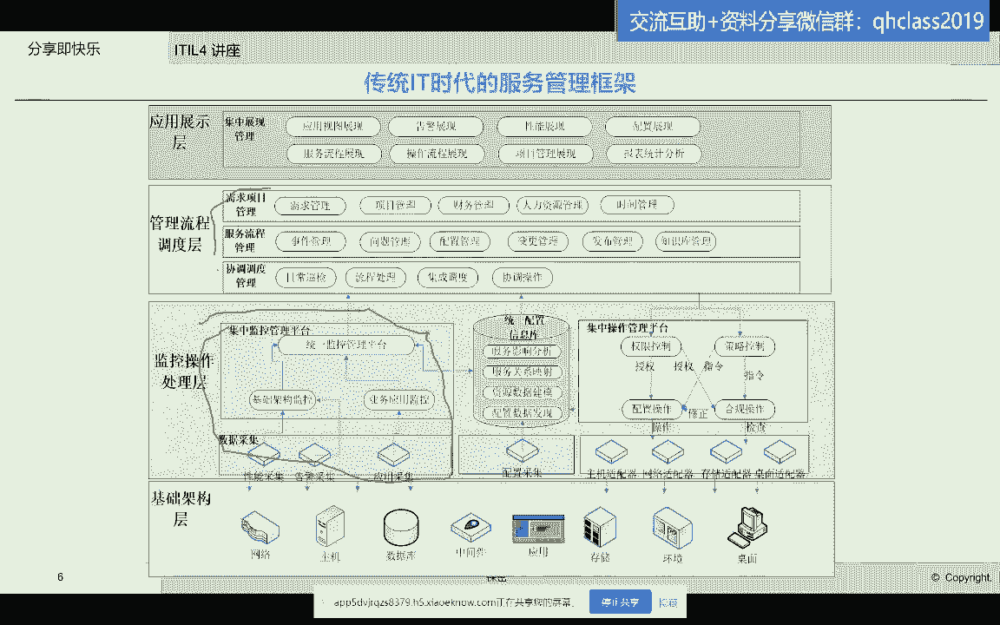
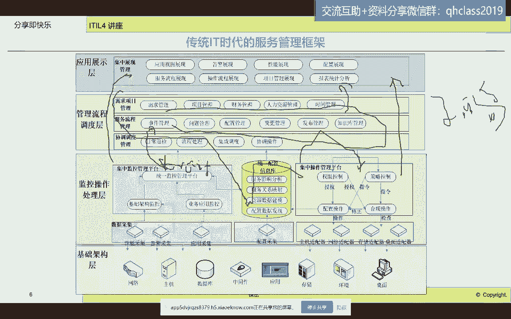

# IT服务管理的十八般武器之ITSM流程管路平台 - P2：2.IT运维服务管理平台完整功能架构 - 清晖Amy - BV1QZ421x7iW

it服务管理体系啊，服务管理体系好，那么我们这个是我们强调第一个观点好。

那我们需要一套什么样的管理体呃，管理工具啊，我们毕竟我们今天分享的主题是，管理工具的实现啊，那么嗯我们管理工具啊，传统的啊，我们做个比喻，什么比喻呢，我们相当于人人生活的时候，需要的是眼睛对吧。

我们要了解事物，了解事态发展，那我们需要用眼睛，第二个眼睛看到了以后，我们要去做决策，做判断，那要去做决策，要去做判断，那我们需要用脑子，然后我们接下来需要用什么。

需要用我们的手啊去控制我们的这个行为啊，行为，那我们就是眼脑手，那么同时呢我们看到我们的脑子要做出判断，需要有我们的神经系统啊，同时我们要活得开心，我们要有健康，要有免疫系统啊，免疫系统。

然后我们要活得精彩，我们要有漂亮的脸蛋儿啊，漂亮脸蛋，我们要活的健康，我们要有骨骼啊，要有骨骼，要有健康的四肢，那么这是我们完整的一个人的这样一个身体，机理能协同发展。

那么我们再运用到运维工具体系来看看，那么我们的眼睛就是我们的监控体系啊，我们很多数据中心要打败完整的监控体系，非常重要，如果没有监控体系，你对数据中心的运行状态一无所知，那你就是个瞎子啊，就是瞎子。

所以说我们啊很多啊，这个就是it部门要建的第一类工具，就是监控工具啊，监控工具好，有了监控工具，那接下来就是要有分析工具啊，分析工具，那分析工具是什么呢，分析工具就是我们现在的人工智能AROS啊。

IOS我们把我们看到的各种信息进行汇聚啊，进行汇聚ALOS汇集起来，我们去做分析，去做判断诶，是什么故障呢，资源够不够用啊，然后这个有没有风险啊，我们去做分析，这个就是AROS啊，接下来分析完了。

有有结论了，我们就要开始去对我们的IT系统，去做反向操作，什么叫反向操作呢，我们要去控制我们的系统，比如说我们现在发现了故障点，我们要去重启，我们要去切换，这个都是自动化啊，然后有风险了。

我们可能要去扩容，我们每天要去了解我们这个这个系统的状态，我们要去做巡检，这个就是我们的自动化好，那么有了这个以呃这个监控，air ops自动化要去行动，要去分析，要去判断，要去观察。

那都需要有一套什么，有一套规范规则，要靠神经系统啊来去组织我们所有的活动，先看到再思考再判断，那就是需要有流程系统来帮助，规范我们日常的运维工作啊，这就是流程平台啊，流程系统给我们带来的好处啊。

那么上面我们企业，很多企业现在嗯在这个运维过程中，我们会去建立三屏对吧，大屏中屏小屏啊，那这个就是我们去对外展示，或者是给我们的管理员去使用的这些终端啊，这些大屏幕，这些PC操作界面。

这个我们称之为门户系统，这是我们的IT的脸啊，it里包括我们现在的这些啊服务目录啊，服务质量，服务处理进度都可以通过门户暴露出来啊，通都可以通过我们的终端，通过我们的PC服务端就暴露出来。

同时我们还要看到我们所有的工作，那都是对什么进行操作呢，需要依赖于什么呢，需要依赖于管理信息啊，这些管理信息存在哪呀，存在我们的什么资源管理系统里面，传统上我们如果理解的狭义一点。

就是我们需要有一个什么运维的主数据平台，叫CMDB对吧，那大家都知道，这个CMDB在这个整个it工具类里面，是属于一个基座啊，无论你眼睛看到的脑子思考的自动化操作的。

都是依赖于你对现在当前你所说需使用到的，观察到的，思考到的所有的资源的操作和判断跟踪啊，记录分析，所以说我们需要有质量管理系统啊，传统上我们可以理解为CMDBCMDB，所以说我们可以看到。

这个是我们对于一个数据中心，需要使用到的系统，用一个人的类比，人的类比来给大家讲清楚啊。

很清楚好，那我们来看看我们现在传统的一些这个，it服务管理框架啊，传统的IT服务管理框架，他们现在的这个整个的管理体系，工具体系有哪些，传统的我们一般叫做监管控对吧，监就是哪一段呢。

就是这一段先管管是哪呢，就是这个就是流程体系，加上CMDB就这套体系空是哪一套呢。

这一套，然后再加上我们的对外展示集中展示平台，我们的脸啊，我们的脸，那我们可以看得到哈，呃我们今天讲的是这一部分，就是管理这一部分啊，管理这一部分，他在这个过程当中，主要就是要去让我们的所有的坚。

所有的空，所有的思考都是有逻辑的，是要有条理的，同时我们为什么需要管呢，因为我们的IT是一个组织，不是一个人，是一个团队，团队就需要协作，就需要有责任分工，就需要有考核制度。

那这些呢就是通过我们的管理平台，流程管理平台来实现的啊，流程管理平台来实现，那它跟这个其他两者和这个，展现成的关系是什么，我们再来看一看啊，我觉得这个有必要给大家讲讲清楚哈，就是我们的流程管理平台啊。

流程管理平台和，监控平台和这个自动化平台，以及列我们的门户平台是什么关系啊，那我们可以看得到我们监控平台发散了事件啊，这种我们称之为event对吗，E v e n t，EVENT这种事件。

那这种事件我们可能就会变成什么，变成一个在idol里面，我们叫incident，这个incident呃，当然在ITLE里面翻译成这个事故管理是吧，我们在这边翻译成在这边我们有事件管理。

这些事件可能就是一种啊，就是严重的系统不工作的，系统和服务质量下降的，那我们就叫事故，我们就会产生一个事故单啊，产生一个事故单就流入了流程，人就开始去处理了啊，去处理了好，那人在处理的过程中。

可能会触发一些自动化的操作，那就进入到操作管理平台啊，操作管理平台，那这就形成了什么监管控的联动啊，监管控的联动，那么监控的信息会展现在屏幕上，管理的状态会展现在屏幕上，操作的结果也会展现在屏幕上。

所以说我们看到我们整个的一套监管控体系，是可以联动执行的，不要割裂的去看啊，这也现在是很多it部门所面临的，这个什么运维工具的孤岛啊，我们说业务系统有孤岛，但是我们的IT系统也面。

IT运维系统也面临着孤岛，也面临着运维工具的烟囱啊，烟囱这些都是我们可能需要去避免啊。

避免的好，这个就是我们看到的啊，这个管控工具的位置啊，管控工具的位置，那我们看看嗯，刚才是传统的，那么我又帮大家去找到一个更加详细的一个，管理体管理工具平台，所以二级的需要具备的这个功能。

那我们可以看得到啊，这个就更复杂了啊，更复杂了，我们的监控啊，监控在哪呢，监控是在这边儿是吧，在这边，监控在这边好，管理在哪呢，管理在这里，在这还有一块就是自动化，在这当然除了这个监管控以外。

我们还有安全的管理对吧，安全的管理，还有这个就是啊一些公共组件，比如说呃这个这个管理平台的基础设施，比如说权限的管理啊，啊这个流程引擎的管理啊啊，还有就是我们的这个一些配置数据运维，数据的管理就在这里。

数据层啊，数据层，那么上面是展现层，所以说我们看到啊基本上是大同小异啊，这是我们传统的这个IT服务管理平台。

