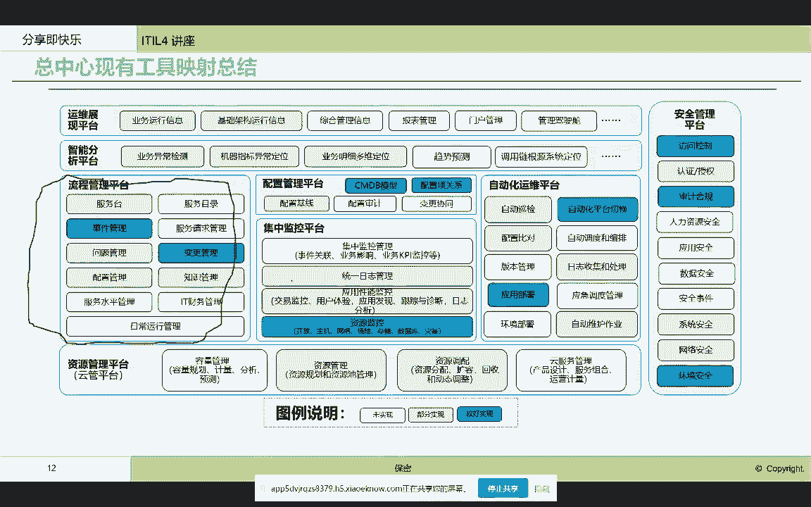
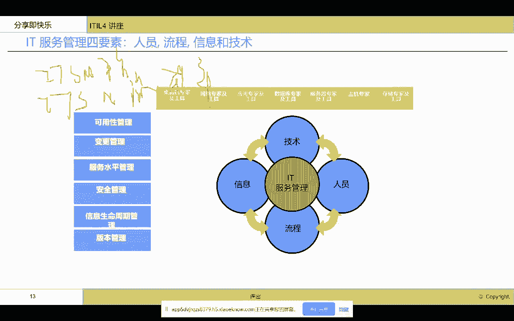

# IT服务管理的十八般武器之ITSM流程管路平台 - P3：3.IT 服务管理四要素人员, 流程信息和技术 - 清晖Amy - BV1QZ421x7iW

服务管理平台，它们的功能以及啊这个it服务管理平台，他们在整个管理体系里面，工具体系里面所处的位置，那么我们再看看嗯，当前很多it部门已经跨入了云的时代，那么在云的时代里面，整个工具平台又会进行刷新啊。

比如说最简单的我们需要增加云管平台，在这里啊，云管平台，因为我们对云是有特殊的一些管理的功能的啊，比如说云资源的动态调配，云资源的容量规划啊，云的资源池的状态的控制啊，资源管理。

那么我们肯定就是需要增加云管平台啊，云管平台，那么除了我们的管控以外啊，我们的云管平台是在云时代，可能需要帮助大家去新引入的一套管理工具啊，一套管理工具，那么在云的时代下，大家可能还会谈到什么。

谈到敏捷，我相信现在很多大家，这个企业里都也都在谈敏捷，那么在谈到敏捷的时候啊，那我们看到跟it服务管理相关的就是DIOS啊，那么很多企业现在都有divers，那么我们看到啊，除了传统的这个监控，管理。

啊这个控制控制这一块，那么我们现在在云加敏捷的时代，我们又会引入新的这个管理平台，我们叫DIOS平台啊，我后续会跟大家详细的来讲这个divers平台，那么在divers平台里面。

我们就会把it服务的这个视角延伸到，从软件的开发到软件测试，到软件发布到上线以后的整整体监控，实现端对端的啊，这个缩短服务上线的时间啊，提高我们服务上线的质量啊，那所以说呢我们看到。

其实我们的diverse平台引进呢，实际上是给我们的整个现在在云环境底下，为我们的运维人员，开发人员去提供it服务价值，又增加了一个强有力的工具平台啊，调整为中风去平台。

那么divers平台和我们的这个，现在的这个自动化平台，里面的云自动化又有紧密的联系，比如说我们看到，其实在这个应用的自动发布于部署上面，当我们在发布的时候，我们就需要我们的自动化平台。

进行什么资源的自动分配，在这一块儿，我们需要按照我们应用发布所需要的资源，我们的自动去开通啊，我们这些资源自动去安装我们的软件啊，这些数据库和中间件啊，然后自动的去干什么软件分发啊，软件部署。

那这些呢就让我们的运维工作更加轻松，在云的世界里，我们有更多的这个工具帮助我们去管理好云，同时更好地服务于我们的什么，我们上层的应用场景，比如说软件的快速上线啊，快速上线，那么同时我们可以看得到哈。

在这个云的环境里，我们的CMDB也有了新的变化啊，新的变化，那最简单的我们的CMDB原来是静态的，现在在云的环境里，这个必须要做到动态，必须要做到自动获取啊，否则我们看到云的资源的变化以后。

在CMDB这样静态的一个信息下面，他可能就会撕布啊，就会失误，所以说我们就必须要求，我们的CMDB的这个平台，要做到云基础架构的自动发现与对比啊，要更加快捷的能够实现什么。

这个真实的物理环境的快速的同步啊，快速的冲突，所以说我们看到云其实也给我们带来很多的，监管控工具，平台的新的这个能力要求和建设的这个方向啊，建设的方向，那么这个是我们在这个云问云环境底下。

我们这个管理平台的新的一些这个含义，那么现在大家都知道大家都进入智能化时代啊，智能化时代了，那么智能化时代在我们传统的监管，控云云管上面，我们又引入了什么，引入了air ops对吧，Air ops。

那么这个air ops就可以帮助我们更好的，增强我们的这个思考能力啊，增强我们的这个神经系统啊，能够让我们的这个决策判断管理，更加的什么智能啊，利用算法做我们以前不能做到的一些事情啊，做的事情。

包括像我们现在很多企业里都在谈，这个异常检测呀，故障诊断呀，故障预测呀，智能变更分析啊，容量预测呀，故障自愈啊，这个借助于算法啊，能够比我们传统的以监管控啊，这种传统手段能够更加高效。

比如说我们的异常检测，可以帮助我们避免固定阈值，带来的什么漏报误报，我们需要大量的手工去设置这个阈值，而现在通过异常检测，通过基带的学习，我们可以设成动态阈值啊，动态阈值，同时这样的话就可以减少。

对我们的IT服务管理平台，我们今天要讲的这块IT服务管理平台，那么它带来的这个好处是什么呢，我们异常检测更准了，我们在事故单就会更少，以前我们传统的监控每天会产生很多事故单啊，因为会发生很多事故。

其实是误报，需要人工梳理，现在不需要了，现在我们可以通过异常检测，更少的更精准的故障的报告和发现，那就产生更少的事故单好，那么我们现在在做问题管理的时候，是要查故障的，查故障，原来我们纯粹是一个流程啊。

纯粹是一个流程，但是我们现在查故障，我们可以干什么啊，我们可以利用人工智能手段故障诊断好，通过人工智能让我们的这个流程T里面的流程，能够有工具可以实现流程，而不是纯粹的就是为了去管理人。

而是用智能化的手段，用数字化的手段，让我们的流程在执行的过程中，用工具真正的赋能啊，工具的赋能，比如说我们原来在这个这个it服务管理里面，很难实现的什么容量管理，大家都知道啊，ILE里面是有容量管理的。

容量管理，那这个容量管理在ITOVR里面，我看到很多，很少有工具会真的去有一个容量管理模块，但是很多企业里又有容量管理，最典型的你们明年你们要新采购多少服务器，新都采购多少内存。

基本上是靠人脑子去判断的，而这样的流程平台流程功能，实际上现在在AOS里面，容量预测是有专业的工具，科学的预测是能实现这些流程的，也就是说智能运维让我们的it服务管理系统。

让一些原来我们的流程平台不具备的功能，现在具备了啊，不具具备了，让我们以前的这些纯粹的是去管人的这些流程，可以通过air ops，智能的实现自动地实现，所以说呢我们看到其实我们一个时代，新的技术的引入。

新的平台的建立，是可以让我们的什么，原来纯粹的以管流程为主的这样服务管理平台，能够发生一些质的变化，这些字的变化，实际上是我们的it服务管理平台，能够做得更好啊，做得更好好，那这里面还有像某一家企业。

他们做的这个服务管理平台在这里对吧，在这，那么他们现在也引入了这个air ops容量管理啊，故障分析啊，那他们完全是为了要去让我们的it服务管理，流程执行起来更加高效，更加高效，那这个就是我们看到的。

现在智能运维平台给我们的it服务管理，带来的好处，那这也是某一家企业啊，某一家企业，他们的整个的运维工具的一个总结啊，一个总结，那我们始终看到，流程管理平台是不他们不可或缺的一块啊，不仅获取越快。

而且来说相对来说比较稳定啊，传统的IDOV2的十大流程组啊，十大流程组那都是在这个流程管理平台里面，有具体的这个实现，那么只是说随着这个技术的进步，让我们的流程平台啊有了这个智能化的执行啊。

有了自动化的这个啊，这个这个执行好，这个就是帮助大家去梳理一下，我们流程平台在整个运维工具体系里面，它所在的位置，以及和其他管理工具之间的逻辑关系，我想就是帮大家梳理到这里，花了差不多半个小时吧。

花了比较长的时间啊，那么呃因为我觉得一个具体的工具啊，其实只是单点的，要产生这个整体的服务管理的效益，我们还是需要结合整体来看，那么我就是给大家把一个流程服务管理的，流程平台，在整个运维体系里面。

工具体系里面他在的位置给大家讲清楚，好。

接下来啊我开始讲T服务管理平台，那么我这里面要纯青指的词哈，一个是我讲到的IT服务管理平台，ITASM平台我会这么说，我也会说ITSM的流程平台啊，流程平台我也会说it服务管理工具体系。

工具体系就是我刚才看到的，大家看到的整个，整个一个数据中心，一个it服务提供商所需要的工具的全集，而我们今天讲的实际上是一个管理流程的啊，平台，那么我们叫流程管理平台也好，ILE平台也好。

ITSM平台也好，那我们认为主要是聚焦在这个流程管理平台啊，那么流程管理平台的建设呢，嗯是依赖于这四要素，我刚才已经跟大家讲过了，我们就不再啰嗦啊。

