# IT服务管理的十八般武器之ITSM流程管路平台 - P5：5.实施IT服务管理潜在风险和困难 - 清晖Amy - BV1QZ421x7iW

服务管理平台实际上是非常非常庞大的啊，非常庞大的，也需要我们去选择合适的这个厂商啊，一个灵活的平台，来构建我们整个的服务管理平台啊，服务管理平台，那么这个服务管理平台的功能，也不是一下子就要建完了。

这里面也需要跟大家去聊啊，我们通常呢这个建设呢呃很多企业里面呢，呃这个流程平台的建设呢是分步骤建设的啊，可能分为一期二期三期这样一个建设周期，那么在这个建设周期里面，我们可以看得到。

我们的建设实际上是从被动到主动到服务管理，那么在被动管理里面，我们重点的是建设什么工具的流程模块呢，比如说incident管理知识库，服务请求啊，然后问题管理变更管理，配置管理，发布管理。

那是不是所有的一期项目，我们就要买这么多流程模块，来建自己的it服务管理流程平台呢，我个人的看法是，这个要因企业而异，因企业的文化而已，为什么会有这个说法，我曾经就碰到过一家企业。

还是国内非常大领先的数据中心，它在一期项目里面，他们就实施了五个流程，就是这五个流程变更配置发布问题突发啊，这个事故管理，还有就是服务请求管理，服务请求管理，他们当时没上，他只上了这五。

这前面这五个艾特V2的五个，最后真正起效果的落地的其实就是事故管理，就是我们的incident管理，还有就是这个变更管理，其他的流程基本上都没有产生特别的效果，还是国内最领先的最大型的一些银行机构。

他们都没有办法一次性消化掉这么多流程啊，我不想，我想可想而知，一些小的企业如果真的是上了这么多流程，可能效果也不会特别明显啊，所以说我的啊建议是什么呢，我的建议是大家一定要根据你们的实际情况啊。

排优先级去建立你们的引入it服务管理平台，打造你们的多期打造你们的功能模块啊，功能模块我们我的个人建议哈也是一些哦，经验总结，我们建议你的第一期啊上的流程组叫IPC，流程组，IPC流程组。

Incident problem change，就是这三个，你如果一期项目能把相应的流程制定好，相应的软啊，ITM平台工具定制好，能够持续的执行，一定会有效果啊，我们最忌讳贪大病，嚼多不烂这种情况啊。

二期项目我建议你们可以去上配置管理啊，发布管理这样的流程，然后三期项目你可以去上技能啊，这个容量管理啊，哎可用性管理啊，持续性管理啊，还有操作管理啊，啊四期项目你可能才去做什么服务级别管理，财务管理啊。

类似于这样的管理流程，管理流程，这样的话，我相信你们这个企业，在这个IT服务管理能力上的，这个路会越走越顺啊，会有越顺，最终呢很多企业会去哪，通过这个ISO20000的认证，去证明。

我们这家企业已经完成了，整个的it服务管理的建设啊，it服务管理建设，那这个就是我给大家的一个建设思路啊。

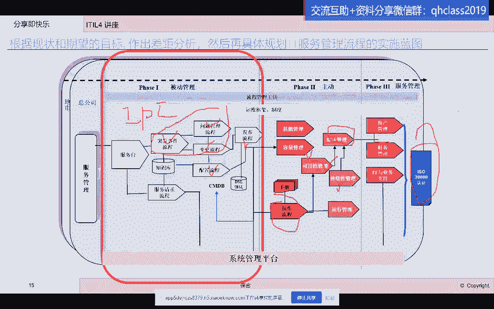

建设思路好，那我们来看一看嗯，建设的时候要分三大部分啊，人员流程工具啊，我们也称为PPT的建设对吧，我记得呃来参加过课程的学员，我跟大家讲的啊，这三要素的建立在一个项目里必须要去考虑啊。

第一个先去考虑流程，流程就是要选择合适的流程，刚才已经跟大家讲了啊啊事件呃，问题变更发布啊，配置还有很多企业会有知识库，会有服务台是吧，那这个是apple的标准流程啊，标准流程，那么除了这些标准流程。

那么很多企业还需要去建立一个非标。

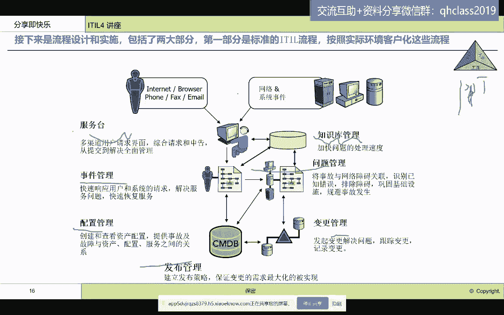

非ISO标准的定制化开发啊，比如说很多企业会有运维文档的管理啊，it运维项目的管理啊，T用于项目的管理，那么这些非标的这些流程，其实会帮助大家干嘛呢，会帮助大家把一些看似不是流程的。

但是又可能会对你们的日常工作产生，密切影响啊，这些流程这些管理制度给你建起来，用工具去实现啊，用工具去实现，那么像这种文档管理，如果你没有流程，你就会导致你们的运维知识流失啊，因为知识的流失。

那我们就需要去建立这样文档管理，文档管理。

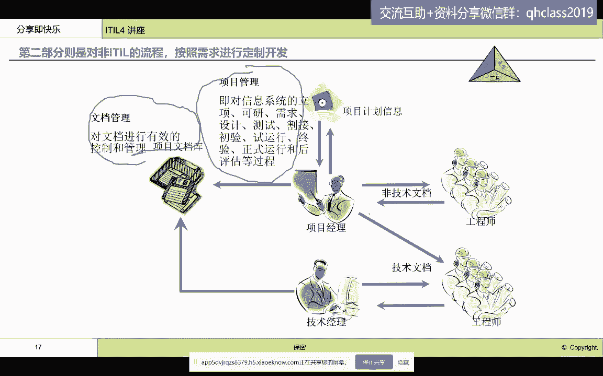

那么同时我们对于这种apple的标准的流程啊，标准的流程像我们看到的这些标准的流程啊，刚才还讲了一些非标的流程，那么除了这三类流程，我们还有这种日常运行的流程，也需要大家去建设。

包括我们刚才讲到的调度管理，工单管理，操作管理这些流程一样的需要大家去关注，去建设，因为它是我们日常运营过程当中必不可少的，必不可少的，它需要和idol的标准流程一起来建设啊，来建设好，有了流程以后。

我们接下来要建什么呢，要建人员体系，人员的服务体系啊，那么人员的服务体系我们要建什么，我们要建的是呃，在整个知识体系里面，我们的分线一线二线三线，大家上过这个啊，incident的管理的时候。

我们重点要强调，我们的整个服务体系是需要术业有专攻啊，80%的事故啊是由一线来解决的对吧，20%的这个80的事故由一线来解决，然后留下20%疑难杂症给二线专家，给第三方供应商，给开发部门啊。

那么这样的人员支持体系呢，在这个整个服务组织里面呢，需要去建立什么呢，建立这样的体系，体系建完了，那体系里面包含了什么。

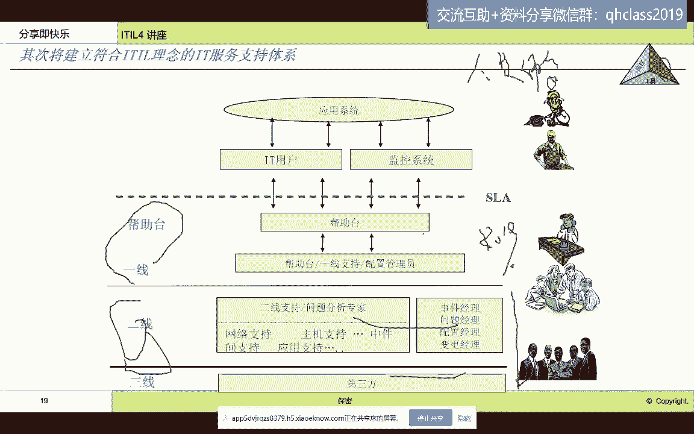

那我们来看看体系要建立组织组织架构对吧。

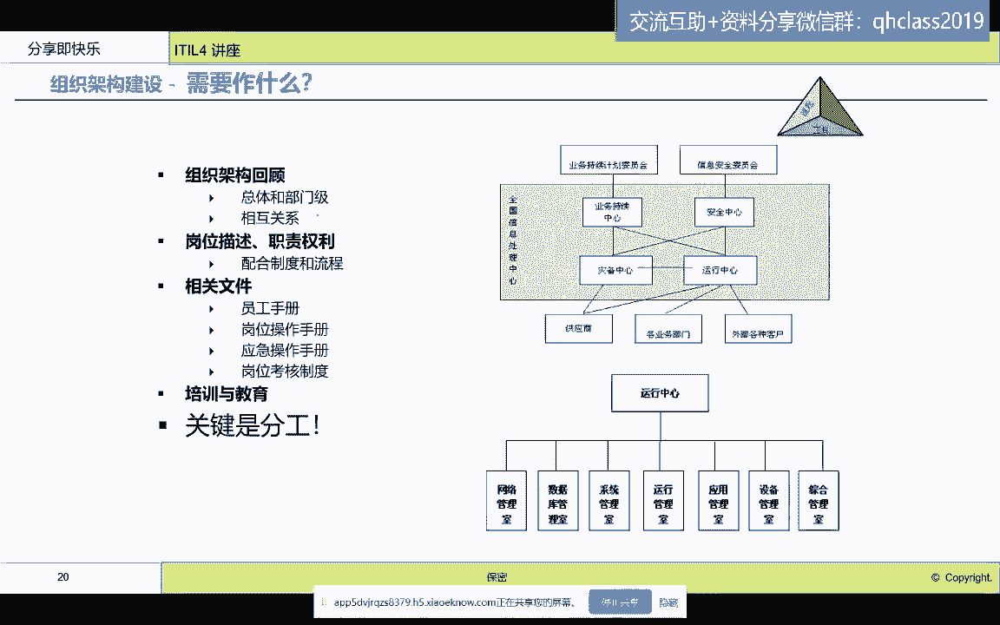

谁汇报给谁，这些人属于什么部门，这个现在都是谈的角色对吗，一线二线三线其实都是谈的角色，我们到一个企业里面住。

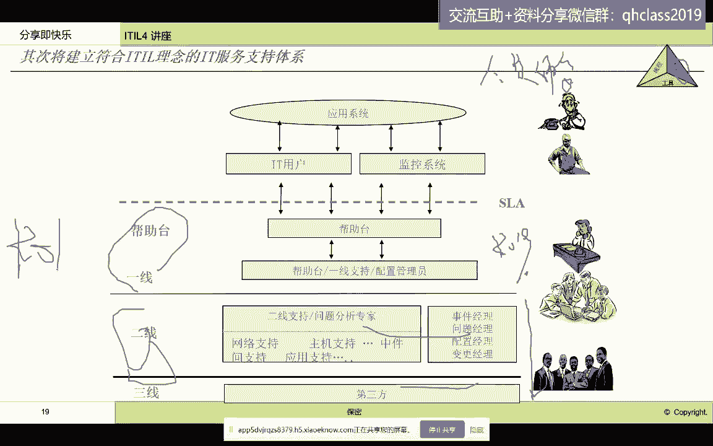

具体的是要谈什么岗位，我们一般谈job position啊，比如说技术支持部，应用运维部，那它就是做二线啊，那么ECC哦，我们一般做一线服务台，一般做一线，那么一线它实际上是个角色，那么具体的组织部门。

那就是企业总控中心，然后这个这个呃就是呃一线值班人员啊，那我们这这个就叫岗位啊岗位，那么我们要去建立我们的组织架构啊，部门相互汇报关系，这是我们第一个要跟大家在人员体系里面建的，第二个对每一个岗位。

我们要去梳理每一个岗位的什么任职资格，考核指标，然后这个呃工作范围啊，工作范围需要遵循的制度和流程，就是描述这个岗位的责权利，这是我们第二个要在人员建设上面要去做的，第三个我们要对人员进行什么日常规范。

这个日常规范呢流程是一类，还有一类我们叫做SOP，叫standard operation procedure标准操作规程，这些操作规程实际上是指导着我们的运维人员，服务人员每天去开展具体的这些操作技术。

操作应急啊，这样的工作，他的具体的操作步骤，那这个呢我们需要写这个操作手册啊，第四个我们还要对员工进行培训教育，让他们具有相应的技能，服务意识啊，服务意识，那么通过这样的一个组织架构，人员体系的建设。

能够让我弥补保证我们整个建设的一个成功啊，建设成功好，接下同时我们还需要去制定什么考核制度啊。

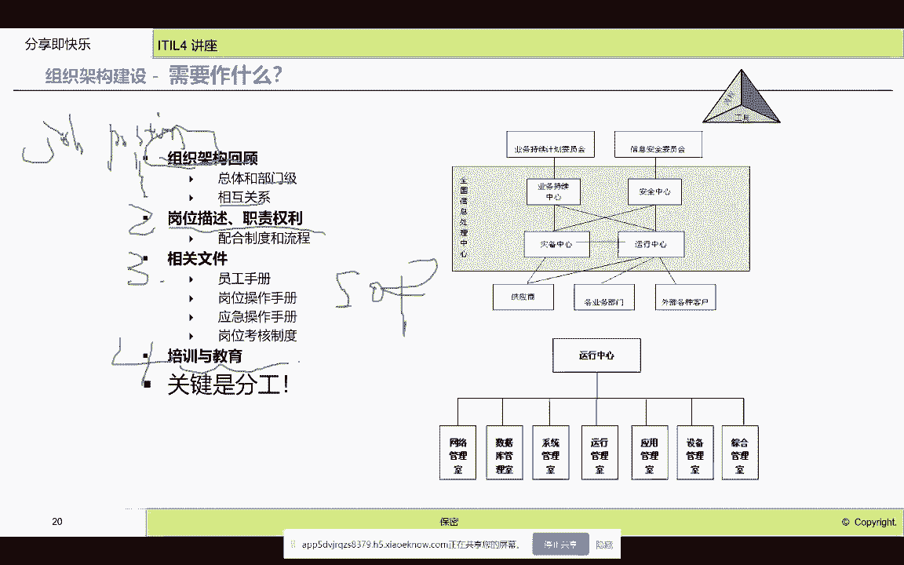

考核制度大家都知道，其实人呢可能这个无论这个你在哪家企业上班，你一定是需要有激励制度的，有激励，那就是需要给你制定KPI是吧，KPI那么这些KPI包括执行效率的KPI，效果的KPI，绩效考核的KPI啊。

那么这些有了这些KPI能激励我们，能够让员工自觉主动去完成这些指标，去为我们的客户去提供什么，提供高质量的it服务，同时也让我们的管理者有了度量的尺子啊，尺子有了此次我们的管理才会什么不是仁治。

而是什么，而是法治，法制啊，我们的流程，我们的考核制度是让我们的法制，体现出来啊，而不是你最后的绩效评估是领导的偏好，领导的喜怒哀乐啊，这个就是我们在人员体系方面，需要去建立的内容啊，然后流程制定好了。

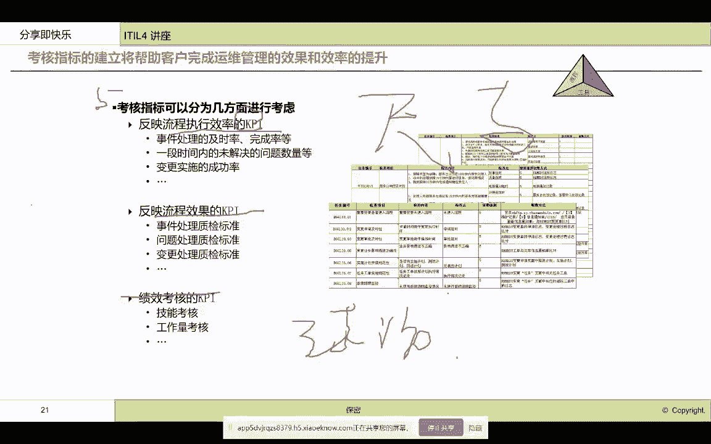

人员体系，岗位职责考核指标都设计好了，那我们接下来要做第三个是第三个是干什么呢，我们要做工具的落地，啊工具的落地，那么我们这些工具流程，这些流程很多人认为大家买一个工具来。

这些工具已经内嵌了一些爱豆的时间，是不是就可以直接用了，我曾经碰到过很多人问这个问题啊，碰到这个问题，那么我的回答是什么呢，拿工具，那拿工具去限定人，这个就叫啊削足适履。

把自己的脚按照鞋子的尺码去切掉去修剪，大家都知道这个是不可取的对吧，如果大家明白这个道理，就知道为什么你不能拿工具去限制人，而是要根据你的企业文化，根据我们前面设计的这个流程啊。

设计的流程以及人员的要求，人员的现在的这个水平，去定制化开发你的工具啊，定制化开发你的工具，同时这些工具在开发的时候还需要去做很多，很多的与第三方工具的集成，比如说我们需要与你的短消息系统。

你的邮件系统，你的AIRDP系统就是你的身份权限系统去做基层，让你的工具，不会成为我们执行过程当中的什么绊脚石，不会拖累我们执行的效率，我们只会让我们的工具更加高效，啊那如果要高效。

你就不能只有一个工具，你是要把所有的工具串起来用啊，串起来用，你有一个入口啊，一个入口去完成所有工具的内容啊，所有工具的内容好，这个就是我们要把工具落地，那么同时我们在工具的执行过程中。

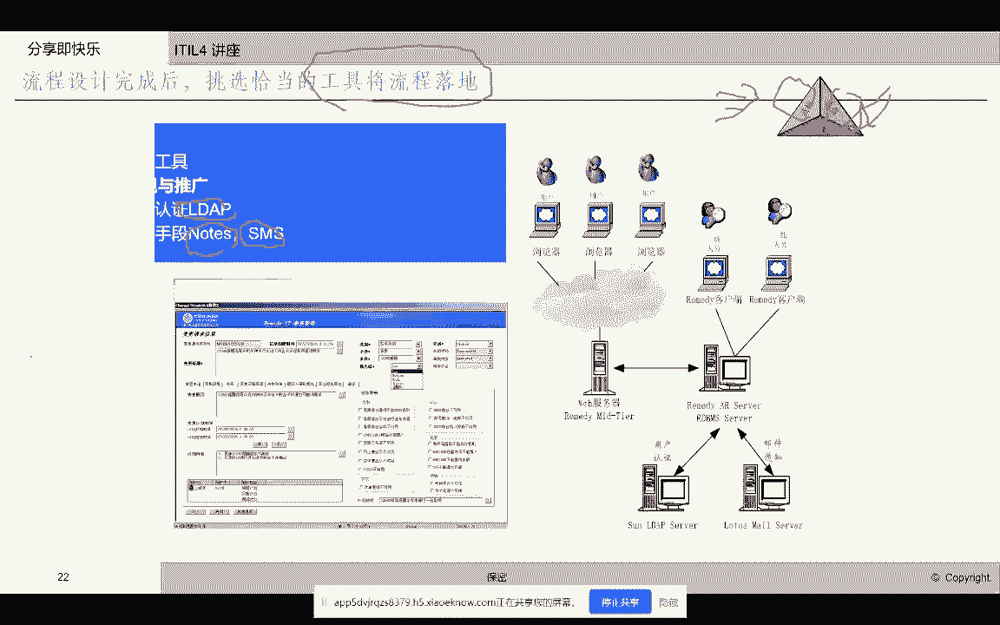

我们还要开发什么报表啊，我们还要开发各类报表，那这些报表呢，实际上呃去体现我们在人员里面设置的KPI，KPI就是我们的关键绩效指标，这些关键指标在工具里怎么落地的，就是以报表的形式啊。

这是我们在某一家企业做的各类的报表啊，各类的表报表，比如说这个每个月我们处理了多少故障数啊，处理多少故障数，然后呃我们的变更啊，我们的问题哪些是已经接单了，哪些是已解决了，已关闭了什么系统故障数多啊。

我们都会去看啊，都会去看，通过这个报表去发现我们的一些管理问题，人员的这个效率问题啊，流程的这个规范问题，流程的执行合规问题，啊我们就需要去制定各种报表，那么在这里我想跟大家强调一下报表。

不要认为这是一个工具，它是体现的是管理思想啊，体现了管理思想，那比如说我们可以去看到，通过报表，我们能去发现我们的流程是否合理，流程是否合理，我们的人员效率是否高效。

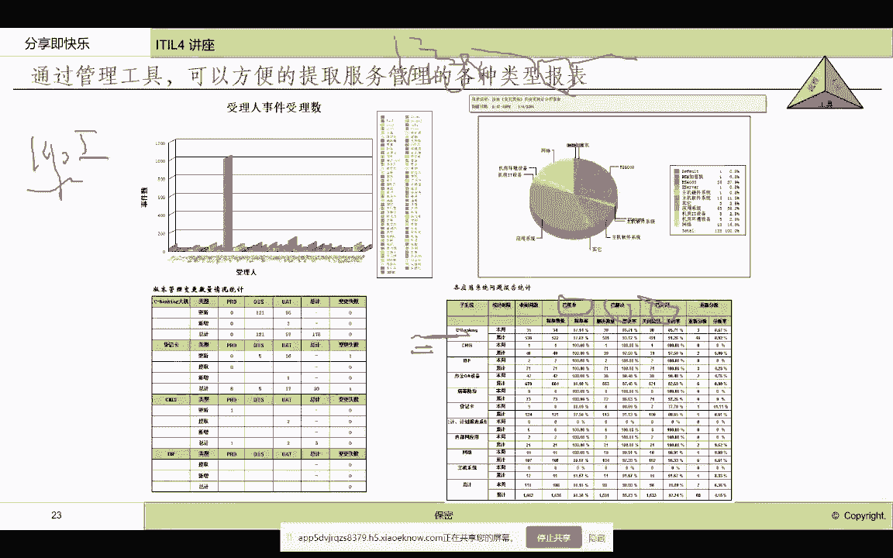

所以说我们要重视我们的报表开发啊，报表开发好，那么我们最后总结一下，我们在整个IT服务管理体系当中，我们需要做到人员流程，技术信息融合啊融合，那么人员方面我们要进行工作角色的培训，比如说大家都都来上头。

其实来上ITLE，其实你可以认为你们在为企业的it服务，管理体系去积蓄力量，在人员方面提升技能啊，提升技能，那么你们可以进行角色培训，流程意识导入啊，IT服务治理设计啊，这是在人员方面，在流程方面。

那我的建议是，你们需要对it的整体建设要做规划，要对apple里面的每一个流程要去做设计，详细设计，然后要用工具，要用工具啊，要用工具去做实施啊，去做定制化开发，印度化开发，在技术方面。

你们当然需要去引入流程平台啊，当然这里面的流程平台我这边写的是remedy哈，这个已经很老了啊，那么呃我一会儿会给大家介绍一下，国内现在我看到的一些工具啊，一些工具，还有像这个这个这个这个呃。

需要跟监控平台集成，需要跟这个各类第三方系统去做集成，这是在技术方面要做的，在信息方面要做什么呢，在信息方面你们要去做报表对吧，我们刚才说了，要去做信息的分析和处理，那通过这些报表这种手段。

我们能看到我们的这个啊效率和效果啊，那需要去建立这个信息收集的手段和工具啊，那比如说我们的配置管理信息，我们就需要通过啊，ITSM管理平台来进行收集啊，来进行收集。

那我们在实施IT服务管理平台的这个时候呢，我们经常会和监控平台一起来做。

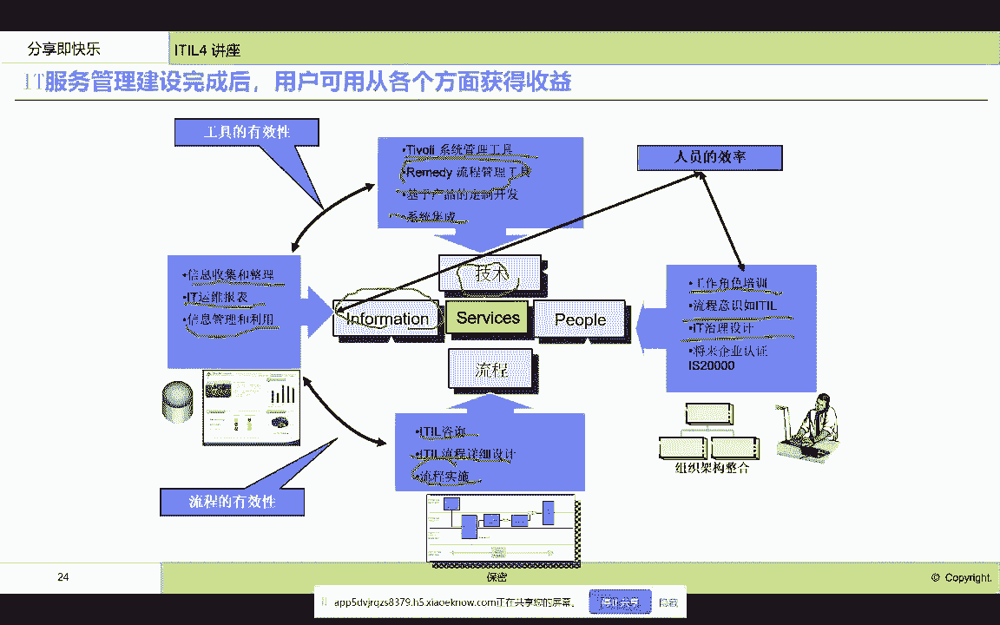

那我们监控平台不是我们今天监控的重点，我们重点讲讲这个IT流程平台建设的时候，我们需要的这个啊注意的地方，可能会导致我们呃这个实施失败啊，这个流程平台建设失败的这些因素有哪些，比如说领导支持。

是不是领导只是来讲个话，发个言，后面啥都不管了啊，第二个，比如说你们员工是不是对apple有比较高的理解，对流程执行是不是有相应的技能适配度啊，适配度，还有你们的流程的角色设计。

许现在的岗位是否能够进行合理的匹配啊，第三个流程平台引入了以后，大家是不是能够自觉自动的去用流程平台，如果不不这个不能够去把这个流程平台用起来，原因是什么，包括好多啊，比如说你们宣导的不够啊。

嗯然后这个嗯工具平台不好用啊，工具平台太繁琐呀，啊与日常的工作这个机制不协调啊，啊这些不协调了，这个是我们看到在整体上的风险，如果在流程平台里面可能还会遇到什么风险呢，比如说对于单个流程。

比如说事故管理，问题管理这样的流程，那么可能会用什么风险呢，比如说没有人使用问题管理流程，我们一般刚才跟大家说，大家一般建立流程平台的时候，可能最先见的是这些三个模块是吧，事故管理，问题管理，变更管理。

你最后可能会发现这个有人用这个有人用，问题管理，没人用，这个模块没人用，为啥问题管理是我，我都把事故解决了，恢复了，没人告诉我，要去查根原因吗，问题管理就是查根原因对吧，那你没有。

如果没有合适的考核机制，就没有人去用这些管理模块，知识库里面有内容空的配置管理呢，维护不及时配置信息，逻辑配置信息和物理配置信息已经完全失误了，大家谁还用啊，所以说我们看到哈建立一个流程平台。

不是买了一个工具就叫上了ILE，我们有很多可能导致我们买了工具，这个钱打水漂了，我们的流程平台建设失败了，失败了。

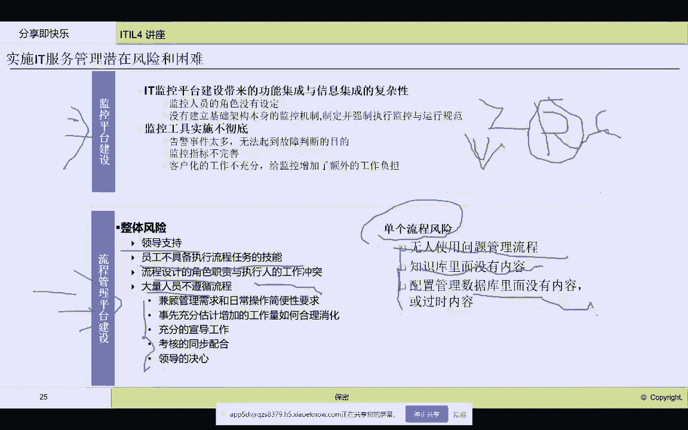