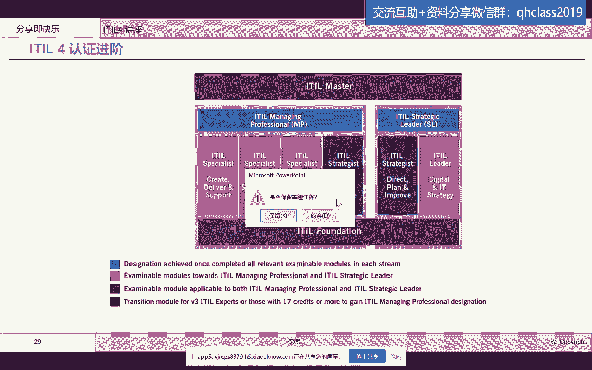
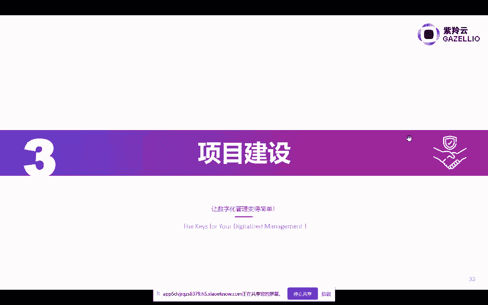
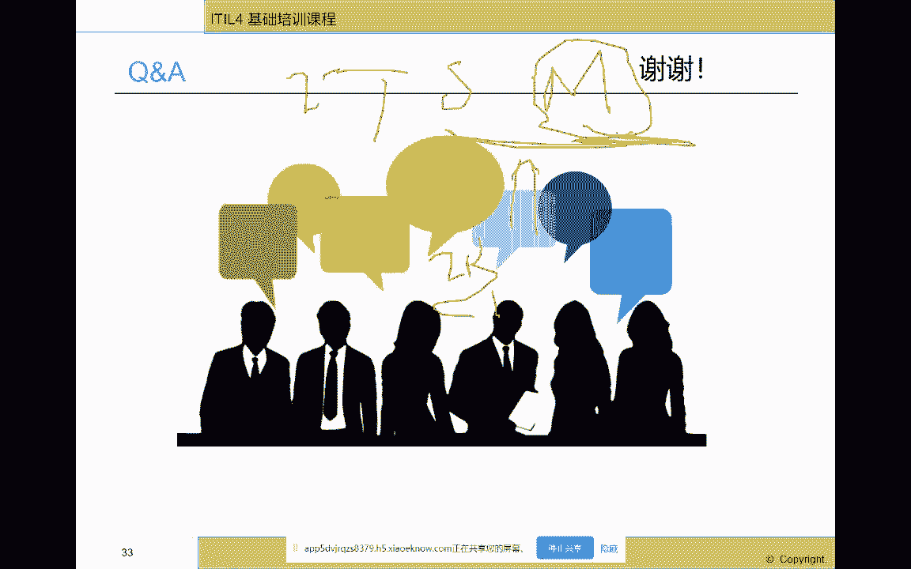
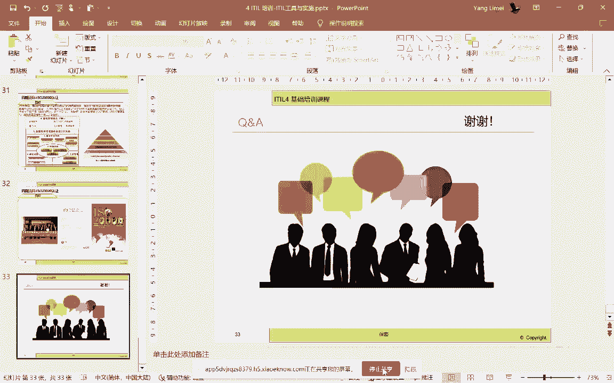

# IT服务管理的十八般武器之ITSM流程管路平台 - P6：ITIL 4 认证进阶 - 清晖Amy - BV1QZ421x7iW

我们的流程平台建设失败了啊，失败了，那么我们再给大家，我们基本上呢就刚才就是把这个啊，我们实施一个it服务管理平台，实施的这个要素给大家讲完了，就是四要素是吧，要四个P，那么这四要素要相辅相成。

相得益彰啊，相得益彰，那么我们在这个业界有哪些工具，可以帮助我们去实施，实现我们刚才讲的那些流程啊，报表啊，然后嗯进行一些非标非idol流程的开发呢，那我们就会选择一些工具啊，选择一些工具。

那么这些工具呢，呃我今天呢呃并不是给哪家厂商代言哈，呃那么这个我只是说在现在在国内啊，这些工具呢是比较常见的啊，比较常见的那这家企业呢是叫紫凌云，也算是国内现在嗯在做这个ITSM工具里面。

比较领先的一家企业啊，比较领先的企业，那么我们看到哈这家企业提供的整个的，大家看得见吗，我等一下我打成这个这个这个全屏吧，那么我们看到这家企业啊。

他提供的这个工具哈，提供的工具它是从这个一家企业的这个哎sorry，一加几啊，从这个使用者就是我们的客户，从提交请求啊开始或者是报故障开始，从服务台开始啊，他提供这样的这个啊。

这个这个这个功能什么功能呢，服务台的接单后面的四部管理服务请求处理啊，问题管理变更管理，发布管理，配置管理啊，配置管理，那么同时它还提供了服务级别服务目录啊，服务目录这样的管理模块。

那后端去支持服务级别的，就有相应的这个啊其他的管理模块啊，管理模块，同时大家看得到它，它其实还有知识管理的这个模块啊，知识管理的模块，那么呃我知道现在国内啊大部分的企业呢。

现在啊真正能够有效或者是落地的，基本上就是中间画的这些部分服务，请求服务台这个事件问题变更发布配置啊，服务目录，服务级别呢嗯我碰到的像一些银联呐，呃建行啊现在做的还是比较好，最后面的基本上现在嗯。

国内实施的都不是特别好吧啊，都不是特别好啊，因为这些相对来说我们认为是一种管理机制，可能你要把它当做一个流程来管呢，相对来说呢没有那么清晰化啊，那大家如果去上过爱豆的课。

你应该知道这些里面都有清晰的流程图啊，角色啊，但是在这些里面，大家看着他们画的那些流程图啊，都是不是特别的啊，清晰和规范啊，清晰和规范，那么呃我们可以看得到哈，像这家企业。

他们的这个呃呃产品的亮点是什么呢，第一个啊他们有这个大家知道我刚才说了啊，这些流程平台要定制的，不是说买过来啊，他有这个这个这个这个这个这个呃模块，它就可以直接来用哈。

那你们企业每家企业都有一些自己特殊的要求，那这就要求我们的这个产品，具有什么具有灵活性啊，就有灵活性，比如说看到的界面上，它能拖拉在自定义嗯，自定义，那么这些自定义啊，你看到界面上的拖拉拽。

实际上它后端就是会引起数据库的变化对吧，那所以说呢我们需要灵活的表单，自定义的这个功能，可视化拖拉传嗯，其实我看到的大部分的这个这个工具，平台上其实都有啊，包括我以前最早用的像remedy啊。

这个现在像神马的这个这个这个平台，像这个呃左航的这个这个save desk class，他们都有这种平台啊，就看谁支持的组件多啊，灵活性高，是不是带有一些固定的模板啊，这个，去拼的是这个能力啊。

拼的能力，那这个一个是表单自定义，你可以认为是字段的自定义，那接下来呢是这个这个这个流程的自定义啊，大家都知道，其实嗯这个买来的工具啊，它实际上是内置了一些idol的最佳时间和流程。

但是这些流程呢到你们企业，你们是不是是这个，这个还会按照这个工具里面的这个步骤，一步一步的做，那么你就可能需要什么，可能需要去做流程调整啊，比如说有些节点我是不做的，在我们公司里啊。

或者是已经没有在我们公司里，我们人人少，我们这个节点我们是跳过的，或者是这个节点和下一个节点是合二为一的，那你就需要灵活的什么流程定制引擎啊，流程定制引擎，那么这个流程定制引擎呢。

这边要强调的就是也是拖拉拽啊，无需编程，低代码低代码，然后这个所见即所得是吧，拖拉拽完了以后就能够模拟执行啊，模拟执行，这是我们看到的这个流程自定义引擎啊，流程自定义引擎嗯，现在还有呃这家企业。

它里面我们看到他的这个，还有像叫社交型ITS是吧，它可以跟这些，比如说我们这个这个建立一些对外联络的这个，chat os的这种渠道，比如说通过钉钉啊，通过这种啊这种即时通讯工具哈，能够进行打通啊。

实现这个呃这个比如说从社区里抓取信息啊，一键去建立一个什么故障处理小组啊，然后呃跟客户更高速的互动啊互动，然后嗯还有他们一个比较特色的，就是建立这个智能知识库哈，就是你可以通过这个啊。

这个这个啊从提交的工单里面啊，提交的这个事故处理里面去自动的去申请什么，这个这个我们叫知识库啊，因为我们很多企业其在知识库的建立里面，其实是蛮有的时候是蛮无力感的，也就是说很多时候最后知识库建完了以后。

发现每天都是那嗯就是每天都是那些老知识哈，没有新知识的跟进，那我们就需要啊有更快捷的方式，让我们的这个啊日常的这些啊解决方案啊，嗯这些问题的解答呀，能够快速的啊深层知识啊，形成知识条目啊。

并把这些知识进行沉淀啊，进行沉淀，那么像这种非标的这种啊ILE的这些流程，像这种排班管理啊，那也是可能需要这个这个这个进行一些啊，这个开发的那么这种智能排班啊，可能在国内的一些企业里面。

现在是一个通用需求，那可能也就变成一个做ITSM工具，厂商需要去啊建立的这样一个功能功能模块哈，比如说像这种自定义排班啊，然后排班的这个手动排班啊，排班是什么策略啊，然后这个排班权限控制啊啊等等啊。

好那么还有就是呃支持多级啊，支持多级，从这个，因为有的企业里面是有这个不同层次的啊，管理层次的，那么支持多服务台，多服务目录啊，那这个就是可能需要有一些多层次的支持，还有就是那这个呃报表引擎。

那么报表引擎就是你可以自可拖拉拽，自定义一个雷爆表啊，资金科研就报表有多种呈现形式，比如说像表图啊，柱状图，饼图折线图啊，然后能够啊，甚至嗯我看到有些企业的工具是能够，直接从数据库里拖拉字段就形成啊。

嗯就是啊这个这个形成这个可视化的，这个报表啊，啊同时在这个报表上，你可以去做一些这个很好的这种啊，复杂的计算啊，复杂的计算，那么呃同时呢这种啊，对各类数据呢要进行可视化的呈现啊。

那这种呈现呢实际上能够丰富我们的这个啊，这个这个就是管理者对于这些信息，多角度的去查看，如何做出做出决策啊，做出决策，当然呃现在很多企业都在谈大屏哈，那么呃除了我们通常看到的那种，实时运行的大屏。

可能是从监控系统上上来的，那么还有一个就是运营的变大屏，那么运营的大屏呢，主要就是帮助我们把这个呃，其实就是我们的流程平台里面啊，积累的这些啊这个数据进行分析以后，通过大屏的形式去展现出来。

然后去进行一些辅助一些管理者进行决策，比如说我们的这个啊这个变更的这个成功率啊，然后这个呃首次故障解决率啊，然后这个紧急变更的占比啊，然后这个服务台的工作效率啊。

客户的满意度啊啊然后这个事件呃积压情况啊，这个都是可以通过大屏哈，能够啊给管理者呈现一个整体视图啊，当然大屏在很多企业里，其实是啊需要去做定制的啊，需要去做定制，那么也要根据企业的这个实际建设的。

进度和模块，进行这个这个这个这个就是啊进行这个开发的，那么呃我们刚才说了，其实除了啊刚才说灵活的底层结构以外，我们还需要可能跟现在的这种DIOS进行打通啊，比如说我们的这个发布管理软件的发布管理。

那就是需要跟divers平台啊，sorry发布平台进行打通啊打通，那么在divers里面的CD啊，其实就是可以承接我们发布流程，到发布的这个具体的实现的时候，就可以触触触发这个啊自动发布啊，自动发布。

那么在发布结束了以后，可能会进行自动监控，进行联动啊，进行联动，然后同时呢，我们还需要跟这些企业里面的邮箱啊，短信啊，然后还有这个就是身份认证系统啊，人事系统啊，采购系统啊，OA系统啊，及时消息系统啊。

进行对接啊，进行对接，那么呃就像我们刚才讲的，你这种工具平台呢，就是it服务管理流程平台呢，还需要跟监控监控平台打通，那么最简单的就是要实现双向打通，所谓的双向打通呢。

就是监控暴露出来的事件发到流程平台，流程平台处理完了以后，应该反向的去关闭，在监控平台里面的事件啊事件，那这样呢就会就会实现什么，我们的一个从事件到事故的管理的闭环啊，自我管理的并发。

还有就是跟云管平台打通，那跟云管平台打通，我刚才也说了，比如说像这个云的资源的规划，那跟it服务管里面的资源管理啊，就是容量预测管理要结合起来啊，结合起来，还有在云管平台里面。

还有通常的一个打通是什么呢，比如说在服务请求里面，要请求开通什么什么什么资源，比如说我现在需要开通五台虚机，每台虚机上要装什么什么这个数据库中间件，这样的一个服务请求过来，得到审批以后。

在流程平台里得到审批以后，接下来就要通过云管平台来自动化的进行什么，自动化的进行资源的申请，你可以通过win2，就把win2的平台云管平台把资源申请好，同时启动云管平台里面的什么资源安装功能啊。

资源安装功能，就是你的数据库自动安装这个这个啊，就是还有这个就是就是就是这个啊，中间件的自动安装啊，甚至一些软件包的自动安装，都可以在这个云管平台里去实现打通，安装完了以后去把这个回到ITS平台去。

把工单关，就是服务请求单关掉啊，服务请求单关掉，那这个就实现了ITS平台和云管平台，的一个闭环啊，一个闭环能也使我们在it服务请求啊，这个体系里面啊，它能够实现什么自动化啊，实现自动化，那么同时呢。

我们可以看到这个我们的这些整个ITC平台，它需要去与我们现在的企业，经常用的这个微信啊，钉钉啊，公众号啊进行一个联动，因为现在我们说的小屏，所谓的小屏就是我们的手机啊手机，那么这些信息呢需要通过啊。

就是运维管理信息呢，需要通过这些小屏啊，进行一个全面的这个结合啊，全面的结合，那么我们具体来看一下，在一个成熟的这个软件平台里面，TM平台里面，那么他们的这个呃成熟的这些apple的流程，在工具平台里。

他们需要有哪些的这个这个这个功能哈，那么比如说嗯我们所有的事件管理流程啊，艾特你的事件管理流程在工具平台里面啊，在工具平台里面，首先它要完整的符合什么，所有的这个IO的流程啊，IO的流程的过程。

那么同时呢它可以进行什么，进行这些方面的一些扩展，比如说啊在这个可以生成，比如说对于某类事件是重大事件，可以单独启动重大事件管理流程啊，然后启用自动关单规则，比如说一个事件多久没人处理啊。

或者是关闭了以后啊，就是解决了以后没有关闭，那它可以实现自动关闭，自动关单啊，还有就是催单规则，比如说事件多久没人处理，它可以升级啊啊可以派送到更高的级的领导啊，还有就是呃这个像这个事件处理完了以后。

自动把它变成一个知识知识知识条目啊，知识条目，还有对事件进行这个不同的通知策略的，这个啊设定啊，这都是我们在工具平台里面去实现事件流程啊，的一些啊，这个这个就是啊功能特色，那么还有像服务请求流程啊。

服务请求流程，那么我们可以建立这个在服务请求里，在这个平台里面这个模块里面，他需要建立审批链，我们知道服务请求是有啊安全审批，财务审批啊，那这些审批那可能需要有灵活的，这种这个审批链的配置。

还有对于企业里面常见的啊，这个内置可能要内置这种常见的，比如说权限申请啊，密码重置啊，这些服务请求这种模板需要内置的啊，还有就是需要去在服务这个服务请求里面，因为服务请求是标准的服务，服务要求服务交付。

那么它是实际上是整个的这个呃服务交付时间，它是呃是标准化的，所以说呢，我们可以在这个一旦服务请求单启动了以后，我们可以对我们的消费，对我们的客户啊，用户其实去展示我们服务执行的状态。

以及服务执行的剩余时间啊，至于全剩余时间以及执行的这个呃，是现在谁在执行啊，谁在执行，同时跟你的SA去绑定啊，看到嗯在规定的SLA里面，这个服务请求执行的情况，合规的情况啊，那么在知识管理模块里面呢。

我们可以嗯能做的事情就比较多了哈，在这家企业里面，它能提供的这个平台里面，包括了像这个关键字段的匹配权限管理，审核机制啊，审核机制，还有知识生成啊，知识生成，还有这个知识排名，像特别是我在上课的时候。

跟大家聊到这个知识排名啊，呃特别重要，因为很多企业里面呢，这个知识库最常见的一个苦恼是什么呢，嗯有库无资就是有一个物理空间，但是没有有用的知识条目，那我们怎么才能够把这个气氛搞起来。

让大家愿意贡献知识呢，那就需要学的论坛的这个方式哈，对于知识的重用，假设我们会对知识进行评分，进行点赞啊，进行收藏，那我们这就要结合我们的，原来刚才谈到的这个考核管理，我们会对排名前三的引用率最高的。

然后收藏率最高的这些知识，我们会给对应的知识贡献者以奖励啊，进行排名人员排名，而不是知识排名啊，那这样的话就能够鼓励我们的技术人员啊，进行这个知识贡献，因为排名就意味着你将来可能在职位升迁。

在奖金的分配上会获得直接的好处啊，直接的好处，那问题管理呢，嗯也是我们常见的这个啊这个流程组哈，流程模块，那么在这块呢我们可可以需要要求的一些能力，包括像啊这个自动啊。

就是对于重复出现的这个incident，我们要自动的简单啊，因为嗯问题管理也会经常面临着只有事故，没有问题，那我们会强制生成问题啊，自定义问题了类别啊，因为我们的问题是需要分类的啊，那么这些问题分类。

是不是可以进行一些关键字的抽取啊，然后这个问题完了以后，能不能跟变更管理流程联动，因为大家都知道问题管理结束以后，实际上是要触发变更，因为问题你找到根音了以后，实际上是要进行变更。

变更完了以后成功了以后解才能去关闭什么，关闭问题，大家在学ITO的时候应该知道这个关联关系哈，事故问题变更的关联关系啊，还有就是嗯我们可以啊，这个就是啊一些啊问题自动的生成知识库啊，传送到知识库。

就是我们啊大家上课的时候啊，哎呦sorry，我们上课的时候经常会提到的KEDB啊，就是已知错误数据库啊，已知错误数据库，那么变更管理其实也是非常这个关键的，流程模块啊，关键流程模块，那么在这个里面呢。

呃我们经常会呃，要求我们的工具厂商能提供的是什么呢，能提供的比如说哈跟配置管理结合，因为变更和配置是孪生兄兄弟哈啊，这个有配置的变更管理啊，我认为是才是这才是高效有用的变更管理啊。

否则这个变更管理的效率啊，或者是说这个变更的这个核心环节就是变更，影响分析，可能很难去这个做到很科学，很理性，所以说我们怎么去变更管理和配置管理进行啊，结合比，比如说实现变更啊，影响分析里面的时候。

怎么和配置管理结合起来啊，比如说呃我们从下到上的配置向影响分析啊，可以允许还有变更完成了以后，能不能自动更新配置项那边的配置配置项，然后还有就是呃对这个变更窗口进行推荐啊，进行推荐。

那这个都是我认为是啊，作为一个啊it服务管理平台啊，他们的一个核心能力啊，核心能力，那配置管理呢，这个大家都知道，确实是啊很多流程管理平台的这个核心功能，但是这个功能呢。

呃其实对it服务提供商来说是个挑战啊，有的企业里呢建it服务管理平台呢，他会把配置管理平台单独建，他认为是一个独立项目，它可能不会和IT服务管理平台，流程平台和建，他可能会分开。

因为这个配置管理这个工具呢，如果只是把它当做一个流程来看，其实只是有流程，没有数，没有这个库，其实你可以认为这个流程就是虚的啊，这个流程是虚的，所以说很多企业会单独来建这个配置管理的，这样一个项目啊。

现在越来越多企业会去这么做，那么在这个配置管理里面啊，我们最核心的当然是要支持，比如说我们配置的自动发现对吧，配置的自动发现，然后还有做这个配置的权限管理啊，配置关系的自动更新。

然后嗯拖这个配置关系的嗯这个查看啊，配置关系的查看，然后还有这个能去模拟一些啊，这个配置的影响分析啊，配置的影响分析，帮助我们的这个啊变更管理流程，去进行变更的这个影响分析啊，变更分析。

同时我们一个配置项，其实通过配置项我们还能够去查到什么，查到相应的事故单呃，呃服务申请单，然后呃工单啊变更单，那你能够去语速找我们的，相应的运维管理信息啊，拥有管理信息。

当然现在很多企业里的配置管理已经不能够，这个满足我们的服务管理需求，现在配置管理有演化成运维知识图谱的趋势哈，呃因为呃这个运维配置管理的信息还只能是啊，只是跟配置相关啊，但是我们知道其实要做这个啊。

就是更高的运维决策，我们不能只盯着配置信息，我们需要把配置信息呃，性能性性能信息，然后这个监控告警信息，然后还有像我们的呃活动工单信息，还有我们的人员信息要融合的来看，那这个就是我们的运维知识图谱。

这个现在也是很多啊，企业特别是领先的企业的一个啊，这个这个就是啊核心功能啊，核心功能好，那么呃最后呢我给大家讲解一个。

这个就是啊这个这个就是某一家企业哈，他们建立这个IT服务管理的一个流程，的一个历程吧，这个比较老，但是也非常经典非常经典，那么这个是啊我们国内的这个最早区域啊，建立it服务管理流程的这样一家企业。

它是交行啊，交行我认为他在国内应该是建的啊，启动早意识比较高，然后呢比较扎实的一家企业嗯，比较踏实的企业，那么它的背景是这样的，他的背景是在2002年，当时全国的银行开始做数据大集中。

数据大学中是什么意思呢，数据大集中就是原来每一个省在座各位，每一个省，其实他都有这个自己的这个银行的交易系统，那这个就会带来很多问题，每个省要自己维护自己的这个呃交易信息，那这些信息你然后再进行汇总。

那这个就可能造成一些什么啊，数据重复啊，不能嗯这个统计麻烦啊，数据数据不一致啊，好，那么在嗯成立这个啊，全国统一的一个核心系统建设以后呢，那这些问题都可以避免，所以说呢他们就启动了这个数据大集中工程。

那就把所有的核心交易系统，全部集中到上海来啊，他们的总行总行了，那么集中到总行来以后，他们就面临着很大的挑战，因为总行的核心系统一摊就影响全国，原来省一级的直营乡省对吧，我我比如说这个广东省谈了。

我只影响广东省，其他省都还是好的，业务正常开展，但是现在集中到全国了，这个系统瘫了，全国30一个人都不能正常经营，所以说对运维的压力就非常高，那么对于运维压力一高了以后呢，就导致我们要去进行规范。

就是要去建设我们的规范的运维系统啊，规范的运维系统，那么我们可以看得到他当时的压力很大，一个就是啊这个这个这个新核心上线哈，嗯这个大集中上线，然后这个是前所未有的这种运维的模式，以前都是省一级的运维。

现在大集中以后要国家级的运维啊，第二个呢就是全国管理，那么这个全国管理呢，因为省一级还有IT系统，他不是把所有系统都上收了，那就形成了总行分行的两级运维体系，还有一个就是它的一个长远规划。

因为呃我们都知道这个一个大大集中，可能要建几年，那么我们相应的运维能力也得持续的去提升，那就是还有一个运维规划，那么他就对这个未来的这个运维，提出的要求是什么，就是全控制啊，E衡量集成化，规范化。

自动化，在这种情况下，他当时就开始去考虑怎么建这个拥有管理系统，流程管理系统，当时02年的时候，国内还对爱豆的人知之甚少，知之甚少，那么当时IBM他是请IBM做这个咨询，做整个运维体系的咨询。

那么呃这个运维体系的咨询呢，当时IBM去从澳大利亚请了两个这个咨询顾问，过来进行这个访谈啊，访谈，然后流程设计规范，然后持续了这个这个这个两个多月吧，最后就帮他建设了三阶段论所谓三阶段。

那就是第一阶段建立服务台，事件变更配置，二阶段见问题发布服务级别，安全管理，三阶段建财务容量，可关系可用性和连续性，这样一个咨询的报告啊，然后同时对相关的人员进行，艾特B2的全方面的培训啊，台湾人培训。

那么在咨询项目结束了以后，就紧锣密鼓地进行了一期项目的建设，一期项目的建设呢，它不单单是建立了这个这个，这个这个就是流程平台，它还建立了这个监控平台啊，然后变更啊，就是设备申请啊，这个这个平台。

那么一期平台主要建设的思路是什么呢，目标是什么呢，就是要建立大家的服务管理意识，建立初步的运维工作机制啊，运维工作机制建立一个服务台系统，能为大集中以后，全国的交行的业务部门去提供服务啊，去提供服务。

那么那么对于他这种要求呢，我们就看到了他提出了很高的要求啊，很高的要求，那这些要求就包括要去啊，我们未来的整个流程平台要具有很高的适应性，能，满足未来的要求，有可可扩展灵活性。

集成性和符合apple的最佳实践标准啊，那么在这期思路下呢，我当时是IBM给他承建的啊，我也参与了整个的呃这个设计好，那么我们分为两个阶段，流程设计阶段，和这个这个就是啊这个工具实施阶段。

流程设计的呢主要是啊设计流程设计工作岗位，设计工具体系啊，那么在这个呃工具实施里面，主要就是啊就是选工具，然后啊做定制开发，然后与管理与与监控平台，门户平台，邮件系统LDP进行集成。

所以说一期项目建设的内容呢，就是事件和问题管理变更管理配置管理，然后做大量的集成和报表啊，然后呢这是在总行做的，分行呢，主要就是呃进行这个呃，管理平台的使用和工单的提交啊，那么这是做完一期。

那么二期呢主要就是呃在一期的基础上，我们开始要进行推广啊，进行推广啊，进行啊这个呃叫分步执行集中管控，那么我们主要的这个工作内容呢，实际上是什么呢，以及目标是什么呢，我们二期的目标主要是是结合艾特规范。

进行全行推广，然后建立一个虚拟的服务台，也就是说啊，全国30一个服务台全部集中到上海，做总总服务台啊，总服务台进行统一受理啊，统一受理，然后就是啊集中分派啊，集中分派。

那么这里面从建立了从处理处到下辖分行，到到分行到总行啊，这样一个从上到下的汇报机制啊，以及派单，同时我们还建立了一个非标的ILE的流程，就是运营管理。

就是这个the schedule management啊，那么在这个时候我们也是通过这种需求调研啊，分行试点，分行推广啊，那么在这个过程当中呢，我们其实是帮啊，然后让事件管理流程。

成为大家根深蒂固的一种行为习惯啊，然后接下来就是三期，三期呢，就对一汽上的这个流程变更管理进行改造，建立服务请求流程，那服务请求流程当时的建立呢应该是艾特VR，没有服务请求流程，我们在06年的时候。

帮助交行很早就实现了预，就是比apple v3，更早的就建立了服务请求管理流程，然后这个建立了新的配置管理流程啊，然后对这个remedy，他们当时选的是remedy系统啊，进行了这个啊。

这个基于我们三期的这个优化设计啊，三期的优化设计，那么进行了一个比如说服务请求流程的这个啊，工具开发，然后配置管理流程，资产管理流程的这个定制化开发啊，然后同时我们也嗯没有这个服务级别管理流程。

是没有用工具来实现，实际上是主要是梳理他的这个对外的服务级别，指标体系啊，指标体系，那四期项目呢，实际上是嗯这个经过了前面三期啊，这个兢兢业业的建设，那么在这个07年的时候。

他们正式启动了ISO20000的这个认证啊，那么这个认证呢也是经历了差不多十个月吧，十个月啊，基于他们整个的这个这个，这个就是啊实实在在的通过工具平台的建设，流程意识的宣导。

以及这个咨询公司和这个工具厂商的配合哈，那么嗯应该是比较优秀的哈，叫做零缺陷去通过了这个ISO20000的认证啊，ISO20000的认证是07年哈，这个当时应该是在国内银行业应该是第一家吧，啊。

第一家同时呢呃写了这样一本书，叫ISO20000的认证与实践嗯，认证与事件，那么是整个呃这个国内也算是第一本哈，就是以ISO20000认证这个角度去写的这样一个啊，一本书。

所以说呢我们看到其实IT服务管理的建设，对于IT服务提供商来说哈，对于很多企大型的企业的，IT部门和数据中心来说呢，实际上是通过自己的实践，然后去对idol的认知进行提高啊。

然后反而过来去总结以后去反哺于社会，反哺于行业啊，所以说呢这个就是也是奉献给各位的，在今天来听啊，这个我讲座的人一个这个这个精神要义啊，精神要义好，那么这个就是我们看到的交行的这个，这个这个就是内容啊。

这个建设过程啊，那么我今天的这个分享呢就告一段落，那么最后总结一下那啊我第一部分是讲了，给大家讲了，这个就是it服务管理平台，在整个IT服务工具体系里面的位置，与其他工具之间的关系。

就是第一个我讲的内容，第二个我是讲了，如果要去做一个it服务管理的项目工具，它的地位是什么，不能以工具代替服务管理的项目的实施，他应该是PPT对吧，人员流程和工具的三维的一个融合，共同的进行。

协同才能够取得我们项目的初衷，才能把it服务管理的体系落到企业里面来啊，雷达体系里面，我们的工具一定是会根据我们的企业文化，流程的设计人员的技能进行匹配定制的啊，要避免拿工具去限定我们的企业啊。

不要让我让工具是给我们赋能的，而不是束缚我们手脚的啊，这是第二个，第三个跟大呃呃呃这是第三个，第四个给大家分享了，交通银行他们经过四期建设，从规划到一期二期三期四期项目，最后拿到ISO20000认证。

他这样一个过程，我们在这个过程里面，我们看到也是有流程的设计，这个工具的开发，然后这个这个这个岗位的这个，这个设计和考核啊，也是践行了我刚才讲的PPT的一个建设思路啊。

好那么这就是给大家今天晚上分享的内容，不知道大家有没有什么问题啊，有没有什么问题，好去敏捷可以，我后面问问老师分享，不知道大家有没有什么问题，那直接用就凉了，对这个还是因为毕竟是个管理的这个项目哈。

呃我记得我一直跟大家宣导哈，我们讲的课叫讲座，叫ITS这四个字母核心要大家要记住啊，核心是这个M是管理对吗，是管理工具，是实现我们的管理意图的，嗯所以说呢，不要认为这个有工具可以，加速我们的这个效率啊。

但是不能以工具去代替我们的管理啊，代替我们的管理，好那，我们今天的课就讲到这里啊，我看大家有什么问题也可以添加我的微信啊，我们欢迎跟各位做深入的交流啊，好的，那我们今天的讲座就到这里，谢谢大家。

希望还有机会跟大家做更多的这个交流。

