# IT服务管理的十八般武器之ITSM流程管路平台 - P4：4.ITSM 管理流程概览 - 清晖Amy - BV1QZ421x7iW

我刚才已经跟大家讲过了。

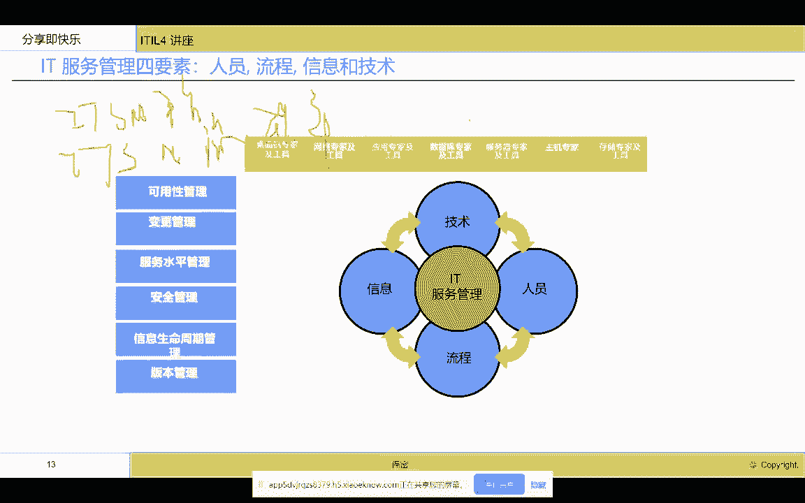

我们就不再啰嗦啊，那么我们来看一看，如果要建立一个it服务管理流程平台，需要建哪些流程，建哪些流程，那我们来首先来看看我们大家都知道，我们其实要给我们的客户去提供服务管理，那么客户比较关注的是什么。

服务级别管理对吧，我们需要建立这个服务级别管理平台，服务级别管理功能这个功能，那么这个实际上是衡量it服务提供商，对客户的承诺以及执行的情况，所以说我们是以服务管理为核心来牵引啊，来牵引。

那么要实现这个服务管理平台，那就服务管理能力模块，我们还要建立什么呢，还要建立采购管理模块，财务管理模块，资源管理模块，因为这些服务级别的实现，实际上牵涉到我们需要去买工具，购买人力。

然后我们要去看到我们不同的服务级别的，计费模式啊，以及我们向客户收取的费用啊，费用在这里我想强调一点哈，我们也是上课的时候跟大家聊到的，我们这个时候IT部门真的不能叫it部门，它叫IT服务提供商对吗。

这个概念大家始终要记住，那如果是一个服务提供商，他就是一家独立的公司，他就必须要盈利，他必须面对客服，那我们的服务级别管理，就是这样一个以公式化的运作，对客户的一个承诺必须建设的一个模块。

那这些模块又依赖于我们的财务管理，采购管理，资源管理啊，那么我们在这个服务级别管理模块里面，我们还要牵涉到我们的性能管理啊，性能管理，因为我们的服务级别大家都知道，有容量管理对吧，有容量管理。

有这个在这里容量管理基于性能。

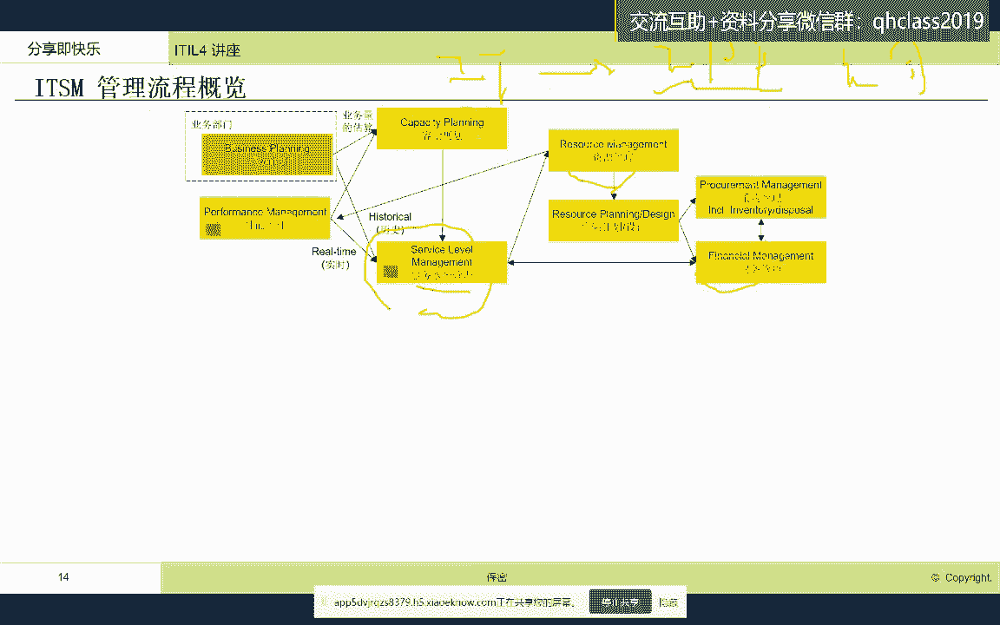

我们去做容量管理啊，容量管理，同时我们可以看得到，要实现服务级别里面，服务级别里面有很多是服务支持的，这些承诺指标，比如说故障响应时间，故障恢复时间，这个变更的成功率这样的指标。

这样的指标是要靠哪些流程模块呢，就是要靠这些事故管理啊，incident问题管理，变更管理，发布管理这样的流程模块，那我们就需要有apple的服务支持的流程模块，这在工具里面必须去开发啊。

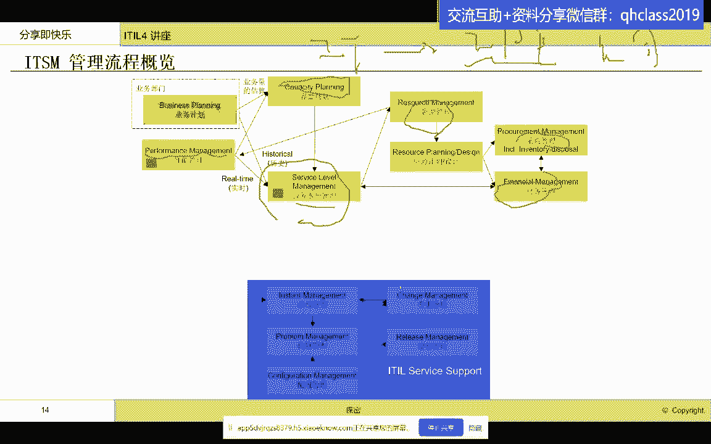

必须去开发，那么这个里面这五大模块，也是大家现在无论是国内厂商还是国外厂商。

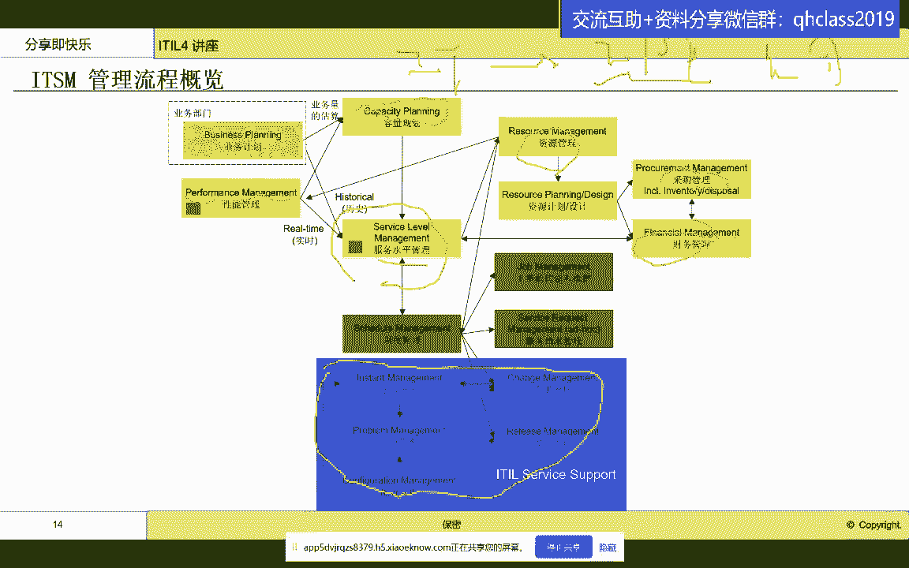

在工具平台里面最主要的这五大模块，五大模块好，那么除了这五大模块，我们看到其实我们一个整体的服务提供商，他有很多工作要做，我们需要调度管理，这个调度靠什么调度呢，靠工单来调度。

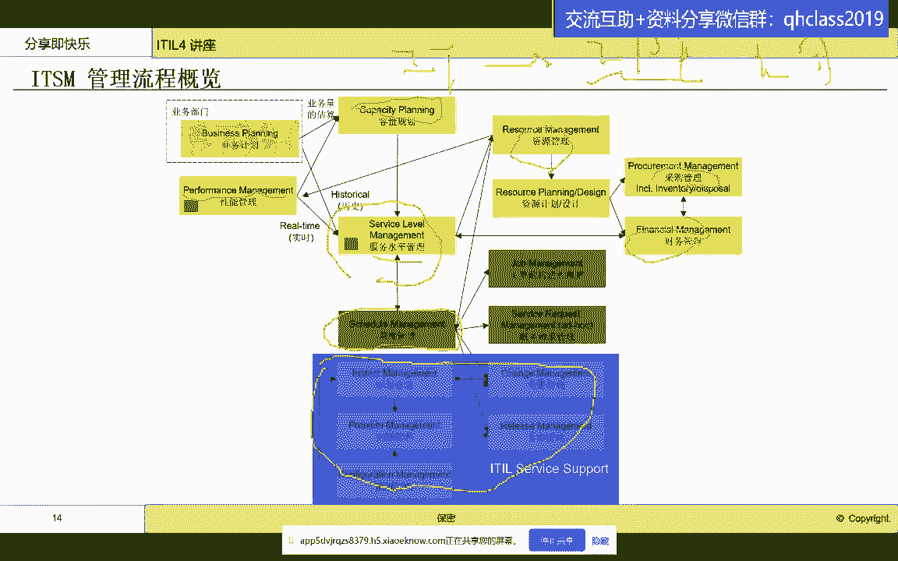

我们有work order啊，Work order，我们每天会有来自于客服的服务请求，service requirement啊，也就是说一个是日常工作，一个是突发性的工作。

这些工作我们要把数据中心需要排成，需要有条不紊的工作，特别是像我经历过的，像这个中农工建交这种大型的数据中心，都是几百人啊，三班倒每天要处理很多事故，查找很多问题啊，查找很多问题要做很多变更。

很多软件发布，结合着日常的巡检啊，服务请求啊，这么多工作谁来做啊，什么时候做这个都需要调度管理，我们叫schedule management，这个在很多现在传统的这个，就是IT服务提供商里面。

它其实并不提供这个模块啊，并不提供这个模块，那这些模块呢实际上是需要定制开发的啊，定制开发的好。

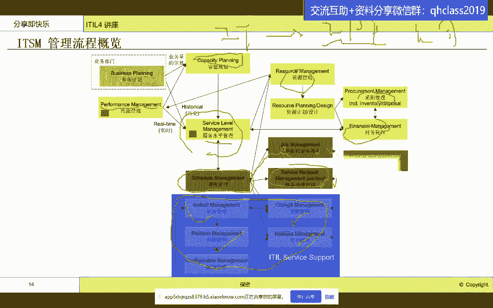

那么我们同时我们在整个数据中心里面，我们还需要什么模块呢，我们还需要这个项目管理模块啊，为什么呢，因为我们在，大家好嗯，这个这个这个现在现在你们能看到见面吗，我这边怎么感觉有点慢哈，大家能听到声音。

看到界面吗，如果能看见，大家打个零好吗，啊可以看到哈。

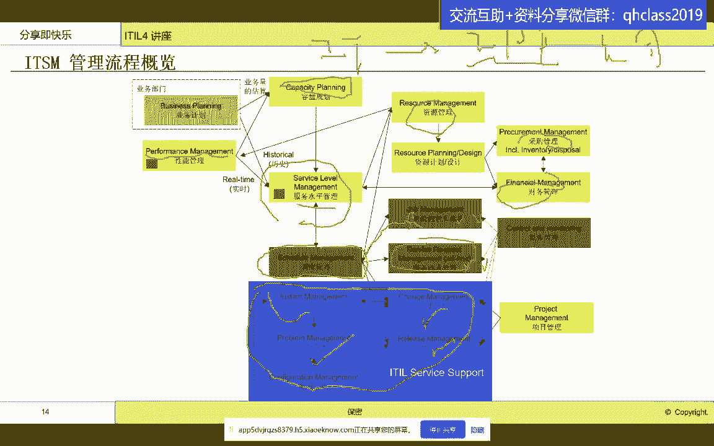

好好太好了好谢谢。

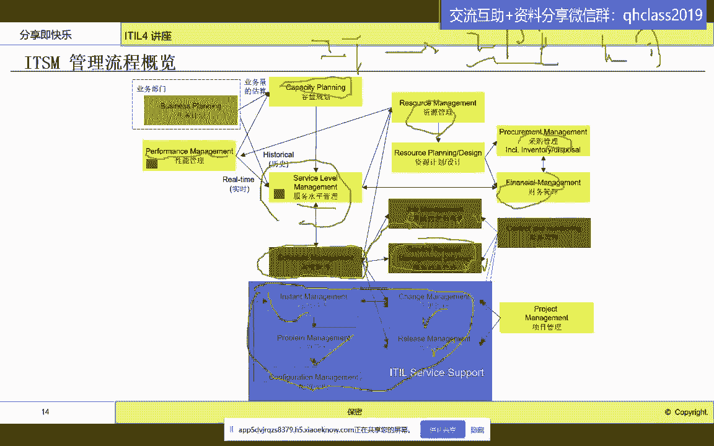

那我们其实可以看得到，其实我们啊很多做变更，做发布其实是一个项目，那我们会有项目管理啊，会有项目管理，那么项目管理呢，这个模块呢一般啊。

不会单独在这个ITS平台里面建啊。

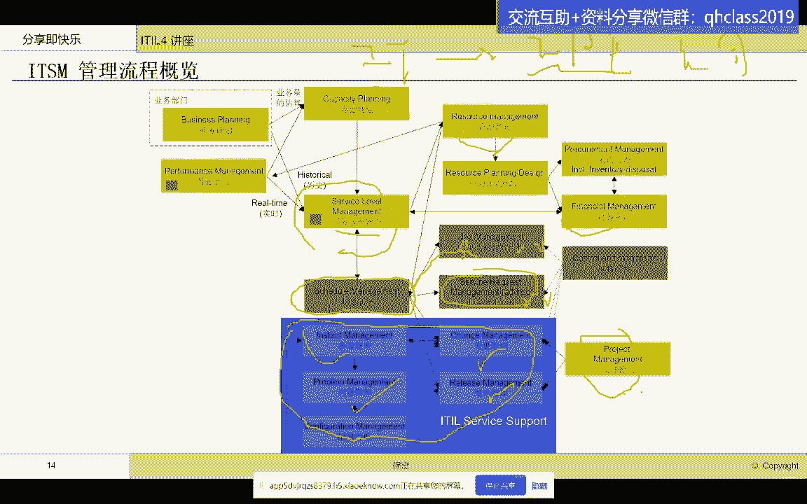

会有另外的这个平台来建设，那么同时呢我们除了这个多人协作的这些流程。

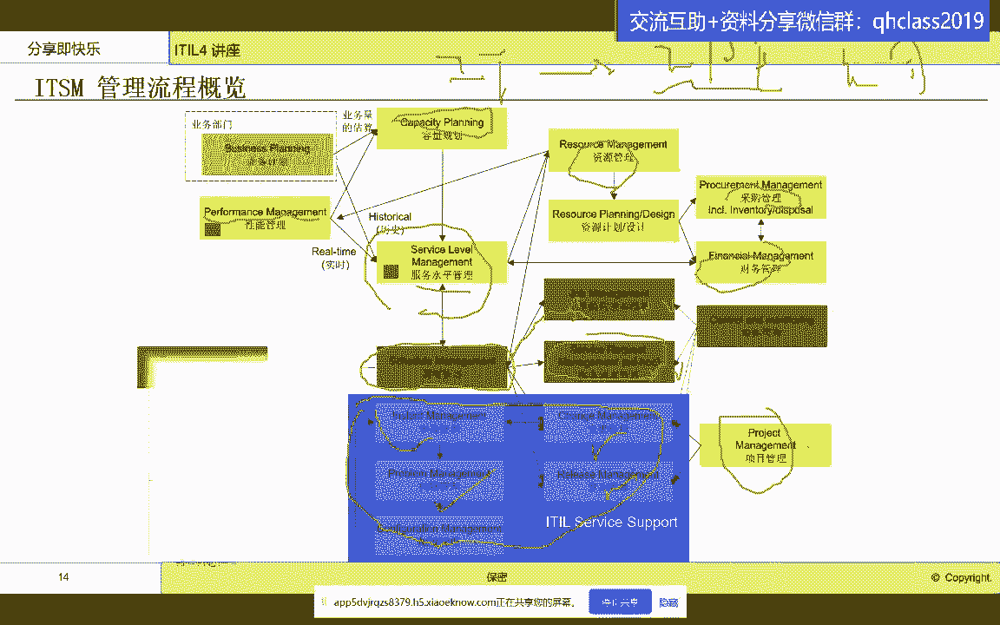

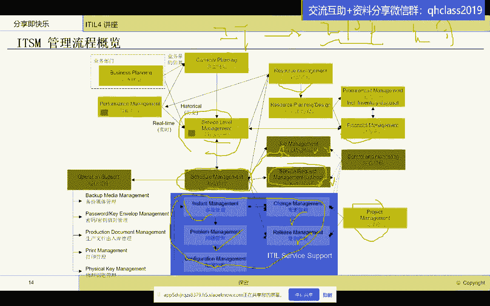

事故问题变更发布，这是标准的，那我们其实在数据中心里面还有一些啊，不是经常做，但是又必不可少的流程啊。

比如说呃备份媒介管理，密钥管理。

密码管理，生产文件出入库管理，打印管理啊，物理钥匙张啊，这个物理钥匙管理这些呢嗯它不一定是流程。

但是呢你又不能不管，特别是像这种呃这个这个这个密密钥管理。

我就曾经碰到过一件事情啊，一个呃灾备演练。

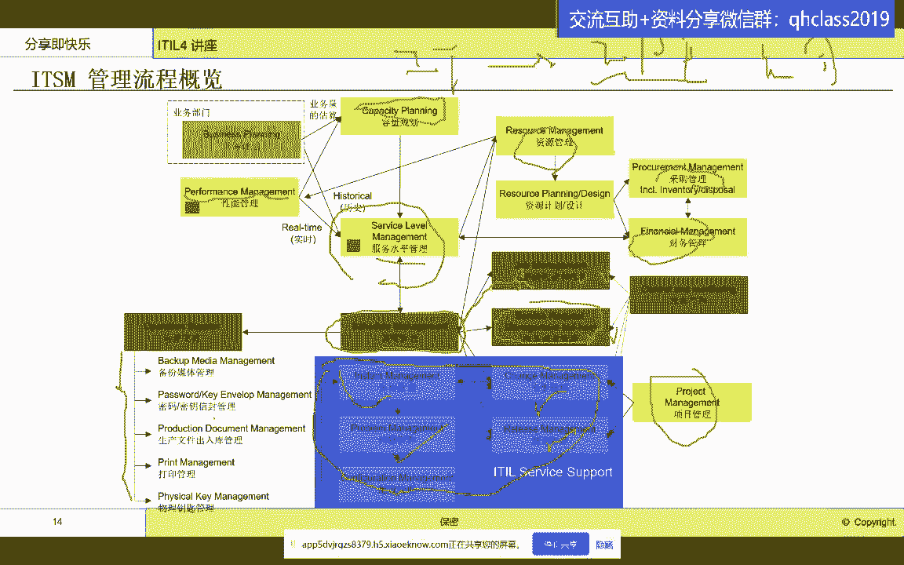

他们演练到特定步骤，实际上是需要去取一个密码来做数据的恢复的。

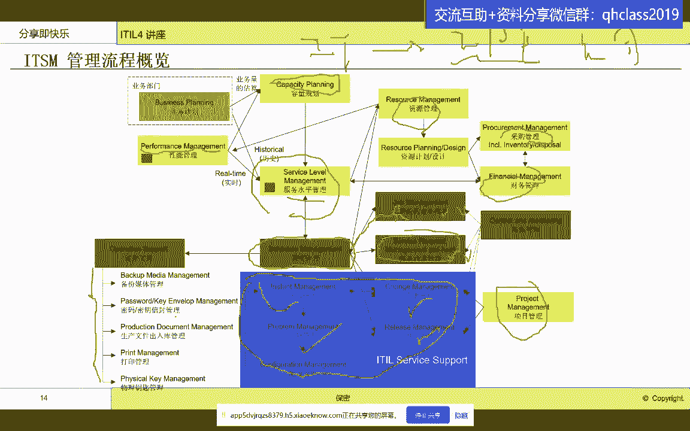

那这个密码到哪里去取，按照什么流程去取。

因为如果你的密码没有流程去管理，这个密码的话，任何人都去取的话，这个可能会造成泄密，所以说你就需要有密码密钥管理啊，密码密钥管理，那么我们通常我们还有信息安全管理这些。

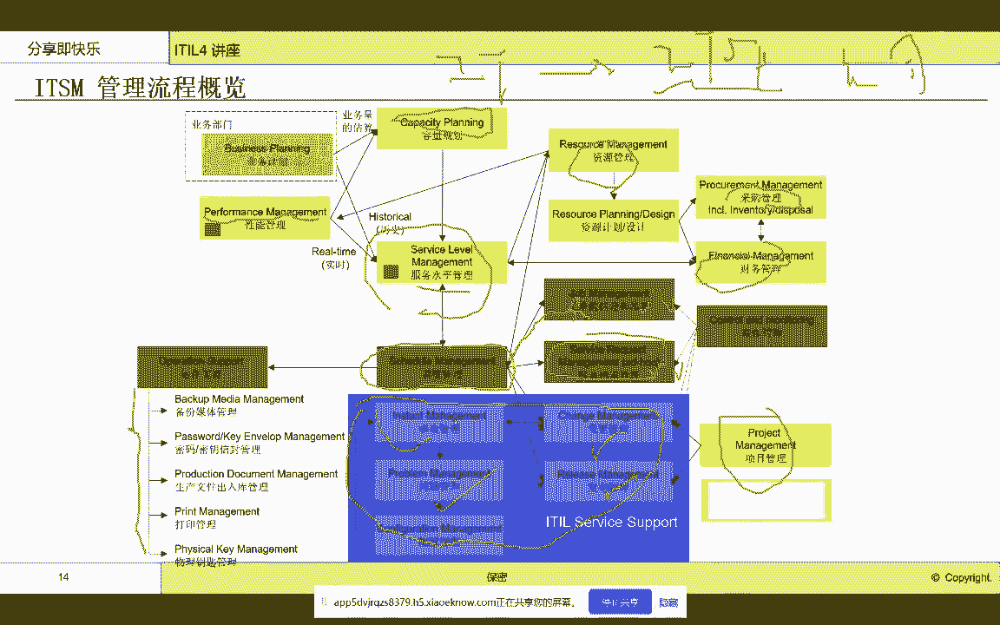

我们其实都可能不在我们的这个系统，ITSM系统的考察范围之内啊，考察范围之内，那么我们可以看得到我们整个的服务管理平台。

