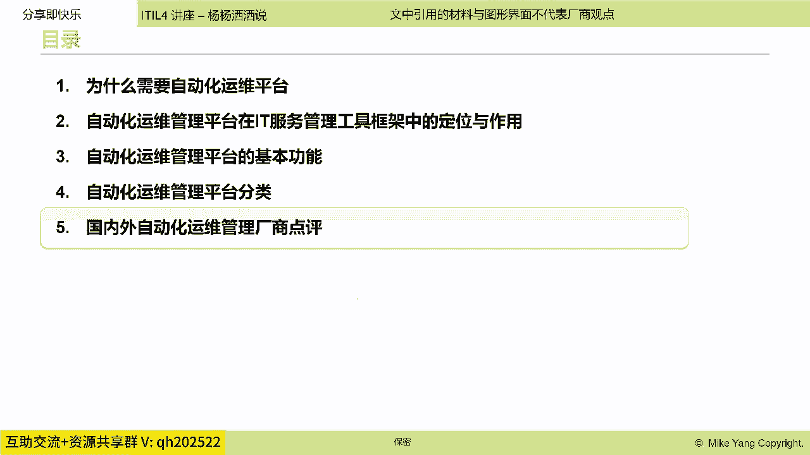
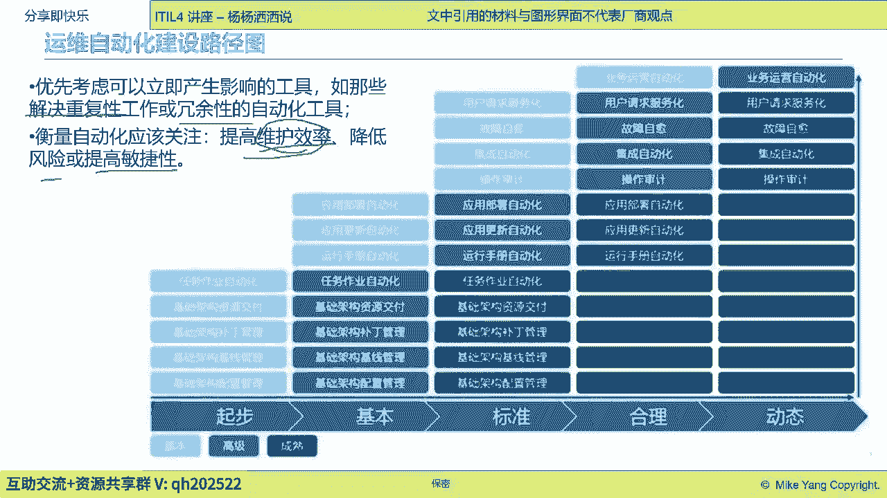
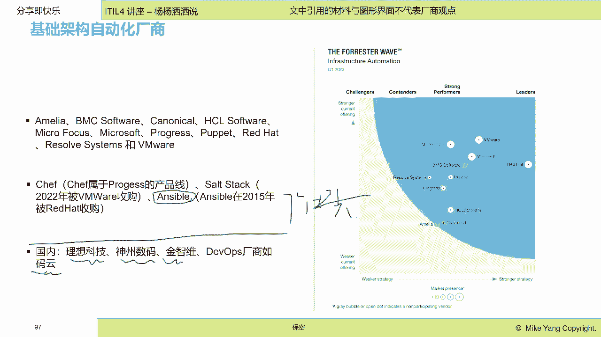
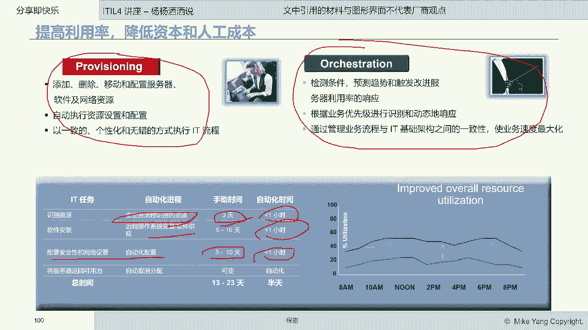
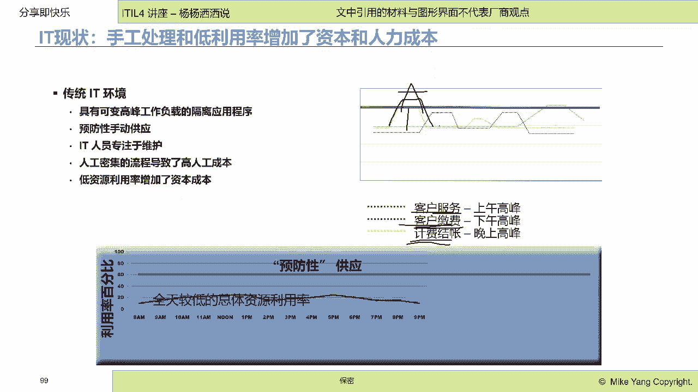
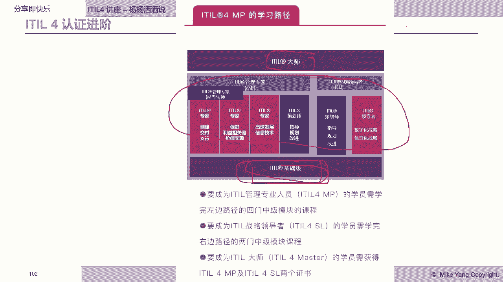

# IT服务管理的十八般武器之自动化运维管理平台 - P4：4.国内外自动化运维管理厂商点评 - 清晖Amy - BV1KD421A7dZ

批量的编队好，那么批量的变更在很多企业里呢，实际上是有各种不同的表现形态啊，不同的表现形态，那么这个呢就啊希望大家继续的进行探讨，那就已经给大家讲完了今天的五大类啊，五大类的这个自动化平台啊。

那么希望大家能够把对大家啊，对于这个服务的自动化交付啊，有更进一步的扩展性的了解啊，那么谈到的是这个切换啊，在被切换的自动化，然后呃资源云资源交互自动化嗯，还有这个应用交付的自动化，就是持续部署。

还有就是这个批量变更啊，就是变更的自动化啊，变更的自动化，那么呃这个我们希望大家能够啊加深理解好。

那么最后呢跟大家分享一下，嗯我们给大家讲了七个自动化平台对吗，哇这个变更平台也很复杂对吧，那个光这个自动化也可以分好多类，那么企业里要建自动化平台，也得有优先级是吧，那通常的一个原则是什么呢。

啊当然就是我们认为重复性最高的那些，冗余性最高的，天天重复做的这种事情，那一定是需要自动化把人释放出来啊，人事翻出来，第二个自动化的目标始终是追求效率，降低风险，提高敏捷性。

效率第一位的人做效率是比较低的啊，比较低的，那么还有呢。

人自动化其实可以带来的就是降低风险啊，因为人做他可能每一次做会有不一样，但是机器做自动化组它是一样的，他给他一条指令，它就会始终执行的一条指令啊，所以说呢我们是要从提高效率，降低风险这个角度出发出发。

那么从这个角度来说呢，我们可以看得到自动化呢，它也分为基本的高级的成熟的，比如说最简单的自动化啊，这边不是特别清楚啊，不是特别清楚，那么这里面最呃最简单的字的话，就是比如说打补丁哎呀，基础资源的交付。

就是云资源的交付，还有跑P啊，跑P配置自动化，这个是最基础的啊，很基础的，然后接下来才是应用发布自动化更新自动化啊，然后接下来就是这个这个这个故障治愈啊，操作审计，然后再到业务运营自动化。

所以说最终的可能就是会衍生到RPA了对吧，RPA了，不单单是在这个it领域的这个自动化哈，能够帮助业务部门去实现自动化啊，其实我个人理解哈，这个这个我们今天谈的这个啊自动化运维平台。

其实就是RPA在it领域的一个例证啊，其实当时提RPA，我一看这不就是这个运维自动化吗，在运维领域啊，所以说我们的运维呃，这个这个这个先进性啊是非常高的好，那么基础架构自动化的厂商有哪些呢。

呃我这边没有去详细的统计过啊，没有去详细统计过呃，也没有呃，这个这个因为这个我自己做自动化嗯，你还是比较早的时候啊，比较早的时候，那个我摘了一个2023年Q1的啊，这个forest的一个统计哈。

它是infrastructure automation啊，因为JER2面，它主要还是关注基础架构的自动化，大家可以看到领先的，还是像这个red hat和WM2，这个主要是强调的这个云资源的自动供应呃。

像容器自动供应啊，容器的自动供应，那么这个像这个传统的惠普的自动化啊，这个BMC的自动化啊，原来IBM在自动化领域也是非常领先的，现在我在这个上面都看不到，他的这个这个这个这个排名啊。

啊还是非常遗憾的啊，惠普现在被mor focus收购了啊，BM呃，现在四大龙里面唯一的存在的还是BMC哈，这个BMC的这个自动化产品还是非常丰富，从他的这个跑批巡检啊。

这个云管平台都还是具有这个持续的创新啊，和领先，那么现在比较呃，原来在这个自动化领域，比较大家耳熟能详的这个就是四大开源软件，Shift solar，Steak，ANSEL和puppet对吗。

puppet这四大这个软件呃，这个开源软件呢，现在有三家都已经被商业收购了，UZLE已经被REHEAD收购了，sl select diremorse收购了，几乎被progress呃呃收购了啊。

那么唯一的像puppet，但是puppet已经老了哈，当然现在大家用的比较多的，大家如果呃平常如果经常使用自动化平台的话，那应该是uncle，现在呃可能会使用量会更多一些啊，更多一些。

那么国内啊在自动化领域啊，我们说了，其实自动化也嗯，我刚才给他分了七大域对吧，七个大类，那么这每个大类都是有不同的厂商的，那这个呃我这边就没有去一个一个的看哈，像理想啊，理想科技。

神州数码精致为divers厂商，像马云，像云管平台，这里面就就很多了，纤云啊等等，那这个呃我也因为我这只是讲座哈，我没有去统计这些厂商的这个名称啊。

好最后举个简单的例子啊，举个简单的例子，这个例子是谈什么事呢，啊去谈什么事呢，嗯是谈的这个，是谈了一个这个就是在传统it里面哈，呃我们很多业务啊，它都是在不同的时候它会有高峰啊。

像这个客服服务的这个业务，客服账户的业务，计费业务，它的这个时间点都不一样，高峰的时间点不一样，那么它对系统带来的压力就不一样，那么在这样一种情况下，人基本上是如果没有自动化，人是束手无策的。

会带来一个什么后果呢，带来的后果就是为了应对这个高峰，我会去叠加它，叠加这个高峰，然后配超额资源，超额资源，也就是说这个比如说这个加起来，CPU会有70%，我会配90%，我会派配百分之百的资源。

或者配140的资源，配两倍的资源给他，那实际上资源只能用到一半，所以说呢它实际上是降低了资源的啊使用率啊，增加了资源的这个金钱，在这个成本啊，同时人在这种没有自动化工具的情况下，大家看这个。

基本上这个没法进行资源的动态调配，比如说突然来个资源的这个呃，这个访问量的增加，这个可能就超过140了，那么我也没办法进行资源的动态调配，所以说呢这个就会导致故障的产生啊。

故障的产生，那么如果我们有了自动化平台啊，比如说我们有了云资源的这个这个自动供应啊，自动供应，那么我们可以快速的在资源高峰的时候，我们会动态的进行资源的这个提示这个供应，那原来是三天。

现在只要一小时软件的安装，5~10天，我可以缩小到一小时啊，然后这些呃安全配置啊，网络配置啊，需要进行调整的话，我也可以做到一小时啊，就是我可以快速的去响应什么，响应他的一些动态的变化。

然后能动态的去适应提供资源，能够让资源同时我能跨资源池去协调资源，我让资源的使用率始终处于一个饱和的状态，能让我的资源使用率达到最优啊最优，所以说呢我们可以通过这个资源供应，能够提高资源的利用率。

降低人工的是这个人的这个工作工作强度，同时我们也可以通过这种orchestration啊，我们叫做协调调配啊，协调调配。

比如说就像刚才提到的三个服务，这三个服务它的高峰期是不一样的对吗。

如果我的三个服务，分别使用了三个不同的资源池，在他高峰的时候，这里边是低谷，我就可以把这边的资源拿到这边来去支援他，这个叫CHERATION，Chortation，它能够动态的识别业务的优先级啊。

动态的响应，它可以根据这个业务优先级更高，B和C更低去降低这边的什么响应速度，极力地满足这边的业务需求，所以说我们通过像这种orchestration的，自动化的协调调配能力。

我们可以提高我们的资源使用率啊，这样的使用率好呃，今天的讲座呢就到这里，最后呢在呃做个小广告哈，这个IO的学习呢，实际上是呃需要从这个基础级到这个，专家级到大师级的学习啊，那么我们清辉这边提供的是这个。

基础级的课程啊，也是帮助大家来提提供这个相应的入门，那么所有的课程呢我们会啊，呃这个提供课前课中课后的跟踪啊，现在我们清辉的这个通过率呢啊，基本上应该是百分之百啊，基本上是百分之百，那这个同时呢。

后续如果大家对于爱豆的中级和大升级呢。

