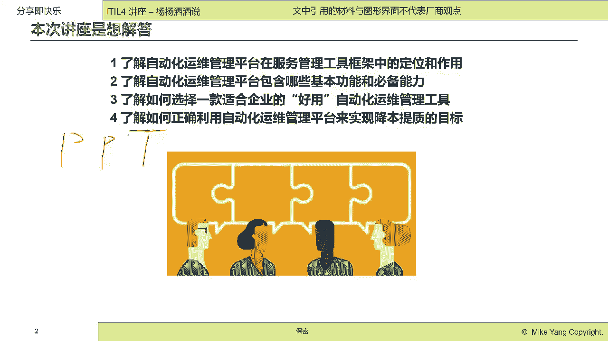
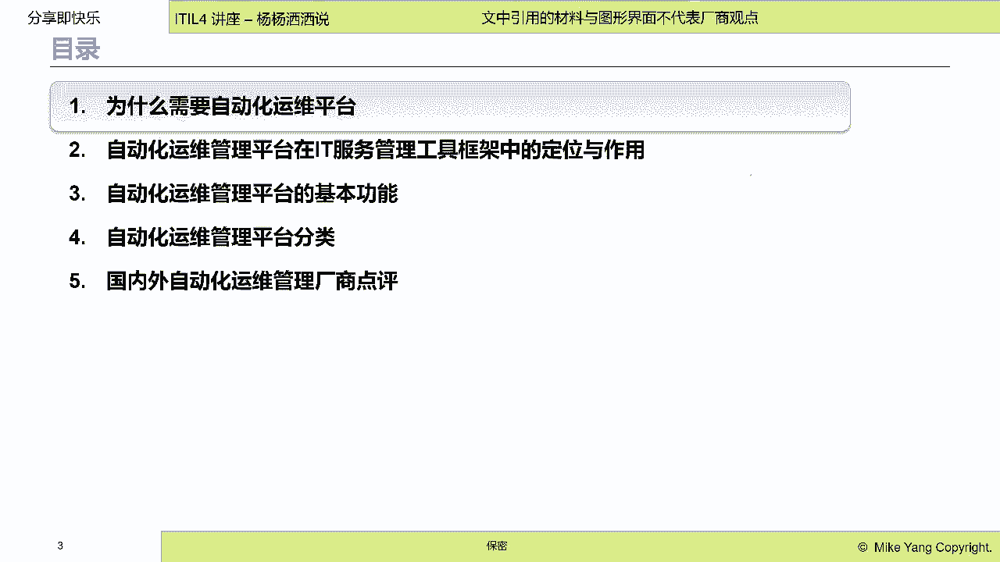
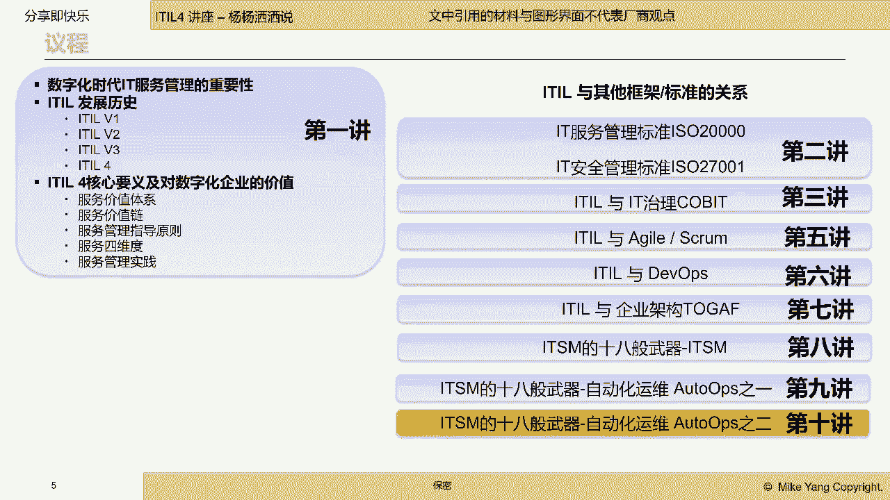

# IT服务管理的十八般武器之自动化运维管理平台 - P1：1.为什么需要自动化运维平台 - 清晖Amy - BV1KD421A7dZ

啊这次讲座呢主要是想帮助大家回答什么问题，因为大家都知道在学习apple的时候啊，在这个IT服务管理领域里面，我们很重要的就是要强调一个PPT的理念啊，PPT可能上过我课的小伙伴。

应该知道这个PPT代表什么意思哈，这不是POWERPOINT的意思，这是我们做idol的三要素啊，我们要去赋能我们的运维人员啊和运维组织，第一个P第二个P呢是我们的process。

我们要建立流程规范制度，让我们的整个服务管理有序啊，能够这个以流程驱动啊，我们的这个服务交付第三个字母T，这个T代表什么呢，这个T有很多代表啊，最典型的就是tours啊，Tours。

那么这个tools是表示我们所有的，无论是人还是流程，我们都希望用工具去支持我们的人，遵循我们的流程去交付it服务，所以说我们的工具是我们的什么，一个助力器是个催化剂。

是个我们行事做事提高效率的有效的手段，当然这个T也可以代表technology技术对吗，我们现在其实在做服务管理的时候，我们会用到很多技术，这种新兴的大数据，新兴的这个AI。

都可以帮助我们进行服务的交付和服务的管理，所以说我们嗯开了一个系列讲座，叫嗯这个IT服务管理的18般工具，那么这18般工具呢，我们讲的，在今天讲的是讲的18般工具里面的之一哈，就是自动化平台啊。

我们前面讲过监控啊，那么我们希望大家知道这个自动化平台，在整个工具框架里的定位，这是第一个希望帮助大家解答的，第二个呢就是说呃这段话嗯工具的分类很多，然后呢，嗯可能很多小伙伴只用过其中一个。

到两个自动化工具，那么我们是希望给大家介绍，自动化工具的全全貌，以及这些自动化工具必须要具备的功能，以及这些功能是解决什么运维的问题，提高如何提高运维效率，这是第二个想帮助大家解解答的，第三个呢。

就是我们怎么去选一个好的自动化运维工具，那么这个其实在第二这个问题里面，其实也帮大家做了解答了哈，就是这些只有必须具备了这些功能的，才算是一个好用的自动化运维工具啊，第四个就是啊也引起大家思考。

怎么选择合理的工具来降本增效提质啊，这是我们想通过这次讲座来跟大家解答的问题。

好那么我们整个讲座的五大块啊，为什么需要自动化平台，第二个，自动化平台在整个it服务，管理框架中的定位与作用啊，让大家明白自动化工具的全貌，如果大家听过啊，这个我们自动化运维平台讲解之一。

那么一和二其实已经讲解过了，已经讲解过了，那大家有兴趣的去啊聆听我们前面的部分啊，前面一次讲座，第三个呢就是自动化平台的这个基本功能啊，我们会讲啊，七大类啊，我们已经讲完两大类。

今天给大家讲剩余的五大类啊，剩余的五大类，第四个呢就是啊这个自动化平台的这个分类，以及我们现在典型的一些厂商啊，国内化自动化运维平台的一些典型厂商，那这个会讲的比较简单，因为我们这是一个讲座。

不是一个厂商的宣讲啊，好这是我们整个讲座啊设计的这个topic好。

我们来简单做个自我介绍哈，我叫杨丽梅，那我我是一个这个老IT哈，骨灰级的IT，那么这个做T已经有25年了，那么这个在这个就是啊it服务管理，it监控，it治理嗯。

还有it架构设计以及air ops devx，二，都有一些这个实际的项目的建设，和这个理论的教学的经验，那么也是啊很高兴有机会跟大家一起来分享，在当前这个变化，这个快速无卡的时代。

我们怎么能够利用啊这些业绩最好的管理框架，I le，怎么助力我们去提高我们服务交付的速度，质量安全和效益啊，这个就是啊我个人的介绍好，那这个我就不不去过多的啊去吹捧我自己啊，有有兴趣大家可以后续交流。

那么这个是我们实讲啊，实讲课程啊，讲的内容比较杂哈，那么当然是以围绕着ITO为核心啊，为核心理念啊，那去讲述IDO与我们现在的这个整个，服务管理领域的标准，还有apple与it治理。

信息安全敏捷divers架构，还有工具怎么去赋能它啊，我们都是围绕着这些啊，主要的这个框架去展开的啊，我们后面还会讲18般武器，会有大量的这个工具，会跟大家一起来啊学习和了解，那么我们今天是第十讲。

是讲这个oops就是自动化运维自二啊，自动化应用为之二，那么这个啊这个之一呢主要是跟大家讲了，刚才说的这个框架的定位，那么我们今天还会更简单的，跟大家一起来复习一下啊，复习一当然可能很呃。

我不知道今天来听讲座的同学，对idol的熟悉程度啊，那IQ的学习啊是一个漫长的过程，而且是需要去实践的啊，一种实践课程，实践类课程，那么光听课是不够的，那所以说我我们这个讲座。

就不局限在这个爱豆的理论里面，更多的是想扩展来看在大家的日常工作中啊，如何去综合的运用apple与其他的管理框架，以及工具，来去帮助在在座的各位去做好it服务啊，交付it服务。

然后呢又能够在当前的这个环境底下，能够去啊实现我们的这个服务质量的提升，同时这个服务成本的下降啊。

这个是我们整个讲座的一个核心思想啊，核心思想，那么这一这个框架我已经讲过第十次了啊，可能经常来听我讲座的同学，已经听出老茧来了啊，嗯这个这个这个其实也是我每次讲座嗯，可以拿出来给大家炫技的一张图哈。

当然这个是我最早的一张图，现在已经进化到第十版了，也应该是那嗯嗯主要就是想告诉大家，其实如果大家在这个信息化领域，在数字化的时代，在座的各位想要成长，想要生存，你们除了要去掌握ITLE啊。

想去掌握ITLE之外啊，就是这个我们讲座的重点是吧，讲座的重点是IDO，那么这个除了爱豆之外，在座的各位需要去掌握更多的技能，去武装自己，去提升自己，能够持续的啊去这个在企业里啊发挥价值。

走向更高的领导岗位，然后能够嗯实现与业务的充分融合融合啊，那这个就是啊我这张图的意思，那么再花2分钟给大家讲一讲啊，那么我们讲座的核心内容是围绕着服务管理啊，那么它主要的这个管理框架是ETO啊。

啊information technology infrastructure library，再给大家普及一下啊，这个要嗯耳熟能详啊，当然如果大家只是做服务管理，还不够。

那你要知道你的服务是怎么生产出来的，那你们要去接触开发管理对吧，那么开发管理啊，大家现在比较熟悉的应该是square是吧，敏捷开发，还有呢这个CMMI啊，这种开发过程的管理啊。

我相信很多现在来听课的小伙伴，你们企业实际上可能啊正在使用敏捷，在驱动你们的软件开发啊，你们企业也过了，CMMI可能是level three level four，Level five。

去证明你们企业生产的软件是高质量的，是没有bug的啊，当然如果你是啊，只是懂开发，只是懂啊，这个服务管理还不足够，你还要知道你们的这些开发是Y，是为什么你们要去开发软件，你们为什么要去交付it服务。

你们交付的这个软件，在整个企业服务于企业的业务，在这儿你们服务于企企业来说，T只是企业的一部分，是一个信息化的工具，属于是一个数字化的手段，你们怎么从战略的高度，从架构的角度去规划当前和未来。

你们去满足企业的发展，那么这个当然就是跟大家聊到的是TOGRAF，对吧，我不知道有多少小伙伴嗯听过这个框架哈，嗯这个是这个架构，这个企业架构的课程，那么这个企业架构实际上是站在更高的角度。

站在一个非不只是T的角度去帮助大家啊，帮助业务部门，帮助企业管理者去规划企业的发展蓝图，同时去定位我们的IT的这个作用啊，所以说我们呢要明白，所有的开发和服务管理，都是企业架构规划出来的，设计出来的。

那么它主要是满足企业的战略发展啊，这个战略包括企业的啊，这个开源节流我不知道大家熟悉吗啊，企业要生存肯定是要赚钱，就是业务开拓嗯，那在开拓的时候不能什么违规是吧，要稳步前进，那就是要业务经营啊。

业务经营，那么在这两个啊企业的最核心的使命的情况下，那我们的信息技术应该达到什么样的一个标准，那么就是啊规划建设啊，这个运营，那么除了这个我们谈到的这个就是呃，归建运之外。

那么我们还有一些专业的技能需要大家去掌握，那么你们现在可能清辉的小伙伴来啊来学习，可能很多人都已经有这个认证了对吗，你们的pm bok prince two是吧，MSP啊，P3O啊。

还有像这个软考的这个呃系统集成项目经理，这个可能是在座的各位啊，长啊，这个已经获得了这个认证哈，也是这个很多这个企业里面，必须要去具备的一个软项目管理的技能，那么除了项目管理之外，大家还需要去了解的啊。

作为一个你们充满学习热情，然后需要渴望持续成长的这些小伙伴，你们可能还要去考虑的是什么信息安全是吧，那你们要去学27001，要去了解，等保要去了解啊，CSA就是云的安全的认证呃，你们还要去掌握什么业务。

持续性管理啊，持续性管理，这就是你们怎么能够在发生灾难的时候，IT能够持续支持业务永续经营，不中断，或者是快速的恢复，那么你们要去学习的是什么，ISO22301啊，这是国际标准。

国内标准是GB20988，那么你们还要学习学习服务质量管理，那么服务质量管理，就跟这个服务管理是紧密相关的哈，我们对业务部门或者是对你的内部客服，外部客服，it部门应该是提供的服务。

这个服务的质量用什么衡量呢，就是用ISO900TQMEFQM6西格玛啊，六西格玛，那么你们还要学习外包管理，在座的各位啊，it部门都有大量的什么嗯，第三方合作伙伴或者是软件硬件供应商。

你们怎么才能管理好它，让他们给你去提供无缝的服务支持呢，那你就需要去学习什么啊，学习这个ESCM叫e source capability model，叫电子化的外包能力模型。

或者去学习sdf sourcing government framework，就是外包的治理框架，那么主要就是让你们在啊采购的外，第三方给你提供的这些服务，商品能够产生你们付出去的钱所对应的价值。

这只是外包管理，你们还要去管理风险是吧，在座的各位都知道，现在这个呃数字化已经让业务和IT融成一体，那么我们的数字化，我们的IT的任何的呃不稳定，不安全都可能给企业造成不可估量的损失。

那么这个损失你们怎么去控制它呢，那你们就要去学习什么m o r manager，risk或者risk i t啊，还有呢或者是学习ISO31000啊，Iso31000，那么这个都是风险管理的框架以及什么。

以及这个这个国际标准啊，营养标准，然后我们还有是什么，还有像这个T资源管理，it人力资源管理，那么人力资源管理是什么呢，就是呃我们很多现在企业里面的，it部门是非常大的。

嗯我见见过有上百人上千人的IT部门，那么这些IT人员他们的成长，他们的技能的发展，那大家可以去了解是PCM，或者是s h i a scale framework of information age。

或者去了解european e cf叫e capability framework，就是电子化的啊，这个能力框架，这是欧洲的，那么因为嗯，虽然大家在企业里算是一个普通员工，但又是因为你们是干IT的。

是具有这个这个业务属性的，所以说这种业务属性呢，就需要有特定的这个it人员的资源管理，这样一套框架，那么当然最后还有就是it是要花钱的啊，it的投资与财务管理，财务管理，那么呃这个你需要去了解的是。

这个就是像这个啊FFBN等等啊等等，那这个都是帮助大家去更好的去啊，管理T的财务，那么当然最终呢你们是要去，管理层期望it的行为模式去经营it的，那么这种我们叫做企业it治理啊，或者it审计啊。

it审计，也就是说你们T需要达到业务的期望，达到管理层花在你们it部门上的钱有投资回报，那么这个就是T字理，那么你们可以去学一些KY，或者是学习ISO38500，那么这个都是关于。

怎么让IT更让业务部门喜欢，更让管理层觉得it部门有价值，这个就是IT治理的理念，所以说我们看其实真的要去做好一个T，经营好一个T真的不像我们想象的那些简单啊，它是有完整的这个一套知识框架，知识体系。

需要大家系统的去学习，当然我在课堂里已经给大家其实讲过啊，讲过啊，这个开发管理啊，就是这个这个这个就是apple和开发管理的关系，跟架构的关系，跟it治理的关系啊，都跟大家一起聊过了啊。

那后续我还会去跟大家聊聊，跟其他的领域之间的关系，那么同时呢我们也会去看看，有什么工具可以帮助我们去实现啊，这个管理领域的这些信息化啊，管理领域的信息化，那么其他领域呢，如果大家有机会呢也可以去了解哈。

